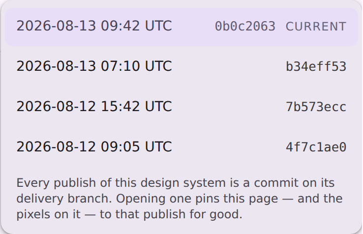
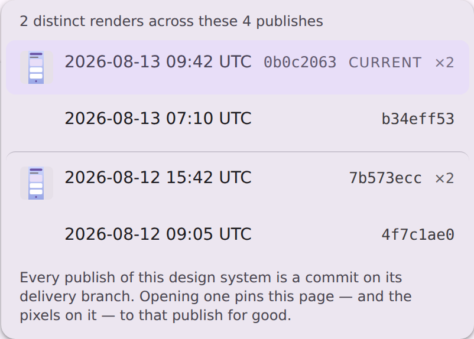

# Marking which published revisions actually differ

The viewer's Revision menu lists every publish of a catalog. That is not the same list as "the
versions of this preview": a `design-artifacts/<system>` branch is regenerated on every catalog
change, so most publishes rewrite nothing a given preview can see.

## The case this was filed from

`media-playerscreen__ideal__default__192dp` on
[preview.coo.ee/wear-m3-catalog](https://preview.coo.ee/wear-m3-catalog/p/media-playerscreen__ideal__default__192dp)
offered **twelve** published revisions. Fetching and hashing all twelve gives **two** distinct
renders:

| revisions | source shas | render |
| --- | --- | --- |
| 2 | `d9628859` (current), `fda4c66e` | 70,166 B · `sha256:c03a0b4a…` |
| 10 | `eede08a2` … `67374d43` | 59,547 B · `sha256:8e685205…` |

| the newer two | the older ten |
| --- | --- |
|  |  |

The pixels moved exactly once in that window, at `fda4c66e` — *"fix(media): draw the kit's two
footer buttons, not a playlist chip"*. `d962885` (toggle-glyph sizing) does not touch media and
republished byte-identical bytes; the ten below are identical to each other. So ten of the twelve
rows in that menu opened the same image, and nothing on the page said so.

## Before

The menu as it was: four dated rows (this is the `serve-viewer-revisions-open` fixture, which has
four publishes rather than twelve), with nothing distinguishing a publish that changed the render
from one that did not.

## After

The same menu with `<cp-revision-runs>` answered. One mini render per distinct look, hung on the
**newest** publish carrying it; the rows beneath indented under the run they belong to; a hairline
where the picture actually changes; and the count said out loud above the list.

Both thumbnails show the harness's single render placeholder — every `**/render/**` request in a
page capture is stubbed with it — so what this shot pins is the *layout*: which rows carry a
thumbnail, which are indented, and where the rule falls.

## Why the head and not the change point

A run has two defensible anchors, and the manifest models both
([`ManifestVersion.commit`](../../../cli/src/main/kotlin/ee/schimke/composeai/cli/serve/PreviewHistoryManifest.kt)
versus its `sinceCommit`). The marker sits on the **newest** publish in each run, because a
thumbnail is an anchor for the rows under it: at the head it reads "this look holds from here
down", while at the publish that *introduced* the look it would sit at the bottom of the stretch it
describes and every row above it would look unlabelled. The boundary itself is drawn as a rule
*between* two rows, so neither of the adjacent publishes has to own "the change happened here".

## What it costs

One unmetered Atom read, on first opening the menu. GitHub serves a path-scoped commit feed —
`github.com/<repo>/commits/<branch>/<path>.atom` — which reports only the publishes that touched
that file, so git does the collapse and the server groups the menu's own revision list against the
answer. For the media player above it returns exactly two entries, matching the byte hashes.

Deliberately not `api.github.com/repos/<repo>/commits?path=…`, which returns the identical answer:
it spends one of 60 unauthenticated calls an hour per IP, and unlike the catalog-wide revision feed
this lane is asked **per preview**, so a single catalog would exhaust the budget.
