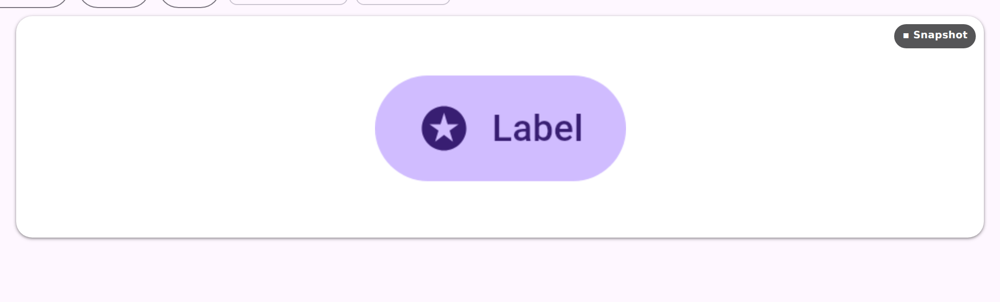
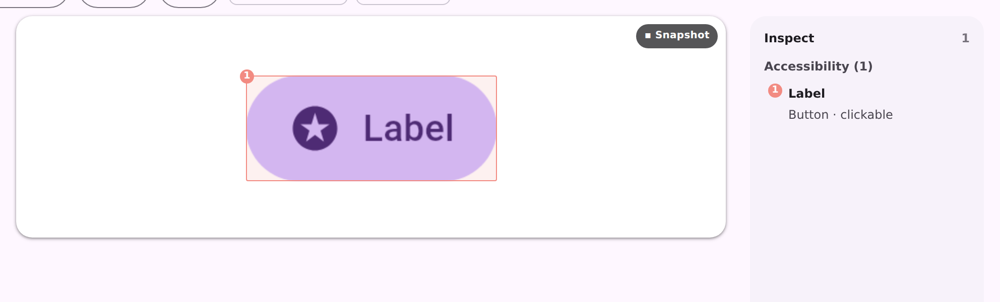

# Serve accessibility inspection layer: enable before fetch

The reported URL, on the public `m3.preview.coo.ee` catalog:

```
/p/button-filled__ideal__default__dark?chrome=dev&themeProvider=…LightMediumContrastTheme&inspect=a11y
```

The deep link ticks the **Accessibility** checkbox and nothing is drawn.

| before | after |
|---|---|
|  |  |

**Before**: `GET /render/<id>.a11y` answered

```
HTTP/1.1 500
a11y/hierarchy fetch failed: data/fetch wire error -32020: data/fetch: kind not advertised: a11y/hierarchy
```

The daemon registers its inspection products **inactive**, so a `data/fetch` on a session nobody
ran `extensions/enable` against reports the kind as unadvertised. `renderA11y` read no capability
flag of its own, and the flag lookup is what triggers that one-shot enable — so on a host whose
capabilities were never asked for, every accessibility fetch failed. On a served catalog that host
is the **per-preview** daemon `ServeCatalogLiveHost` routes `renderA11y` to, while the checkbox is
gated on `hasA11yOverlayFor`, answered by the **shared** daemon. Hence a control that was offered
and could only fail.

It was intermittent in a way that hid the cause: any unrelated request that *did* read a capability
— an SVG export, a scroll capture — enabled that daemon's extensions, after which the same URL
worked until the daemon was replaced. Reproduced against production, deterministically:

```
$ B=https://m3.preview.coo.ee; ID=button-filled__ideal__default__dark
$ curl -s -o /dev/null -w '%{http_code}\n' "$B/render/$ID.a11y"   # 500 kind not advertised
500
$ curl -s -o /dev/null -w '%{http_code}\n' "$B/render/$ID.a11y"   # still 500 — not a warm-up
500
$ curl -s -o /dev/null -w '%{http_code}\n' "$B/render/$ID.svg"    # reads hasSvgExport ⇒ enables
200
$ curl -s -o /dev/null -w '%{http_code}\n' "$B/render/$ID.a11y"   # now advertised
200
```

**After**: the a11y lane reads `hasA11yOverlay` first, which runs the enable, so the first fetch
succeeds and the focus map + legend draw. A backend that genuinely carries no a11y extension now
answers `404` rather than a `-32020` `500`, matching the shape `renderSvg` already gives a backend
without figma-svg. The viewer also stops caching a failed product fetch per frame, so one transient
failure no longer blanks the layer for as long as the frame stays on screen.

Both frames captured from the reported page's own markup and assets, served locally with
`/render/<id>.a11y` answering as production did (before) and as it does once the extension is
enabled (after).
