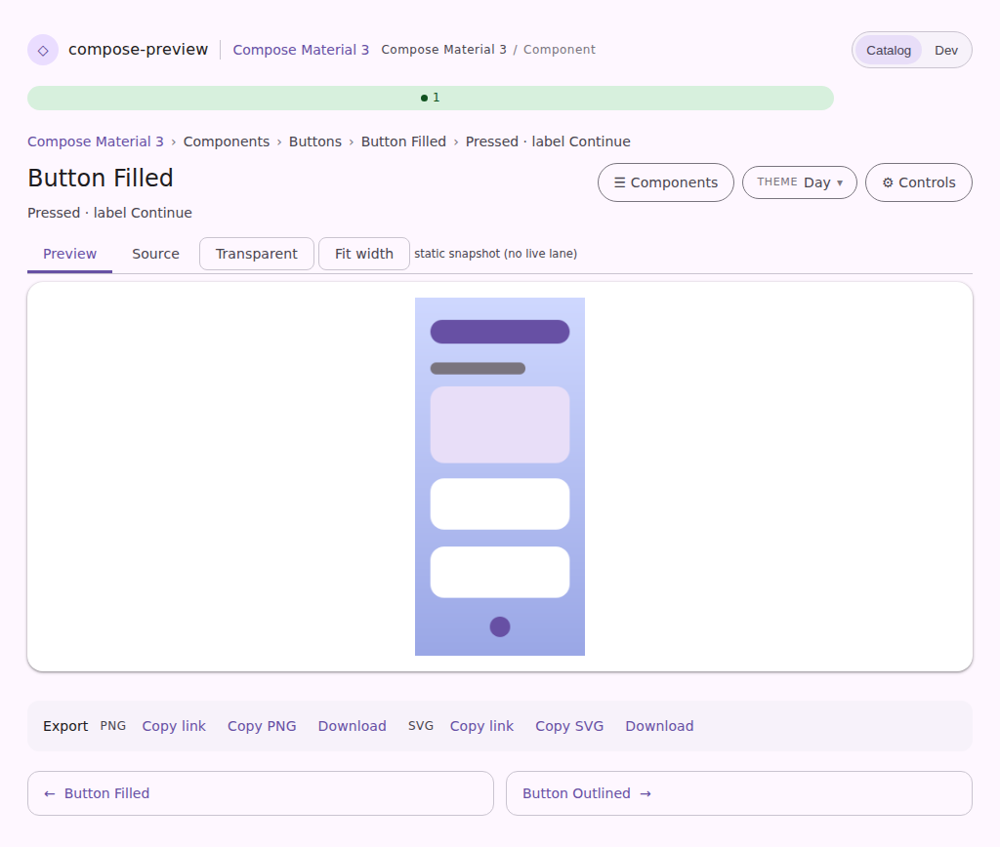
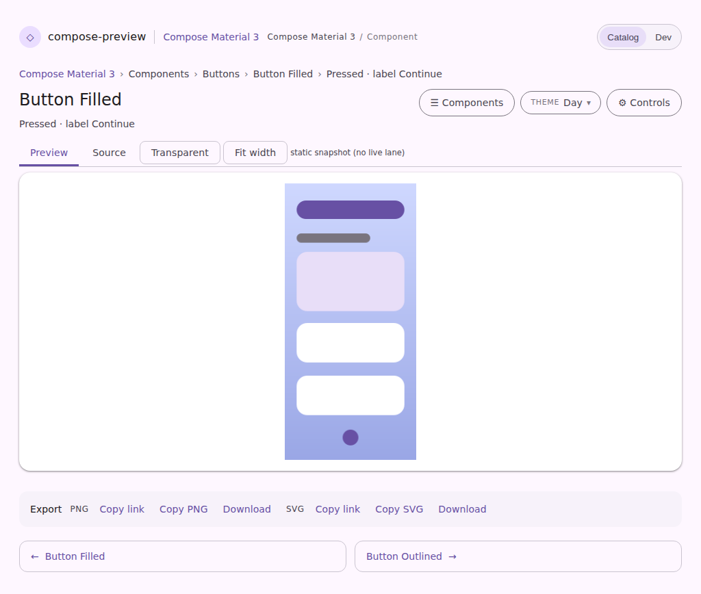
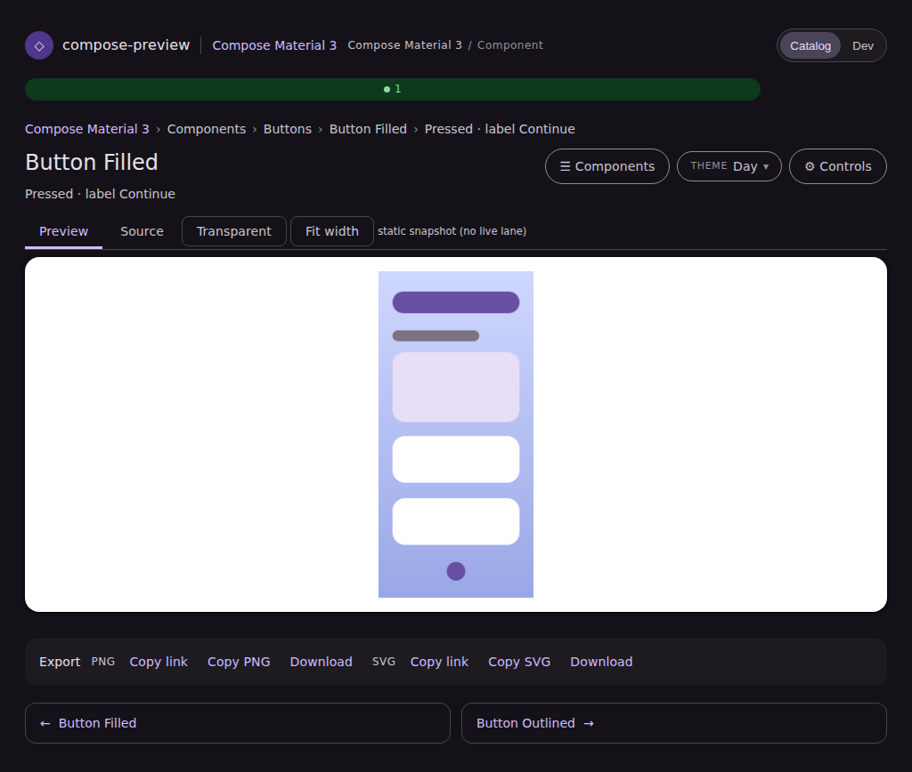
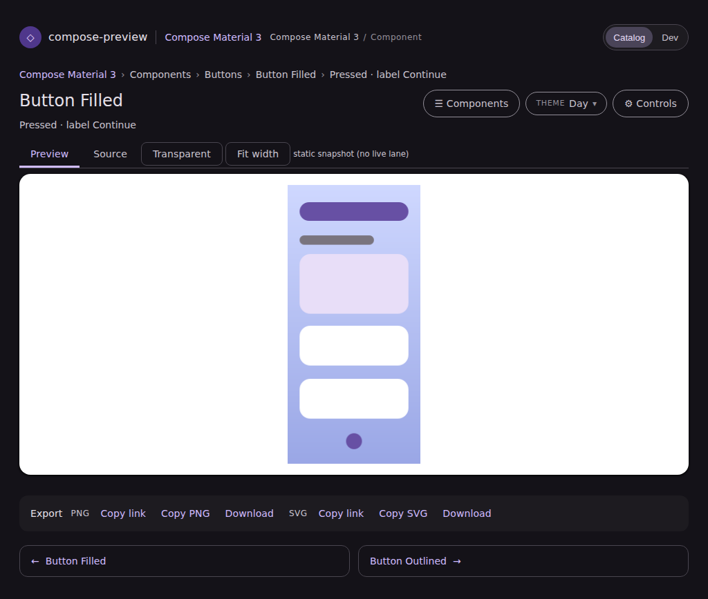

# The render-server badge painted as a bar in Catalog mode

The badge is a count **on** the header's Status link (`ServeWeb.siteHeader`) — the number is the
summary, the link is where the detail is. Catalog mode's header carries no nav, so it has neither
the Status link nor the badge's server-rendered slot.

`presenceScript` used to cover that case by creating the span itself and appending it to
`<header>`. That header is a two-column grid (`.cp-site-header`, `minmax(0, 1fr) auto`) whose row
already holds the brand and the Catalog/Dev toggle, so the appended span flowed into an implicit
second row, in the `1fr` track, stretched by the grid item default `justify-self: stretch` — and the
instance count painted as a full-width green bar under the brand, pushing the whole page down.

| Before | After |
| --- | --- |
|  |  |

Dark, where the bar is louder still:

| Before | After |
| --- | --- |
|  |  |

The slot is now the whole feature switch: no slot, no badge, and no poll either — Catalog mode had
been fetching `/api/daemons` every 20s for an answer it has nowhere to display, and no `/status`
page to read the detail against.

## How these were captured

Both are `pages-snapshot.spec.mjs`'s new `serve-component-browser-component-daemon-connected` state,
shot through the standard harness (`npm run harness:snapshot`). The fixture
(`serve-component-browser-component.html`) now carries a `presenceUrl`, so the real poller ships on
the page the harness shoots, and the state stubs `/api/daemons` with a running instance — the same
technique as the Dev landing's existing `daemon-connected` shot, which could not cover this because
Dev mode is exactly the mode that has the slot.

That state's claim is a **negative** one: a live render server must move nothing in the Catalog
header. A screenshot can hold that; an assertion that waits for an element cannot, because on a
correct build the element never arrives. The `before` column is this same state run against the
pre-fix `presenceScript`.
