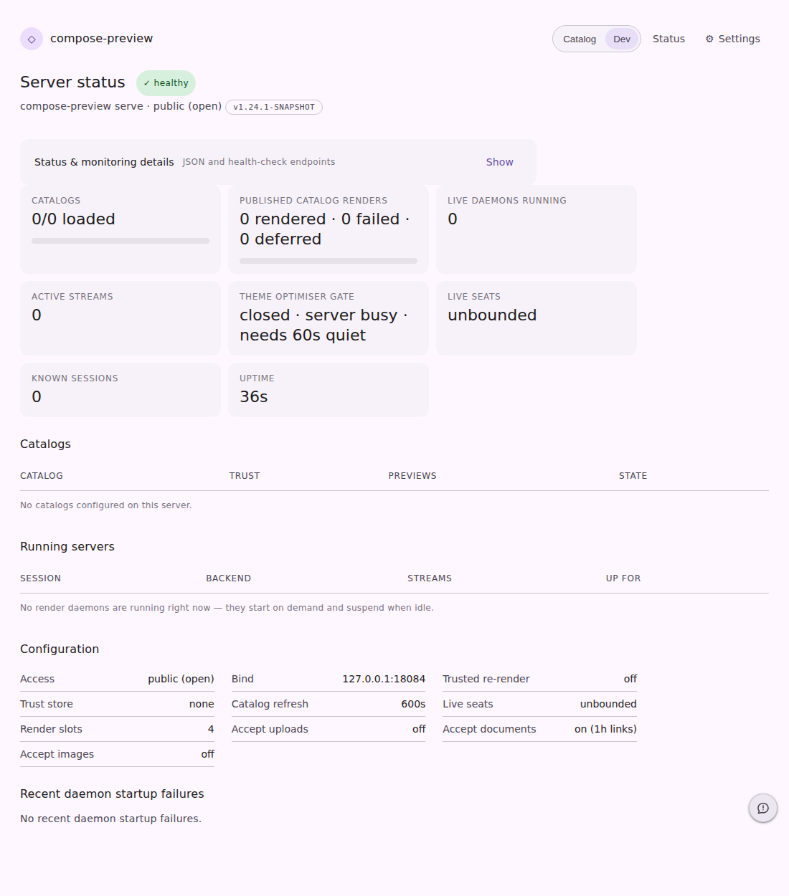
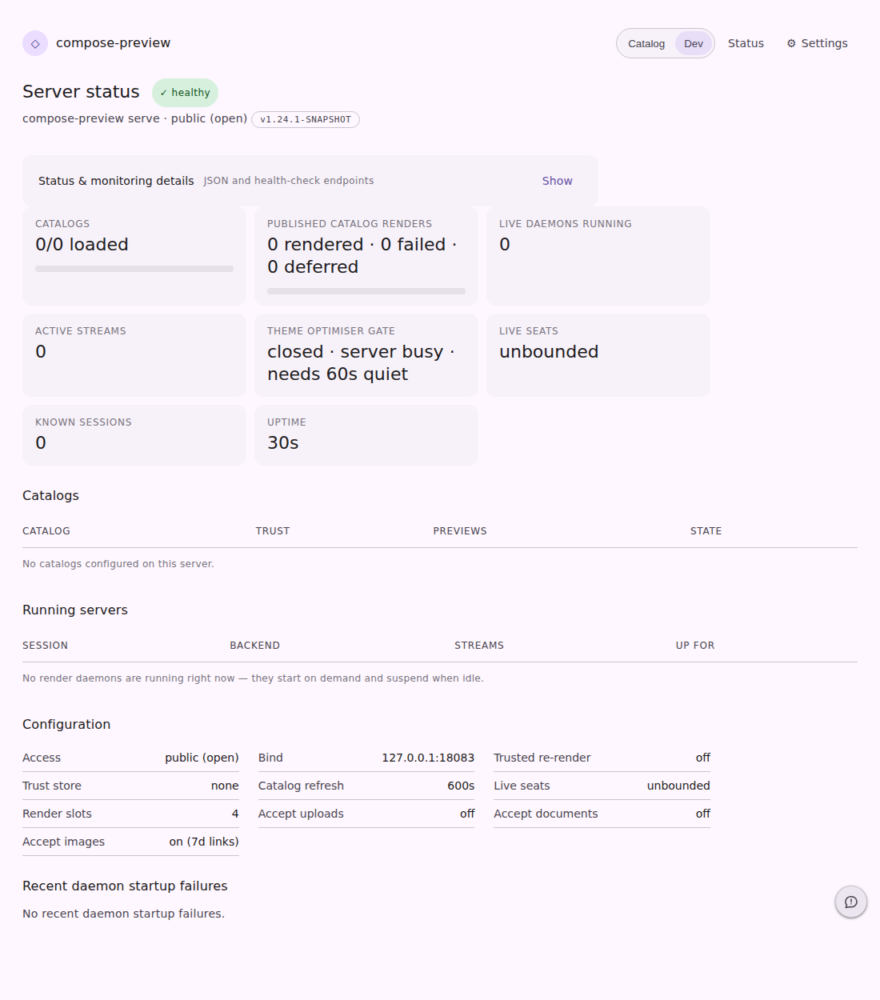

# The image lane on `/status`

`compose-preview serve --public` run twice against the same build: once with the document lane only
(`--accept-docs`), once with the image lane on
(`--accept-images --image-upload-repo yschimke/compose-ai-tools`). The **Configuration** block is the
whole visual surface this feature adds — the lane itself has no page, deliberately: its two routes
answer a script, and a browse view over other people's uploads is the one thing an
unguessable-link store must not grow.

| image lane off | image lane on |
| --- | --- |
|  |  |

**Off** (what every existing deployment shows once this ships): `Accept images · off`, beside
`Accept documents · on (1h links)`.

**On**: `Accept images · on (7d links)`. The gating repository is deliberately **not** in this cell —
the column is narrow and a value carrying `owner/repo` overran its own label in the first capture of
this page. Who may upload is on `/status.json` (`config.imageUploadRepository`), in the startup log,
and in the `401` body an unauthenticated caller gets back:

```
$ curl -s -i -X POST --data-binary @render.png 'http://127.0.0.1:18082/images?name=after.png'
HTTP/1.1 401 Unauthorized
WWW-Authenticate: Bearer realm="compose-preview"

Uploading preview images requires a GitHub token with access to yschimke/compose-ai-tools.
Send it as: Authorization: Bearer <token>  (e.g. "$(gh auth token)").
```

The same capture is where `7d links` came from: `ServeWeb.humanDuration` topped out at hours, so the
default TTL first rendered as `168h`.
