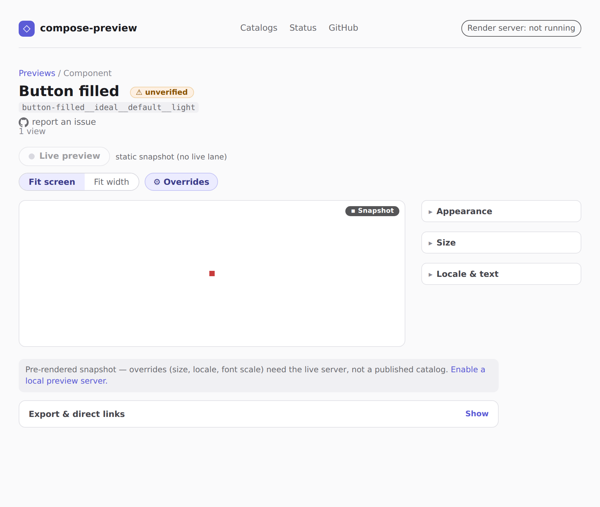
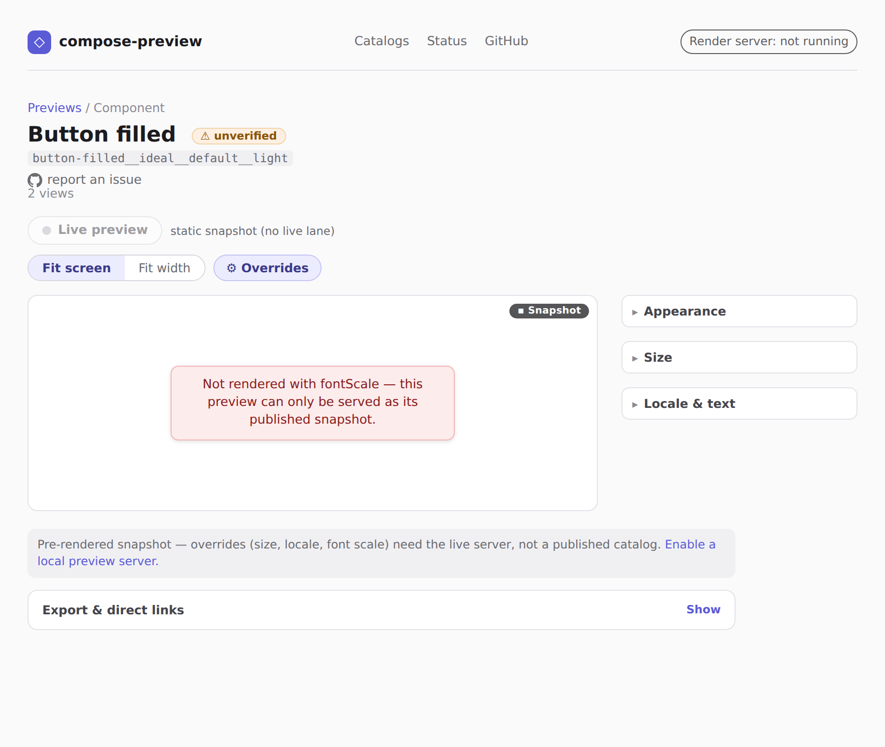

# Serve override honesty (#3449)

A `compose-preview serve` viewer opened at
`/p/button-filled__ideal__default__light?fontScale=2.0` on a **baked-only** session (an uploaded
bundle — no live render lane), which is the state the issue was reported in.

| before | after |
|---|---|
|  |  |

**Before**: `GET /render/<id>.png?fontScale=2.0` answered `200 image/png` with pixels byte-identical
to the un-overridden snapshot, so the viewer showed the snapshot as though the font scale had been
applied. Nothing in the response distinguished "this override changes nothing visually" from "this
override was never rendered".

**After**: the render is refused (`409`, or `503` + `Retry-After` when the preview *has* a live lane
that is merely unavailable), naming the dropped params in
`X-Compose-Preview-Dropped-Overrides: fontScale`, and the viewer says so on the stage.
`&fallback=baked` opts back into the snapshot, marked with
`X-Compose-Preview-Render: baked-fallback`.

Reproduced with the CLI built from this branch:

```
$ compose-preview serve --bundle m3-catalog=demo-bundle.zip --public --port 8791
$ U=http://127.0.0.1:8791/m3-catalog/render/button-filled__ideal__default__light.png
$ curl -sD - -o /dev/null "$U?fontScale=2.0" | head -1
HTTP/1.1 409 Conflict
```
