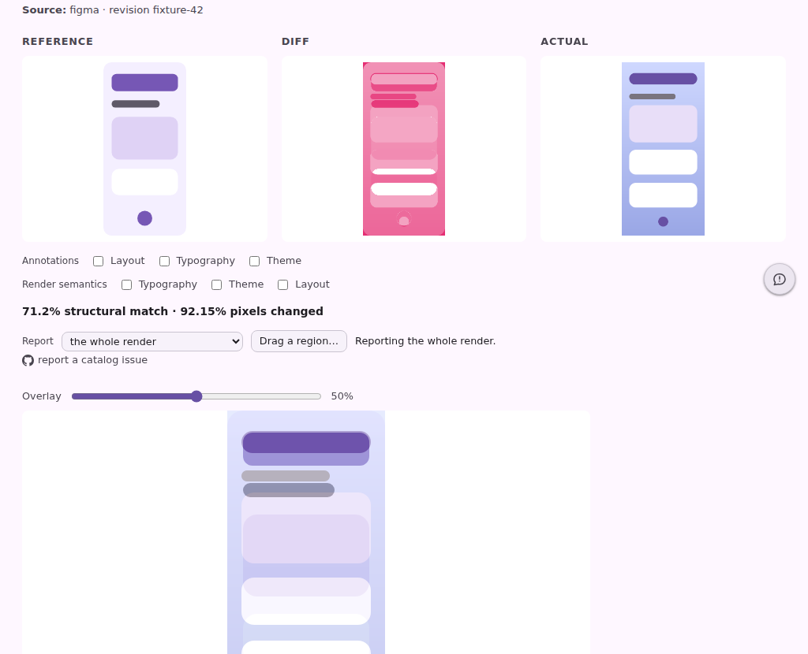
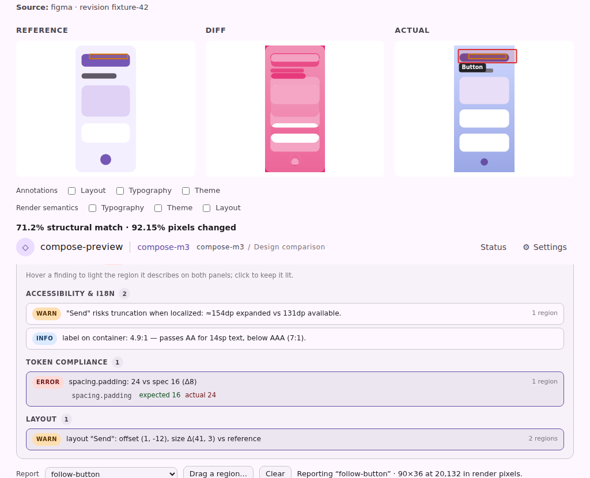
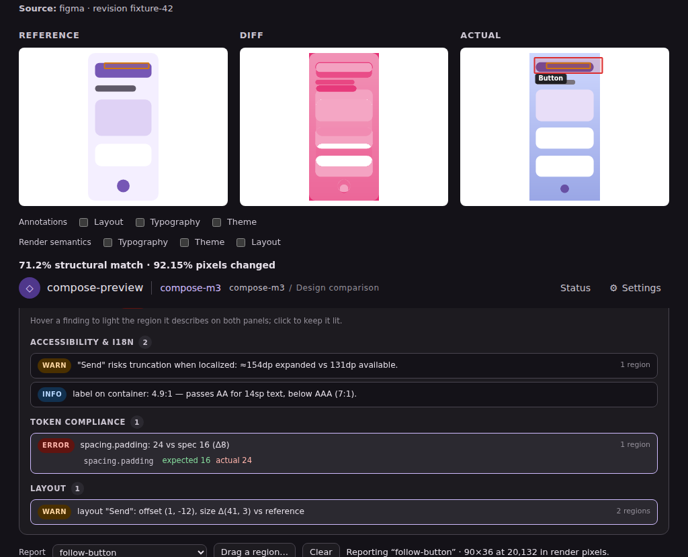

# The parity verdict on a focused comparison

What the comparison page could say before, and what it says now. Both pictures are the committed
`serve-reference-compare` page fixture shot by the preview harness — the real markup and the real
stylesheet, not a mock.

## Before

Three panels and a percentage. The page can prove the two frames differ and, with the redline
toggles, describe what each side *is*. It cannot say **why** they differ, or whether the difference
matters.

## After

The run's own conclusions, grouped the way a parity run reports them — accessibility and i18n first,
then tokens, then layout — under the panels they describe.

## What is in the picture

Two findings are **pinned**, which is why their regions are lit:

| Finding | Severity | Anchors |
| --- | --- | --- |
| `layout` — `"Send"`: offset (1, -12), size Δ(41, 3) | warn | the label's box, on **both** panels |
| `token` — `spacing.padding: 24 vs spec 16 (Δ8)` | error | the component's own frame on the render |

The layout row is the one worth reading twice. A stated offset is a number; the same offset with the
element outlined on the reference *and* on the render is the difference you can see. That is why a
finding's anchors are per panel rather than a single box — the two frames are different sizes, and a
shared coordinate space would put one of them at the wrong scale.

Nothing is lit at rest. A verdict routinely carries a dozen findings over one frame, and drawing all
of their regions at once produces a panel covered in overlapping boxes that answers "where is this
one" for none of them. Hover lights a row's regions; a click pins them, so the highlight survives the
reader's eye moving from the sentence up to the frame — which is exactly the movement the affordance
exists for, and exactly when a hover-only highlight would vanish.

The third row is prose. `label on container: 4.9:1 — passes AA for 14sp text, below AAA (7:1)` has no
geometry to point at, so the server renders no `tabindex`, no `role`, and no pointer affordance for
it: a promise of a highlight that cannot come is worse than plain text.

## What the harness shoots

`pages-snapshot.spec.mjs` captures this as the `parity-verdict` state of `serve-reference-compare`,
with the authored redline and the derived semantics layers switched back off — so the boxes in the
shot are the finding's own and nothing else's. Every future change to the panel or the highlights is
diffed for free.
