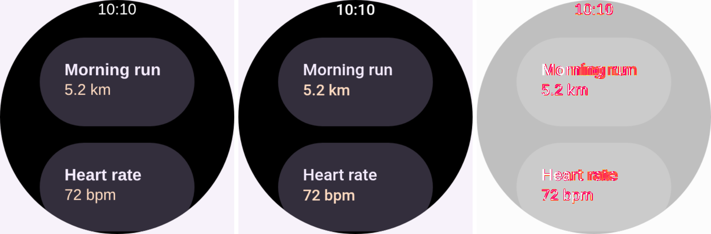

# The served viewer's Remote Compose typefaces (#3480)

What the browser RC lane drew before the `serve` viewer registered any `@font-face`, what it draws
now, and the difference — captured from a **real running server**, not a fixture.

Reproduced locally against `compose-preview serve --accept-docs --public`, playing
[`watch-screen-round-clip.rc`](../../../../scripts/design-artifacts/fixtures/watch-screen-round-clip.rc)
on its `/d/<id>` page in headless Chromium at `deviceScaleFactor: 2`. The two runs are the *same
page*: the "before" one has `/rc-fonts/**` blocked at the network layer, which is exactly the page as
it was served before this change.

## Unregistered (before) · registered (after) · `pixelmatch` diff

**2.29%** of the canvas differs, and all of it is text. Every glyph of every line: the document's
built-in family id resolves to the player's `Roboto, sans-serif` request, which on the unregistered
page fell through to whatever the container's `sans-serif` happens to be, and now lands on the
vendored `Roboto-Regular.ttf` / `Roboto-Medium.ttf` — the same files the snapshot renderer rasterizes
with and `rc-compare` scores parity against. Nothing else in the document moved.

## Metrics, measured on the same two pages

`ctx.measureText` on the stack the player itself paints with (`100px Roboto, sans-serif`):

| | fontBoundingBox ascent + descent | advance width |
| --- | --- | --- |
| unregistered → container fallback | 90 + 22 = **112** (1.12em) | 756px |
| registered (as served now) | 93 + 24 = **117** (1.17em) | 771px |

The ~4% line box is the part no layout work could have closed: it compounds down a card, on top of
any real divergence, and it moves with the reader's machine rather than with the document. The same
registration is what gives a weight-500 request a real Medium file instead of matching Regular.

Both numbers are re-checked on every CI run rather than left as a claim here — see the
`a Remote Compose document plays in the vendored typefaces, not the visitor's` case in
[`serve-lanes.spec.mjs`](../../../../vscode-extension/preview-harness/serve-lanes.spec.mjs), which
loads the same page twice (served, and with `/rc-fonts/**` blocked) and fails if the faces aren't
loaded or the two renderings agree.
