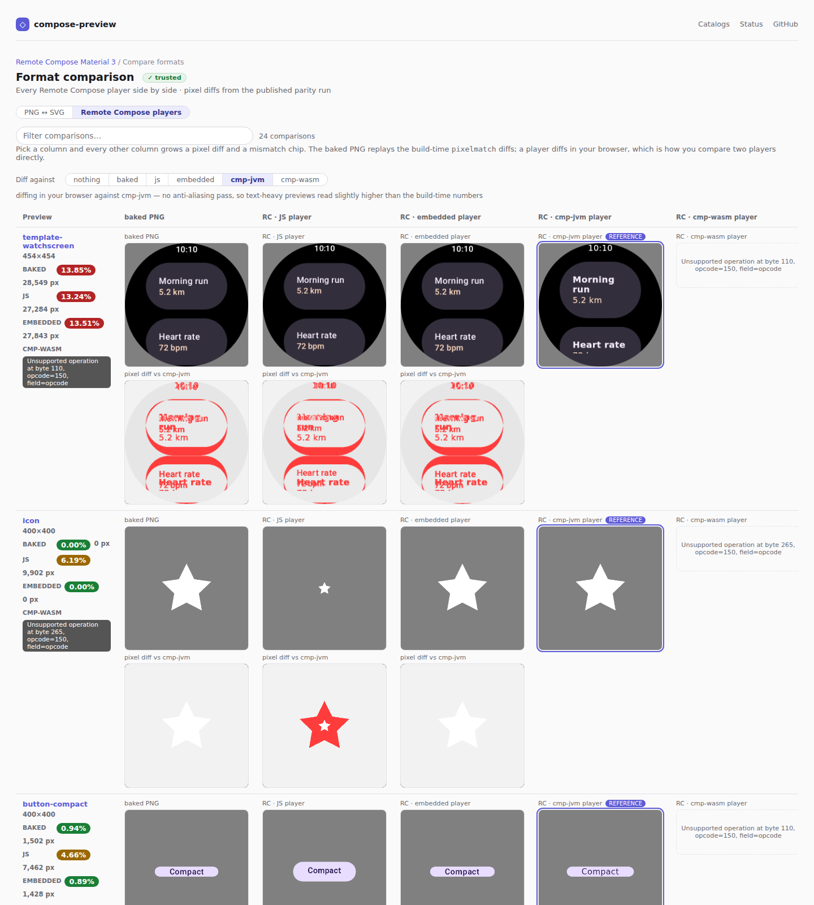
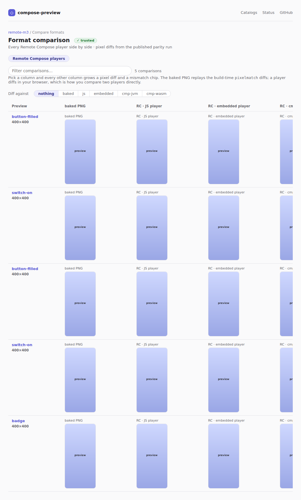
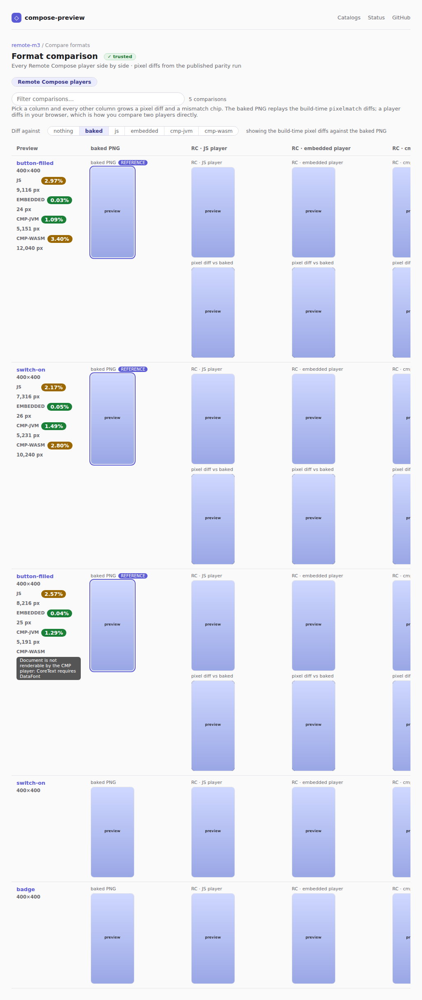

# serve `?format=rc` — every Remote Compose player side by side

`/<system>/compare?format=rc` used to be a two-column table: the baked PNG next to **one** lane —
the vendored TypeScript player — rendered live in the visitor's browser. That meant a `.rc` fetch
plus a canvas render per preview before a single score appeared, and it could only ever answer
"how does the *browser* player do?", because it is the only player that runs in a browser.

The offline `rc-compare` pipeline has already rendered every document through every player it can
reach and pixel-diffed each against the baked PNG, and publishes the lot on the catalog's delivery
branch (`rc/`, `rc-embedded/`, `rc-embedded-jvm/`, `rc-cmp-wasm/`, their `-diff/` siblings, and
`rc-compare-summary.json`). The page now replays that: one column per player, and a diff appears
*inside* a player's column once you pick a reference column.

## All players, nothing diffed

`remote-m3` served locally from its real delivery branch. Five columns, 24 previews, and the
divergences are readable without diffing anything: the JS player draws `icon` at a fraction of the
size, drops the second `button-group` label, and the CMP/Wasm player refuses these documents
outright and says why.


## `Diff against: RC · cmp-jvm player`

The question no build-time artifact answers — the offline run only ever diffed each player against
the baked PNG. Picking a *player* diffs in the browser on a `<canvas>` with pixelmatch's YIQ metric
at the run's own threshold, so the baked column becomes just another lane being scored: on `icon` it
agrees with cmp-jvm at 0.00% while the JS player lights up at 6.19%.

Picking `baked` instead replays the run's own `pixelmatch` PNGs and exact percentages — no pixels
computed in the browser at all.



## The committed fixture

The surface is wired into the preview harness as `serve-rc-lanes`, so every future PR gets before/
after shots of it for free — including the diff state, captured by a `FIXTURE_STATES` entry that
picks the baked reference. Both are shown here in light; the harness shoots each in both themes.

| default | `Diff against: baked PNG` |
| --- | --- |
|  |  |

## How these were produced

```sh
./gradlew :cli:installDist
cli/build/install/compose-preview/bin/compose-preview serve \
  --catalogs remote-m3 --trust-store deploy/preview.coo.ee/producers.json --public
# then open http://127.0.0.1:<port>/remote-m3/compare?format=rc

# the fixture pair:
UPDATE_SERVE_WEB_FIXTURES=true ./gradlew :cli:test --tests '*ServeWebFixtureTest*'
cd vscode-extension && HARNESS_FIXTURE=serve-rc-lanes npm run harness:snapshot
```
