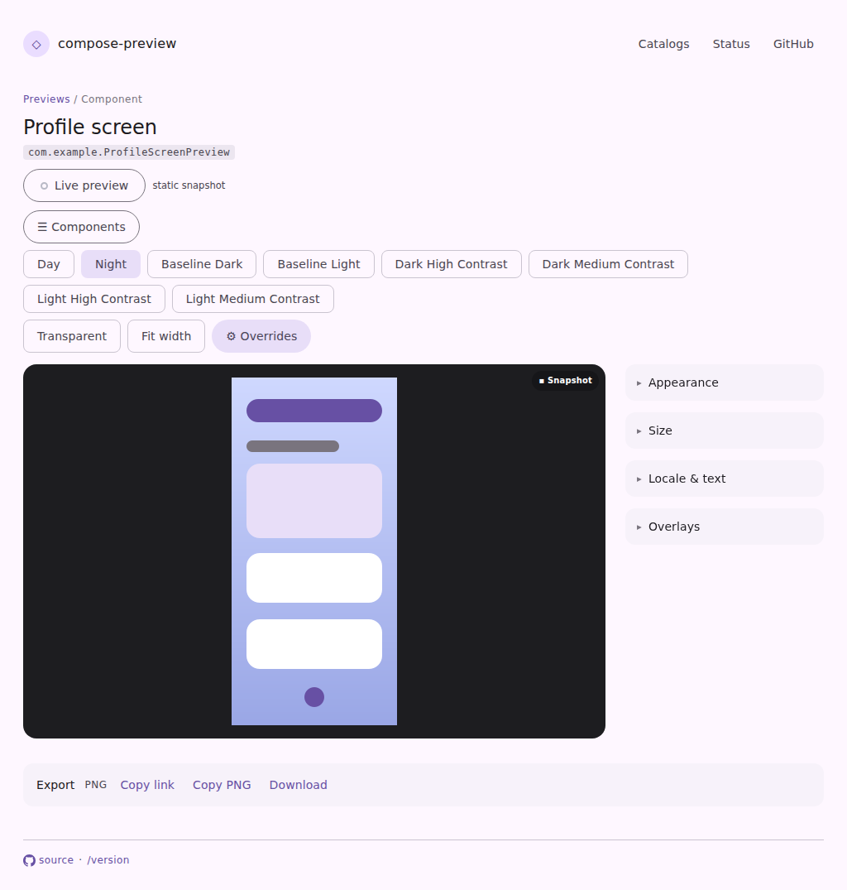
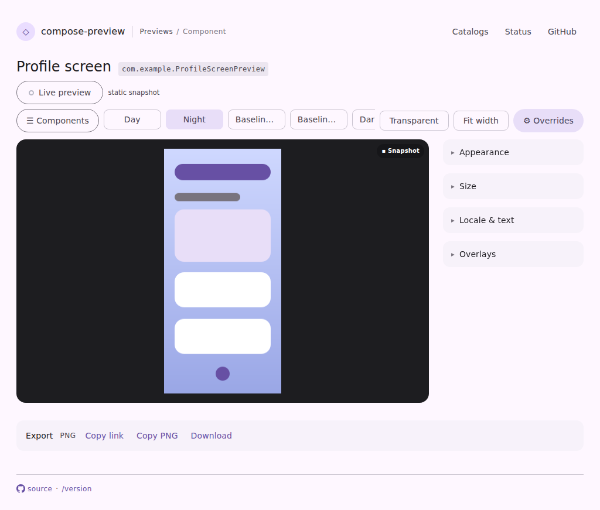
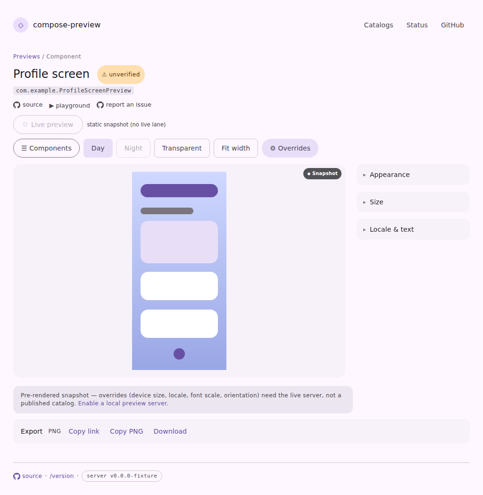
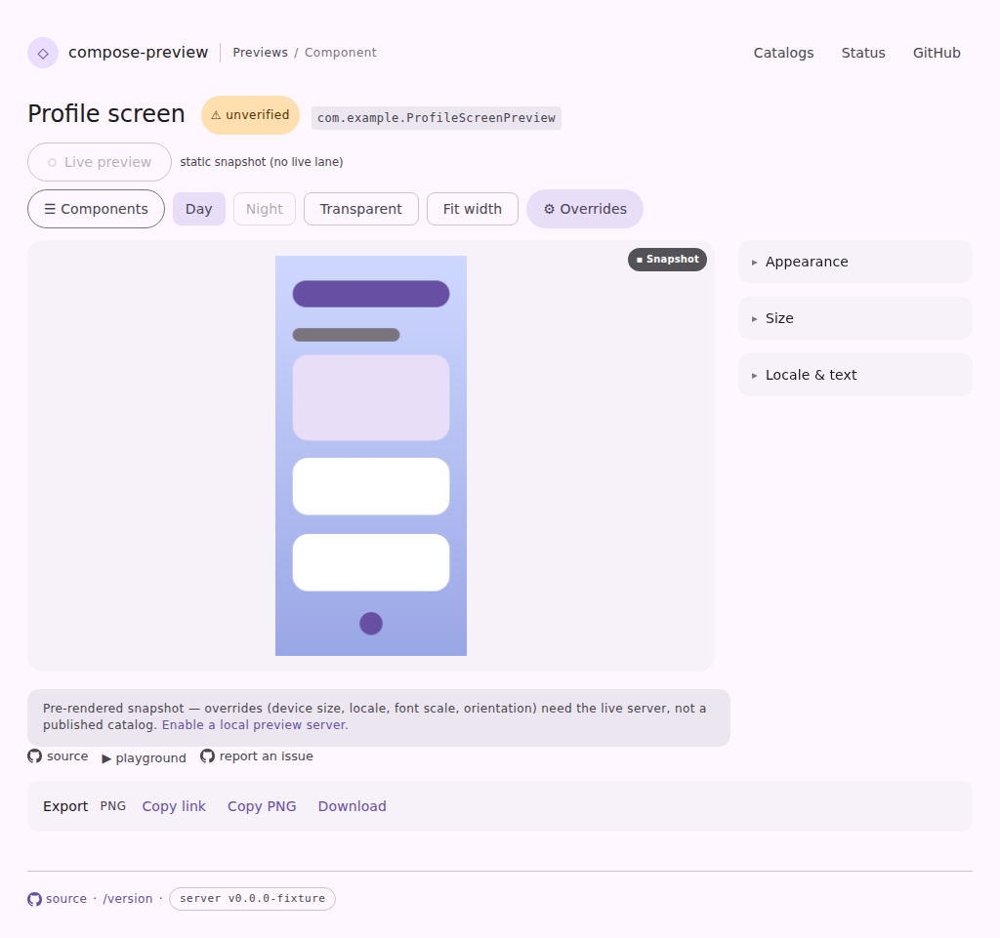
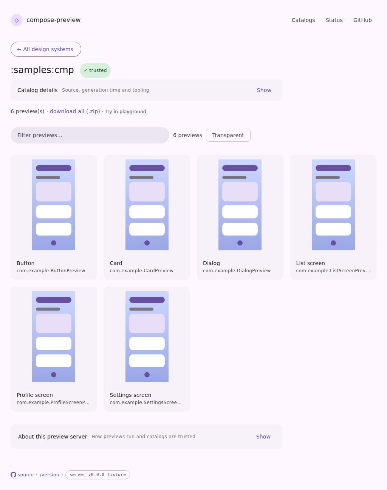
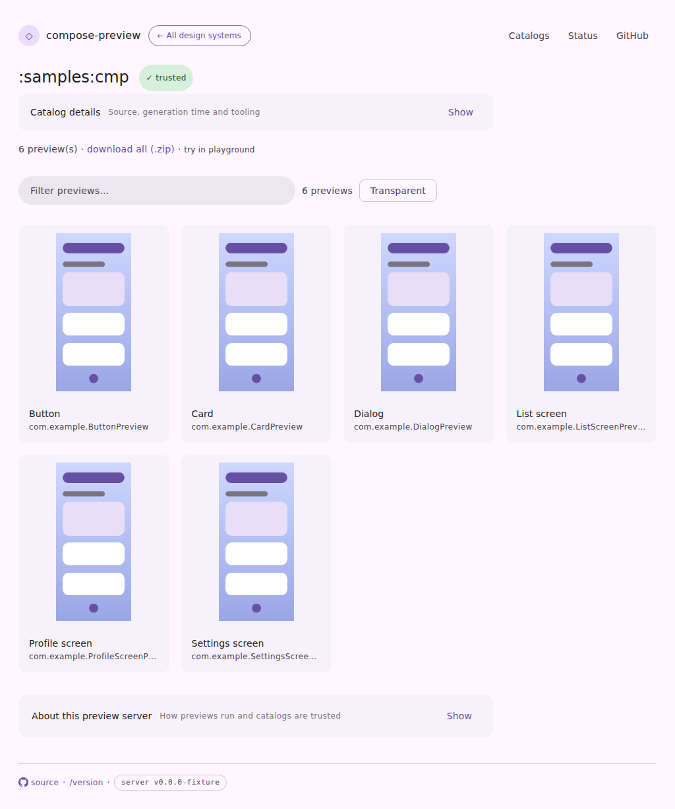

# Space in the `compose-preview serve` pages

The viewer's chrome had grown until the render — the one thing the page exists to show — opened
half below the fold, and a catalog with several declared themes pushed it further with every theme
it declared. Captures come from the preview-harness (`pages-snapshot.spec.mjs`) at 1024×720, light
theme, full page.

## A crowded viewer toolbar

The `serve-viewer-theme-overflow` fixture: eight theme chips beside the four fixed toolbar controls,
which is what the published `compose-m3` catalog actually offers. Before, the bar wrapped onto three
lines and the breadcrumb, title, id and provenance links each took a row of their own — the stage
started 440px down:

After: the trail is in the header, identity is one row, and the toolbar is capped at a single line —
the theme chips are its only elastic member, so they shrink (ellipsising) to a floor that keeps them
tellable apart and the group scrolls within itself past that. The stage starts at 236px:

## The ordinary viewer

Same page without the theme crowd, showing where the provenance links went. Before, `source` /
`playground` / `report an issue` sat between the heading and the render:

After, they sit directly above the export bar, with the other take-this-away-with-you affordances:

## The catalog landing

The back button moves out of the body's first line into the header's brand slot, so the catalog's
own heading leads the content column:

## Kept diffed

`serve-viewer-theme-overflow` is a committed page fixture, so the CI visual-diff bot renders and
diffs the crowded toolbar on every future PR — this page is a snapshot of the change, not the
mechanism that keeps it covered.
