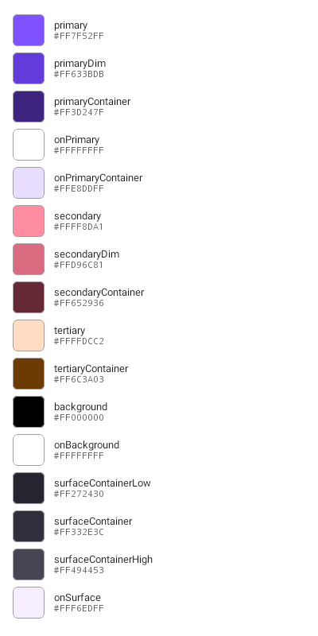
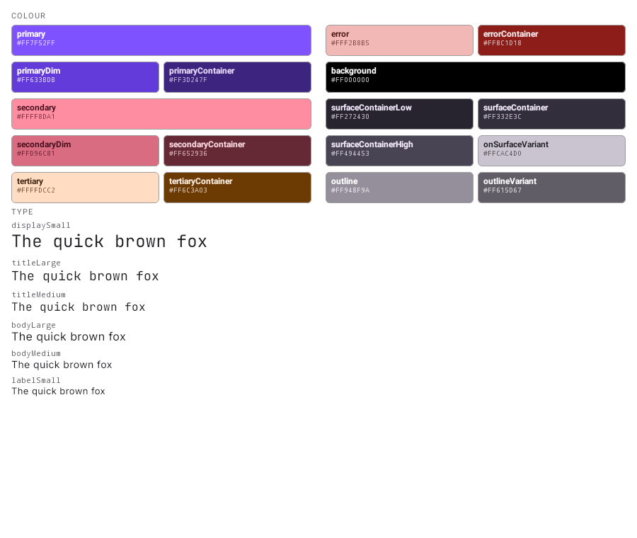
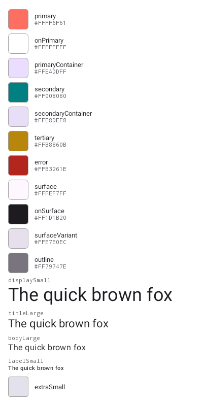
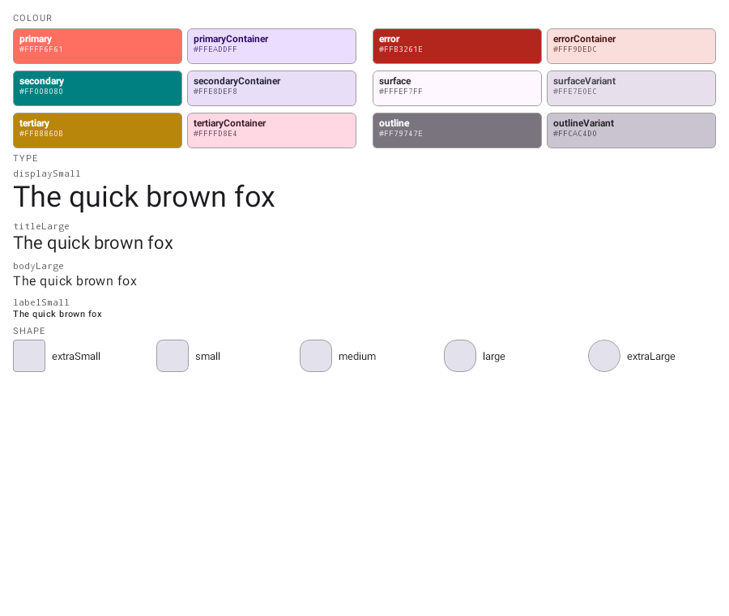

# Theme specimen sheets stop truncating

Both `@ThemeCatalog` and `@WearThemeCatalog` sheets laid their rows out in a single `Column` on a
fixed canvas, so every row past the bottom edge was simply not drawn. Nothing reported it — the PNG
just ended, and in both cases it ended part-way through the *last* section, which is the one a
reader is least likely to notice is missing.

At the old 400 x 800 canvas (16dp padding → 768dp of content), with each swatch / shape row at 40dp
plus 4dp padding and a 4dp gap = 48dp:

| sheet | content | what rendered |
| --- | --- | --- |
| Wear (21 colours + 6 type) | 21 x 48 = 1008dp of colour alone | 16 swatches, **no type at all** |
| Mobile (11 colours + 4 type + 5 shapes) | ~954dp | **1 of 5 shape rows** |

The sheet is now laid out as blocks on a 900 x 760 canvas instead of one list on the 400 x 800
sandbox: **colour roles in two balanced columns**, then the **type scale at full width** (a specimen
line is judged on a real line of text, and a half-width column wraps the pangram mid-phrase), then
the **shape scale as a single row** so the corner progression reads left to right.

Colour roles are drawn as chips that **letter their own name in the role they pair with** — `primary`
in `onPrimary`, `surfaceContainer` in `onSurface` — with variants (`*Dim`, `*Container`) sharing the
row beneath their base. A pair of hex codes on separate rows asserts that `onPrimary` goes on
`primary`; a chip that draws the name in it shows whether that pair is actually legible, which is
the question a reviewer has about a theme.

## Wear — `wearthemecatalog__KotlinConf`

The type scale is what this sheet could never show. After, the KotlinConf pairing is legible
directly in its own specimen: JetBrains Mono on `displaySmall` / `titleLarge` / `titleMedium`, Inter
on `bodyLarge` / `bodyMedium` / `labelSmall`. Wear's `*Dim` roles now sit beside the base they dim.

| before | after |
| --- | --- |
|  |  |

## Mobile — `themecatalog__Brand_Light`

The shape scale returns — all five tokens, not just `extraSmall`, and as one row the corner
progression is readable at a glance.

| before | after |
| --- | --- |
|  |  |
