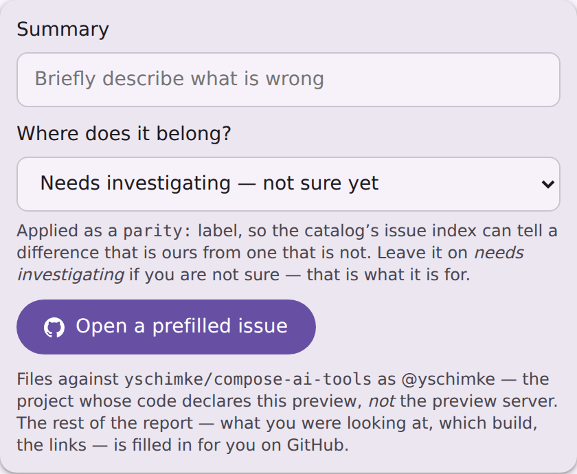
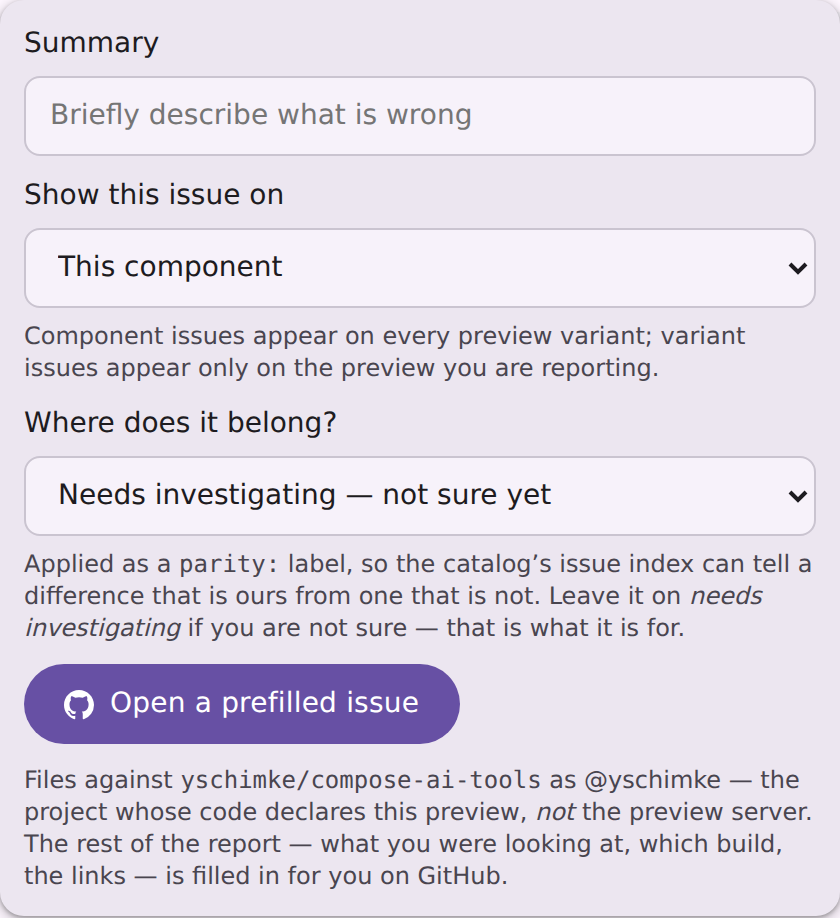

# A report filed from the viewer carries a parity locator

[#5000](https://github.com/yschimke/compose-ai-tools/issues/5000). `parity/issues.json` is built
from the `compose-parity-locator/v1` fence, and only the focused comparison emitted one. The
**viewer** — the report form reachable from every preview page and every catalog grid card — filed a
complete-looking issue with a `parity:` label and no fence, so `buildIssueIndex` skipped it as
`NO_LOCATOR` and the component's card never badged. Both ends were silent:
[m3-catalog#256](https://github.com/yschimke/m3-catalog/issues/256) and
[#269](https://github.com/yschimke/m3-catalog/issues/269) are open, labelled, and absent from the
index, while the form beside them told the reporter their label fed it.

**What has landed, and where.** The fix is in
[`yschimke/compose-preview-server`](https://github.com/yschimke/compose-preview-server), which owns
the server since extraction #4732 — so it reaches a deployed `preview.coo.ee` with that repository's
next release, and reaches *this* repository's bundled `compose-preview serve` only when the released
version is adopted here (`composeai-preview-serve` in `gradle/libs.versions.toml`, on 2.15.0 at the
time of writing, bumped by Renovate). Until that bump, the CLI this repository builds still files the
locator-less body, and the stale copy of the page fixture under
`preview-server/preview-harness/fixtures/pages/` still shows the old panel; both move with the
version, not with this commit. The shots below are taken from the server repository's own
regenerated golden.

The viewer's report context now names the preview's design reference — the first, resolved exactly as
the page's own spec lane and annotations already resolve it, so the locator names the reference the
viewer actually puts on its stage — so `ServeIssueReport.locator` returns a locator, and the block's one override-dependent field is left as
an `{{overrides}}` placeholder the page's own script fills from live control state, on the same pass
that fills `{{render}}`. The *score* stays exclusive to the comparison: it is the only page that
measures one.

The shots are the committed page fixture, production CSS and JS, with the report disclosure opened.
Both commands run in a **`yschimke/compose-preview-server` checkout**, not this one: `:server` is
that repository's project, and this build has no such module since the extraction.

```sh
git clone https://github.com/yschimke/compose-preview-server && cd compose-preview-server
UPDATE_SERVE_WEB_FIXTURES=true ./gradlew :server:test --tests '*ServeWebFixtureTest*'
```

## Before

The panel a viewer report is filed from, with no locator in its body — so nothing it files reaches
the index the note under "Where does it belong?" promises.



## After

The body now carries a locator, and the locator is what puts **Show this issue on** in the panel —
the scope control the comparison has had since batch 02, offering the same component-wide or
variant-only choice.



## The body itself

What the served form now prefills for `com.example.ProfileScreenPreview`, appended after the
existing prose table (unchanged above this point):

````
[Open this preview](https://preview.coo.ee/compose-m3/p/com.example.ProfileScreenPreview)

```compose-parity-locator/v1
repository: yschimke/compose-ai-tools
system: compose-m3
component: Profile/Screen
preview: com.example.ProfileScreenPreview
reference: profile-screen-figma
variant:
overrides: {}
revision: yschimke/compose-ai-tools@design-artifacts/compose-m3
```
````

The template the page's script fills is the same body with `overrides: {{overrides}}` on that line.
A visitor with scripting off files the served form above, whose overrides are the ones their own URL
asked for and whose render link is the matching one.
