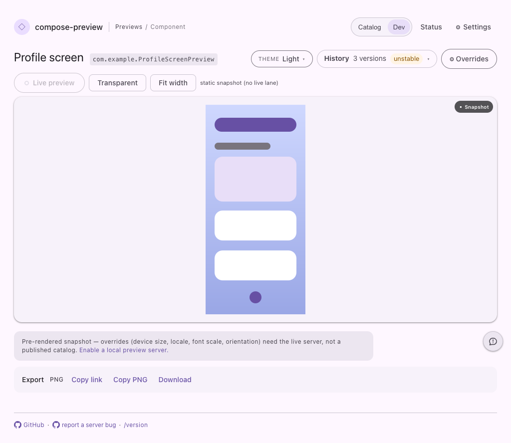
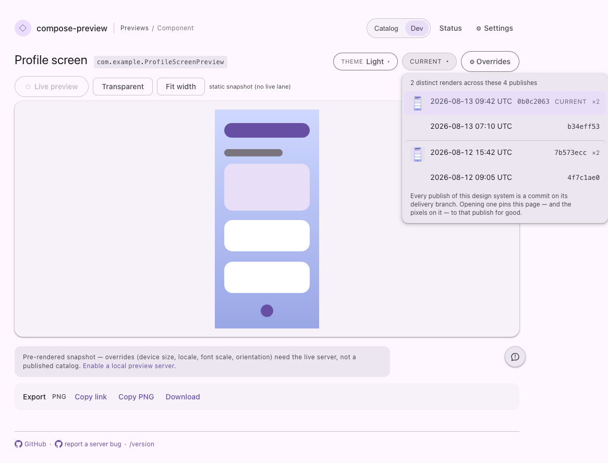

# Vue serve-web migration evidence

The serve-web custom elements moved from Lit to Vue without intentionally
changing their layout or interaction design. These representative light-theme
captures exercise the two controls whose content arrives after initial page
load: the render-history menu and revision-run decorations.

Both before/after pairs are byte-identical. The complete Playwright page suite
also captures every committed fixture in light and dark themes.

## History menu

Before:

After:

## Revision runs

Before:

After:

