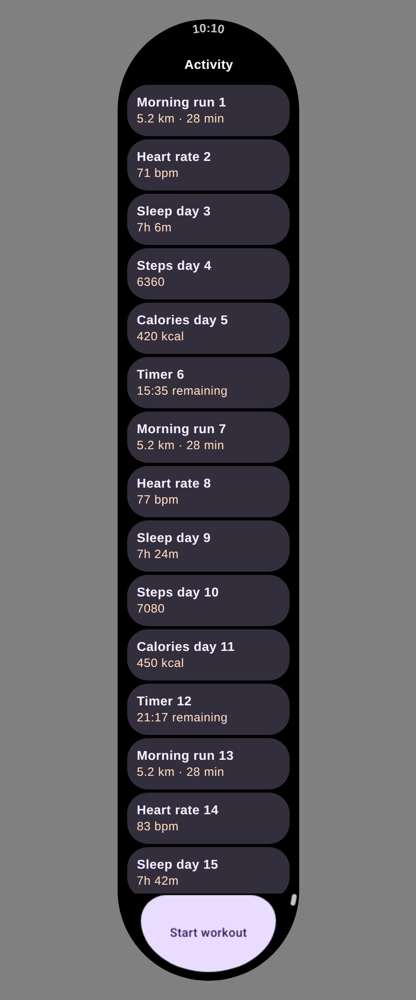

# The capsule fixture names Roboto Flex again

`WearScrollSvgGrowthTest` has been red on `main` since #4342. The failure reads as a font
regression, and it is the opposite: the render got **better** and the committed fixture stayed
behind.

## Reading the failure correctly

The drift guard is

```kotlin
assertEquals(
  "committed capsule fixture is stale — regenerate with UPDATE_WEAR_SCROLL_FIXTURE=true",
  stripRasterBytes(fixtureHtml),   // expected — freshly generated
  stripRasterBytes(committed),     // actual   — the committed fixture
)
```

JUnit's `assertEquals(message, expected, actual)`, so **`expected` is the fresh render and `actual`
is the committed file** — the reverse of the usual reading. The reported difference

```
expected: font-family="'Roboto Flex', sans-serif"
actual:   font-family="sans-serif"
```

therefore says the *fresh* SVG names Roboto Flex and the *committed fixture* does not. Nothing
failed to resolve a font.

## Why the fixture was behind

The fixture was last regenerated in #4310. [#4342](https://github.com/yschimke/compose-ai-tools/pull/4342)
then added `deviceFontFamilyName` to the `compose/semantics` producer, so a text node drawn through
`Font(DeviceFontFamilyName("roboto-flex"))` finally reports a typeface — its own commit message
notes that before it, "every text node in a family declared that way reported **no typeface at
all**", and that this "is how Wear Compose Material 3's own type ramp declares Roboto Flex, so it
covered every Wear preview's text".

The fixture is a snapshot of that earlier era. Regenerating is the fix; 31 of the capsule's 32 text
nodes gain the family, and the remaining one inherits.

## What the fixture renders as



**This screenshot does not show the change**, and is not offered as proof of it. Roboto Flex is not
installed in the container that captured it, so the browser falls back to its own sans-serif for the
old and new fixture alike — the two PNGs differ by 32 bytes and are indistinguishable by eye. The
change is in the SVG's *declared* `font-family`, which a viewer with the face available honours; the
image above is here to show the capsule still renders correctly after the regeneration. The textual
diff is the evidence, and CI's `vscode-preview-diff` bot renders this fixture on every PR.

Regenerate with:

```sh
UPDATE_WEAR_SCROLL_FIXTURE=true \
  ./gradlew :renderer-android:testDebugUnitTest --tests '*WearScrollSvgGrowthTest*'
```
