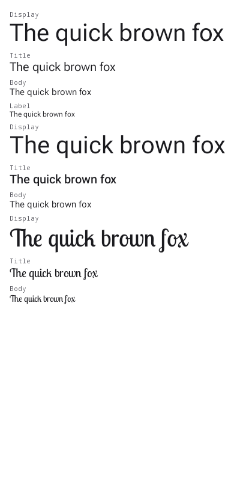
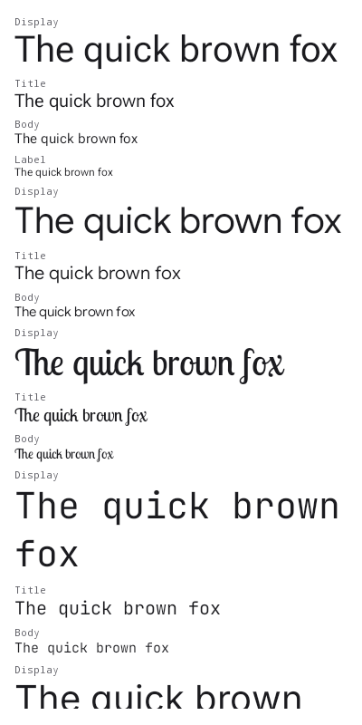

# Wear M3 theme catalogs change the typeface

The `@WearThemeCatalog` providers in `:samples:design-catalog-wear-m3` passed only a
`colorScheme` to `MaterialTheme`, so a selected theme re-tinted a sticker and always
drew it in the stock Wear face. Underneath that, `Typography(defaultFontFamily = …)`
is a no-op on Wear — it applies via `TextStyle.withDefaultFontFamily`, which only
fills a role that has no family, and every `TypographyTokens` role already declares
`Font(DeviceFontFamilyName("roboto-flex"), variationSettings = …)` — so the sticker's
own `knob.theme.font` override had never applied either.

## Typeface catalog

The declared `@TypographyCatalog` specimen sheet, rendered by
`:samples:design-catalog-wear-m3:composePreviewRenderAll`
(`renders/typographycatalog__all.png`).

Before, the **Google Sans Flex** group (second) drew in the platform sans — it aliased
`FontFamily.SansSerif`, on the claim the family isn't distributed. The CSS2 endpoint
does serve it, which is all the renderer's downloadable-font path needs, so it now
resolves to the real face. **JetBrains Mono** and **Inter** are new: they are the pair
Confetti Wear's KotlinConf identity is built from, and the KotlinConf theme now applies
them.

| before | after |
| --- | --- |
|  |  |

## Why the theme sheets aren't the evidence here

`wearthemecatalog__KotlinConf.png` and its siblings would be the natural place to show
a theme's typeface, and they can't: `WearThemeSpecimen` lays its type rows out *below*
21 colour swatches, past the bottom of the synthetic theme preview's fixed 400 × 800
canvas, so no Wear theme's typography appears in its own published sheet. That is a
renderer-side gap, not a catalog one — a follow-up should give the theme-catalog
previews a canvas tall enough for their type rows, after which this class of change is
diffed visually for free.

Until then `WearCatalogTypographyTest` is what pins the wiring, because the failure is
invisible in both code review and the rendered PNG.
