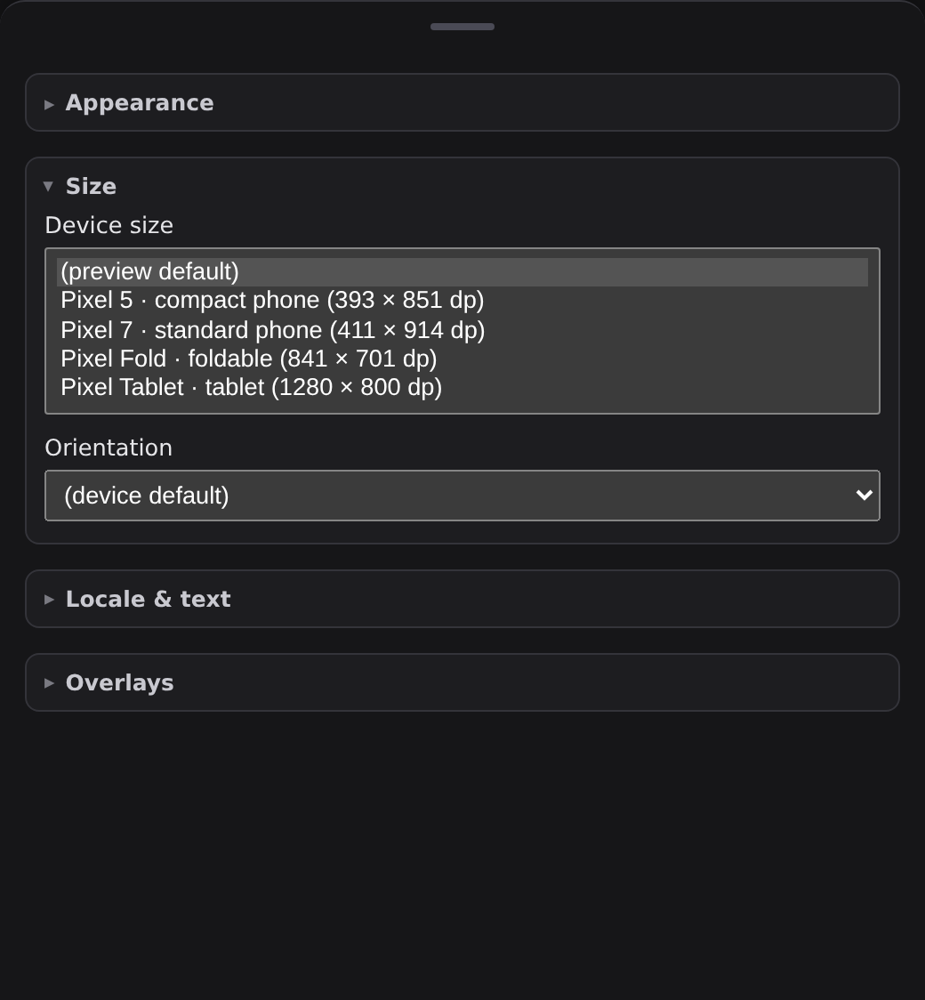
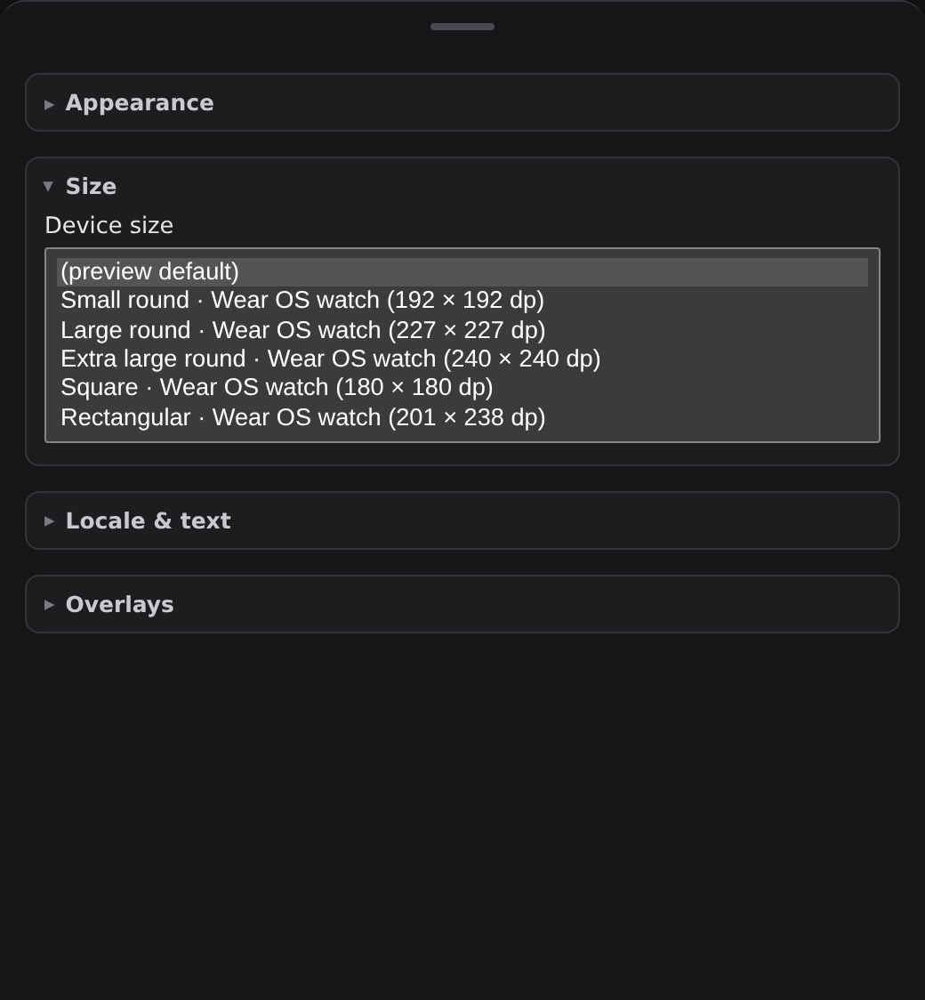

# Wear screens get watch device profiles

The `serve` viewer's **Size** panel offers a screen preview a short list of device
profiles. That list was a fixed set of Android handhelds, so every Wear catalog —
`home-assistant-wear`, `confetti-wear`, `wear-m3` — asked the reader to render a
watch surface on a Pixel Fold or a 1280 × 800 dp tablet, and offered an Orientation
control no watch can honour.

The picker now branches on the served system id (the same Wear/watch token heuristic
that already drives the always-dark stage): Wear systems get the five Wear OS shapes
the renderer already resolves for `@Preview(device = …)`, and the Orientation control
is omitted for them. Handheld catalogs are unchanged.

Captured from the committed `serve-viewer-wear-screen` page fixture
(`vscode-extension/preview-harness/fixtures/pages/`), with the **Size** group opened
and the device menu expanded inline so the whole list is visible.

| before | after |
| --- | --- |
|  |  |
