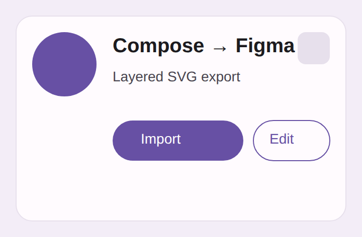
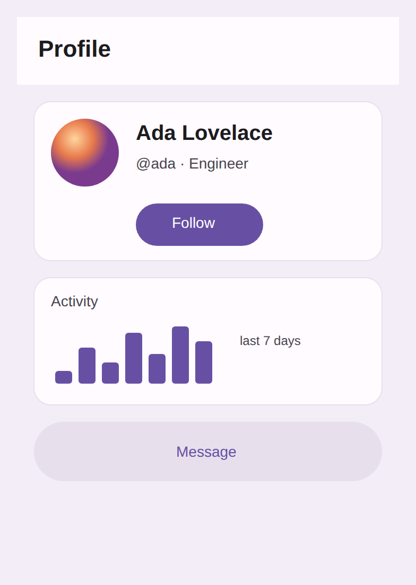

# `compose/figma-svg` — example output

An illustrative example of the layered, editable SVG the `compose/figma-svg`
data product emits (renderer: `FigmaLayeredSvg` in `:data-layoutinspector-core`).

[`profile-card.svg`](profile-card.svg) is the exact document shape the exporter
produces for a small Material card — a rounded, bordered surface containing a
circular avatar, a bold title, a subtitle, a filled button, an outlined button,
and a rounded badge. [`profile-card.png`](profile-card.png) is that SVG
rasterised (so the vector can be viewed as pixels here):

What to notice — and why it imports cleanly into Figma:

- **Every composable is a named `<g id="…">` group**, nested exactly as the
  composables nest (`Surface` › `Avatar` / `Title` / `PrimaryButton` › `ButtonLabel`
  …), so a Figma SVG import lands each component/screen as a named layer.
- **Container tokens become real vector shapes**: `background` → a filled `<rect>`
  (or a rounded-corner `<path>` when corners aren't uniform), `border` → a stroke,
  the resolved corner radius → Figma's editable corner radius, `CircleShape` →
  a max-radius rounded rect (the avatar).
- **Text is editable `<text>`**, not outlines, carrying the captured
  family / size / weight / colour — so a designer edits the string in place.
- **Named theme colours ride along** as a `<title>` + `data-token` on the layer
  (`Surface · surface`, `Avatar · primary`, …), to pair with the sibling
  `figma-variables.json` when binding fills to variables. (Shown here because
  this example is generated with a theme colour-name map; wiring the live
  `compose/theme` map into the render path is a tracked follow-up.)

The live artifact is produced per-render by both daemon backends; the desktop
`RenderEngineTest` asserts a real render drops `compose-figma.svg` alongside the
wireframe.

## Hybrid: mostly vector + a few rendered components

Some components can't be faithfully reproduced as vector — bitmaps (`Image` /
`AsyncImage`), vector assets (`Icon`), custom `Canvas` drawing, gradients,
charts. Rather than export those badly, the exporter classifies them as
**opaque** and emits an `<image>` placeholder at the node's bounds, backed by a
background-free raster the render pipeline captures in isolation. Everything else
stays editable vector. So a whole screen is *mostly* parameterized SVG with only
a few rendered components.

[`hybrid-screen.svg`](hybrid-screen.svg) is a profile screen exported this way —
the app bar, cards, buttons, borders, corner radii, and all text are vector,
while the **avatar** (a photo) and the **activity chart** (a `Canvas`) are
`<image>` references into [`figma-raster/`](figma-raster). Rasterised:

The classifier is driven by `FigmaSvgModel.DEFAULT_RASTER_COMPONENTS` (a
per-design-system-tunable set of composable-name fragments); each opaque node is
reported on `FigmaSvgModel.rasterTargets` so the pipeline knows exactly which
background-free PNGs to render. Which components are best rasterised vs.
vectorised is tuned against the fidelity diff (render vs. SVG), so designers can
trust the result.
