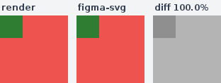
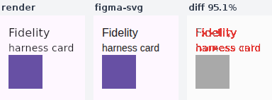
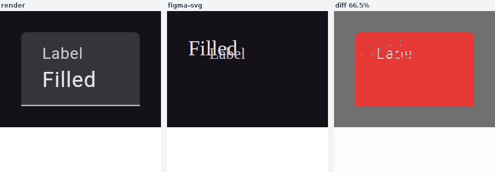
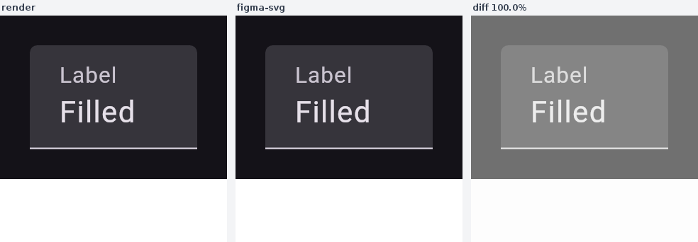
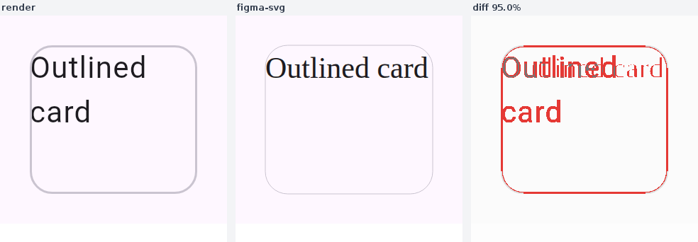
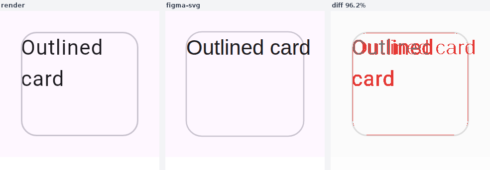
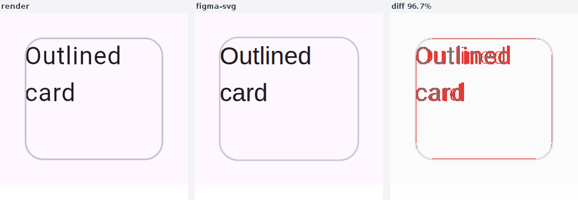

# figma-svg fidelity harness

The fidelity harness scores how faithfully the `compose/figma-svg` export reproduces the real
render. For each preview it rasterises the exported `compose-figma.svg` (headless Chromium — the
engine an imported SVG is interpreted by, so text/gradients/`figma-raster` images all render),
aligns it to the padding-free render PNG, and diffs them into a `render | figma-svg | diff`
composite plus a `compose-figma-fidelity.json` score.

It is opt-in (`-Dcomposeai.figma.fidelity=true`) and runs on the desktop backend (where the renderer
and a browser live). The pure scoring/compositing lives in `FigmaFidelity`; the rasterise + align in
`FigmaSvgFidelity`.

## Examples

**Hybrid raster — 100%.** A screen with an opaque `Image`: the vector surface + the cropped
`figma-raster` image both reproduce exactly, so the export is pixel-faithful.

**Composite card — ~95%.** A themed `Surface` with a title, body text, and a coloured box. The
surface fill and box match exactly. The `<text>` baseline is now placed from the captured typography
— font ascent plus the line-height leading split above the first line — instead of a flat
`top + 0.8·fontSize`, which dropped the card's mean per-pixel error by ~a third (4.0 → 2.7). The
residual the diff still shows is **font shape**, not baseline: the export declares `sans-serif` and
the browser substitutes its own face, whose glyph advances differ from the render's, so the words
drift horizontally along the line. Closing that needs the resolved font embedded/referenced in the
SVG — a separate axis from placement.

## Fixes tuned by the harness

The diff is the signal for *which* export bugs to fix. Three systemic ones the harness surfaced on
the `compose-m3` catalog (mean fidelity across 70 stickers **97.54% → 98.59%**, no regressions):

**Text no longer collapses to serif.** A concrete `<text>` family (`Roboto-Regular`) carried no CSS
generic fallback, so with no `@font-face` embedded the browser/Figma substituted their default
*serif*. Emitting a style-correct fallback (`Roboto-Regular, sans-serif`; serif/monospace specimens
keep their style) puts the text back in the right typeface — the middle panel below goes from serif
to the render's sans-serif. **Rasterise the imperatively-drawn Material chrome.** The filled/outlined
`TextField` container + indicator and the `Slider` track are drawn in a `Canvas`, never surface as a
container token, and so dropped out of the vector entirely — the filled `TextField` was the worst
sticker (dark: **66.5%**, whole box missing). It now exports as a hybrid `<image>` crop. **Scale the
outline stroke by density** — a 1dp Material hairline is 2px at the 2× capture density, not the
hardcoded 1px.

| before | after |
| --- | --- |
|  |  |
|  |  |

**Wrap multi-line text where the render wrapped it.** The capture recorded `lineCount` but not the
break positions, so wrapped text collapsed onto a single baseline. Capturing each line's substring +
left + baseline from the node's `TextLayoutResult` and emitting one `<tspan>` per line puts the wrap
back — the `OutlinedCard` title below returns to two lines matching the render:

| before — one line | after — wrapped |
| --- | --- |
|  |  |

The residual red on the card is the render's two-line wrap (the SVG keeps one line — the capture
records `lineCount` but not the line-break positions yet) and the remaining font-shape drift.

The score is a per-pixel agreement fraction over a common opaque background. It's a **structural**
metric: a per-channel colour tolerance absorbs antialiasing, and a **spatial tolerance** (a ±1px
neighbourhood match) absorbs the sub-pixel baseline/edge drift that is unavoidable between the render
and its SVG re-rasterisation — so the score flags real drift (missing shape, wrong fill, text off by
more than a pixel) rather than being dominated by 1px text jitter. The `rasterizer` field in the
sidecar records whether Chromium (text-inclusive) or the Skia fallback (shapes only) produced the
score.
