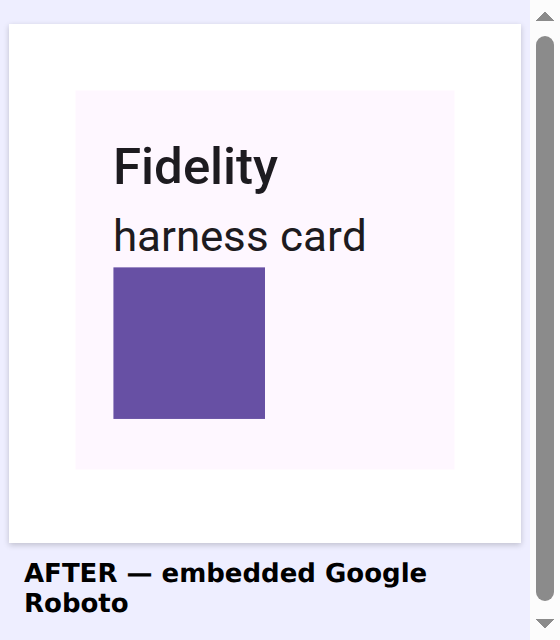
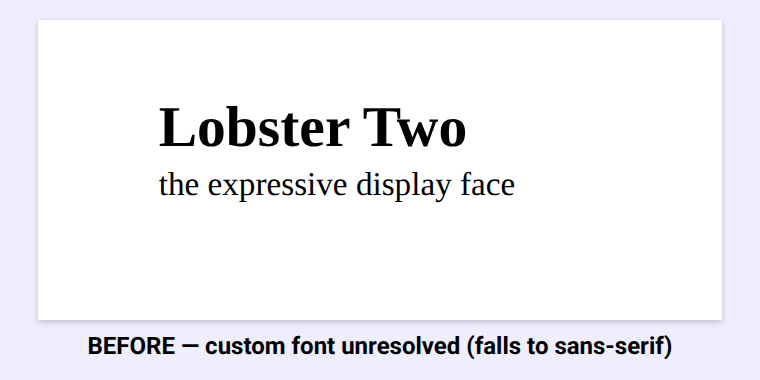
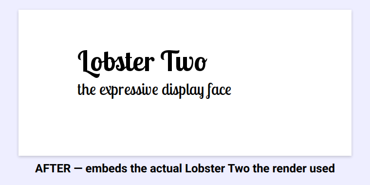
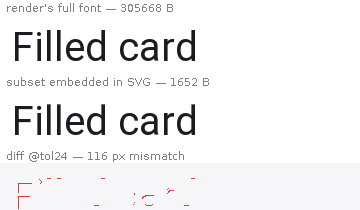

# Google downloadable fonts in the figma-svg export

By default the `compose/figma-svg` export names text `font-family="sans-serif"`, so whatever opens
the SVG — a browser preview, the fidelity rasteriser, Figma — substitutes *its own* sans-serif and
the typography drifts from the design.

With font embedding on (`-Dcomposeai.figma.embedFonts=true`, also implied by the fidelity harness)
the exporter resolves each text node's face to a **Google downloadable font** — the Material default
maps to **Roboto** — fetches its WOFF2 (via the Google Fonts CSS2 API, cached under the renderer's
own `composeai.fonts.cacheDir`) and embeds it as an `@font-face` data URI, naming the text with the
real family. The SVG becomes self-contained and renders the true typeface everywhere.

| Before — `sans-serif` (viewer substitutes) | After — embedded Google Roboto |
|---|---|
|  |  |

Both panels are the *same exported SVG* rendered by headless Chromium; the only difference is the
embedded `@font-face`. Before, Chromium falls back to its platform sans-serif (here a DejaVu/Liberation
face); after, the title renders in Roboto Medium and the body in Roboto Regular — the actual Material
type. Figma, which ships Roboto, matches by name on import; a browser/Chromium uses the embedded WOFF2.

Embedding runs on **both backends** — desktop (`RenderEngine`) and Android (`ComposeFigmaSvgExtension`)
— so a `data/fetch` for the figma-svg on either target yields the same self-contained SVG. The flag is
read in the **daemon JVM**, so the Gradle plugin forwards `-Dcomposeai.figma.embedFonts=true` (or
`-PcomposePreview.figmaEmbedFonts=true`) into the daemon's system properties
(`AndroidPreviewClasspath.buildSystemProperties` + the daemon-start descriptors) — otherwise the flag
set on the Gradle invocation would never reach the daemon that reads it. It's opt-in so default renders
stay deterministic and offline-safe (a failed/absent fetch degrades to the named `sans-serif`, never an
error).

## Custom / downloaded / variable fonts — embed the face the render used

Naming a face `sans-serif` and fetching **Roboto** by name only covers the Material default. Any other
face — a downloaded Google font, a bundled/custom face, a variable font — is captured by the *path of
the font file the render actually loaded* (e.g. `…/.cache/composeai/fonts/lobster-two-700.ttf`), not a
Google family name, so a name-based fetch would miss it.

So the export now **embeds that exact file**: when a text node's captured family is an on-disk
`.ttf`/`.otf`/`.ttc`, `ComposeFigmaSvgDataProducer` reads its bytes, names the `@font-face` by the
font's real family (read from the file), and points the `<text>` at it. The SVG reproduces the *same
bytes the render drew* — faithful for any face, no name guessing — falling back to the Google-Fonts
WOFF2 fetch only for generic families.

| Before — custom font unresolved (falls to sans-serif) | After — embeds the actual face the render used |
|---|---|
|  |  |

Both are the same exported SVG rendered by headless Chromium; only the `@font-face` differs. The
render loaded **Lobster Two** (a downloaded Google font); before, the export couldn't reproduce it and
Chromium substituted a serif; after, the SVG carries the real Lobster Two file and renders the script
face — matching the render.

## Subset to the drawn glyphs — exact face, a few KB

Embedding the *exact file* the render loaded is faithful but a whole font is 100–300 KB, base64'd
into every sticker — a catalog of SVGs balloons by megabytes. So the embed is **subset** to just the
code points the SVG's `<text>`/`<tspan>` actually draw (`FontSubsetter`, pure-JVM via FontBox): keep
those glyphs' outlines, then strip the OpenType layout + hinting tables — `GPOS`/`GSUB`/`GDEF`/`kern`,
`fpgm`/`prep`/`cvt`/`gasp` — that static, pre-laid-out SVG text never applies. For a UI font `GPOS`
alone is 60–70 KB, dwarfing the ~2 KB of real outlines, so that's where the weight goes.

| face | full file | subset embedded | reduction |
| --- | --- | --- | --- |
| Roboto-Regular | 306 KB | ~3 KB | ~100× |
| Noto Serif | 247 KB | ~4 KB | ~60× |
| Droid Sans Mono | 108 KB | ~4 KB | ~24× |

The `glyf` outlines are untouched, so the shapes stay identical to the render — exact typeface, a
fraction of the bytes. Below, the render's full Roboto and the subset embedded in the SVG draw the
title identically (the diff is edge antialiasing only):



Best-effort: a CFF `.otf` (no `glyf`) or any parse failure falls back to embedding the full file, so
a face is never dropped. The dropped `GPOS` kerning is sub-pixel for UI labels and absorbed by the
fidelity harness's tolerance; the Google-Fonts WOFF2 path (generic families) already ships a bounded
`latin` subset, so it's left as-is.

## Desktop-render font gap (follow-up)

The desktop `compose-figma-fidelity` score doesn't move on the embed alone, because the desktop Skiko
render doesn't itself draw Roboto: on a headless Linux box `fc-match sans-serif` resolves to **DejaVu
Sans** (Roboto isn't installed), so `FontFamily.Default` renders DejaVu while the export embeds Roboto.
It can't be fixed in application code — Compose Desktop casts `LocalFontFamilyResolver.current` to its
concrete `FontFamilyResolverImpl`, so a resolver that remaps `FontFamily.Default → Roboto` (the trick
the Android fonts-recorder uses) throws `ClassCastException` on desktop.

The fix is **environmental**: install the Roboto TTFs and make Roboto the fontconfig default —

```
# Roboto {400,500,700}.ttf → ~/.local/share/fonts, then:
~/.config/fontconfig/fonts.conf:
  <alias><family>sans-serif</family><prefer><family>Roboto</family></prefer></alias>
fc-cache -f
```

Verified: with that in place the desktop render draws Roboto, matching the embedded face, and the
composite card's mean per-pixel error drops **4.02 → 1.89** (score → ~95.6%). Because it changes the
default font of *every* desktop render, adopting it means regenerating all desktop `@Preview`
baselines — so it belongs in a dedicated PR (render-environment setup: CI + the agent session-start
hook) rather than riding along with an export change. On Android the render is already Roboto, so the
embedded face matches there today.
