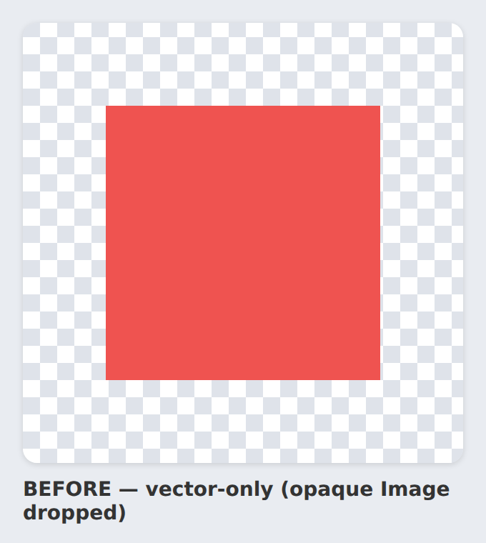
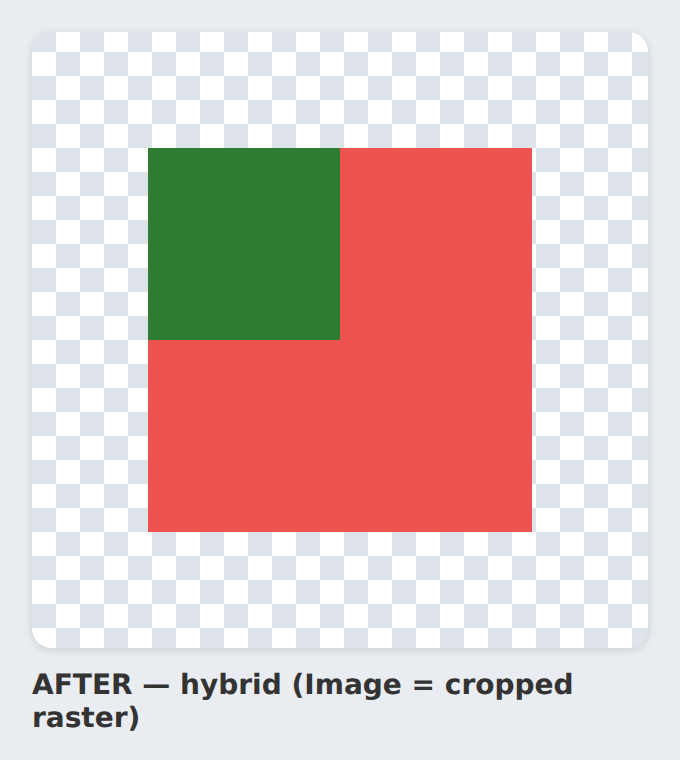

# Hybrid raster capture — before/after

Real desktop-render output for the `OpaqueImageSquare` fixture (a red screen with
one opaque 32×32 `Image` in the top-left), rasterised with headless Chromium.

| Before (vector-only) | After (hybrid) |
|---|---|
|  |  |

**Before** — the opaque `Image` node had no vector representation, so the export
dropped it: the region shows the red screen behind it, and the SVG carried no
`<image>` reference.

**After** — the exporter emits the `Image` as an `<image>` layer and the producer
crops its bounds out of the captured frame into `figma-raster/<node>.png`, so the
green image renders in place and the SVG is whole (no dangling reference).

These are produced from an actual render (not hand-authored), so they track the
real `ComposeFigmaSvgDataProducer` cropping behaviour.
