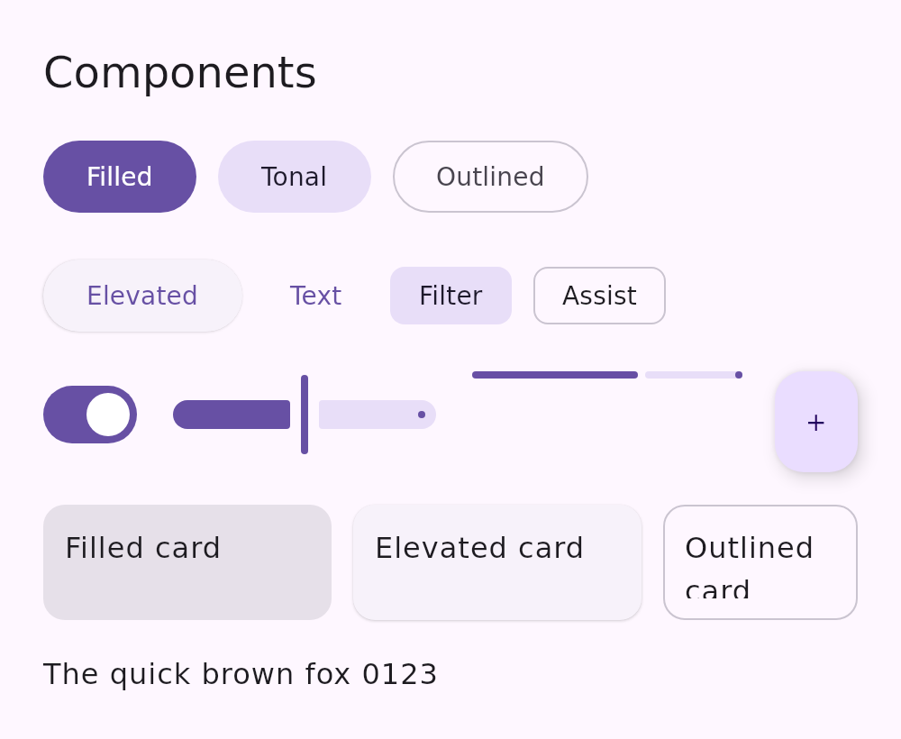
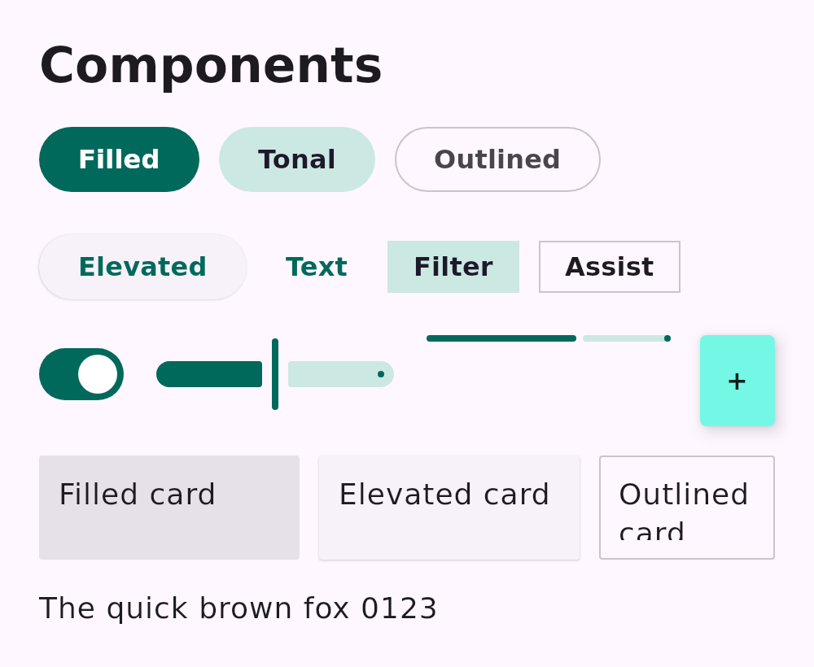
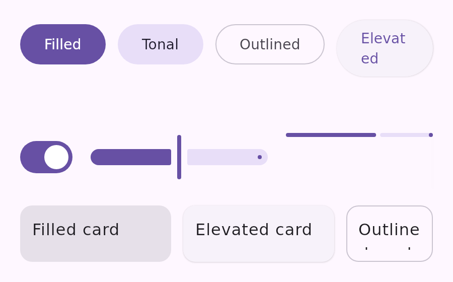
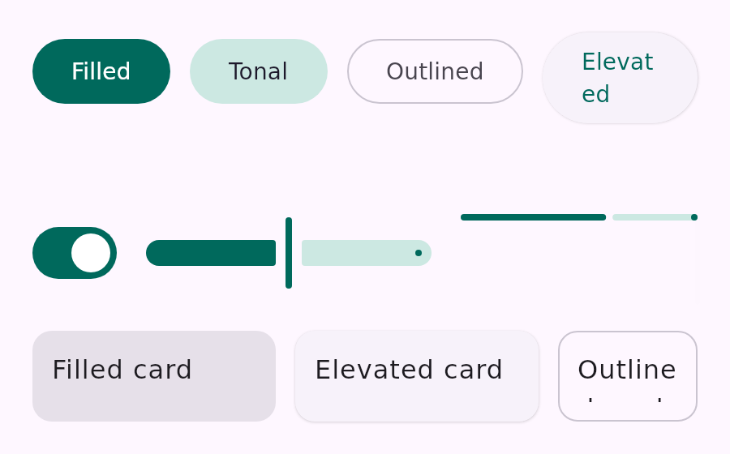

# Re-skinning the Material 3 catalog with an app theme

The Compose Material 3 catalog (`:samples:design-catalog-m3`, published to
`preview.coo.ee/compose-m3/`) resolves its theme overrides through shared functions in
[`CatalogThemeChoices`](../../samples/design-catalog-m3-shared/src/commonMain/kotlin/com/example/designcatalogm3/shared/CatalogThemeChoices.kt)
that **both** render tiers call — the desktop `@Preview` sticker sheet (`CatalogSticker`) and the
in-browser Wasm viewer (`CatalogApp`). Because every sticker resolves the knobs through that one
place, a consumer can re-skin the **whole** catalog under its own brand theme with **no per-preview
change and nothing brand-specific hardcoded in this repo**.

A `MaterialTheme` is `(colorScheme, typography, shapes)`, so there is one knob per axis:
`theme.colors`, `theme.typography`, `theme.shapes`. Each is inert by default — the decode only fires
for its own `scheme:` / `typo:` / `shapes:` prefix, so a named/absent knob renders byte-identically.

## `theme.colors` — a serialized `ColorScheme`

Alongside the named palettes (`M3`, `Coral`, `Teal`), `theme.colors` accepts a serialized
`ColorScheme` inline on the string knob:

```
scheme:l=<role>:<AARRGGBB>,<role>:<AARRGGBB>,…;d=<role>:<AARRGGBB>,…
```

- `l=` / `d=` carry the light and dark schemes; the resolver decodes the segment for the mode being
  rendered.
- Each role is one of the 48 M3 `ColorScheme` roles — the base set **and** the fixed accent roles
  (`primaryFixed`, `onPrimaryFixed`, …) the `compose/theme` token export reads. Roles the blob omits
  keep their stock M3 tone, so a **partial** palette still renders.
- An unparseable value falls through to the stock M3 scheme — the decode never throws.

Encoder: `serializeCatalogColorScheme(light, dark)`.

## `theme.shapes` — a serialized `Shapes`

```
shapes:xs=<dp>,s=<dp>,m=<dp>,l=<dp>,xl=<dp>
```

The five M3 corner-size tokens as `RoundedCornerShape` radii in dp. Only the tokens the blob carries
are overridden (the rest stay stock M3); any other / absent value yields the stock `Shapes()`. This
re-corners the components that read the size tokens — cards (`medium`), chips (`small`), FAB
(`large`), text fields (`extraSmall`) — while components pinned to `CornerFull` (buttons) stay their
stadium shape, exactly as under a normal app `Shapes`. Encoder: `serializeCatalogShapes(…)` (it takes
the five dp values directly, since a built `CornerBasedShape` doesn't expose its size portably).

## `theme.typography` — serialized type **metrics**

```
typo:<role>=<sizeSp>/<lineHeightSp>/<letterSpacingSp>/<weight>,…
```

One entry per M3 type role, carrying the numeric scale (size / line-height / letter-spacing /
weight); `-` in a slot leaves the base value. The metrics are overlaid on the base type scale, which
already carries the **typeface** from the `theme.font` knob — because a font *file* can't travel on a
string knob, the face is resolved separately (the catalog's vendored / named families), and only the
scale rides here. Encoder: `serializeCatalogTypography(typography)`.

> For pixel-faithful type under an arbitrary app font that the catalog doesn't vendor, the
> whole-theme `PreviewWrapperProvider` route (the one the wear catalog uses) is the general answer —
> it hands the catalog the app's real `Typography` (and `FontFamily`) object rather than serializing
> the scale. The string knobs here are the rebuild-free path that works today on the CMP-desktop
> pipeline.

## Before / after

The same M3 components, same layout — only the `theme.*` knobs differ. Left is the stock theme; right
is an example app re-skin combining **all three** axes (a teal `ColorScheme`, sharper corners, and a
bolder/larger type scale), each fed through its knob and resolved by the shared functions.

| Stock theme | App re-skin (colors + shapes + typography) |
| --- | --- |
|  |  |

The colors axis on its own:

| Stock `M3` | App palette (`scheme:…`) |
| --- | --- |
|  |  |

Overrides resolve in-composition, so a value reaches a live render through `compose-preview serve`
(`/render/<id>.png?knob.theme.colors=scheme:…`, `&knob.theme.shapes=shapes:…`,
`&knob.theme.typography=typo:…`) or the daemon RPC. Baking the re-themed PNGs into a published bundle
is a follow-up (a `--knob` seam on `bundle pack`), which lets an app surface the re-skinned catalog as
its own tab.

Encode/decode round-trips are covered by
[`CatalogColorSchemeTest`](../../samples/design-catalog-m3-shared/src/desktopTest/kotlin/com/example/designcatalogm3/shared/CatalogColorSchemeTest.kt)
and
[`CatalogShapesTypographyTest`](../../samples/design-catalog-m3-shared/src/desktopTest/kotlin/com/example/designcatalogm3/shared/CatalogShapesTypographyTest.kt).
