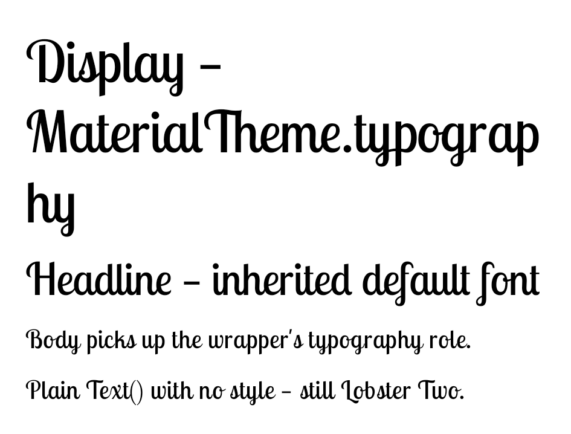

# Font preview wrapper — a downloadable Google font as a preview's default

`FontPreviewWrapper` is a `PreviewWrapperProvider` that makes a downloaded Google font the
**default** typeface for the preview it wraps — the type-design counterpart to the renderer's
`SystemBarsPreviewWrapper` chrome. It re-themes with a `Typography` whose every Material 3 role is
retargeted to **Lobster Two** (a Google Fonts display script, deliberately unlike Roboto so a glance
confirms the wrap fired) and also seeds `LocalTextStyle`, so both idioms inherit it:
`Text("…", style = MaterialTheme.typography.headlineMedium)` and a bare `Text("…")`.

The font resolves through the same `Font(GoogleFont(name), provider)` path the rest of the sample
uses — on-device via GMS Fonts, and under the renderer's Robolectric harness via
`ShadowFontsContractCompat`, which hands back a TTF from the shared `~/.cache/composeai/fonts/`
cache (downloaded once from `fonts.googleapis.com/css2`). No bundled TTF, no `src/debug` fork.

## Reuse across a multi-preview

androidx's `@PreviewWrapper` is `@Target(FUNCTION)`-only, so it can't be hoisted onto a
multi-preview annotation — you'd repeat it on every function. The project annotation
`@PreviewWrapperClass(wrapperClassName)` (in `:preview-annotations`) additionally targets
`ANNOTATION_CLASS`, so a multi-preview annotation can declare the wrapper **once**. `@FontPreview`
carries `@Preview` (light + dark) **and** `@PreviewWrapperClass(FontPreviewWrapper)`; discovery
hoists the wrapper onto every expansion (a direct `@PreviewWrapper`/`@PreviewWrapperClass` on the
function still wins). So `@FontPreview` alone both fans the preview out and installs the wrapper.

## Rendered showcase

`FontWrapperShowcasePreview` carries **no** font wiring of its own — every line inherits Lobster
Two from the wrapper, including the last line, which uses a bare `Text()` with no style at all
(resolved through the seeded `LocalTextStyle`). If the wrapper ever fails to load or the reuse
regresses, these lines fall back to the platform sans-serif, so the diff is unmistakable.

