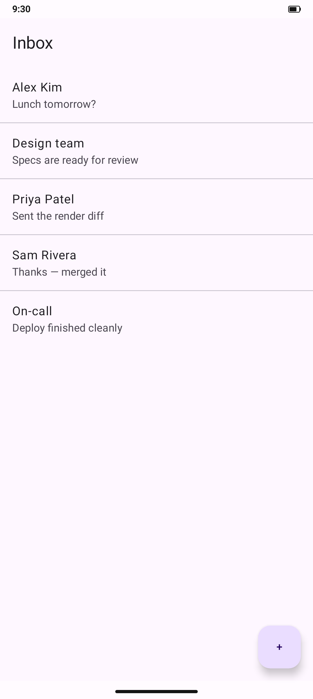
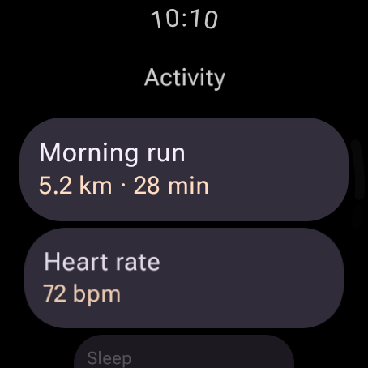
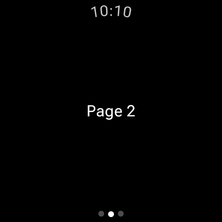
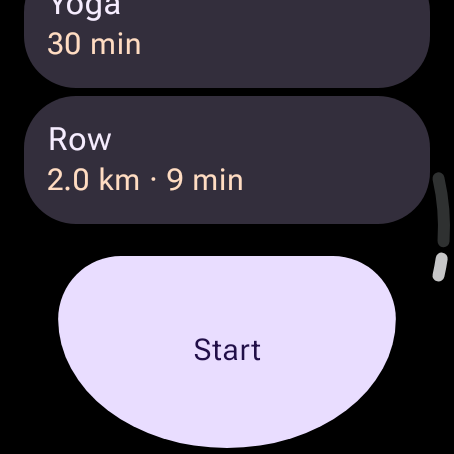

# Scaffold-template renders

Sample renders of the **Scaffold templates** groups added to the design
catalogs — full-screen, pre-built screen skeletons an app copies whole. See
[`../DESIGN_CATALOGS.md`](../DESIGN_CATALOGS.md#scaffold-templates) for the
authoring model; the sources live in `samples/design-catalog-m3` and
`samples/design-catalog-wear-m3`. These PNGs are committed as visual evidence;
the authoritative renders are produced by `composePreviewRenderAll` and the
weekly `design-artifacts` bundles.

## Compose M3 — `Template/AppScaffold`

A full-screen layout with the OS status bar: a `TopAppBar`, a list, and a FAB,
captured on a phone with `showSystemUi = true` (status bar + gesture-pill nav
drawn by the renderer's `SystemBarsFrame`), in light and dark.

| Light | Dark |
| --- | --- |
|  |  |

## Wear M3 — `Template/TimeText`, `Template/PageIndicator`, `Template/EdgeButton`

Each Wear template carries its own curved `TimeText` status strip (frozen at
`10:10`). Shown here at the large-round breakpoint; every template also renders
at small- and extra-large-round.

| TimeText (base) | Page indicator | Edge button |
| --- | --- | --- |
|  |  |  |
