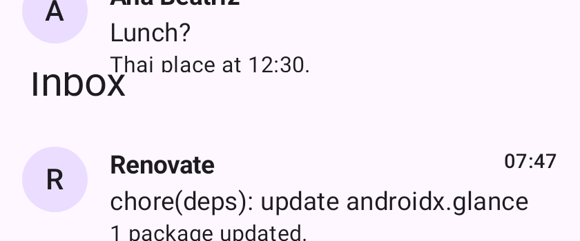
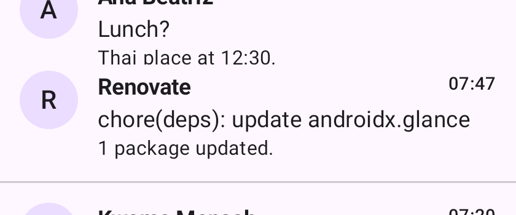

# `ScrollMode.LONG` repeats top-pinned chrome at every seam (#5234)

Rows 1150–1500 of the stitched `Inbox Long` strip
(`samples/android/.../InboxScrollPreviews.kt`, 320×480dp, 12 mails behind a
`TopAppBar`). The full strip is 840×3395px before and 840×3221px after — the
174 rows the fix removes are the duplicated bar.

| before | after |
| --- | --- |
|  |  |

**Before:** the `Inbox` app-bar title is pasted mid-strip, on top of the "Lunch?"
row it lands over. It appears twice in the strip (rows 223 and 1261).

**After:** content is continuous across the seam and the title appears once, at
row 223. All 12 mails survive in both (12 clean avatar runs at x=45).
