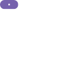

# Material button interaction SVG

Regression evidence for #4639. These images use the `MaterialButtonInteractionState` fixture at
96×48 px.

- `before-focused.png`: the historical focused SVG, byte-identical to the resting export.
- `after-focused.png`: the live 10% Material focus state layer folded into the editable fill.
- `after-pressed.png`: the focused layer plus the settled bounded press ripple.

The integration test also samples the daemon PNG and requires each corrected SVG fill to match its
real Material pixels within one 8-bit channel step.

| Before: focused | After: focused | After: pressed |
| --- | --- | --- |
|  |  |  |
