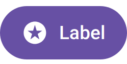

# Material focus ring in the figma-svg export

Evidence for #4980 — the `compose/figma-svg` export dropped Material's keyboard
focus indicator, and with it the state layer and press ripple, on every catalog
running material3 1.5+ / Compose Multiplatform material3 1.12.

## The bug

`button-filled__ideal__focus-ring` from `preview.coo.ee`, both at 1:1 (249×126 px),
captured before the fix. That catalog renders on
`org.jetbrains.compose.material3:material3:1.12.0-alpha03`, whose ripple node
lives at `androidx.compose.material3.internal.ripple.RippleNode` — a class name
the export did not match.

- `render.png`: the daemon PNG. The focus indicator is drawn: a 2 dp `secondary`
  band on the button's own edge over a 3 dp `onSecondary` band 1 dp inside it,
  which is what leaves the gap between the ring and the pill.
- `svg-before.png`: the same preview's `compose/figma-svg` export, rasterised.
  No ring — and byte-identical to the resting sticker. The 3D exploded view is a
  post-process of this SVG, which is why it showed a plain button.
- `svg-before.svg`: the export those pixels came from, kept so the missing layers
  are inspectable rather than only visible.

| The render | The export, before |
| --- | --- |
|  |  |

## What the ring is

`inset-focus-ring-render.png` is `:samples:android-alpha`'s
`InsetFocusRingFanOutPreview` at focus step 1, rendered in this repo on
material3 1.5.0-alpha27 — the only module here pinned forward far enough to have
`RippleDefaults.InsetFocusRingThemeConfiguration` at all. "Edit" holds focus: the
ring is drawn *inside* the button's own layout bounds, over its container, which
is why the visible pill is smaller than its resting neighbours rather than the
button growing.

## What is not captured here

There is no after-shot of the *export* in this directory. `compose/figma-svg` is
written by the daemon's post-capture extensions, not by the Gradle plugin's
render task, and every daemon lane in this repository runs material3 1.4 /
CMP 1.11 — the line where the ring API does not exist and the pre-fork ripple
node was matched correctly all along. The read is covered by
`MaterialFocusRingTest` instead, and the visual confirmation is the catalog
re-render on `preview.coo.ee`.

That gap is the reason this shipped: nothing exercises the export against the
material3 line the catalogs actually render on. `:renderer-desktop` already has
the shape of the answer in `forwardComposeSystemThemeTest`, which runs one test
class against `compose-multiplatform-forward`.
