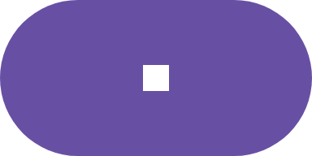
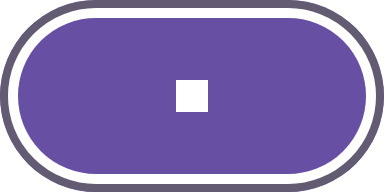

# Material focus ring in the figma-svg export

Evidence for #4980 — the `compose/figma-svg` export dropped Material's keyboard
focus indicator, and with it the state layer and press ripple, on every catalog
running material3 1.5+ / Compose Multiplatform material3 1.12.

## The bug

`button-filled__ideal__focus-ring` from `preview.coo.ee`, both at 1:1 (249×126 px),
captured before the fix. That catalog renders on
`org.jetbrains.compose.material3:material3:1.12.0-alpha03`, whose ripple node
lives at `androidx.compose.material3.internal.ripple.RippleNode` — a class name
the export did not match.

- `render.png`: the daemon PNG. The focus indicator is drawn: a 2 dp `secondary`
  band on the button's own edge over a 3 dp `onSecondary` band 1 dp inside it,
  which is what leaves the gap between the ring and the pill.
- `svg-before.png`: the same preview's `compose/figma-svg` export, rasterised.
  No ring — and byte-identical to the resting sticker. The 3D exploded view is a
  post-process of this SVG, which is why it showed a plain button.
- `svg-before.svg`: the export those pixels came from, kept so the missing layers
  are inspectable rather than only visible.

| The render | The export, before |
| --- | --- |
|  |  |

## What the ring is

`inset-focus-ring-render.png` is `:samples:android-alpha`'s
`InsetFocusRingFanOutPreview` at focus step 1, rendered in this repo on
material3 1.5.0-alpha27 — the only module here pinned forward far enough to have
`RippleDefaults.InsetFocusRingThemeConfiguration` at all. "Edit" holds focus: the
ring is drawn *inside* the button's own layout bounds, over its container, which
is why the visible pill is smaller than its resting neighbours rather than the
button growing.


## The export, before and after

`svg-forward-before.png` and `svg-forward-after.png` are the *export itself*,
both written by the daemon on the forward runtime that
`:daemon:desktop:forwardComposeInteractionExportTest` supplies — Compose
Multiplatform 1.12 with CMP material3 1.12.0-alpha03, the line whose ripple node
lives at `androidx.compose.material3.internal.ripple.RippleNode`. The subject is
`InsetFocusRingButtonInteractionState`, a focused Material button at 96×48 px,
shown at 4× so the bands are legible.

The only difference between them is `RIPPLE_NODE_CLASSES` in
`ComposeSemanticsDataProduct.kt`: "before" is that set cut back to the single
pre-fork class name, which is the code as it shipped.

| Before: the single pre-fork name | After: all three names matched |
| --- | --- |
|  |  |

`svg-forward-after.svg` is the export those pixels came from — 24 lines, so the
two `Material Focus Ring` layers are readable directly:

```
<g id="Material Focus Ring">
  <rect x="3" y="3" width="90" height="42" rx="21" ry="21" fill="none" stroke="#FFFFFF" stroke-width="3"/>
</g>
<g id="Material Focus Ring">
  <rect x="1" y="1" width="94" height="46" rx="23" ry="23" fill="none" stroke="#625B71" stroke-width="2"/>
</g>
```

Editable strokes on their own boxes, after the content they surround — not a
raster, and not baked into the container fill.

Before that forward lane existed there was no way to capture this at all:
`compose/figma-svg` is written by the daemon's post-capture extensions, not by
the Gradle plugin's render task, and every daemon lane in this repository ran
material3 1.4 / CMP 1.11 — the line where the ring API does not exist and the
pre-fork node was matched correctly all along. That is why the regression
shipped green, and why the lane is wired into `test` rather than only `check`.
