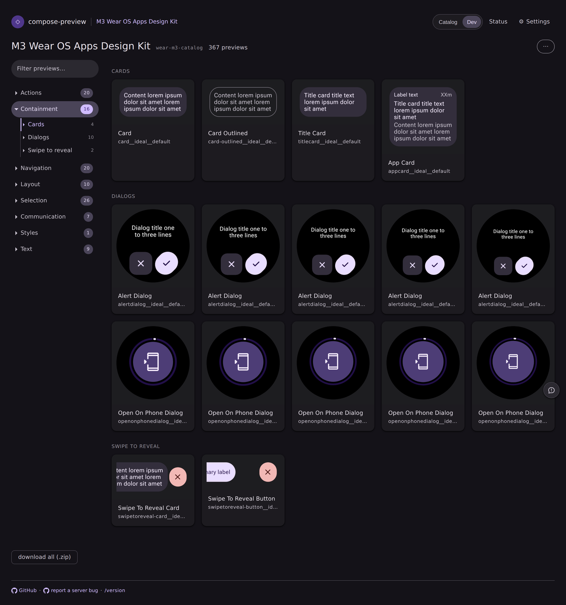
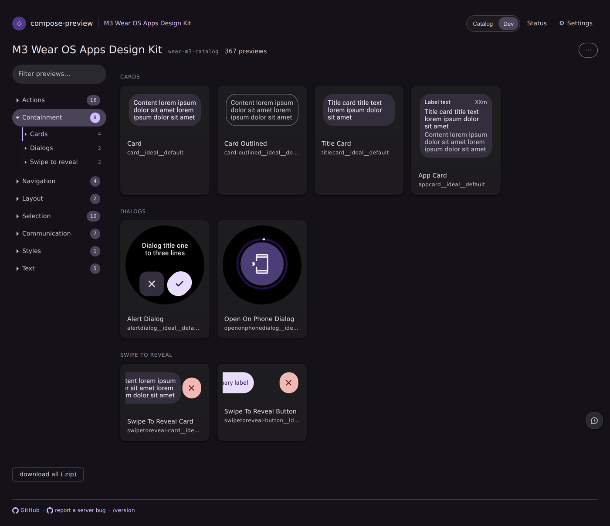
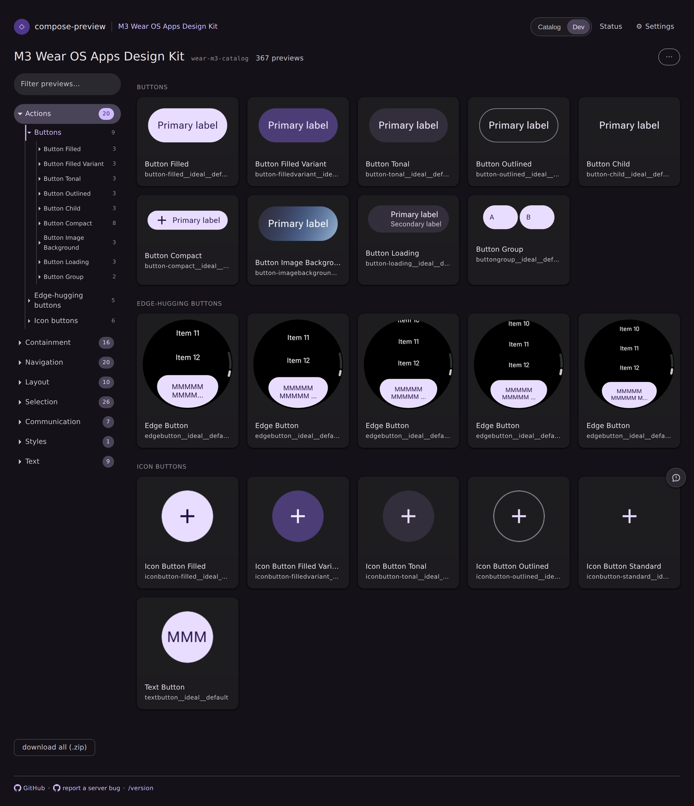
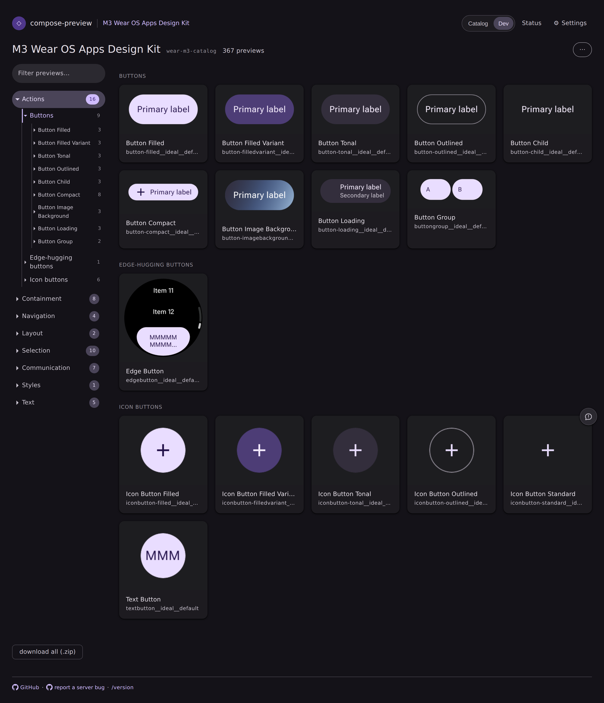
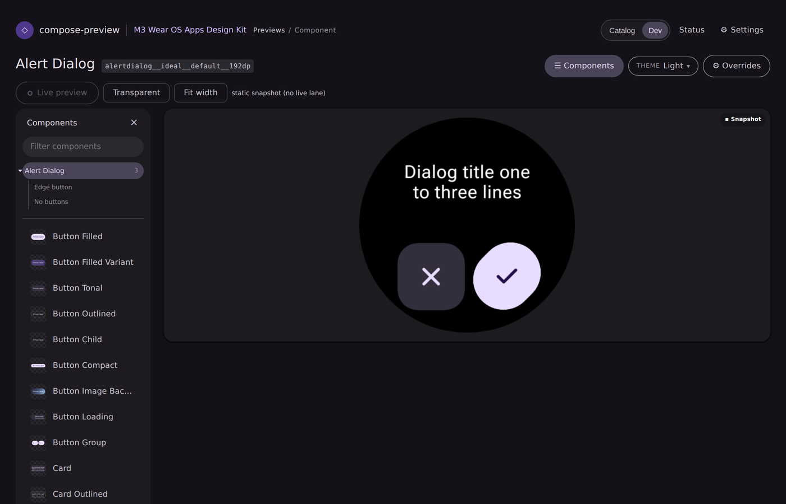
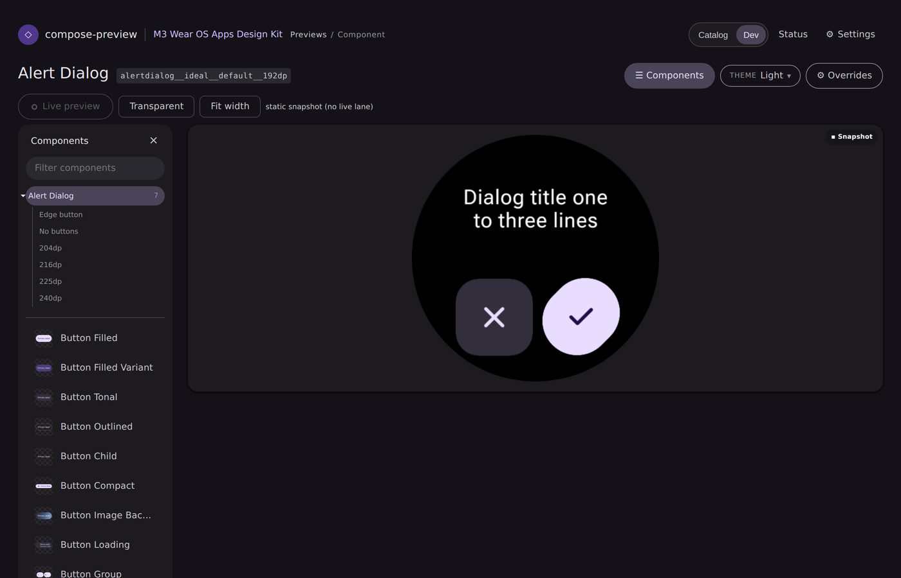

# One card per component, not one per breakpoint

Evidence for the fix in `ServeWeb` / `ServeCatalogStore` — the browse surface reads a published
catalog's `size` axis and folds it, the way it already folds `state` and `props`.

## Symptom

[wear-m3-catalog#41](https://github.com/yschimke/wear-m3-catalog/issues/41), "So many duplicate
components". That catalog renders every full-screen component at the five screen sizes its Figma
kit declares (`192dp`, `204dp`, `216dp`, `225dp`, `240dp`). The published `catalog.json` is correct
— **53 components**, each with one image per size — but the served sheet showed **109 cards**, with
14 components appearing five times apiece under one name.

## Cause

The export tags each image with the breakpoint it rendered at (`"size": "192dp"`), and
`catalog-breakpoints.mjs` resolves those names from the spec's `breakpoints` table. `ServeCatalogStore`
then dropped the tag: it was never read into `VariantMeta`, so `ServePreview` had no size and
`ServeWeb` saw only five ids differing by a trailing token. Its grid folds `state` and `props`; with
nothing to key a size fold on, every breakpoint stayed a card.

The size vocabulary is per-catalog (`192dp` here, `smallRound` elsewhere), so folding on the *id*
was never an option — `previewSizeVariantLabel`'s hard-coded token list didn't even recognise
`192dp`, which is why the collision-qualifier fallback left all five cards plainly named
"Alert Dialog".

## After

`size` now rides `catalog.json` → `variants.json` → `ServePreview`. The landing folds every
non-primary size onto the component's one card, drawn at its **first declared** breakpoint; the
viewer's component subtree lists the others so they stay one hop away.

### The tab the issue was filed from — Containment

Five "Alert Dialog" cards and five "Open On Phone Dialog" cards become one each.

| before | after |
| --- | --- |
|  |  |

### Actions

"Edge-hugging buttons" drops from five identical cards to one; the section count goes 20 → 16.

| before | after |
| --- | --- |
|  |  |

### The folded sizes stay reachable

The viewer's component subtree gains a row per breakpoint beside the state rows — the "Alert Dialog"
count goes 3 → 7.

| before | after |
| --- | --- |
|  |  |

## How these were captured

`ServeWeb.landingPage` / `viewerPage` rendered from the **real** published
`yschimke/wear-m3-catalog@design-artifacts/wear-m3-catalog` `catalog.json` (367 images), with its
committed render PNGs routed in, screenshotted with the preview-harness's Chromium. The "before"
column is the same page built from previews with `size` stripped — exactly what the server saw
before this change.

Regression coverage is not these PNGs: `ServeWebBreakpointFoldTest` pins the fold and the switcher,
and `serve-landing-breakpoints.html` / `serve-viewer-breakpoints.html` join the committed page
fixtures, so the visual-diff bot captures this surface on every future PR without anyone
remembering to.
