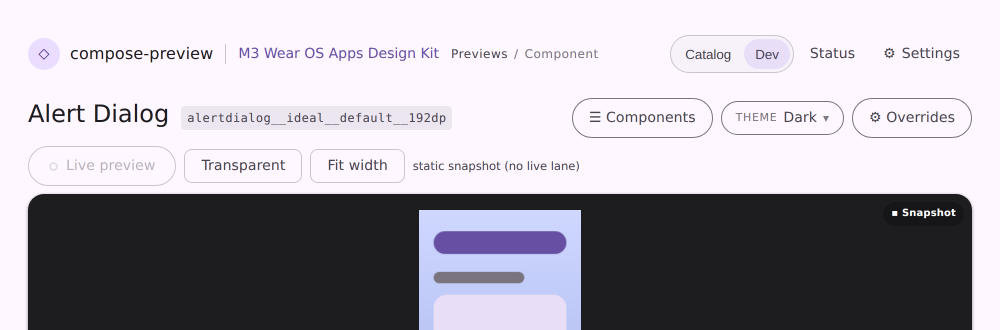
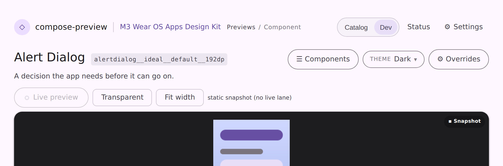

# The catalog's caption, on the page

Every design catalog authors a one-line description per component
(`@CatalogComponent(caption = …)`, or the spec entry that overrides it), and the export has always
written it into `catalog.json`. The serve layer never deserialized it, so a browse surface could
name a component but never say what it was for — the question "Button Loading… or what is loading?"
had no answer anywhere on the page.

## After

`ServeCatalogStore.Component` reads `caption`, carries it through `previews/variants.json`
(`VariantMeta`) onto `ServePreview`, and the viewer prints it under the component's name. The
component drawer's row tooltip is the caption too, where it used to repeat the preview id.

| before | after |
| --- | --- |
|  |  |

Captured from the committed `serve-viewer-breakpoints` page fixture, which now carries a caption —
so the visual-diff bot covers the caption line on every future PR.
