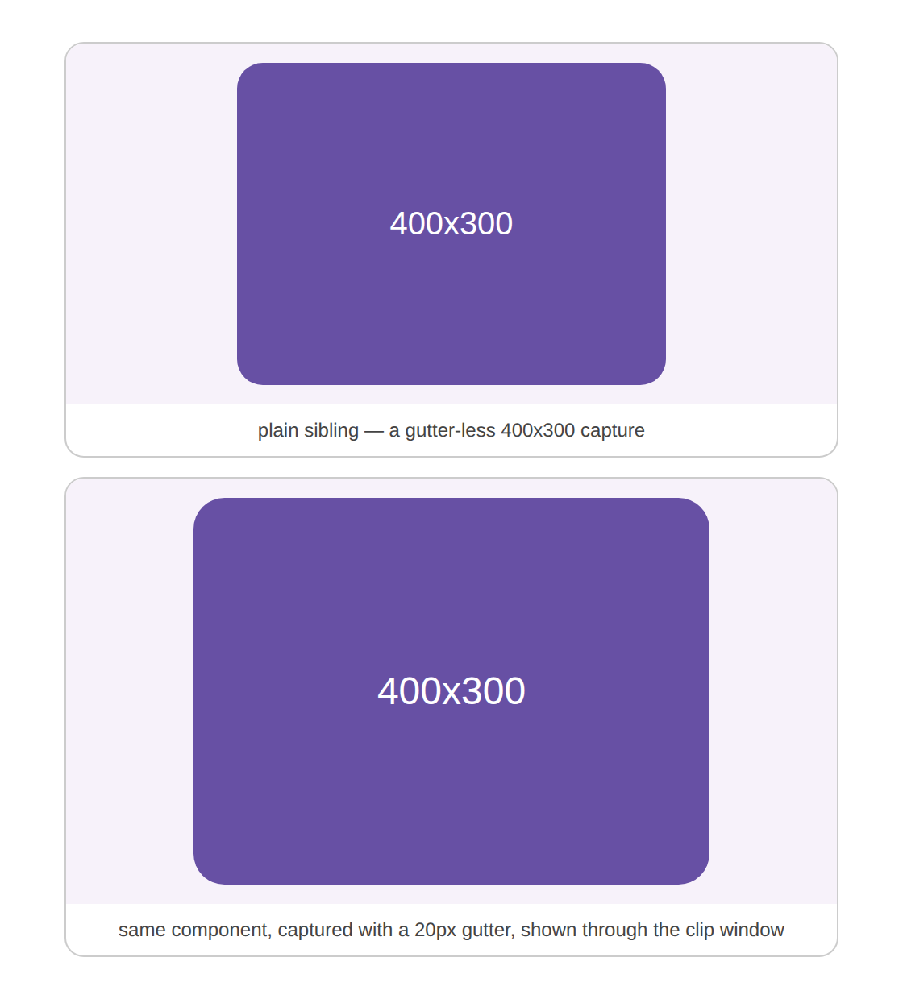
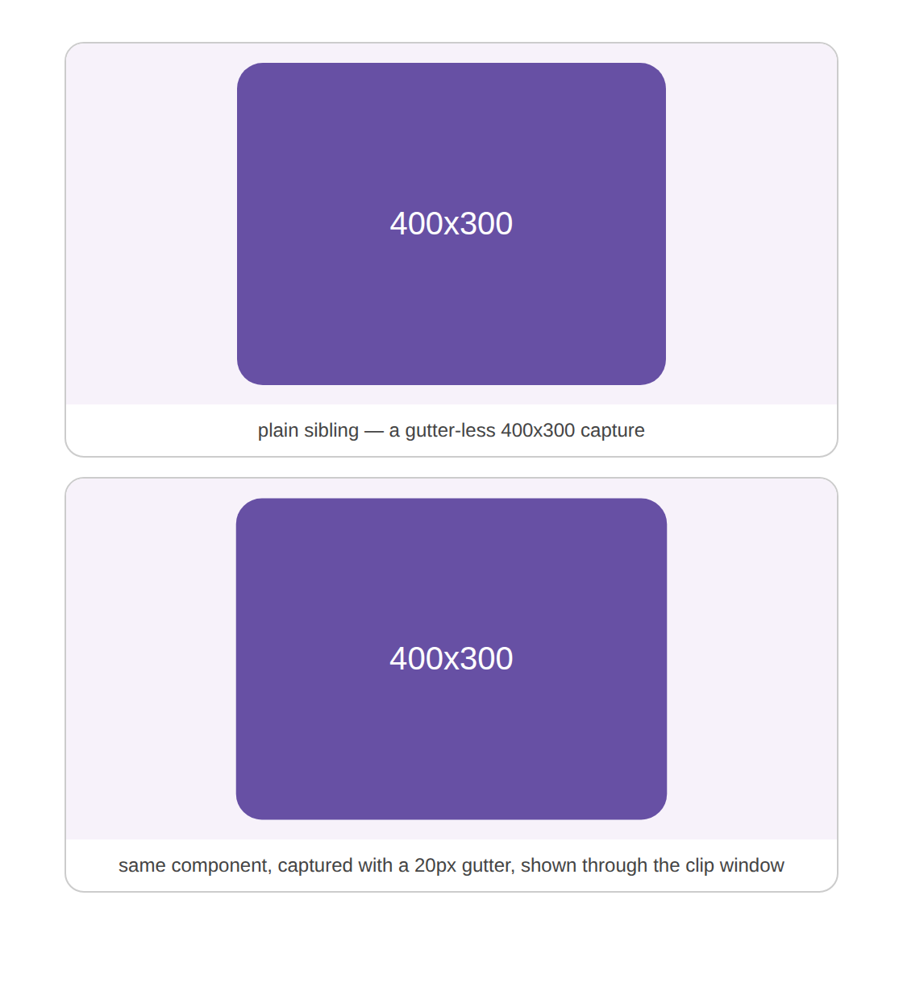
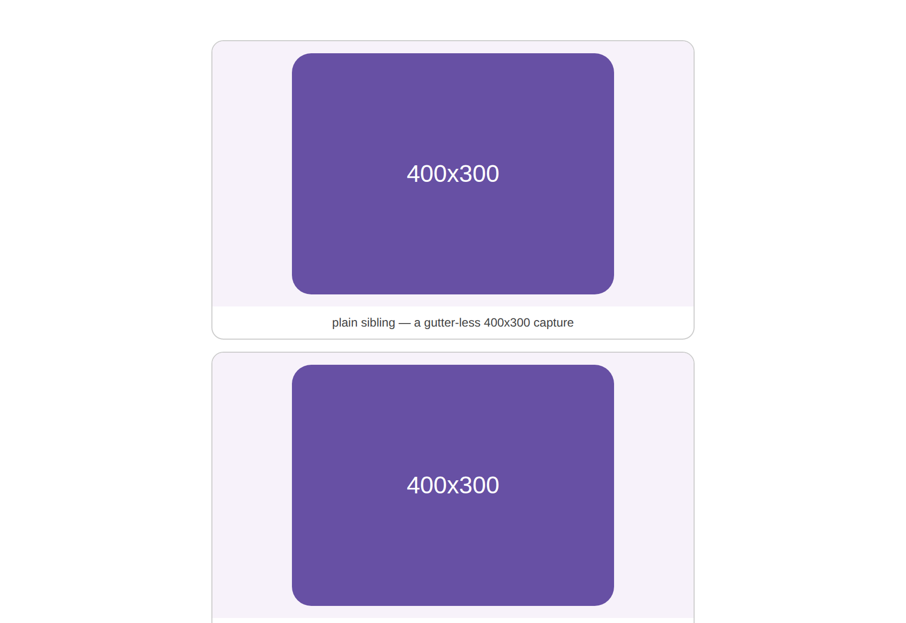
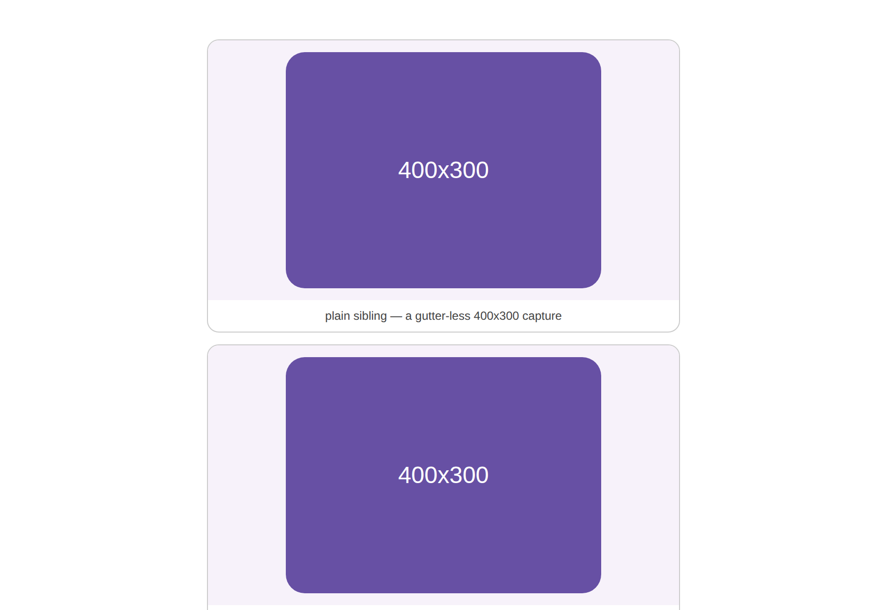

# A crop window shrinks with the narrow-viewport cap, like the plain image beside it

Evidence for the fix in `ServeThumbCrop` / `ServeWeb` / `serve.css` — the clip window a cropped
catalog card is drawn through now resolves its width against the same display cap the plain
`` beside it obeys, instead of freezing the desktop cap into the HTML.

## Symptom

[#4544](https://github.com/yschimke/compose-ai-tools/issues/4544). A plain card image is capped by
the stylesheet — `.cp-imgwrap img { max-height: 240px }`, dropping to `200px` under
`@media (max-width: 640px)`. A **cropped** card is not: `computeThumbCrop` / `computeGutterCrop`
applied the 240px cap server-side and `thumbImg` emitted the result as a literal
`style="width:320px"`. Inline width beats any stylesheet, so on a phone the plain image shrank and
the window did not, and a cropped card drew **20% larger** than an otherwise identical neighbour.

That mismatch is exactly what a gutter window exists to remove: `computeGutterCrop` caps on
*height* precisely so a guttered capture lines up with its gutter-less siblings (m3-catalog#179).
Below the fold it stopped doing that.

## Cause

The cap lived in one place — the geometry — and the geometry was baked at page build. The obvious
CSS fix does not work: adding `max-height: 200px` to `.cp-crop` **squashes** the box rather than
scaling it, because the window carries an inline `aspect-ratio` and already has a definite width,
and an aspect ratio is only honoured while one axis is free.

## After

The crop now travels with its **native** box (`natBoxW`) and the native length of the axis the cap
bounds (`natCapAxis` — the largest edge for a content crop, the height for a gutter crop). `thumbImg`
publishes the *relationship* rather than the result —

```html
<span class="cp-crop" style="--cp-crop-w-per-cap:1.3333;--cp-crop-max-w:400px;aspect-ratio:320/240">
```

— and the stylesheet resolves it against a cap it owns:

```css
.cp-crop { width: min(var(--cp-crop-max-w, 100%),
                      calc(var(--cp-crop-w-per-cap, 9999) * var(--cp-thumb-cap, 240px))); }
@media (max-width: 640px) { .cp-crop { --cp-thumb-cap: 200px; } }
```

Only the **width** is constrained, so `aspect-ratio` still derives the height and the box scales
instead of squashing. `--cp-crop-max-w` is the 1× ceiling, so a component smaller than the cap is
still never upscaled — and never wrongly *shrunk* by a lower cap it was already under.

## Pictures

A 400×300 component published twice: once gutter-less (the plain card) and once captured with a
20px gutter (the cropped card). They are the same component and must draw the same size.

### Narrow viewport (560px — the `max-width: 640px` block is in force)

Before, the window is 320×240 against the plain image's 267×200. After, both are 267×200.

| before | after |
| --- | --- |
|  |  |

### Desktop (900px) — unchanged

Both are 320×240 before and after: the fix re-derives the same number at the 240px cap.

| before | after |
| --- | --- |
|  |  |

## Reproducing

`harness.mjs` loads the **shipped** `serve.css` and reproduces the exact markup `thumbImg` emits,
so the pictures track the stylesheet rather than a hand-drawn mock; `before` pins the frozen-px
window the server used to bake in.

```
cd cli/serve-web && npm ci        # playwright
node docs/evidence/serve-crop-window-cap/harness.mjs
```

It prints the measured sizes it screenshots, which is the assertion in picture form:

```
before narrow  plain 267x200  window 320x240
before desktop plain 320x240  window 320x240
after  narrow  plain 267x200  window 267x200
after  desktop plain 320x240  window 320x240
```

Set `CHROME_PATH` to skip playwright's browser download when a Chromium is already installed.
