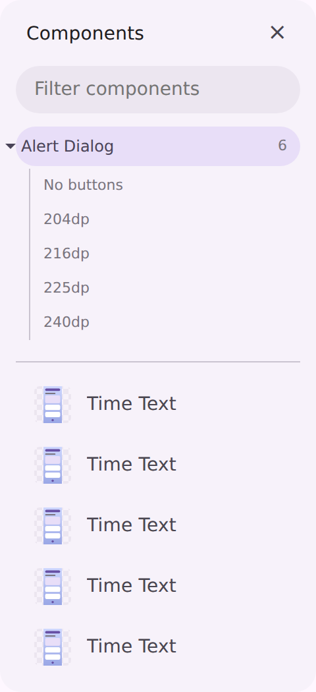
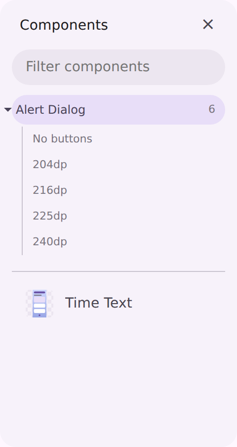

# The component drawer names a component once, not once per breakpoint

Follow-up to [`serve-breakpoint-fold`](../serve-breakpoint-fold/README.md) (#4279), which taught the
landing grid to fold a component's `size` axis the way it already folds `state` and `props`.

## Symptom

The fold reached the grid and the viewer's component subtree, but not the two *other* places the
serve host lists components:

- the viewer's left-hand **Components** drawer (`ServeWeb.navDrawerHtml`), and
- the front door's cross-catalog **component palette** (`ServeWeb.componentSearchEntries`).

Both filtered non-default states and props variants and then stopped, so a catalog that documents
five breakpoints filled the drawer with five identically-named rows per full-screen component —
"Alert Dialog" five times over, with nothing in the row to say which watch each one was. The
committed `serve-viewer-breakpoints` fixture had this baked in: five `Time Text` entries for one
component.

## Cause

`isNonPrimarySize` was applied at the grid's `groupPreviews` call site only. The drawer and the
palette build their own lists from the same previews and never learned about the size axis, so
`groupPreviews` keyed them by theme-stripped id — which still differs by breakpoint.

## After

Both list surfaces fold the same three axes the grid does, so the drawer reads as a list of
components. The sizes stay one hop away: the drawer's *current* component still shows its own size
rows in the subtree above the list (`204dp` … `240dp` below), which is where the reader switches
breakpoint.

| before | after |
| --- | --- |
|  |  |

Captured from the committed `serve-viewer-breakpoints` page fixture (before = the fixture at
`main`, after = the regenerated one in this change), with the drawer pinned open.
