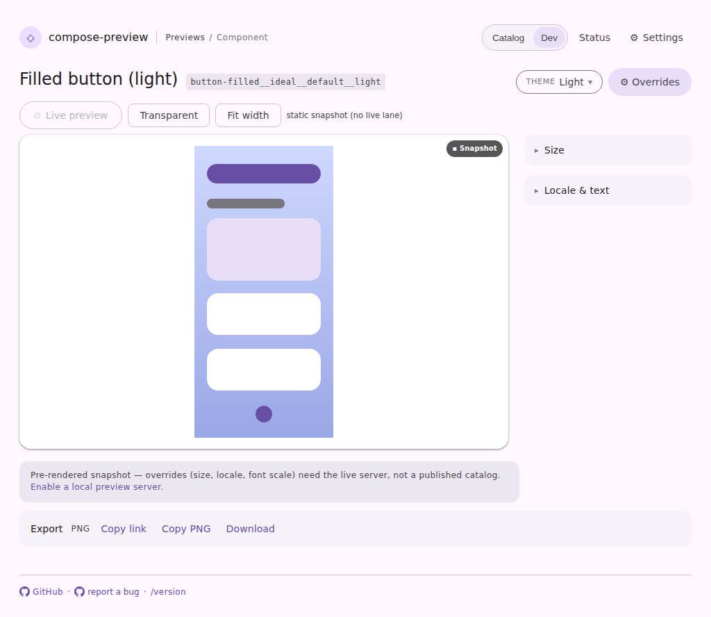
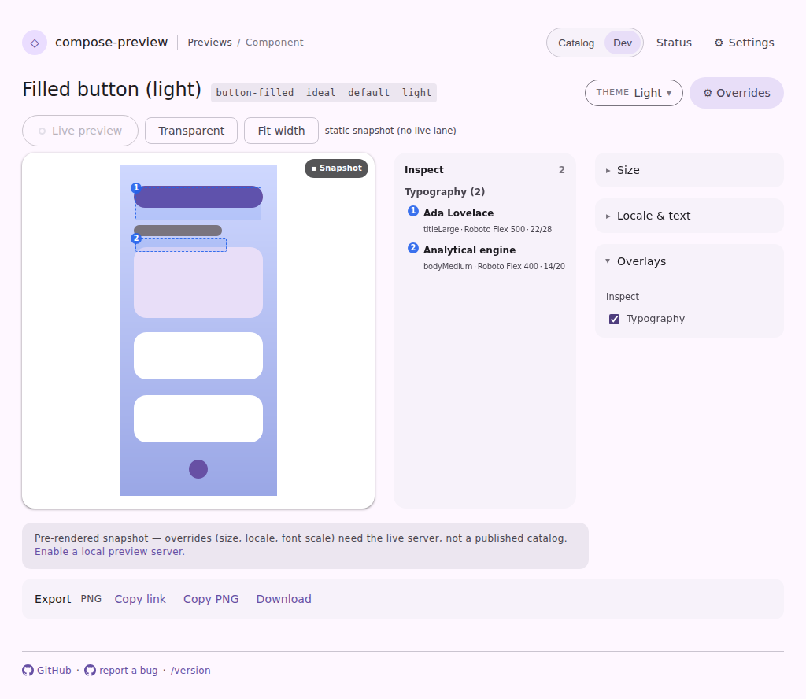

# Typography inspection on a published catalog, with no daemon

Visual evidence for the baked half of the `.annotations` lane. Both shots are the
`serve-viewer-published-typography` harness fixture — a **static** catalog viewer
(`canApplyOverrides = false`, no live daemon), served by the harness's own static server and driven
with Playwright: open the Overrides drawer, then tick Typography where there is one to tick.

## Before

`ServeBundleHost` answered `.annotations` with `NotFound`, so the viewer offered no Typography
layer for the Compose render at all — the Overrides drawer has Size and Locale & text and stops
there. The catalog's `annotations/index.json` was already on disk, feeding only the compare page.

## After

The published annotations answer the lane, so the layer appears and draws. Only Typography: the
theme attributes are projected from a live semantics tree and nothing authors them into a bundle,
so that row stays off rather than being offered dead.

The after shot is the committed `serve-viewer-published-typography-layers` capture, so the CI
visual-diff bot re-renders and diffs this surface on every subsequent PR.
