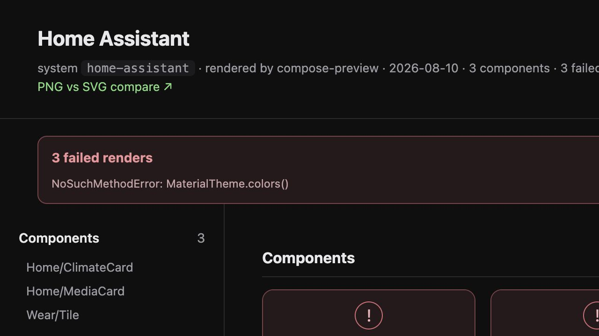

# Failed-render catalog UI

Visual evidence for issue #3592. The fixture uses the same `renderIndexHtml` path as published
design-artifact branches and models three previews that all failed with one shared
`NoSuchMethodError`.

The catalog now keeps the broken components visible, reports `3 failed renders`, and aggregates
the repeated cause as one signature (`×3`) instead of presenting an apparently empty catalog.
Each failure card opens its preview id, render phase, top application frame, and stack trace.

