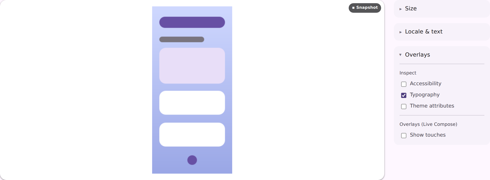
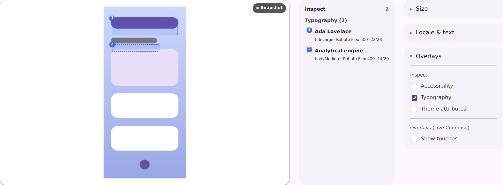

# Typography inspection on a catalog + live-daemon viewer

Visual evidence for issue #4254. Both shots are the committed
`vscode-extension/preview-harness/fixtures/pages/serve-viewer-inspect.html` fixture — the
production viewer page, the production `<cp-inspect-layers>` bundle, and the
production-shaped `.annotations` payload the harness already stubs — driven with Playwright:
open the Overrides drawer, expand **Overlays**, tick **Typography**.

The only difference between them is what `/render/<id>.annotations` answers, which is exactly
what the fix changes for a `ServeCatalogLiveHost` page.

## Before — `.annotations` 404s

`ServeCatalogLiveHost` never routed `renderAnnotations` to its daemon, so the endpoint fell
through to `ServeHost`'s daemon-less `NotFound`. The checkbox ticks, the fetch 404s, the overlay
draws nothing and no legend appears.

## After — `.annotations` answers

The lane routes to the daemon twin the way `renderA11y` already did, so the same tick draws the
numbered boxes over the frame and the legend beside it.

