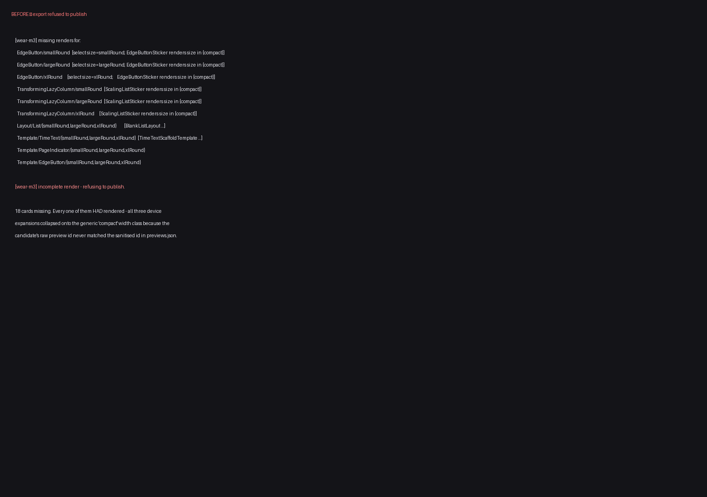
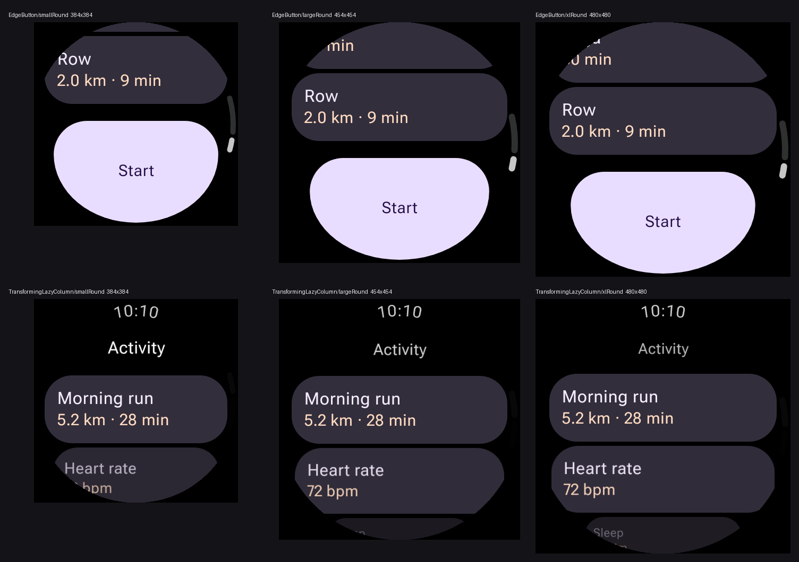

# Wear breakpoint renders lost to a preview-id spelling mismatch

Evidence for the fix in `scripts/design-artifacts/preview-id-alias.mjs`.

## Symptom

`Design Artifacts → wear-m3` failed at **Generate importable catalog** with 18 missing renders, and
the `design-artifacts/wear-m3` delivery branch stopped being republished after 2026-08-05:

```
[wear-m3] missing renders for: EdgeButton/smallRound [select size=smallRound;
  EdgeButtonSticker renders size ∈ {compact}], … (18 entries)
[wear-m3] incomplete render — refusing to publish.
```

Every one of those previews *had* rendered. The six `@CatalogWearBreakpoints` components each
produced three device expansions, and all three collapsed onto the generic `compact` width class,
so the spec's `smallRound` / `largeRound` / `xlRound` selectors matched nothing.

## Cause

`bundle pack` stores zip entries and **both** bundled manifests under a sanitised id
(`sanitizeBundleEntryId`: `[^A-Za-z0-9._-]` → `_`), so `@Preview(name = "Extra Large Round")` is
stored as `…EdgeButtonSticker_Extra_Large_Round`. The raw discovery id is kept alongside it in the
manifest's `rawPreviewIds`.

The candidate reader hands back candidates keyed by the **raw** id:

```
bundle previews[].id  : …CatalogPreviewsKt.EdgeButtonSticker_Extra_Large_Round   (underscores)
candidate.previewId   : …CatalogPreviewsKt.EdgeButtonSticker_Extra Large Round   (spaces)
```

So `previewById.get(candidate.previewId)` returned `undefined` in both
`applySpecBreakpoints` and `applyCatalogPreviewAxes`. Neither pass reports a miss — the image is
just skipped — so the failure surfaced far from its cause, as a *missing render* for a preview that
had rendered perfectly.

Only ids containing a sanitised character are affected, which is why this hit exactly the six Wear
components whose `@Preview(name = …)` carries spaces and nothing else in the catalog.

## Before



## After

Three genuinely distinct renders per component, at the three declared device resolutions
(192/227/240 dp × 2.0 density = 384/454/480 px):



| component | size | pixels | sha256 (first 12) |
| --- | --- | --- | --- |
| EdgeButton | smallRound | 384×384 | `533879f677fb` |
| EdgeButton | largeRound | 454×454 | `28a48a776959` |
| EdgeButton | xlRound | 480×480 | `0a8528c03ab8` |
| TransformingLazyColumn | smallRound | 384×384 | `3216ece915ed` |
| TransformingLazyColumn | largeRound | 454×454 | `ef2ec0dad12c` |
| TransformingLazyColumn | xlRound | 480×480 | `bb56f65446f3` |

Distinct hashes matter as much as the pixels: they show the three expansions are three different
screens, not one render duplicated across a collapsed axis.

## Reproducing

```bash
./gradlew :cli:installDist
PATH="$PWD/cli/build/install/compose-preview/bin:$PATH" \
  compose-preview bundle pack --module :samples:design-catalog-wear-m3 \
    --with-semantics -o /tmp/wear-bundle.png
(cd scripts/design-artifacts && npm ci)
node scripts/design-artifacts/generate-design-catalog.mjs \
  --spec samples/design-catalog-wear-m3/catalog.spec.json \
  --renders /tmp/wear-bundle.png --out /tmp/out --renderer local
```

Before the fix this reproduces CI's 18 missing renders exactly; after it, the export completes with
`38 component(s), 43 image(s)`.
