# The public preview server

`compose-preview serve` can run as a **public** preview server (the deployment behind
`preview.coo.ee`) with two things to show:

1. **Uploaded bundles** — anyone can `POST /bundles/<name>` a portable bundle (or point at one with
   `?url=`) and get a shareable `?session=<name>` link. The server shows the bundle's **data tiers**
   (baked PNGs, Remote Compose / Protolayout / Lottie IR) for any uploader, and reports a **trust
   verdict** so you can tell a bundle from a producer you trust from an anonymous one.
2. **Shared documents** — with `--accept-docs`, anyone can drop a **generated document** (a Remote
   Compose `.rc`, a Lottie JSON) at `/docs` and get back an **expiring permalink** that plays it in
   the browser. See [Sharing a document](#sharing-a-document---accept-docs).
3. **The design systems we publish** — `--catalogs compose-m3,wear-m3,remote-m3` fetches each
   published `design-artifacts/<system>` catalog and serves it read-only at its canonical path
   `/<system>/` (the legacy `?session=<system>` form still works). Browsing that branch and opening a
   live, customisable render are then two ends of one workflow (the branch's README + `catalog.json`
   carry `livePreview` deep links back here).

   When a server publishes catalogs, its **front door (`/`) is an index of those design systems** —
   one card per listed system carrying a meaningful hero preview, the system's title + library, its
   trust badge, and a link to `/<system>/`. (A plain `serve` with no `--catalogs` still shows the
   served module's own preview grid at `/`.) This replaces showing an arbitrary default module at the
   root — the point of the public server is the catalogs, so the landing leads with them.

   The server keeps privacy-minimal **engagement counts** for catalog/app landing visits and each
   preview viewer. Small view totals appear in the front-door card footer, catalog summary, preview
   cards, and viewer; `/api/previews` exposes the same aggregate `views` fields. No IP address,
   cookie, user agent, or referrer is retained. `--engagement-file <path>` makes the JSON counters
   survive restarts; the prebuilt image defaults this to `/config/engagement.json` on its existing
   `preview_config` volume (`SERVE_ENGAGEMENT_FILE=none` opts out of persistence).

   Two per-system display choices are **systematised** in one place (`ServeWeb.SystemDisplay`), so
   the front door and each catalog grid agree:
   - **Hero** — the card fronts the *most representative* preview: a real `Screens`-section preview
     (an app's actual screen, primary view preferred) when the catalog has one, else a canonical
     component. So Confetti leads with a conference screen while a component library like `compose-m3`
     leads with a button.
   - **Stage** — a **dark-first** system (Wear OS is black-watch-face-first — `wear-m3`,
     `confetti-wear`, …) backs its hero on a dark stage instead of the default white, so a
     light-on-transparent Wear sticker isn't washed out. `SystemDisplay.isDarkFirst` decides, from an
     explicit list plus a Wear/watch id heuristic; extend the list to pin any other dark-first system.

   

   The front door's imagery is **prebaked**, not rendered per visit. Each card's hero is cropped to
   its component box, downscaled to the card's size (at 2× for retina), and content-hashed **once**
   per catalog — when the catalog host is first seen, not on the request path — then held in memory
   and served from `/hero/<system>/<hash>.png`. That lane deliberately does none of what `/render`
   does: no session lease, no render-slot permit, no disk read, and no chance of waking a suspended
   daemon, so a dozen cards can never queue behind a catalog render. Because the file name *is* the
   content hash, the response is `Cache-Control: public, max-age=31536000, immutable` — a repeat
   visitor paints the whole index from cache with no image requests at all, and a republished catalog
   simply gets new URLs (nothing to invalidate). Serving `/` therefore costs the server the HTML and
   essentially nothing else. A catalog whose hero PNG can't be decoded falls back to the live
   `/render` lane for that one card.

   The front door looks the same; it just stops shipping full-resolution renders to do it. Against
   the live `preview.coo.ee` catalog set, the index's imagery went from **775 kB over 11 render
   requests** to **146 kB of prebaked, permanently cacheable PNGs** — the heaviest card (a JetNews
   phone screenshot) from 267 kB to 29 kB.

   | Before — full renders over `/render`, lazy | After — prebaked heroes over `/hero`, eager |
   | --- | --- |
   | 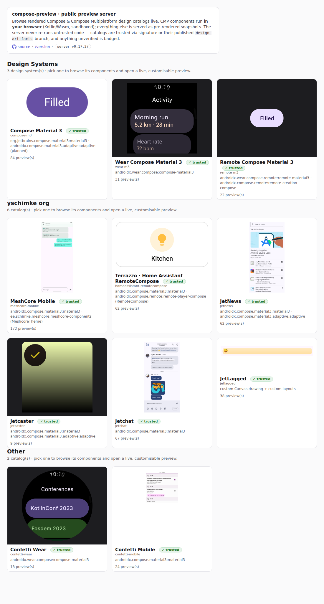 | 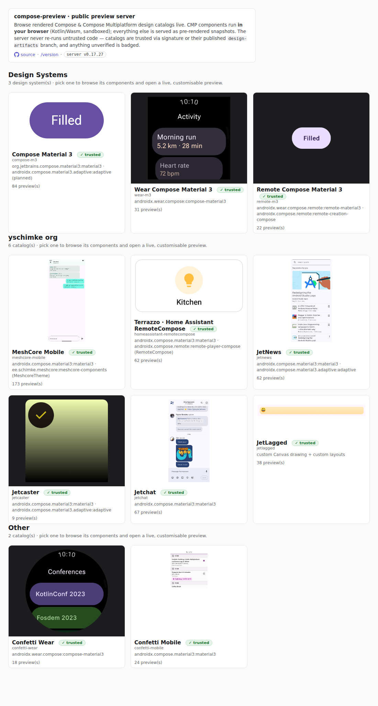 |

   A catalog entry may name a **per-system source repo** as `<system>@<owner>/<repo>`, so one server
   can serve systems published to *different* repos — e.g. `compose-m3,wear-m3` from this repo
   alongside `meshcore-mobile@yschimke/meshcore-mobile` from the app's own repo (both listed on the
   front page). `--catalogs-unlisted` serves a system exactly like `--catalogs` but keeps it **off the
   front door** — an unlisted catalog (e.g. `cadence`) is **not** listed on the `/` index and is kept
   off the in-catalog "Design systems" nav row. It's reachable only at `/<system>/` (and `?session=`),
   shareable by direct link, so you can publish a catalog without advertising it on the public landing.
   Every catalog's branch (whatever repo) must be in the `--trust-store` to badge `Trusted(Branch)`;
   otherwise it serves `Unverified` (the data tiers serve either way).

## Tabbed catalog pages

A catalog whose components declare a **`section`** (set per group in the catalog spec — `Themes`,
`Components`, `Screens`, `Animations`, …) is served with its previews grouped into **tabs**, one per
section, and the component `group` shown as a sub-heading inside a tab. Sections, their groups, and
the cards within follow the catalog's **authored order**, so the tabs read Themes → Components →
Screens rather than alphabetically (the served preview list is otherwise id-sorted). Empty sections
are omitted and the set is open-ended — tag a group with any section name to grow a new tab.

Tabs are progressive enhancement: with scripting off every section shows under its own heading and
the tabs are in-page anchor links; with scripting on, selecting a tab shows just that section while
the **search box still spans every tab**. A catalog whose previews carry no section (the published
design systems today) keeps the single flat grid, unchanged.


## Every selection is in the URL

What a visitor picks is reflected into the page URL, so the page on screen is the page its URL
describes — bookmarkable, shareable, and reachable with **Back**. Picking Components and then a
theme on `https://preview.coo.ee/meshcore-mobile/` lands on
`…/meshcore-mobile/?tab=components&theme=theme:app.ui.DynamicDarkTheme`, and opening that link
later reopens exactly there.

Nothing reloads. Every write is a `history.pushState` / `replaceState` from
[`assets/url-state.js`](../cli/src/main/resources/ee/schimke/composeai/cli/serve/assets/url-state.js),
and Back/Forward re-points the grid (or the viewer's controls) in place — no second fetch of a page
the browser already has, and no re-render the visitor didn't ask for. Params the server owns
(`token`, `session`, …) are never touched, and a control back at its default **clears** its param
rather than pinning a redundant value, so an untouched page keeps the clean URL it was opened with.

| Surface | Carried in the URL |
| --- | --- |
| Catalog landing | `tab` (section), `theme` (a baked chip or `theme:<providerFqn>`), `q` (filter), `bg` |
| Viewer | every override the render URL takes — `device`, `localeTag`, `orientation`, `background`, `fontScale`, `uiMode` / `themeProvider`, size bounds, `focus`, `gestures`, `scroll`, `mode`, `knob.<key>`, `rc.<name>` |
| Format comparison | `format`, `theme`, `q` |

Opening a bookmarked catalog URL — the tab it names is the selected one, and the theme it names is
applied (here an app-declared theme, re-rendered on arrival because the link asked for it):

| `…/meshcore-mobile/` | `…/meshcore-mobile/?tab=screens` |
| --- | --- |
| 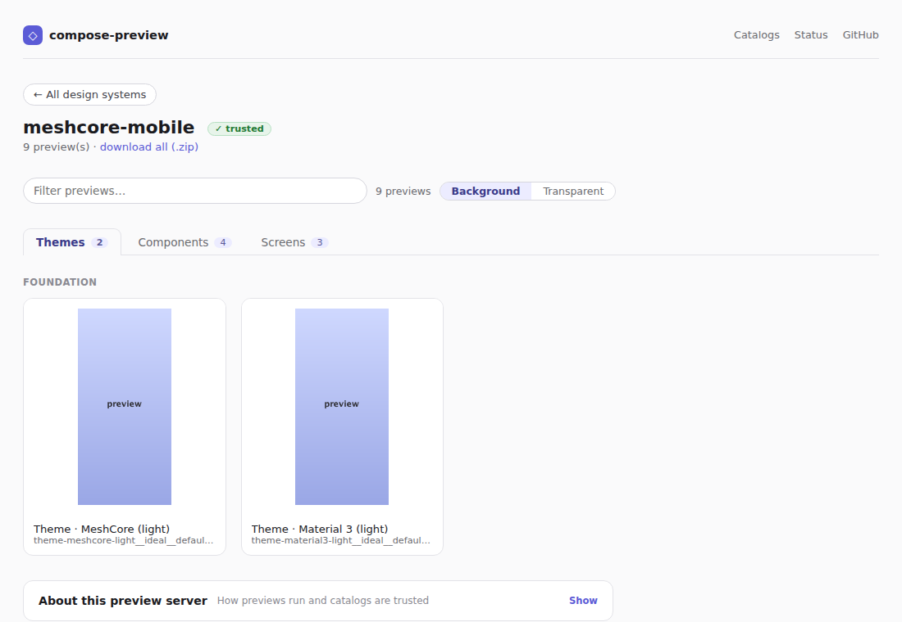 | 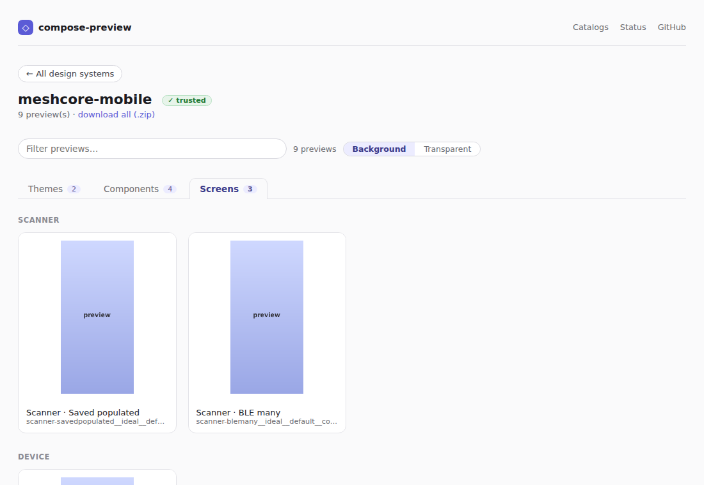 |

| `…/compose-m3/` | `…/compose-m3/?theme=theme:com.example.HighContrastThemeCatalog` |
| --- | --- |
| 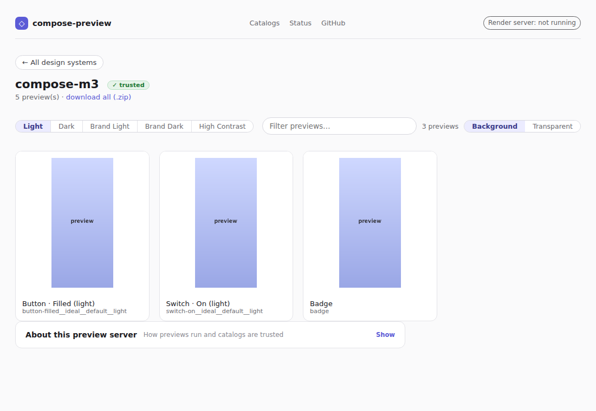 | 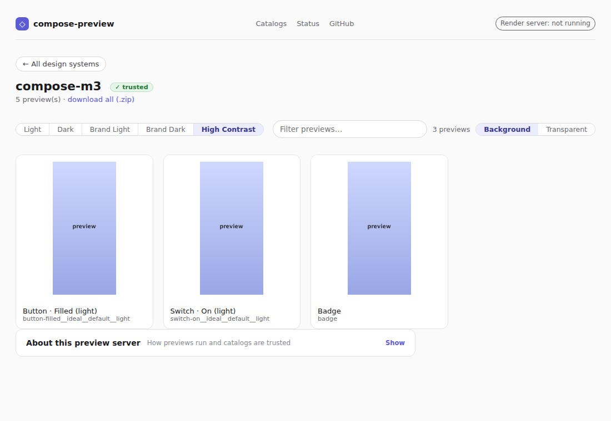 |

A **discrete** choice (a tab, a theme, a lane) pushes its own history entry; **continuous** input (a
filter, a slider) replaces the current one, so typing six characters costs one entry, not six.

The URL outranks the remembered (`localStorage`) choice wherever the two disagree — it is on the
address bar only because someone picked it here or was handed the link. That is also the one place a
declared theme is replayed on load: a *stored* app-declared theme deliberately isn't (it would put
the whole grid through the daemon on an ordinary page view), but a link that names one is a request
for exactly that.

In `--public` mode the landing page opens with a short **"about" intro** explaining what the host is
and its safety model, with a link to the machine-readable [`/version`](#endpoints):


## Catalog theme selector

The catalog header carries a single **Theme** control listing every theme the catalog configures —
not just Light/Dark (issue #2881):

- the **baked** light/dark pair, when components were captured in both. Picking one swaps each card
  to that render in place (instant — the pixels are already published);
- every app-declared **`@ThemeCatalog` / `@WearThemeCatalog` theme** the session carries
  (`ServeHost.declaredThemes`, read from the live bundle's `previews.json`). Picking one re-points
  each card's thumbnail at `/render/<id>.png?themeProvider=<providerFqn>`, so the whole grid redraws
  under that theme through the carried daemon — the grid-wide counterpart of the viewer's unified
  Theme select.

Declared themes are offered only when the session can actually render them (a trusted catalog served
live, or a daemon-backed module); a static bundle keeps the baked light/dark chips alone, and an
individual card with no daemon twin keeps its baked pixels. A catalog with independent per-preview
daemons uses a conservative **two-worker queue**, while a monolithic daemon stays serial. The small
cap avoids a grid-sized JVM/request burst. Each worker starts its next card only when the previous
image settles; shed requests get bounded exponential-backoff retries. Their URLs are emitted by the
server into the page script (never read back out of a `data-` attribute), so nothing the page assigns
to an `` originates as DOM text. A theme-neutral module whose session
declares themes gets a leading **Default** chip to return to. The choice persists per catalog
(`cp-theme:<system>` in `localStorage`, shared with that catalog's viewer Theme select).

Completed catalog-grid theme renders are cached on the catalog host, above the LRU pool of
preview-scoped daemons. Re-selecting a theme therefore reuses its PNGs even if those daemons were
evicted. Refreshing the catalog replaces the host, so the replacement starts with an empty cache;
mixed theme-plus-knob renders remain in the daemon's bounded override cache rather than growing
this catalog-lifetime cache. Dynamic theme URLs remain `no-store`, preventing a browser or shared
proxy from replaying old-catalog pixels after refresh.

The cache can also be filled **ahead of the first visitor** — an idle pass that walks each catalog's
`previews × declaredThemes` set and renders the missing entries — but that pass is **off by
default**. It is hundreds of daemon renders per catalog for pixels nobody has asked for, and on the
public box it is what turned a quiet server into a permanently busy one. The reactive half is where
the value was and is unchanged: a theme a visitor actually selects is cached on completion, so
re-selecting it is instant. Turn the eager pass on with
`-Dcomposeai.serve.themeOptimization=true`; when it runs, `/status` reports it per catalog
(`themeOptimization`: `waiting` / `running` / `paused` / `complete`, plus cached/remaining counts).

When enabled, it yields twice over — both learned from `preview.coo.ee`:

- **It never runs while catalogs are loading.** A box brings its catalogs up one at a time, and each
  load fetches a branch, resolves a live bundle's classpath and starts a render daemon. The idle
  clock counts *request* traffic, so a freshly-rolled server with no visitors yet looks perfectly
  idle — and the first catalog's optimizer used to start hundreds of renders while the remaining
  catalogs were still loading, each loaded catalog adding another optimizer. The later a catalog sat
  in the list, the longer its daemon start waited, and a slow enough start is recorded as
  `livebundle-unavailable` — degrading that catalog to baked PNGs for the life of the process. The
  whole startup pass (and any later refresh or admin registration) now reads as *busy*, so the
  optimizers stay parked until the catalogs are up.
- **Only one catalog optimizes at a time, server-wide.** Once loading ends every catalog's optimizer
  becomes runnable at the same instant; the background lane holds a single render permit, so they
  take turns instead of occupying every live seat, and a visitor's render is never queued behind
  more than one background one. The permit is taken per render, so a catalog that parks for traffic
  hands it straight to the next one.

The grid is serial by default. Selecting an app-declared theme asks the server for a fixed,
60-second page lease; at most one page server-wide receives a burst, clamped to five workers and
the server's render-slot count. Other pages remain serial, queue completion/page exit releases the
lease early, and catalog replacement invalidates it because the grant is bound to that host
instance. This burst changes admission only: the app/catalog still owns its bounded LRU pool of
preview-scoped daemons.

The individual preview's **Appearance → Theme** select uses that same axis: **Day (Default)** and
**Night (Default)** map to the ordinary `uiMode` override, while each declared theme maps to
`themeProvider` and therefore supplies its own day/night palette. A declared choice is restored when
navigating from the catalog even when the destination id contains a baked `__light` / `__dark`
fallback token.

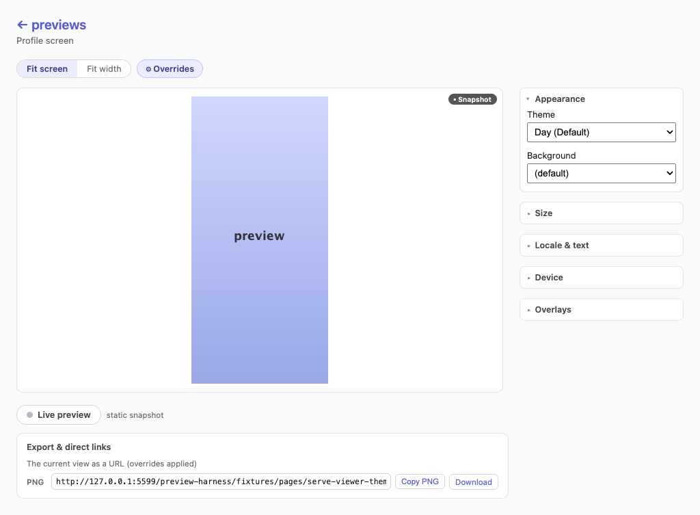

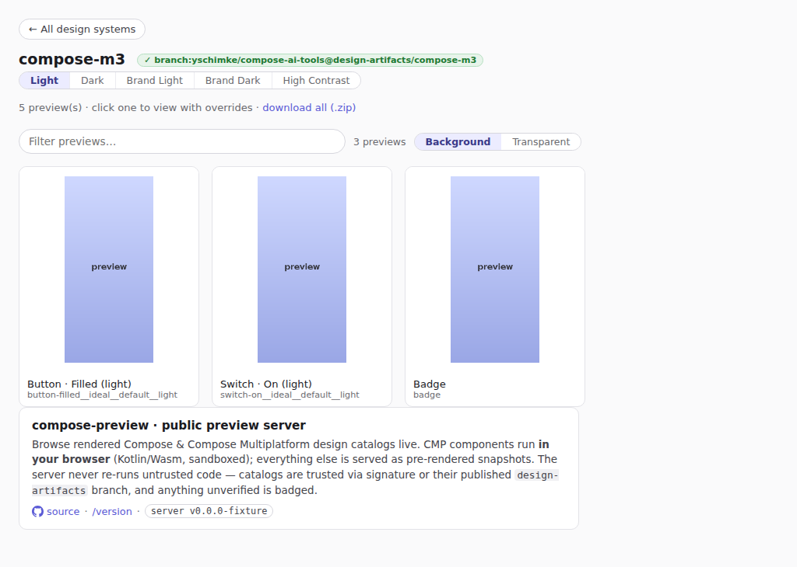

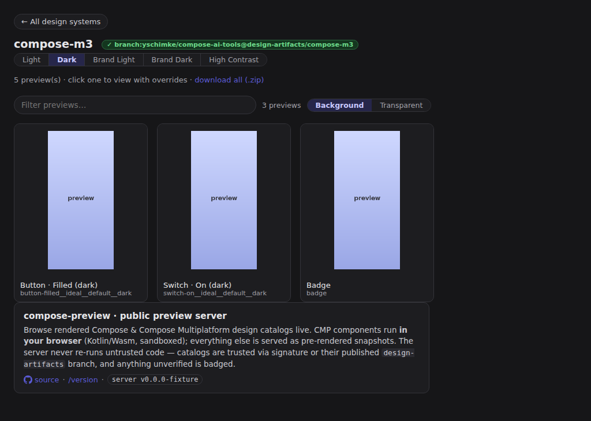

## Long-press a card for a live session, in place

The Theme control above re-renders the grid's *pixels*. Sometimes what you want is the component
itself — pressed, dragged, scrolled — and until now that meant opening the viewer and flipping its
**Live preview** toggle. **Holding a card** on the catalog grid does it where you are: the card's
preview starts streaming from the session's render daemon inside the card, and everything you do to
it goes to the real composition.

| Before — baked thumbnails only | Hover — the affordance | Held — a live session in the card |
| --- | --- | --- |
| 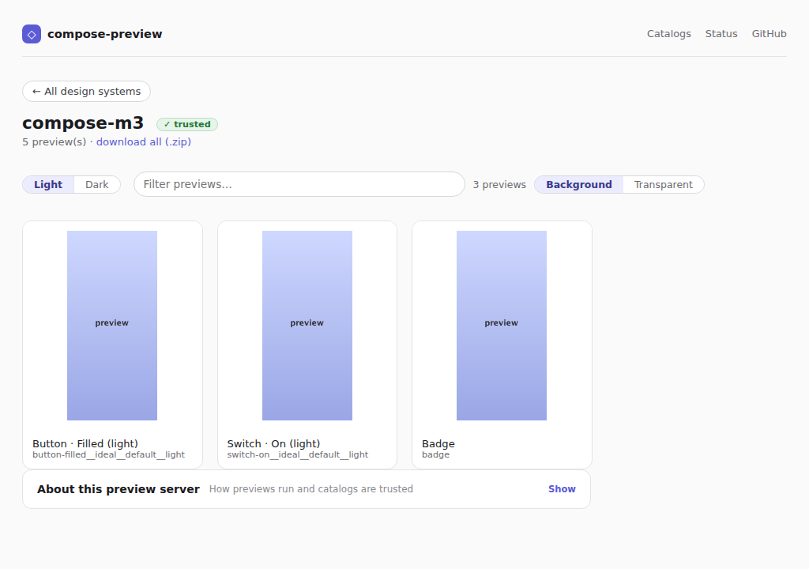 | 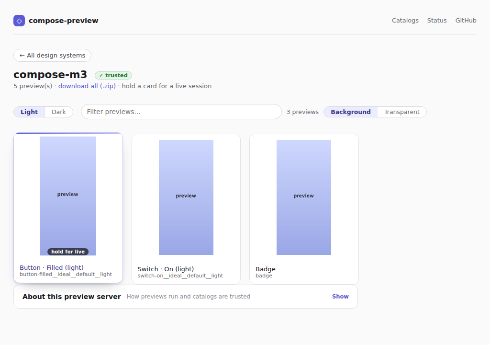 | 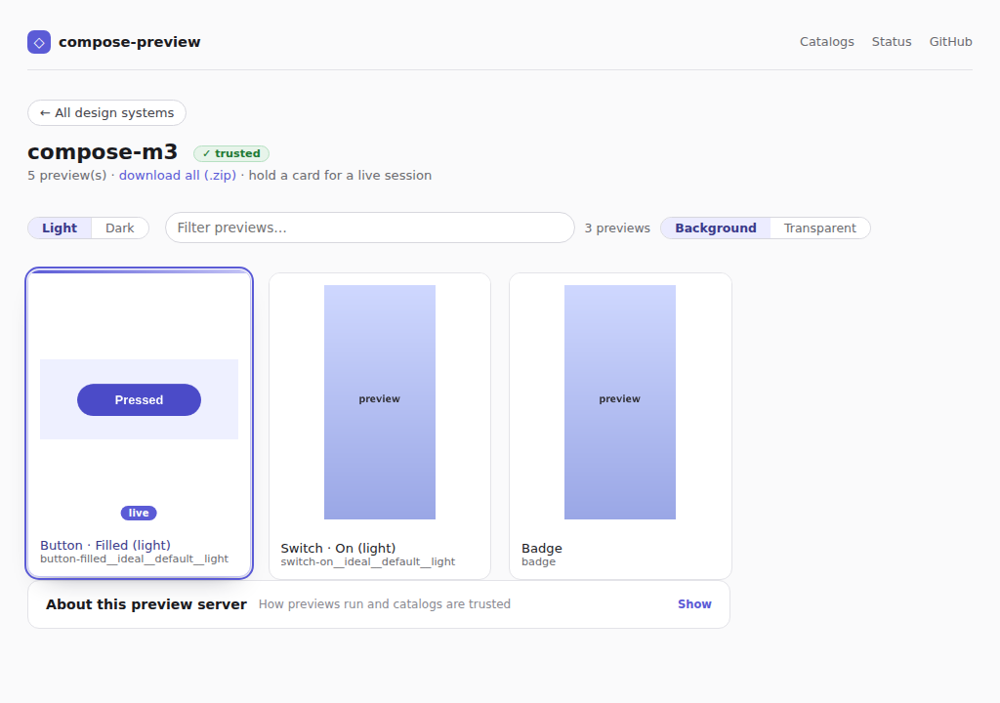 |

What the gesture does, and what it deliberately doesn't:

- **The card is the stage.** A `<canvas>` is mounted as an absolute overlay on the thumbnail's slot
  (the same trick the viewer uses), seeded with the thumbnail's own pixels so there is no blank
  flash while the socket comes up, and the daemon's frames paint over it. The card keeps its exact
  geometry either way — a live frame whose dimensions differ from the baked thumbnail scales into
  the same box rather than resizing the grid under you.
- **Input reaches the composition.** Pointer presses, drags (multi-touch included) and wheel/rotary
  scroll are forwarded as image-natural pixels over the same `/ws/<previewId>` lane the viewer's
  Live toggle opens — so it is one protocol, one seat budget, one set of close codes, not a second
  live implementation.
- **One card at a time.** A live seat *is* a render daemon and a catalog is commonly 80+ cards, so
  starting a session ends the previous one. `Escape`, a press anywhere off the card, or leaving the
  page ends it too.
- **It appears only where it would work.** A card takes the gesture when the session offers the
  stream lane **and** that preview has a daemon twin behind it — the same two conditions the
  viewer's Live toggle answers to. A baked-only catalog's cards are the plain links they always
  were, with no affordance and no script loaded at all. On a box that gates live lanes behind
  GitHub, the press answers with the sign-in rather than a socket that would close `1008`.
- **A tap is still a tap.** The press has to be held past ~half a second, without drifting, before
  it means "go live"; a tap opens the viewer, a drag scrolls, and a right-click is left alone.
  `L` on a focused card is the keyboard equivalent, since a long press is a pointer gesture.

Long-pressing under a selected app-declared theme keeps that theme: the socket carries the same
`themeProvider` the grid is showing, so the live session opens on the palette on screen rather than
snapping back to the catalog's baked one.

## The chrome is Material 3

The server exists to show Material design systems, so the page around them is one too. The web
chrome is built on **Material 3** (Material You) — the same design language `@material/web` ships —
expressed as a token layer at the top of
[`serve.css`](../cli/src/main/resources/ee/schimke/composeai/cli/serve/assets/serve.css): the
`--md-sys-color-*` role set (the primary/secondary/tertiary/error families, the surface-container
ladder, the outline pair), the shape scale, the six elevation levels, the state-layer opacities, the
motion easings, and the type scale. The `--cp-*` properties the sheet was already written against
are now **aliases onto those roles** rather than a second palette, so there is exactly one place a
colour is decided.

Nothing is imported to do it. A published artifact is served under a strict CSP with no CDN and no
web-font fetch, so the M3 **baseline** scheme is inlined rather than pulled from a package, and
Roboto is asked for but never downloaded — the stack falls back to the platform UI face where it is
absent.

What changed on screen, component by component: cards became M3 *elevated cards* (tonal fill,
elevation 1 at rest, rising to elevation 3 with a `primary` state layer under the pointer — no
keyline); the section tabs became M3 *primary tabs* with a 3dp active indicator; every chip and
toggle took M3's selected language (a `secondary-container` tonal fill instead of a tinted border);
the filter field became an M3 *search bar*; panels (about, provenance, override groups, the export
card, the component drawer) became *filled cards* separated from the page by tone rather than by a
1px border; and focus is M3's own 3dp `secondary` indicator everywhere.

| Before — the built-in indigo shell | After — Material 3 |
| --- | --- |
| 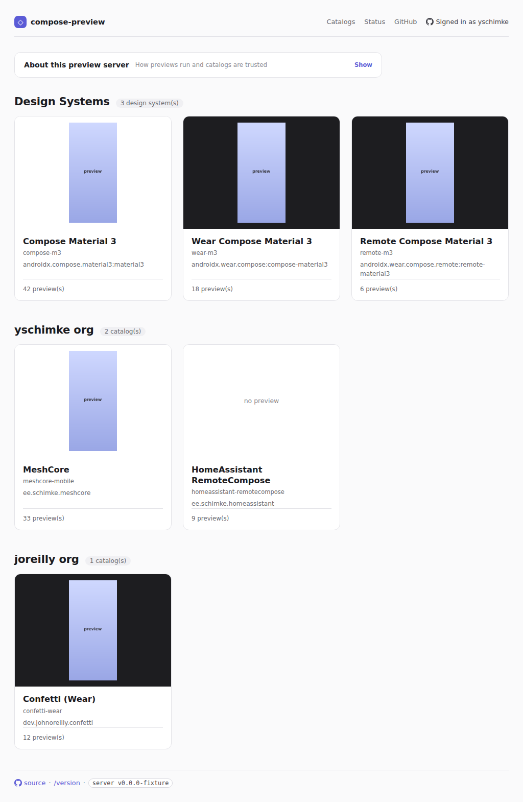 | 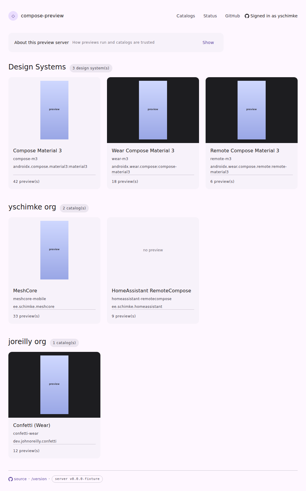 |
| 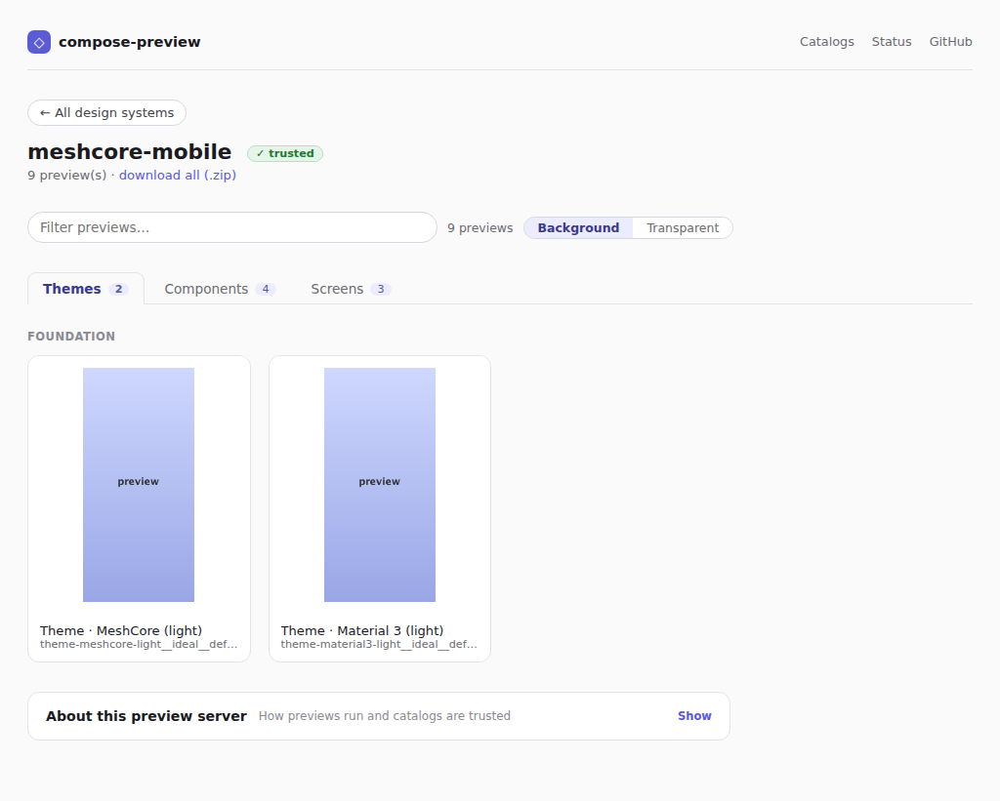 | 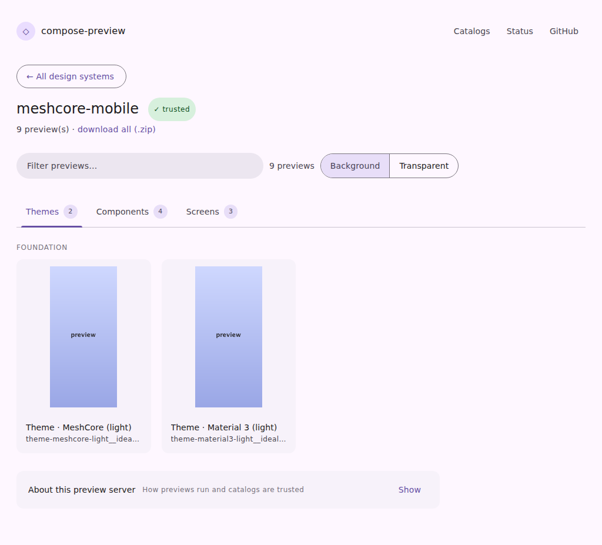 |
| 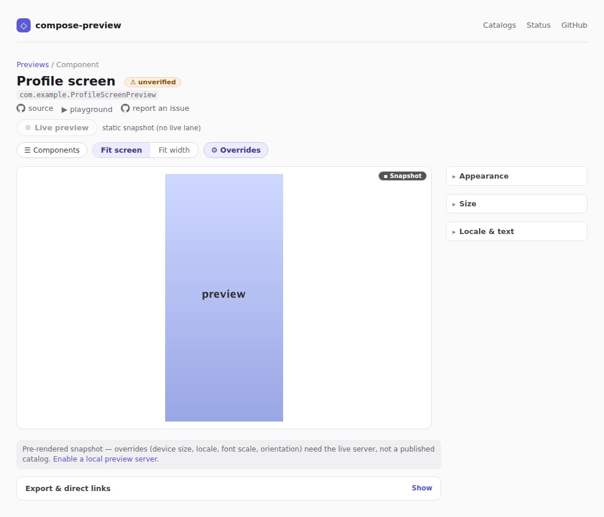 | 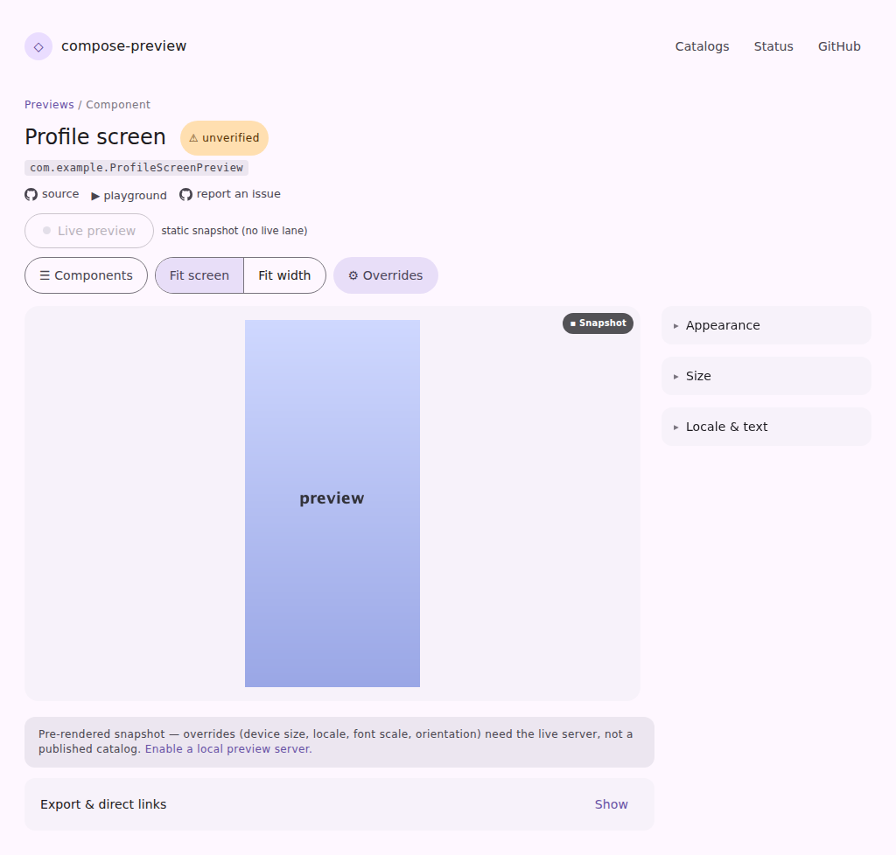 |
| 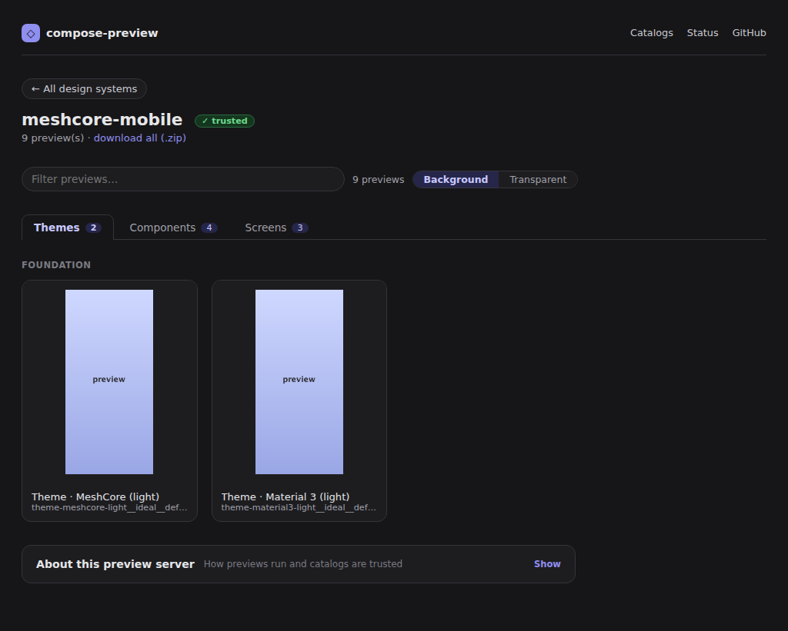 | 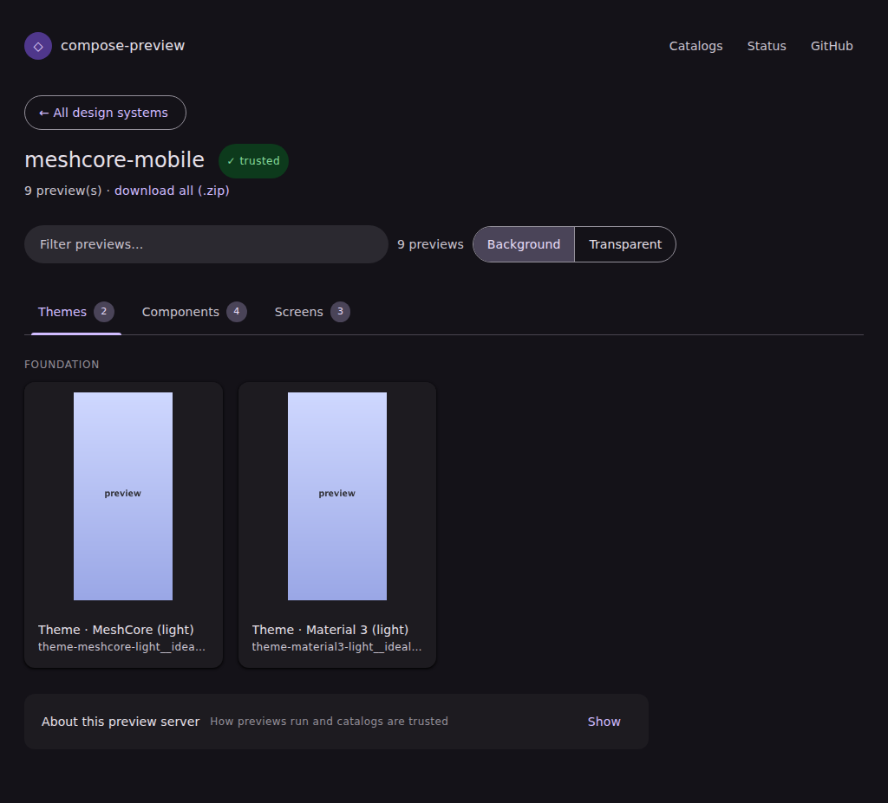 |

The dark scheme is the M3 baseline's own dark half. Because the aliases are `var()` references, it
re-declares only the **roles** — the long list of per-rule dark overrides the sheet used to carry
(re-pointing a border, a surface, a muted text colour at its dark twin) is gone with them. What
survives is what a token layer genuinely cannot express: the **semantic** colour pairs (trust
badges, good/warn/bad scores, the code/design parity lanes, the live-lane green), which are literal
by design because they must mean the same thing in every design system — they keep M3's
*container / on-container* relationship but not its palette.

The next section is why the role family matters as much as the alias family.

## The page wears the catalog's own palette

The Theme selector above re-renders the *previews*. The **page around them** is themed from the same
place: every `design-artifacts/<system>` branch publishes a `tokens.dtcg.json` beside `catalog.json`
(the W3C DTCG projection of the resolved `MaterialTheme.colorScheme` the catalog was rendered with,
lifted from the render's `compose/theme` data product), and the server projects it onto the CSS
custom properties the site chrome is painted from. So `/wear-m3/` is framed in Wear M3's cyan on its
own near-black surface, `/jetnews/` in JetNews's crimson — instead of every design system arriving
inside the same fixed baseline shell.

The projection covers **both** families the token layer declares — the `--md-sys-color-*` M3 roles
*and* the `--cp-*` aliases — produced together from the same resolved values. Emitting only the
aliases would leave everything painted from a role (a tonal chip, a state layer, an error container)
stuck on the M3 baseline scheme while the rest of the page re-themed. `ServeThemeCss` derives the
roles from the values it has already contrast-checked rather than reading the token file twice, so
the two families can never disagree about the same colour; a test asserts both that every role the
sheet declares is themed and that the overlapping ones match exactly. The roles the chrome has no
alias for — the secondary/tertiary/error families and the container ladder — come from the catalog
when it publishes them **and** the mode being painted is the one it baked, and are derived
otherwise, so a light-first catalog never paints a light error container onto a dark page.

| Before — one fixed chrome for every system | After — `/jetnews/` in JetNews's own palette |
| --- | --- |
| 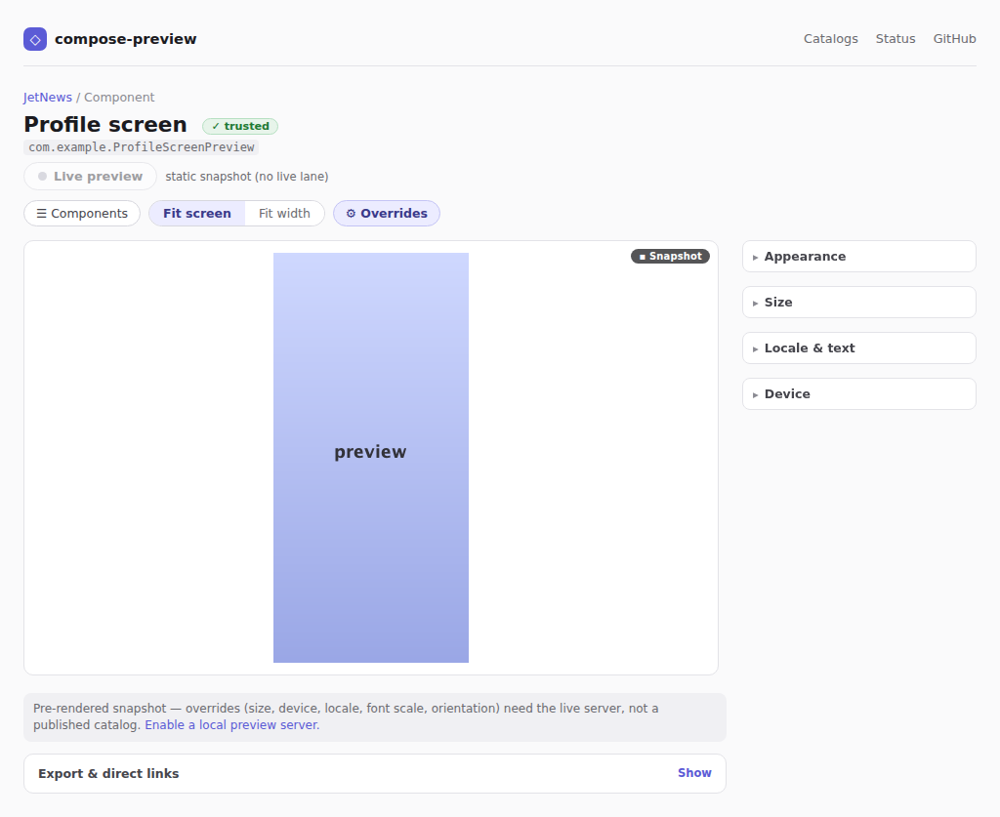 | 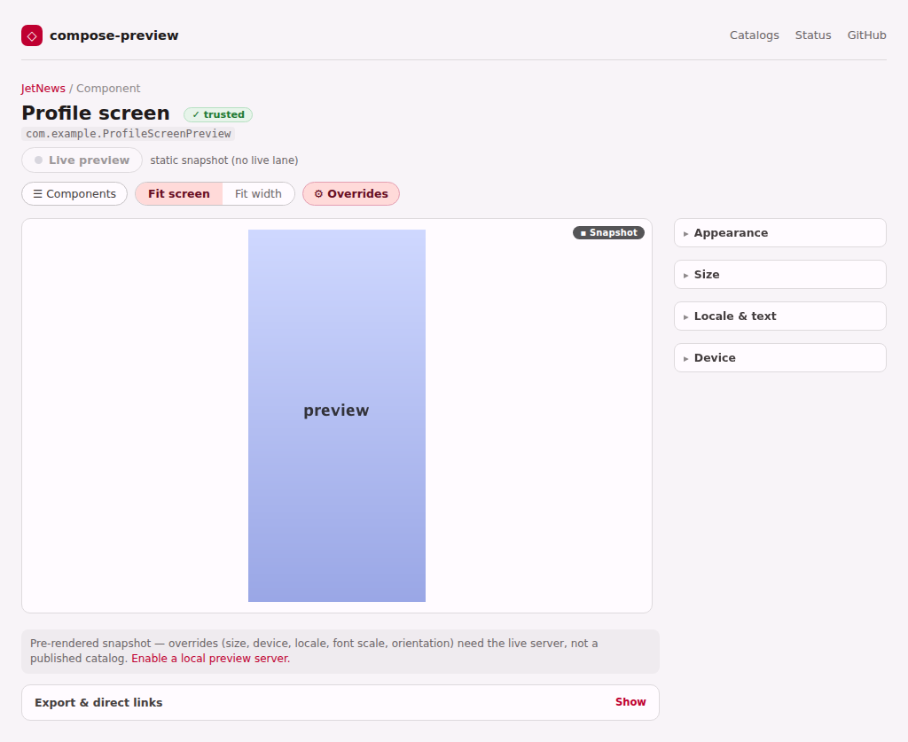 |

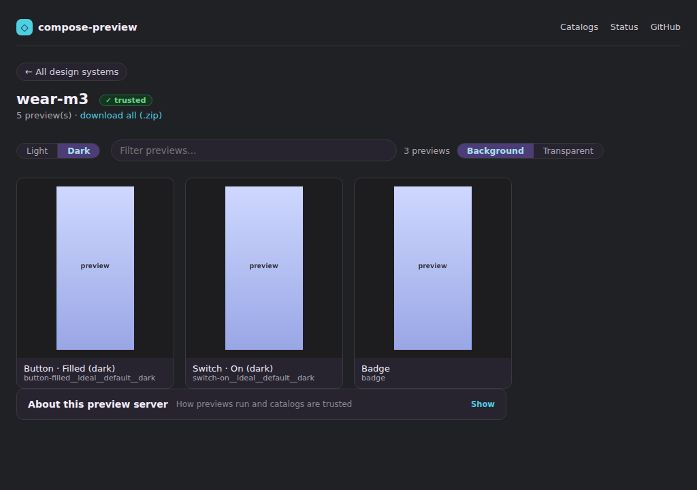

It is a **sync**, not a second palette to maintain: re-publishing a catalog with a new brand colour
re-themes its pages on the next catalog refresh, with nothing to edit in the server. A catalog that
publishes no tokens (or an unfetchable / unparseable file) simply keeps the built-in chrome — every
failure mode is the same non-event.

Two details make it behave under a real visitor's settings:

- **A catalog bakes one mode; a visitor arrives with their own.** The emitted CSS declares both. The
  **matching** mode gets the full sync (surfaces, text and borders from the catalog's `surface` /
  `onSurface`, plus its `surfaceContainer*` ladder when it publishes one, and its accent family);
  the **opposite** mode keeps the built-in neutrals for that mode and takes only the accent family.
  A dark-mode visitor browsing a light-first catalog therefore gets a dark page in the catalog's
  brand colour, not a light page.

- **Nothing themed is allowed to become unreadable.** Every colour that ends up carrying text is
  pushed to a minimum contrast ratio against what it sits on, so a low-contrast brand colour is
  deepened (or lightened) until it reads rather than being taken literally. What is *not* themed is
  as deliberate: the trust badges and good/warn/bad scores stay literal because they mean the same
  thing in every system, and so do the sticker stages — a light-rendered sticker keeps its white
  backing and a dark-rendered one its dark backing, since those are pinned to the render's theme,
  not the page's.

## The page follows the theme you picked — Settings › Page theme

The palette above says *which colours*; this says *which mode*. Selecting **Dark** in the catalog's
Theme control (or opening a `?theme=dark` link someone shared) now paints the **page** dark too,
instead of handing a dark grid to a light shell — the one combination nobody picked.

| Before — **Dark** picked on a light machine | After — the page follows it |
| --- | --- |
| 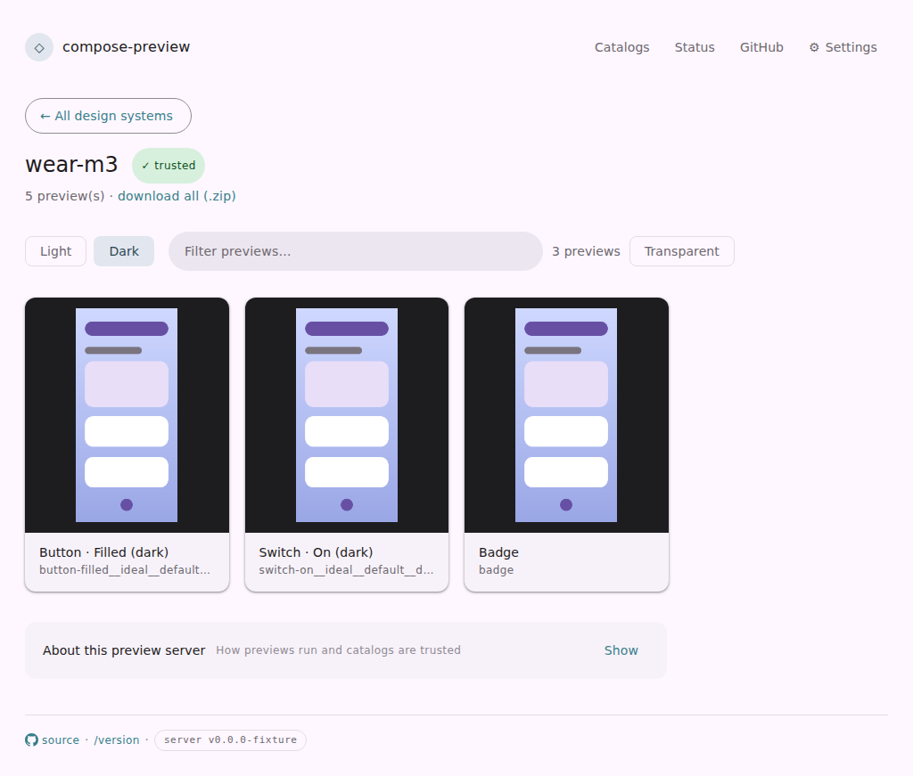 | 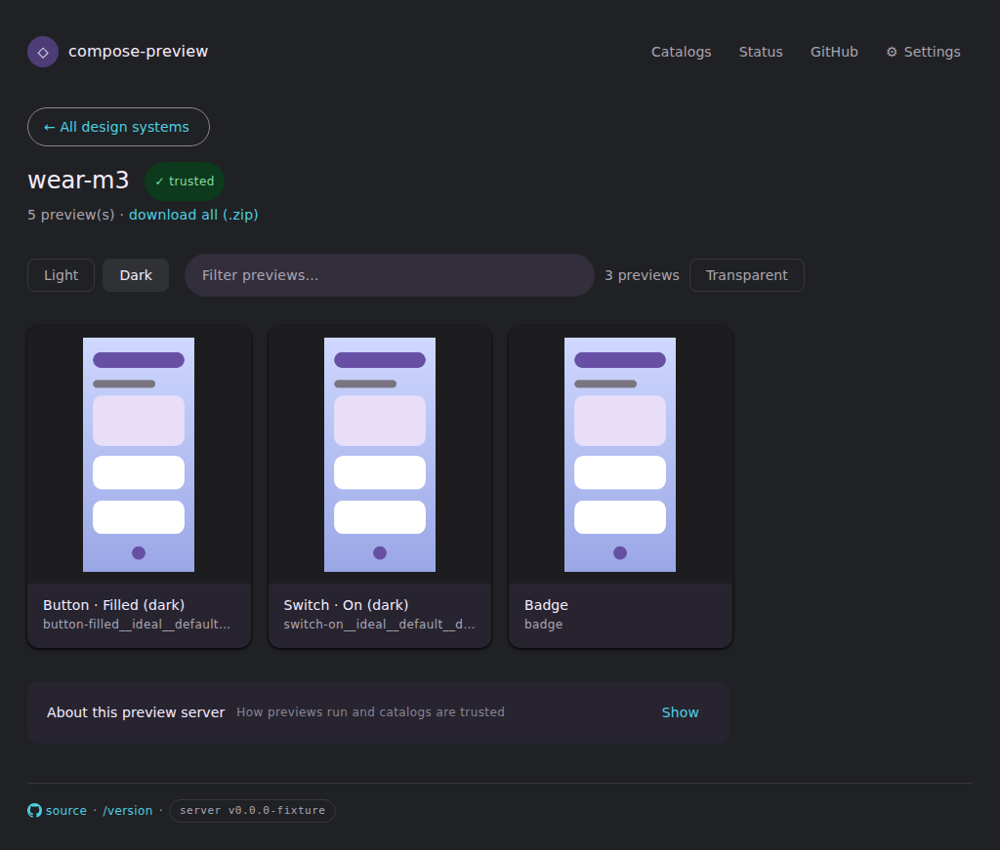 |

It is **optional, and it is a setting** rather than another control in the toolbar — a standing
preference, answered once, that applies to every catalog and every page. The header's **Settings**
menu holds it:

- **Match the preview theme** (default) — an explicit Light/Dark pick pins the page to that mode.
- **Follow my system** — the previous behaviour: the page stays on `prefers-color-scheme` whatever
  the previews are showing. Somebody who keeps their machine dark all day sets this once.

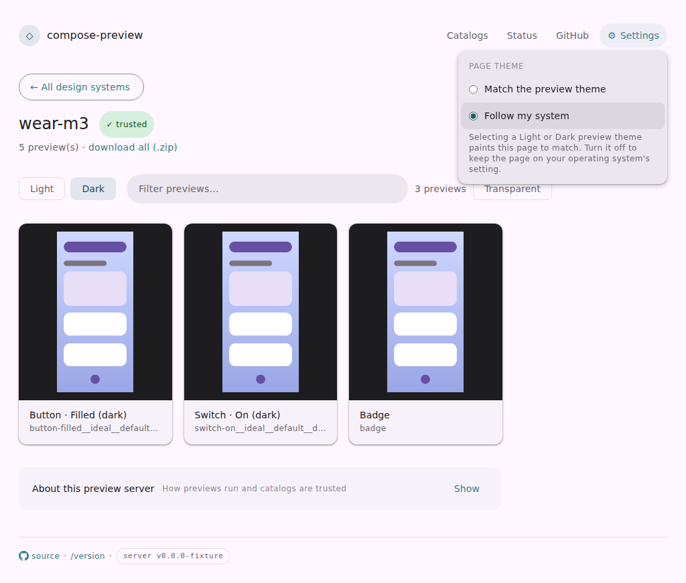

Only an **explicit** `light` / `dark` moves the chrome. `Default` and an app-declared
`theme:<providerFqn>` carry no light/dark axis — a declared theme is a palette, not a mode — so they
leave the page on the visitor's OS preference rather than guessing. The choice is not carried in the
URL either: a shared link describes the previews, not the reader's chrome preference. Resolution
order matches the theme itself — `?theme=` / `?uiMode=` on the URL first, then the catalog's
remembered choice — and it is applied by a pre-paint script in the page `<head>`, so a page opened
under `?theme=dark` never flashes light first.

Mechanically the whole feature is one CSS property. `serve.css` and the emitted catalog palette both
write every mode-dependent value as a **`light-dark(<light>, <dark>)` pair** instead of a `:root`
block plus a `prefers-color-scheme` block, so pinning the mode is `color-scheme: dark` on `<html>`
(`.cp-scheme-dark`) and the chrome, the catalog's palette and the semantic badges all re-resolve
together. With neither class set the declared `light dark` pair defers to `prefers-color-scheme`
exactly as the media query did, which is what the setting turns back on — and what a no-JS client
gets.

That rewrite also fixed a latent bug it made visible: the light scheme's elevation shadows were
written as `rgba(var(--md-sys-elevation-shadow), 0.3)` over `--md-sys-elevation-shadow: 0 0 0`, which
is invalid legacy `rgba()` syntax, so **every M3 shadow in light mode computed to `none`**. Cards,
sheets and the viewer stage had been flat on a light page since the token layer landed; they are not
now.

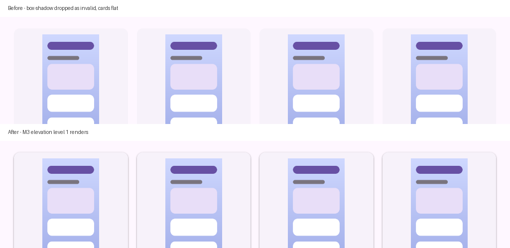

## Reporting a bad render

Every viewer page carries a **report an issue** link beside its "source" link. It opens a
**prefilled GitHub new-issue form** against the repo that owns the preview, carrying the facts a
triager would otherwise have to ask for: the design system, the preview id, the source file, which
catalog build was on screen (`repo@branch` + the compose-ai-tools version that rendered it), a deep
link to the viewer, and the `/render` PNG **at the overrides in force when the link was clicked** —
the viewer keeps the prefill current as the knobs, theme and size change.

Mechanically it is a **GET form**, not an anchor: keeping the prefill current means writing page
state into it, and writing a page-derived string into an `href` is a navigation sink (a
`javascript:` URL there would execute). The form's action is a server-rendered literal the JS never
touches, the live render URL only ever lands in a hidden input's value, and the browser does the
query encoding on submit — so there is no sink to guard.

| Before | After |
| --- | --- |
| 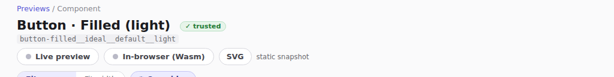 | 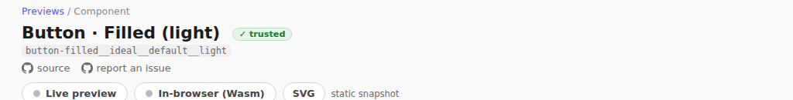 |

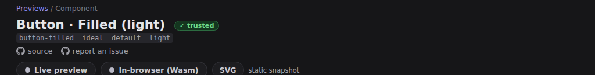

**Which repo it files against** is the catalog's **source** repo (the Kotlin the preview is declared
in — `catalog.json`'s `source.repo`), falling back to the delivery repo and finally to
`yschimke/compose-ai-tools`, whose renderer produced the pixels either way. A source repo that is a
fork is still the right target: that fork is where the preview code that misrendered lives.

**The render is embedded, and a paste is still offered.** The body carries the render as a markdown
image (``), so GitHub shows the pixels inline and a triager sees the
problem without clicking anything. That embed is a **live** render, though: it re-renders against
whatever the catalog is when someone reads the issue, so it can drift away from what the reporter
saw. The template says so, and still asks for a paste — **Copy PNG** (on the *Export* line)
puts real `image/png` bytes on the clipboard rather than a base64 `data:` URI, so one Ctrl-V/Cmd-V
uploads the exact pixels to GitHub's own CDN, where they stay put. Browsers without `ClipboardItem`
fall back to the data URI.

**The embed appears only when GitHub can actually load the URL**, which takes two things.
*Reachable*: an inline image is fetched by GitHub's camo proxy, not by the reader's browser, so it
must be reachable from the public internet over HTTPS — a `compose-preview serve` on
`http://127.0.0.1:8080`, a box on a private LAN, or plain HTTP is not. *Answerable*: the render lane
must serve the URL **without a session token**, because the token is stripped from everything that
reaches an issue body. A token-gated (`--public` off) server 404s that tokenless request however
public its hostname is, so its reports keep the `[PNG at these settings](…)` link form too. Both
conditions are evaluated against the server's own external URL and mode, so the viewer's live
re-substitution can never turn a working image into a broken one.

**The server never files the issue itself**, and asks for no extra OAuth scope to offer this. The
auth cookie holds only a login and a repo-access verdict — [the OAuth token is discarded after the
check](#github-auth-for-live-lanes) — so filing server-side "as the visitor" would mean holding user
tokens on a public box. Their browser is already signed in to GitHub, so the prefilled link files
under their own identity with nothing to custody. When the box *does* know the visitor's login it
names it in the link's tooltip ("File an issue on `owner/repo` as @login"); signed out, the flow
still works, because GitHub prompts for sign-in on the issue form.

A token-gated (`--public` off) server strips its **session token** from both URLs in the body — that
token is the capability to drive the server, and an issue is public.

### Opening the Figma node a preview is specified by

When the served catalog publishes a **Figma-backed design reference** for a preview, the viewer adds
a third link to that row: **figma spec**, opening the file focused on that exact node.

| Before | After |
| --- | --- |
|  | 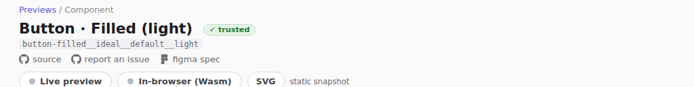 |

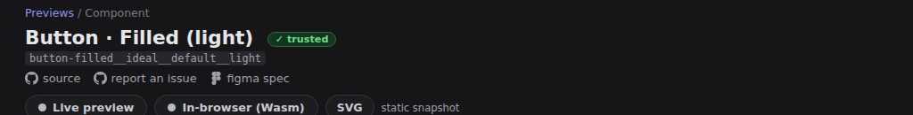

Nothing new is published to make this work. A producer that keeps a `design-map.json` already emits
its Figma entries into `references/index.json` as `source.provider = "figma"` plus a
`figma:<fileKey>/<nodeId>` handle, and the server already keeps those fields — this only turns the
handle into a URL (Figma's URL form spells a node id `73-6` where the map and the API use `73:6`).

**It appears only when the catalog names a spec.** A preview whose reference is an HTML export or a
plain PNG — and every catalog that publishes no references at all — gets no link rather than a guess
or a dead one. Today that means a handful of meshcore-mobile screens; `compose-m3` and `wear-m3`
publish no Figma references, so their viewers are unchanged.

**The server still never talks to Figma.** `source.uri` remains informational: the browser
navigates, nothing is fetched, and no Figma credential exists anywhere in `serve`. Because a catalog
is third-party data, the handle is parsed strictly and the URL assembled from a literal origin plus
a validated file key and node id, so a catalog declaring `javascript:…` resolves to no link at all
rather than an attacker-chosen href on the viewer page.

**Posting a comment from here would be a different feature**, and a much larger one. Figma has no
prefilled-comment URL — the equivalent of GitHub's `issues/new?body=` — so it would mean calling
`POST /v1/files/:key/comments` with a real Figma credential: either a server-held token (every
comment authored by one bot account, and a public box holding write access to your design file) or a
per-visitor Figma OAuth flow (a second token to custody, which is exactly what the GitHub path
avoids). Figma comments also carry no image attachments, so the "paste the render" trick above has
no equivalent there.

### Putting the spec on the stage beside the players

The link above sends you to Figma. The **Spec lane** keeps you here: when the catalog publishes a
design reference for a preview, the viewer's renderer row grows a `SPEC:` group beside the
Remote Compose player chips, so the same control strip that chooses *which player draws the code*
also offers *what the design says*.

| Before | After |
| --- | --- |
| 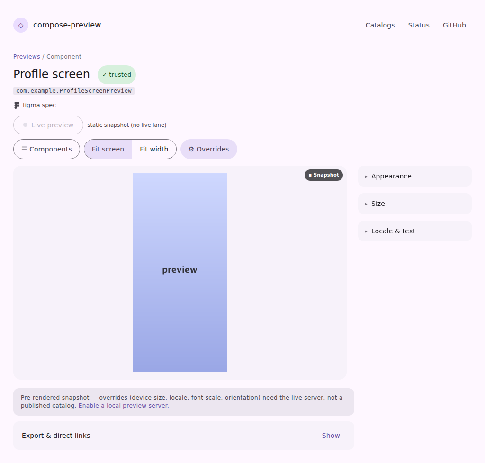 |  |

Pressing the chip swaps the imported reference onto the stage in place of the render, flips the
corner badge to `◇ Figma`, and labels the lane "imported design spec — not a render" — the render is
one press away again, which is what makes flipping between the two a comparison rather than a
navigation. `view diff →` beside the chip steps into the focused
[Reference / Diff / Actual](#design-references-and-ui-mocks) page for that exact mapping.

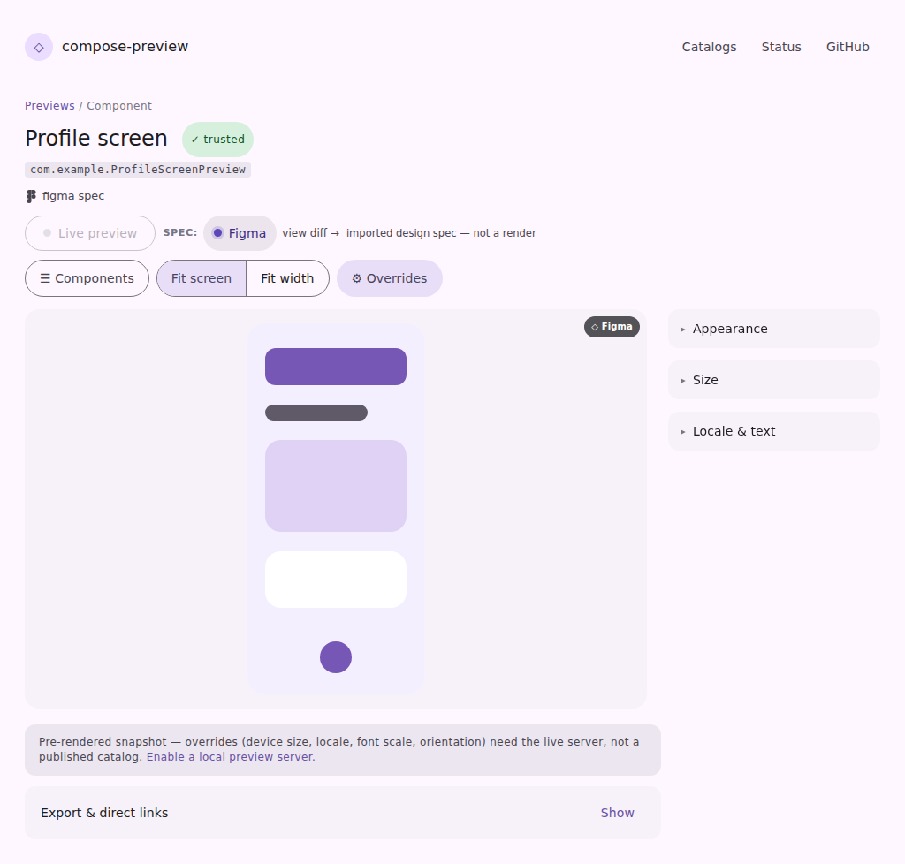

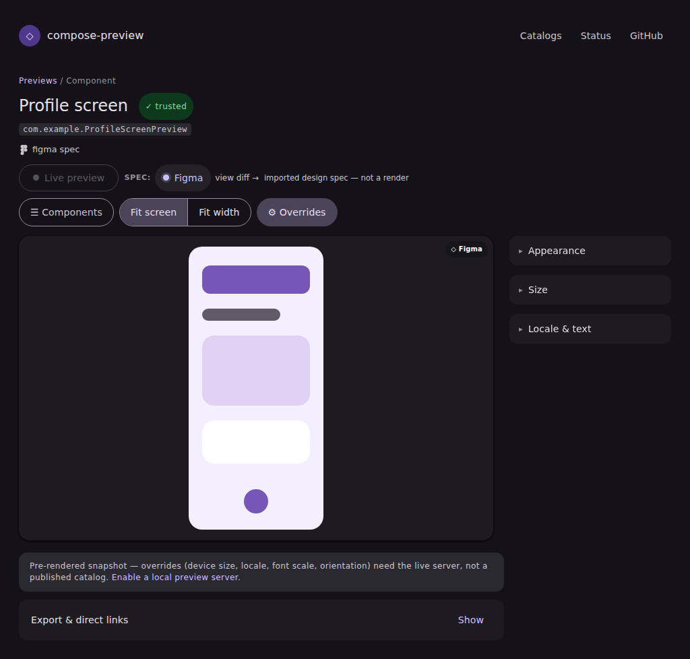

The lane is bookmarkable (`?mode=spec`) and Back/Forward-able like every other lane, and while it
owns the stage the override controls are disabled: no device size, locale or theme re-points a
fixed imported raster, so they would be dead knobs rather than useful ones.

**Still nothing is fetched from Figma.** The raster is the catalog's own canonical, inert PNG,
served by this box from `/reference/<id>.png` — the same bytes the comparison page scores against.
The lane is therefore provider-neutral: a reference imported from a committed PNG bundle, an HTML
export or Stitch gets the same chip (labelled `Spec` rather than `Figma`), and a catalog that
publishes no references gets no lane at all.

### Diffing the spec without leaving the viewer

Flipping between the render and the spec is a weak instrument. It answers *are these different?*
only by asking the eye to hold one frame while looking at the other — which finds a wholesale colour
change and misses the 4dp of padding that is usually the actual bug. The focused
[Reference / Diff / Actual](#design-references-and-ui-mocks) page has the real instruments, but
reaching it means leaving the viewer, and with it the overrides, knobs and theme that produced the
render worth comparing.

So the instruments come to the lane. While the Spec lane is up, a segmented group beside the
renderer picker offers four ways to look at the same pair, one click apart, with the match score
beside it:

| View | What it shows |
| --- | --- |
| **Spec** | The imported reference alone — the lane's original behaviour, and still the default. |
| **Diff** | The magenta delta map: where, exactly, the two disagree. |
| **Triptych** | Spec, diff and render side by side — the shape the focused comparison page is built around. |
| **Slider** | One frame, wiped between spec and render, with a draggable seam — the alignment instrument. |

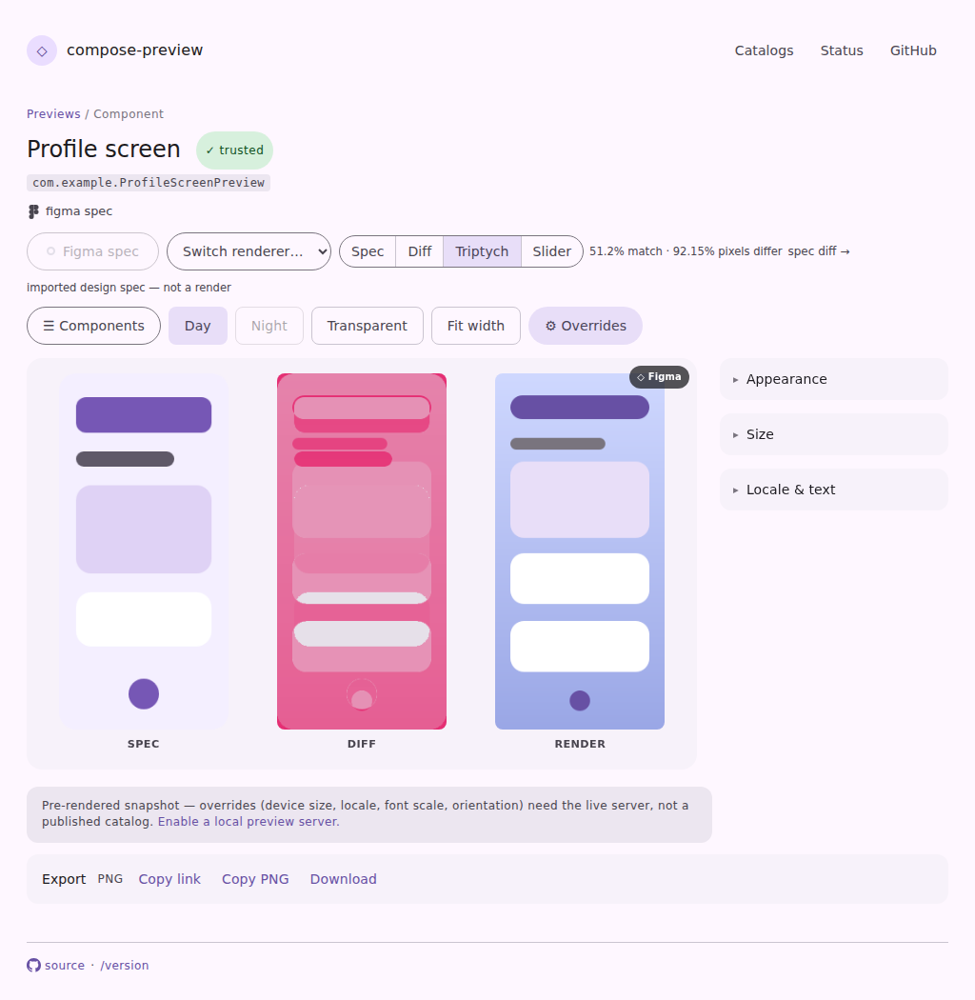

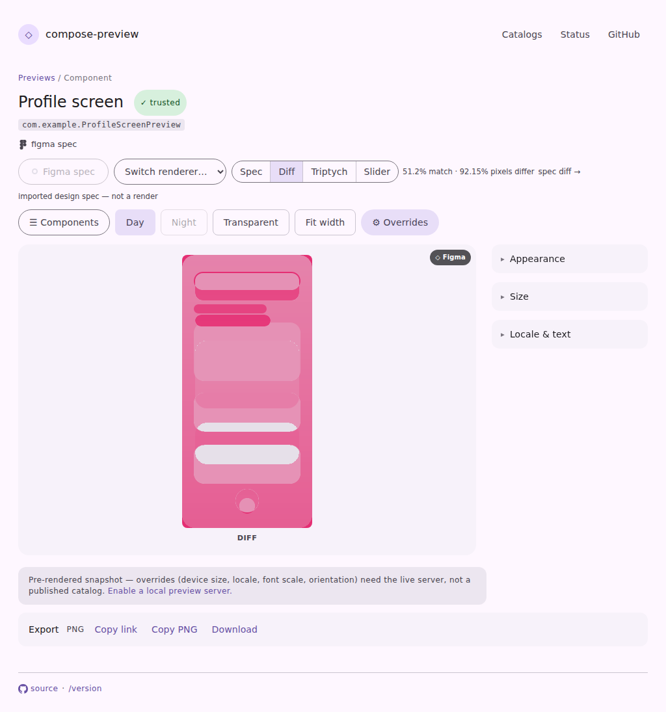

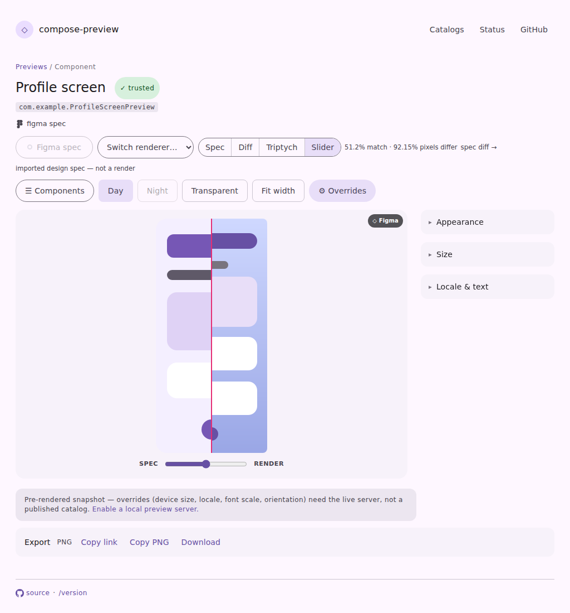

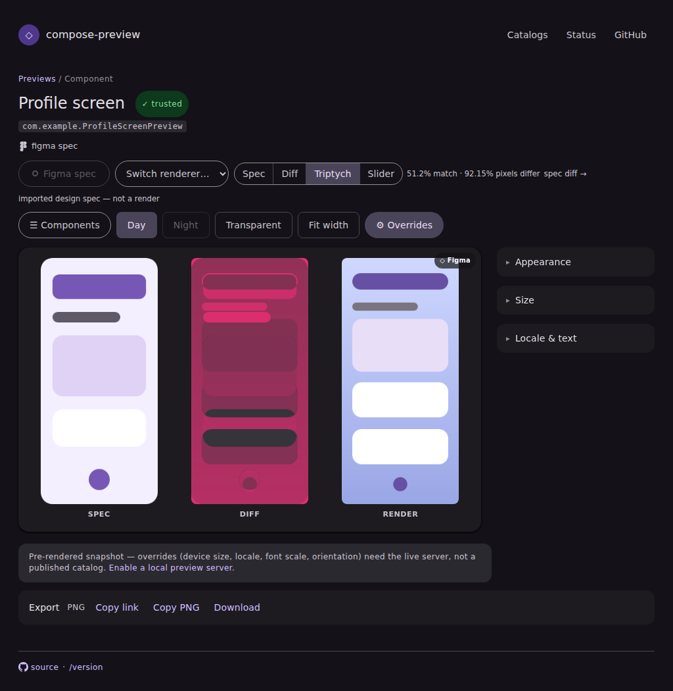

Every surface comes from **one normalisation pass**: each side is cropped to its content box and
redrawn into one shared pixel space before anything is compared, the same treatment the focused
page's score uses. A reference exported at a different scale — or with different padding — than the
render therefore lines up here instead of reading as a total mismatch, and the diff, the three
panels and the wipe are all in the same coordinates.

The comparison runs against **the bytes already on the stage**, not a fresh render: the viewer hands
the spec lane the blob it fetched for the current controls, so entering the lane costs no second
render (an override-bearing render is `no-store`, so re-fetching would re-render and could race the
daemon's shared override state) and the score describes exactly the frame the visitor was looking
at.

The chosen view rides the URL as `?specView=diff|triptych|slider` alongside `?mode=spec`, so
`…/p/<id>?mode=spec&specView=slider` is shareable and Back returns to the view you came from.
`spec diff →` beside the group still steps out to the focused page when the annotation layers or the
opacity overlay are what you want.

## Design references and UI mocks

A bundle or published catalog can map independently-authored UI mocks to exact preview ids. The
landing links to **compare formats**; its **PNG ↔ Design reference** lane scores the canonical mock
against Compose, and the focused comparison shows **Reference / Diff / Actual** plus an opacity
overlay and source provenance.

References use a provider-neutral `compose-preview-references/v1` manifest at
`references/index.json`. Published catalogs fetch this manifest from their delivery branch;
inline `catalog.json` references remain supported for older producers:

```json
{
  "schema": "compose-preview-references/v1",
  "references": [{
    "id": "login-figma",
    "previewId": "com.example.LoginPreview",
    "label": "Login / signed out",
    "raster": {
      "path": "references/login-figma.png",
      "width": 390,
      "height": 844,
      "sha256": "<lowercase sha256>"
    },
    "source": {
      "provider": "figma",
      "uri": "https://www.figma.com/file/…",
      "revision": "42",
      "attributes": { "nodeId": "10:2" }
    },
    "artifact": { "kind": "html", "path": "mocks/login.html" }
  }]
}
```

Every producer—PNG, SVG, HTML, Figma, or another design tool—must normalize its output to the
declared PNG before publication. `serve` reads only that inert raster. It never executes the
artifact or follows `source.uri`; catalog import fetches the raster from the already-trusted catalog
branch and rewrites it to a server-owned path. IDs and paths are contained, duplicate mappings are
discarded, and an optional SHA-256 is verified before the reference is advertised. A reference names
one preview id — the mapping is never inferred.

**The two sides are scored on their content box, not their canvas.** A reference and a preview are
framed differently by construction: the preview carries whatever its `@Preview` scaffold added
(`showBackground`'s opaque sheet, a `padding()` inset, a fixed-height container the content does not
fill), while the reference is usually cropped to the artboard. Comparing canvases measured the
scaffold rather than the component — a padded preview scored like unrelated art, and a size mismatch
reported nothing at all. So each side is cropped to the region it actually draws in and both are
normalized into one box before scoring, and the match score is reported beside a **proportion
difference** rather than blended with it: a reference stretched into the render's canvas is a real
finding, not noise to smooth away. Near-empty captures are the exception and fall back to
whole-canvas scoring, because a content box of a few percent is located by whichever stray mark
happens to be present rather than by the component.

Measure a whole lane with [`scripts/compare-audit.mjs`](../scripts/compare-audit.mjs): `mirror`
pulls a catalog's compare page and its artifacts onto disk, `run` replays them in Chromium and
reports per-catalog mean / p10 / min / count-below-threshold. `run --patch <format-compare.js>`
scores the same bytes with a local copy of the scorer, which is how a scoring change is A/B'd
against real artifacts before it ships.

### Where a published catalog's references come from

For a **published catalog**, the manifest is generated — you don't hand-write it. The
`Publish design references` step of
[`design-artifacts-reusable.yml`](../.github/workflows/design-artifacts-reusable.yml) runs
[`emit-design-references.mjs`](../scripts/design-artifacts/emit-design-references.mjs) over the
calling repo's [`design-map.json`](https://github.com/yschimke/design-parity) — design-parity's
correspondence file, which most adopters already keep — and writes `references/` into the bundle
just before it is published to `design-artifacts/<system>`.

The join is by **`@Preview` function name**: a design-map entry's code handle
(`ui/ChatBodyPreviews.kt#ContactChatDarkPreview`) names the same function that `catalog.spec.json`
names for a component or one of its variants, which pins the exact sticker — and therefore the exact
serve preview id (`chat-contact__ideal__default__dark__compact`). Keying off the function rather than
the compose-preview discovery id is deliberate: the discovery id carries the `@Preview` `name=` and
gets filename-sanitized on its way into a bundle, while the function name is the stable identity both
files already agree on. A design-map entry that maps to no published sticker is a warning, not an
error — a repo may map more components for its own parity run than it publishes.

Pixels come from, in precedence order: a pre-rendered PNG under `--reference-images` (for a repo
that already rasterizes references in an earlier job), a committed `.html` mock rasterized with
Playwright's Chromium against the fonts the workflow already staged, a committed `.png`, or a
`figma:<fileKey>/<nodeId>` node rendered over the Figma REST API when a `figma_token` secret is
supplied. Each raster is then resampled to the sticker's exact dimensions and hashed — "exact" is
load-bearing, because the comparison refuses a size-mismatched pair rather than scaling it, so an
unresampled reference publishes as a dead row. An entry that can't be rasterized (a Figma reference
in a run with no token, say) is dropped with a warning and the rest of the manifest still publishes;
a catalog must never lose its render to a reference lane. Pass `--strict` to gate on that instead.

A repo with no `design-map.json` is a clean no-op, so the step runs unconditionally for every
catalog.

The same step also writes the **reference side of the annotation layers** — the numbered spec boxes
the compare page draws over each column. Two things decide whether those numbers can be read against
the render's:

- **`density` on the design-map entry** — the reference board's scale, in source pixels per dp. A
  Figma file reports its own pixels and nothing in it says what they are pixels *of*, so only the
  map's author knows. Declared, the reference column is quoted in the same `dp`/`sp` the render
  resolved (`text 17.5sp` for a 3× board's 52.5px), with the factor and the source unit recorded in
  the annotation's `detail` so the original number stays recoverable. Undeclared, the column names
  the board's own unit (`text 52.5px`) rather than guessing — a wrong factor silently rescales every
  spec, which is worse than an honest `px`. Omit it unless you know it.
- **`≈` in a label** — the spacing was measured off the frame's child geometry, not declared. Only an
  auto-layout frame carries Figma's `padding` / `itemSpacing`, so a hand-placed mock would otherwise
  publish a type layer and no layout layer at all. The measurement fills that gap; the mark keeps it
  from reading as a number the design file actually asserts.

The lane only appears once a catalog actually publishes references — before the producer existed
every catalog served the format controls on the left:

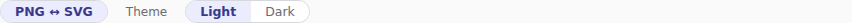

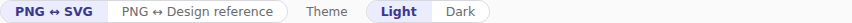

and selecting it scores each mock against the sticker it is mapped to:

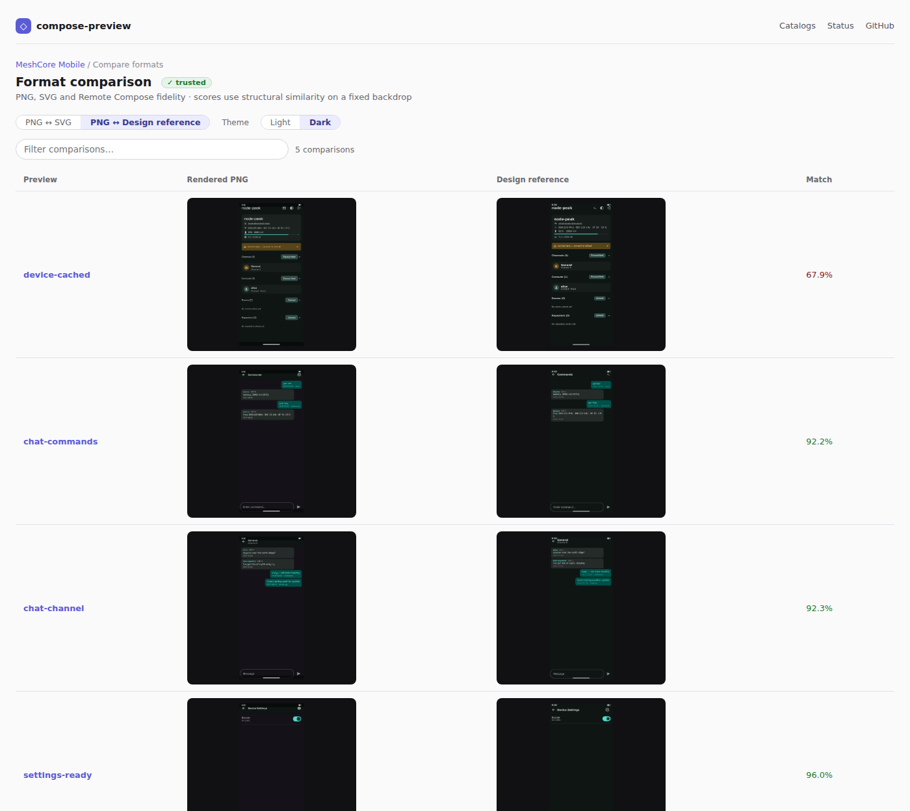

## Remote Compose players (`/<system>/compare?format=rc`)

A catalog that ships Remote Compose documents gets a **Remote Compose players** lane on the same
compare page: one column per player — the baked PNG, the vendored TypeScript `RcdPlayer`, AndroidX's
Compose-embedded `RcPlayer`, the Compose Desktop / Skiko player, the CMP/Wasm player — showing every
player's render of the same document, with nothing diffed until you pick a column as the reference.
Picking the **baked PNG** replays the offline run's exact `pixelmatch` diffs; picking a *player*
diffs in the browser, which is the only way to ask "how far is cmp-wasm from cmp-jvm?".

Nothing is rendered in the visitor's browser to build it. The columns are the renders the offline
`rc-compare` pipeline already published on the catalog's delivery branch alongside
`rc-compare-summary.json` — the same data `rc-compare.html` is built from — which the catalog store
stages on its background fetch lane, re-keyed from daemon preview ids onto the served catalog ids
and served back at `/<system>/rc-compare/<lane>/<slot>.png`. A catalog that publishes no summary
keeps the older in-browser lane (baked PNG ↔ the JS player, rendered live), and one that ships no
`ir/` documents at all shows no Remote Compose lane.

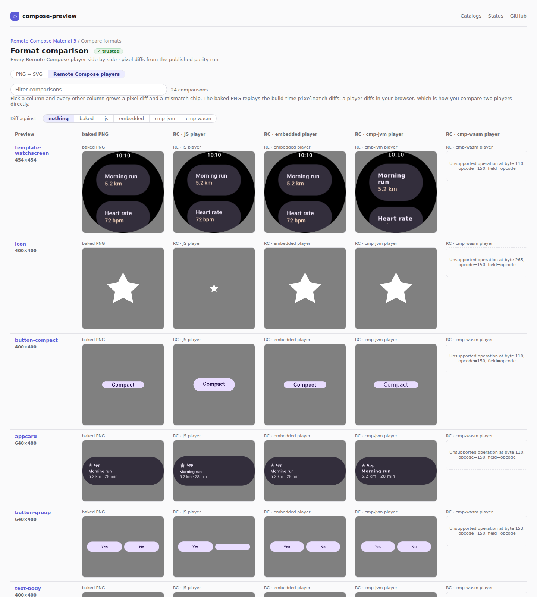

## The design-parity view (`/<system>/parity`)

A catalog landing links **design parity** beside "compare formats". That page answers one question
the grid can't: *has this catalog's code drifted from the design file it is specified by?*

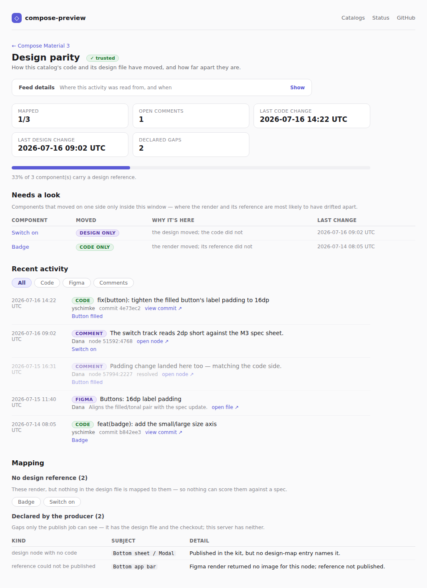

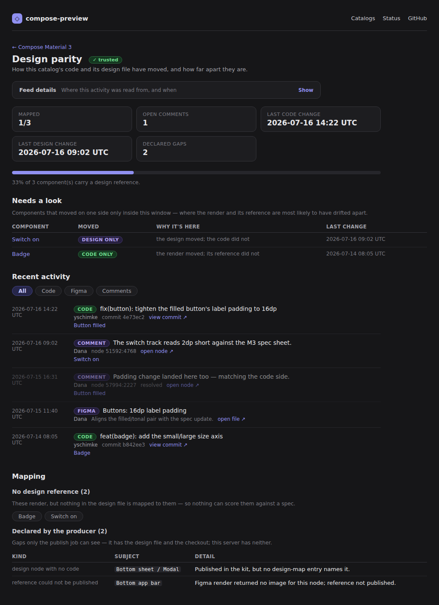

Four bands, in the order a reader needs them:

1. **Where we stand** — how many components carry a design reference, how many Figma comments are
   open, and when each side last moved.
2. **Needs a look** — components that moved on **one side only** inside the window. This is why the
   two feeds share a page rather than sitting in two tools: a component with a commit and no design
   change (or a design comment and no commit) is exactly where the render and its reference are
   about to disagree, and every row links straight to that component's Reference / Diff / Actual
   comparison.
3. **Recent activity** — the merged reverse-chronological feed: commits, Figma file versions, and
   Figma comments, filterable by lane. A row that names previews this session serves links inward
   to them; a row's outbound link opens the commit on GitHub or the node in Figma.
4. **Mapping** — components with no design reference (derived live), then the gaps only the publish
   job can see.

### Half of it is derived live; the other half is published

**Coverage is computed on the box**, per request, from the previews and design references the
session is already serving. So the view works for *every* catalog that maps anything, with no
pipeline change and no new file — and a stale feed can never claim a component is mapped after the
catalog dropped it.

**The activity itself is a published snapshot**, read from `parity/activity.json` on the delivery
branch. That split is forced, not stylistic:

- The server has no checkout, so it cannot `git log`.
- **The server holds no Figma credential and never talks to Figma** — the same rule that keeps
  `source.uri` on a design reference informational (see [above](#opening-the-figma-node-a-preview-is-specified-by)).
  A dashboard that called `GET /v1/files/:key/comments` at request time would mean a write-capable
  design-file token on a public box, and page loads that fail when Figma rate-limits.

The publish job has both, and already holds `figma_token` to rasterize references. So it snapshots
the feed at publish time and the server only renders it — which also makes the page reproducible
(every visitor sees the same feed) and diffable (the delivery branch keeps its history). The page
says so: the **Feed details** disclosure names the repo, the file, and when the snapshot was taken,
because "nothing changed in Figma" and "we last looked a week ago" are different claims.

### The wire format

`parity/activity.json`, schema `compose-preview-activity/v1`. Every field is optional; a lane that
produced nothing is omitted rather than published empty.

```json
{
  "schema": "compose-preview-activity/v1",
  "generatedAt": "2026-08-06T09:12:00.000Z",
  "windowDays": 30,
  "code": {
    "repo": "yschimke/m3-catalog",
    "ref": "main",
    "events": [{
      "sha": "4e73ec2…",
      "subject": "fix(button): tighten the filled button's label padding",
      "at": "2026-08-05T10:00:00+00:00",
      "author": "yschimke",
      "previewIds": ["button-filled__ideal__default__light"],
      "components": ["Button/Filled"]
    }]
  },
  "figma": {
    "fileKey": "ocdacdEsnHipMJD3egzxKb",
    "fileName": "Material 3 Design Kit",
    "versions": [{ "id": "3928471", "at": "…", "label": "…", "description": "…", "author": "Dana" }],
    "comments": [{
      "id": "9182",
      "at": "2026-08-04T08:00:00Z",
      "message": "The switch track reads 2dp short against the M3 spec sheet.",
      "author": "Dana",
      "resolved": false,
      "nodeId": "51592:4768",
      "previewIds": ["switch-on__ideal__default__light"],
      "components": ["Switch/On"]
    }]
  },
  "gaps": [{
    "kind": "unmapped-design-node",
    "detail": "Published in the design file, but no design-map entry names it.",
    "ref": "figma:ocdacdEsnHipMJD3egzxKb/51827:5859",
    "component": "Bottom sheet / Modal"
  }]
}
```

**`previewIds` are route-safe serve ids, not discovery ids.** A design map names the raw discovery
id the daemon keys renders on (`sections.ButtonsKt.FilledButton_Light`), while the server keys a
preview by the id derived from its image path (`ServeCatalogStore.previewIdFor`). The emitter
translates through the published `catalog.json` — which carries both — before writing an event,
because the server filters every event's ids against the live catalog and simply drops the ones it
doesn't recognize. Publishing the discovery id would therefore be *silent*: the page still renders,
every row just loses its link to the comparison, and the feed degrades into the pair of unrelated
changelogs it exists not to be.

That translation is deliberately **incomplete rather than approximate**. A catalog image carries the
*sanitized* in-bundle id (`sanitizeBundleEntryId`), so an exact match is tried first and a sanitized
one second — but sanitizing is lossy, and `assignBundleEntryIds` in the plugin resolves collisions by
letting the first claimant keep the base form and suffixing the rest. Where two previews share a
sanitized key the raw→route direction genuinely isn't invertible from the catalog, so that key
resolves to *nothing*. Reproducing the plugin's suffix assignment in JavaScript would be a third
restatement of a Kotlin derivation with nothing checking it, and its failure mode is a link that
quietly points at the wrong component — worse than no link, because a reader who lands on the wrong
comparison has no way to tell.

`gaps[].kind` is one of `dangling-mapping` (the map names a preview the catalog no longer
publishes), `unrendered-reference` (a mapped node whose raster couldn't be published), or
`unmapped-design-node` (a component in the design file nothing maps to). An unknown kind is dropped
rather than rendered as a mystery row. Note what is *not* a gap kind: "this preview has no design
reference" — the server derives that itself, so a stale feed can't contradict the catalog in front
of the reader.

**A catalog is third-party data carrying free text other people wrote** (commit subjects, comment
bodies), so nothing in this file is trusted. Every string is HTML-escaped, an event with no
parseable timestamp is dropped (the feed is ordered by time), over-long text is truncated rather
than dropped, and the two outbound link shapes are **reassembled** from a validated repo/sha and a
validated file-key/node-id against literal origins — a catalog declaring `javascript:…` produces no
link at all rather than an attacker-chosen href.

### Where the feed comes from

The `Publish design-parity activity` step of
[`design-artifacts-reusable.yml`](../.github/workflows/design-artifacts-reusable.yml) runs
[`emit-parity-activity.mjs`](../scripts/design-artifacts/emit-parity-activity.mjs), immediately
after the references step so the catalog is final. It reads:

- **code** — `git log --name-only` over the window, joined to previews through `design-map.json`'s
  `code` handles (a changed file path → the entries under it → their preview ids). `actions/checkout`
  clones at depth 1, so the step deepens the checkout to the window first; failing that, the code
  lane is warned about rather than published empty, because an empty lane reads as "nothing
  changed".
- **design** — `GET /v1/files/:key/versions` and `GET /v1/files/:key/comments`, both read-only, with
  the file key taken from the design map's own `figma:` refs (nothing extra to configure). A pinned
  comment's `client_meta.node_id` is joined back through the map to the previews it specifies —
  that join is what turns "a designer commented" into a link to a comparison. Replies are dropped
  (a thread's openers are the signal) and only a display name is published, never an email.
- **gaps** — computed against the published `catalog.json` and, with a token, the file's component
  list. `unrendered-reference` is *derived* rather than reported: the reference step's warnings are
  gone by the time this runs, so the emitter instead reads the `references/index.json` it just
  wrote — which records each reference's design-map `code` handle — and reports a mapped entry
  missing from it. Only with a token, since without one that step skips `figma:` entries by design
  and "missing" would mean "never tried".

The staging side matters as much as the producing side: a served catalog is a fresh tree assembled
from explicitly fetched parts, so `ServeCatalogStore` copies `parity/activity.json` into it
(validating first) exactly as it does the reference and annotation manifests. A file nobody stages
is invisible to the host however faithfully it was published — and the failure is silent, because
the page falls back to coverage-only rather than erroring.

Fail-soft throughout, like the reference step: no token ⇒ the code lane and the gaps still publish,
which is the normal state for a fork or a PR run. A repo with no history, no design map and no token
writes nothing at all, so the step runs unconditionally for every catalog. `--strict` gates on any
skipped lane.

The pure half lives in [`parity-activity.mjs`](../scripts/design-artifacts/parity-activity.mjs) and
unit-tests without an `npm ci`; its output is committed as
[`fixtures/parity-activity.json`](../scripts/design-artifacts/fixtures/parity-activity.json) and
loaded by the Kotlin reader's own test, so the two languages can't drift apart silently.

### `?format=json`

`GET /<system>/parity.json` (or `?format=json`) returns the same dashboard as data — schema
`compose-preview-serve/parity/v1`, with `coverage`, `drift`, `activity` and `gaps`. It is the
derived view rather than a passthrough of `activity.json`: coverage isn't in that file, and the
preview ids here have already been filtered to ones the session actually serves. A CI check can gate
on `coverage.percent` or on `drift` being empty without scraping HTML.

## Two axes: trust × format

These are orthogonal. **Trust** decides attribution; **format** decides what draws the pixels. Neither
ever lets untrusted code run *on the server*.

> **The one deliberate exception: the playground.** `--playground` /
> `--playground-bundle` / `--playground-android-bundle` exist to compile and run someone else's
> snippet, which inverts the constraint above. (`--playground` adds a runtime **catalog selector**
> over the systems this host already serves; it changes which classpath a snippet compiles against,
> never who may compile — the gate below is the same either way.) Under `--public` the lane is
> admitted on either of two independent bases:
>
> - **contained** — the operator configures a per-session sandbox (`--playground-sandbox strict`, or
>   a `custom:` jail that supplies its own resource caps) **and** the startup probe proves that jail
>   blocks egress, contains the filesystem, and isolates the process namespace. The snippet then
>   runs in its own jailed JVM — one per snippet, killed at a hard wall-clock TTL — not on the
>   server proper. This is the posture that lets *anyone* compile.
> - **repo-access-gated** — GitHub auth is configured, so all three playground surfaces admit only a
>   signed-in user with access to `--github-auth-repo`. The snippet is then a repo collaborator's,
>   not a stranger's: the same trust level as the token-gated posture, and not the untrusted code
>   the constraint above is about. A sandbox is still applied when configured, as defence in depth
>   rather than as the precondition.
>
> Anonymous **and** uncontained is refused, and the startup log says which posture admitted the
> lane, so "admitted because collaborators only" is never mistaken for "admitted because
> contained". Design + profiles: [`docs/design/PLAYGROUND.md` §6](design/PLAYGROUND.md).
> Everything else on this page keeps the original constraint unchanged.

### Trust

A bundle/catalog is `Trusted(by …)` or `Unverified`. Trust gates only **server-side re-render** of a
bundle's *executable* Compose; the data tiers serve regardless. Three bases (`--trust-store
trust/producers.json`):

| Basis | How | Strength |
|---|---|---|
| **Signature** | An Ed25519 `signatures.json` signed by a key in the store's `keys` (`bundle sign`). | Strongest — cryptographic, offline. |
| **Branch** | The server fetched the catalog from a branch in the store's `branches` (e.g. `design-artifacts/*`). | Origin/TLS trust. |
| **Provenance** | A CI OIDC identity in the store's `oidc`. | Advisory — annotates an already-signature-verified bundle; full Sigstore/Rekor is a follow-up. |

Empty store ⇒ trust nothing (fail-closed). See [`trust/producers.json`](../trust/producers.json) for
the starter, and `compose-preview bundle keygen | sign | verify` to mint a key, sign a bundle, and
check a verdict.

The landing + viewer pages **badge** the session's verdict — green ✓ for a trusted
signature/branch/provenance, amber ⚠ for `unverified` (a live daemon-backed module carries no
badge):


### Why a session is snapshot-only — the degradation banner

When a session can only serve **baked PNG snapshots** — an interactive/live lane the viewer would
otherwise offer is unavailable — the landing + viewer show an amber **banner under the header** that
says *why*, instead of leaving a visitor to guess from a dead "Live preview" toggle. The reason is
computed once, at catalog-load time (the point the fallback is actually decided, where it was
previously only logged to the server's stderr), and carried on the host so the same string appears in
the viewer and in `/api/previews`. The current reasons (`ServeDegradation`):

- **`catalog-baked-only`** — the delivery branch publishes no `liveBundle` this server can run (an app
  catalog that hasn't opted into the live tier, `remote-m3`, …). This is the common case.
- **`livebundle-unavailable`** — a `liveBundle` was declared but couldn't be brought up (its bundle or
  an externalized font failed to fetch/verify, or server-side re-render isn't enabled here); the
  detail names the cause.
- **`unverified-no-rerender`** — a live-capable catalog verified as `unverified`, so re-render is
  refused fail-closed (the trust badge already shows the amber verdict; the banner states the
  consequence).

The banner complements the viewer's per-control `cp-note` (which explains what an individual override
needs); a fully-live session shows neither. The programmatic form rides `/api/previews` as a
`degradations` array (`[{ "code", "detail" }]`), empty for a live session, so a client (the Figma
plugin) reads the same reason without scraping HTML.


### Format (each its own renderer; none executes code on the server)

| Format | In-browser | Server render | Data-only / safe | Server render needs trust |
|---|---|---|---|---|
| **Compose Android** | — | Robolectric (daemon) | no (runs Kotlin) | **yes** |
| **Compose MP (CMP)** | **Kotlin/Wasm** (browser sandbox) | Skiko desktop (daemon) | no (runs Kotlin) | server: **yes**; Wasm: sandboxed |
| **Remote Compose** | RemoteDocument player | player | **yes** | no |
| **Protolayout / Lottie** | web player | renderer | **yes** | no |
| **Baked PNG** | `` | — | **yes** | no |

So: **CMP renders in the browser** (Wasm sandbox), **Compose Android uses the server**, and a **baked
PNG** is the universal fallback when an image is needed. Remote Compose / Protolayout are *separate,
data-only* formats — the safest uploads.

The CMP-Wasm tier is built (`:samples:cmp-wasm-catalog`): a CMP catalog session's viewer has a single
**"Live preview"** toggle (static snapshot by default) that, when a Wasm app backs the session,
mounts the M3 components client-side in a sandboxed iframe — no server round-trip, so safe even for
an unverified session. (When the session also carries a live daemon, the toggle prefers that stream;
the corner badge's icon flips ▪→▶ to show which lane is live.) The app is sourced two ways:

- **From the trusted branch (default).** When the `design-artifacts/<system>` catalog declares a
  `webRender` (a `web/wasm/` app committed to the branch), `--catalogs` fetches it alongside
  `catalog.json` + `images/` and serves it at `/wasm/<system>/` — **trusted by the same branch
  origin**, no local build needed.
- **From a local build.** `--wasm-dir <system>=<dist>` points at a `wasmCatalogDist` output, which
  overrides the branch app for that system (handy when iterating locally).

The `/wasm/` assets are sent with `Cache-Control` + an `ETag`, so the heavy skiko + app wasm (≈ 8 MB
gzipped) is cached and revalidated cheaply (304) instead of re-downloaded each viewer load.

## Running one

```bash
compose-preview serve \
  --module :samples:design-catalog-m3 \   # a base module (used only for ?session=/legacy; `/` is the index)
  --public \                              # open every route (no token)
  --catalogs \                            # listed on the front-page index; app systems may come from their own repo
      compose-m3,wear-m3,remote-m3,meshcore-mobile@yschimke/meshcore-mobile,homeassistant-remotecompose@yschimke/homeassistant-remotecompose \
  --catalogs-unlisted cadence@yschimke/cadence \  # served at /cadence/ but NOT on the front page
  --trust-store trust/producers.json \    # who we trust (must list every catalog's branch/repo)
  --host 0.0.0.0 --port 8080

# The listed systems open at https://preview.coo.ee/compose-m3/ (and /meshcore-mobile/, etc.);
# cadence is served unlisted at https://preview.coo.ee/cadence/ (not on the front page, but shareable).
```

- **`--public`** drops the token gate (the deployed server is meant to be open). It is **safe by
  construction**: rendering a bundle/catalog executes no code, re-rendering untrusted Compose is
  refused, uploads are size-capped, and the `?url=` fetch is SSRF-gated (`--accept-bundles-from`).

### Serving any fetched bundle — no module upfront (`--bundle`)

A catalog is the *packaged* form of "a trusted producer publishes a branch". When you just have a
**preview bundle** — the executable `.bundle` the export pipeline emits, sitting on a GitHub branch or
a local disk — you don't need a `catalog.json` wrapper (or a local module to build) to render it
live. `--bundle <url|path>` (repeatable, `--bundle <name>=<url|path>` to name the session) fetches
the bundle at startup and stands it up as its own `/<name>/` session:

```bash
# A pure preview server — no --module, no local checkout, no Gradle build.
compose-preview serve \
  --public \
  --allow-render-trusted \
  --trust-store trust/producers.json \
  --bundle https://raw.githubusercontent.com/yschimke/compose-ai-tools/design-artifacts/compose-m3/bundle/compose-m3-bundle.png
# Opens the fetched bundle live at http://localhost:8723/compose-m3-bundle/
```

Same **trust × format** rules as a catalog, and the same fail-closed gate — a fetched bundle earns
the **live** (server-side re-render) lane only when it verifies `Trusted` **and** the operator passed
`--allow-render-trusted`:

- **Trusted by branch origin.** A `raw.githubusercontent.com/<owner>/<repo>/<ref>/…` URL is attributed
  to `<owner>/<repo>@<ref>`; if that branch is in the `--trust-store`, the bundle is
  `Trusted(Branch)` with no signature needed (same origin trust the `--catalogs` fetch uses).
- **Trusted by signature.** Any bundle (including a local `--bundle /path/app.bundle`) carrying an
  Ed25519 `signatures.json` signed by a key in the store is `Trusted(Signature)`.
- **Otherwise `Unverified`** → served **read-only as its baked PNGs**; its executable Compose is never
  re-rendered on the server (no RCE lever). The data tiers serve either way.

Desktop-backend only for the live lane (it rides the same `liveBundle` daemon path `compose-m3` uses:
`ServeBundleDaemon.materialize` extracts the bundle, resolves its classpath, and launches the render
daemon straight from it — no build). An Android bundle falls back to baked PNGs, fail-closed. A URL is
fetched from the operator's own command line, so — unlike the client `?url=` upload path — it is **not**
SSRF-gated (`--accept-bundles-from` doesn't apply); the operator chose the address. `--bundle` also
works **alongside** a `--module` (both are served); run it with no `--module` outside a Gradle project
to get the pure module-less server above.

## Sharing a document (`--accept-docs`)

A bundle is a whole preview session. Often what you actually have is **one generated document** — a
Remote Compose `.rc` an agent just emitted, a Lottie an animator exported — and one thing you want to
do with it: **let someone else look at it.** `--accept-docs` is that lane:

```bash
compose-preview serve --public --accept-docs --doc-ttl 3600 --port 8080
```

- **`GET /docs`** — a drop zone. Drag a document in (or pick a file, or paste a link when the host
  allows URL fetches) and the page hands back the permalink, ready to copy.
- **`POST /docs?name=<label>`** — the same thing for a script or an agent; the document is the request
  body. Answers `201` with `{"id","name","format","formatId","bytes","url","expiresIn",
  "expiresAtEpochSeconds"}`, where `url` is `/d/<id>`.
- **`GET /d/<id>`** — the permalink: the document played back **client-side** by its format's vendored
  player, with what the server could read out of it (size, version, frame count/duration, layers) and
  how long the link has left. `GET /d/<id>/raw` is the document itself.

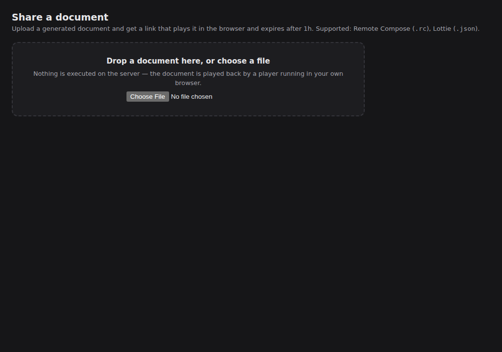

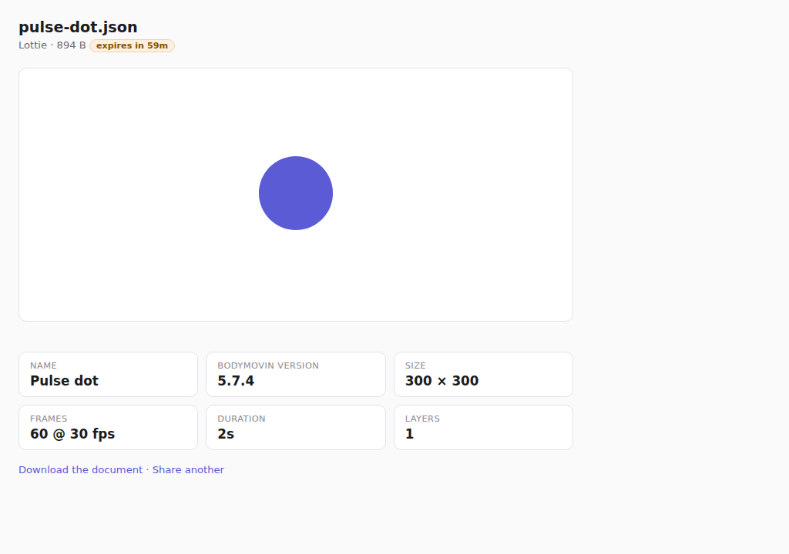

```bash
# Share a Lottie an agent just generated, then hand over the link.
curl -sS --data-binary @loading.json 'https://preview.coo.ee/docs?name=loading.json'
# {"schema":"compose-preview-serve/doc/v1","id":"0YFhq8Kb…","format":"Lottie","url":"/d/0YFhq8Kb…",
#  "expiresIn":"1h", …}
```

**Known formats** ([`ServeDocFormats`](../cli/src/main/kotlin/ee/schimke/composeai/cli/serve/ServeDocFormats.kt)) —
adding one is a registry entry plus its player bundle, not a new route:

| Format | Sniffed by | Played by | Player bundle |
|---|---|---|---|
| **Remote Compose** (`.rc`) | the `Header` op's `0x048C` magic | `RC.RcdPlayer` on a `<canvas>` | the same vendored player the preview viewer's canvas lane uses |
| **Lottie** (`.json`) | a Bodymovin object (`layers` + `fr`/`ip`/`op`) | `lottie-web` (SVG renderer) | vendored MIT build, `cli/src/main/resources/lottie-player/` |

Why this is safe to leave open on a public box, and where its limits are:

- **Data only, played in *your* browser.** The host stores bytes and serves them back; the player runs
  in the viewer's browser. Nothing about a document ever executes on the server — same tier as the
  Remote Compose / Lottie rows in the format table above.
- **Content-sniffed, not name-trusted.** An upload must *be* a known document. A zip, a script, an
  HTML page, or an `.rc`-named impostor is refused — so the lane can't be used as a general file drop
  or to serve attacker-chosen HTML from the host's origin. `?name=` is only ever a display label.
- **The link is the capability, and it expires.** The id is 128 bits of `SecureRandom`, the page is
  `Cache-Control: private, no-store`, and the document is dropped from memory once `--doc-ttl`
  (default 1 h) is up — after which both `/d/<id>` and `/d/<id>/raw` 404 without saying whether the id
  ever existed. Share the link with one person, and it goes away on its own.
- **Bounded.** Per-document (8 MB), count (64) and total-memory (64 MB) caps; an upload burst evicts
  the shares closest to expiry rather than growing the heap.
- **`?url=` is fail-closed.** A client-supplied URL is fetched only when its host is on
  `--accept-docs-from` (empty ⇒ uploads only) — the same SSRF gate `--accept-bundles-from` applies.

On the deployed image set `SERVE_ACCEPT_DOCS=1` (plus optional `SERVE_DOC_TTL`,
`SERVE_ACCEPT_DOCS_FROM`); it's off by default.

## Deploying `preview.coo.ee`

Both container profiles take this config from env (the entrypoint maps `SERVE_PUBLIC`,
`SERVE_CATALOGS_FILE`, `SERVE_ADMIN_TOKEN`, `SERVE_GITHUB_AUTH_*`, `SERVE_TRUST_STORE`,
`SERVE_WASM_DIR`, `SERVE_ACCEPT_BUNDLES`, `SERVE_ACCEPT_DOCS` / `SERVE_DOC_TTL` /
`SERVE_ACCEPT_DOCS_FROM` → flags) and put **Caddy** in front for TLS. They default to the **open
public profile** (`SERVE_PUBLIC=1`); set `SERVE_PUBLIC=0` + `SERVE_TOKEN` for a token-gated box.

### GitHub auth for live lanes

A public catalog can stay browseable while code-running surfaces require a GitHub session. Configure
a GitHub OAuth app with callback `/auth/github/callback`, then set the OAuth secrets:

```bash
SERVE_GITHUB_AUTH_CLIENT_ID=...
SERVE_GITHUB_AUTH_CLIENT_SECRET=...
SERVE_GITHUB_AUTH_COOKIE_SECRET=... # at least 32 chars
```

With those set, live preview WebSockets require a signed-in GitHub user. `/playground`,
`POST /api/<version>/compiler/run`, and `/pg/<token>` require a signed-in GitHub user that also has
access to `SERVE_GITHUB_AUTH_REPO` / `--github-auth-repo`, where what counts as access depends on
that repository's visibility:

- **Public repo** — `admin`, `maintain`, or `write`. Read is deliberately not enough, because GitHub
  reports `read` for *any* authenticated user on a public repository; a read-level gate there would
  admit every GitHub account to a surface that compiles and runs submitted Kotlin.
- **Private repo** — any permission other than `none`. On a private repo a `read` grant is a real
  decision somebody made, so read-only collaborators keep playground access.

If the repository's visibility can't be determined, the stricter (public) rule applies. The browser
cookie stores only a signed, expiring login plus the repo access verdict, and is marked `secure` whenever
the request arrives over HTTPS (which is why a reverse-proxied box should set
`SERVE_GITHUB_AUTH_CALLBACK_BASE_URL`). The OAuth token is not stored.

**The requested OAuth scope follows the gating repo's visibility**, so a visitor is asked to consent
to as little as the check actually needs:

| `SERVE_GITHUB_AUTH_REPO` | scope requested |
| --- | --- |
| public | `read:user` |
| private, or visibility unreadable | `read:user repo` |

`repo` is GitHub's *full control of private repositories* — read and write, across every private
repo the visitor can reach. On a public gating repo it buys nothing: the access check reads
`GET /repos/{owner}/{repo}`, which is available there to a token with no repository scope at all. A
private gating repo genuinely needs `repo`, because classic OAuth apps have no read-only repository
scope. Visibility is probed once, anonymously, at first sign-in; if that probe can't answer, the
wider scope is requested, since over-requesting inconveniences a visitor while under-requesting
would fail their sign-in. Set `SERVE_GITHUB_AUTH_SCOPE` / `--github-auth-scope` to override.
Reverse-proxied deployments should also set
`SERVE_GITHUB_AUTH_CALLBACK_BASE_URL=https://preview.example.com` so the OAuth callback URL is stable.
When `DOMAIN` is set, the prebuilt image derives
`SERVE_GITHUB_AUTH_CALLBACK_BASE_URL=https://$DOMAIN`. Empty `SERVE_GITHUB_AUTH_USERS` allows any
signed-in GitHub user to use live previews; playground still requires access to
`SERVE_GITHUB_AUTH_REPO`. Set `SERVE_GITHUB_AUTH_USERS=alice,bob` to narrow sign-in to named logins
for both surfaces. The allowlist only ever **restricts** — naming a login does not grant it
playground access, which always comes from the repo check above.

### The catalog set is config, not image content

**Which catalogs a box publishes lives in a `catalogs.json` outside the image**, on the mounted
`/config` volume (`SERVE_CATALOGS_FILE`, default `/config/catalogs.json`). Adding a catalog is an
operator edit — or one `POST /admin/catalogs` — never an image rebuild or a CLI release:

```json
{
  "groups": [
    { "id": "design-systems", "heading": "Design Systems", "noun": "design system(s)" },
    { "id": "android-samples", "heading": "android/compose-samples", "noun": "sample(s)" }
  ],
  "catalogs": [
    { "system": "compose-m3", "repo": "yschimke/compose-ai-tools", "group": "design-systems" },
    { "system": "jetnews", "repo": "yschimke/compose-samples", "group": "android-samples",
      "attributionRepos": ["android/compose-samples"] },
    { "system": "cadence", "repo": "yschimke/cadence", "listed": false }
  ]
}
```

Each entry names the catalog's delivery repo, whether it's on the front-page index (`listed: false`
serves it at `/<system>/` but keeps it off the front door — that's how `cadence` is published), and
the **front-page section** it appears under. Nothing in the server knows any particular catalog's id:
grouping is entirely this config, and a catalog that declares no group is sectioned by its source
repo's owner (`joreilly org`), with unattributed catalogs in `Other`.

A `group` is a **claim checked against provenance**. The section applies only when the fetched bytes
really came from the entry's `repo` (or one of its `attributionRepos` — which is how Android's
samples, fetched from preview branches in the `yschimke/compose-samples` fork, are still credited to
`android/compose-samples`). So serving a third-party catalog under the id `compose-m3` can't make it
read as an official design system.

### Image seed vs deployment config

Two different things, kept in two different places on purpose:

| | Lives in | Is |
|---|---|---|
| **Image seed** | [`deploy/image/catalogs.json`](../deploy/image/catalogs.json) + [`deploy/image/trust/producers.json`](../deploy/image/trust/producers.json) | Baked into the image; copied to `/config/…` on **first boot only**. What an operator adopting the prebuilt image starts with. |
| **Deployment config** | `deploy/<deployment>/catalogs.json` + `producers.json` (e.g. [`deploy/preview.coo.ee/`](../deploy/preview.coo.ee)) | One box's published set. Applied over the admin API when config changes on `main`, with image publishes as a fallback; never baked. |

The seed carries **`compose-m3` only**, plus the single producer that publishes it — enough that a
bare `docker compose up -d` shows something real, and nothing that presumes a relationship with any
other project. It used to carry preview.coo.ee's full 17-catalog set and nine trusted producers,
which meant every adopter's front page opened on someone else's apps and inherited trust in repos
they had nothing to do with. On a box running the default `SERVE_ALLOW_RENDER_TRUSTED=1` that second
part isn't cosmetic — trust is eligibility for server-side execution.

So: publishing a catalog on **your** server is editing your own `/config/catalogs.json`, POSTing to
`/admin/catalogs`, or bind-mounting your own file — never waiting on this repo. Running the same
CI-side reconcile for your own box is `DEPLOY_CONFIG_DIR` + `DEPLOY_BASE_URL` pointing at yours.

After first boot the operator's `/config` copy always wins and an image pull never touches it.

`SERVE_CATALOGS` / `SERVE_CATALOGS_UNLISTED` still work as **additions** (`<system>@<owner>/<repo>`,
comma-separated) for a box that wants one extra catalog without editing config; a system named in
both keeps its config entry. Re-running [`deploy/image/setup.sh`](../deploy/image/setup.sh) removes
the known legacy `SERVE_CATALOGS` override containing only `jetnews`, `jetchat`, and `jetlagged`, so
older `preview.coo.ee` deployments fall back to the config file cleanly.

### The admin API

Setting `SERVE_ADMIN_TOKEN` enables two admin surfaces on a **running** server: the catalog set and
the producer-trust store. Both are needed for either to be useful — publishing a catalog whose
producer isn't trusted just serves it as `unverified`.

#### Catalogs

Three routes for publishing catalogs:

| Route | Does |
|---|---|
| `GET /admin/catalogs` | the configured catalogs + each one's load state (`loaded` / `failed` / `pending` / `stale`) |
| `POST /admin/catalogs` | publish one catalog — the body is a `catalogs.json` entry |
| `DELETE /admin/catalogs/<system>` | retire a catalog: its session (and any live daemon) is dropped |

```
curl -H "X-Compose-Preview-Admin-Token: $SERVE_ADMIN_TOKEN" \
     -d '{"system":"cadence","repo":"yschimke/cadence","listed":false}' \
     https://preview.coo.ee/admin/catalogs
```

Each mutation is applied live **and** written back to `catalogs.json`, so it survives a restart; the
response carries a `warning` when the config file couldn't be written (the catalog is still serving,
it just won't come back). A registration fetches the branch **before** it's persisted, so a typo'd
repo fails with `502` rather than leaving an unservable entry for every future boot to retry;
malformed entries are `400` and re-publishing a served catalog is `409`.

#### Front-page groups

| Route | Does |
|---|---|
| `GET /admin/groups` | the sections a catalog entry may claim |
| `POST /admin/groups` | define a section, or restyle one that exists — `{"id","heading","noun"}` |
| `DELETE /admin/groups/<id>` | delete it; its catalogs fall back to their owner heading |

Defining a section also **re-resolves the claims of catalogs already registered**. That matters
because a catalog's placement is resolved once, at registration, into a snapshot — so without this,
defining a section after its catalogs were published would collect nothing, and the cards would sit
under the owner fallback until a restart.

For the same reason `POST /admin/catalogs` on an id that's already published **converges its
listing** rather than refusing: re-posting an entry whose `group` or `listed` has changed updates it
in place, with no re-fetch and no dropped load state. Re-posting an *unchanged* entry is still `409`,
so a duplicate stays visible, and a changed `repo` is still refused — that decides what bytes get
served, so re-pointing a catalog is a retire plus a publish.

Groups were the last part of the catalog config with no runtime path: a section could only be added
by editing the box's `catalogs.json` and restarting, and a catalog claiming an undefined one was
rejected outright — which meant a committed config genuinely could not converge. It can now.

#### Trusted producers

The trust store is config too, on the same volume (`/config/producers.json`). Without this, runtime
catalog registration was only half a feature: you could publish a catalog in one HTTP call, but
trusting its producer meant a code change, a release, an image publish and a roll — so the new
catalog badged `unverified` until the image caught up.

| Route | Does |
|---|---|
| `GET /admin/trust` | the trusted branches, pinned key ids, and CI identities |
| `POST /admin/trust` | trust one producer — `{"kind":"branch"\|"key"\|"oidc", …}` |
| `DELETE /admin/trust?kind=…` | stop trusting one — selectors ride the query string |

```
# trust a repo's delivery branches, then publish a catalog from one
curl -H "X-Compose-Preview-Admin-Token: $SERVE_ADMIN_TOKEN" \
     -d '{"kind":"branch","repo":"yschimke/horologist","branch":"design-artifacts/*"}' \
     https://preview.coo.ee/admin/trust

curl -H "X-Compose-Preview-Admin-Token: $SERVE_ADMIN_TOKEN" \
     -d '{"system":"horologist","repo":"yschimke/horologist","listed":true}' \
     https://preview.coo.ee/admin/catalogs

# ...and to retire the producer again (the slash in owner/repo is why this is a query param)
curl -X DELETE -H "X-Compose-Preview-Admin-Token: $SERVE_ADMIN_TOKEN" \
     'https://preview.coo.ee/admin/trust?kind=branch&repo=yschimke%2Fhorologist&branch=design-artifacts%2F*'
```

Changes take effect on the **next** verification — the next catalog fetch or branch refresh — with
no restart, and are written back to `producers.json` the same way catalog changes are written back to
`catalogs.json` (same `warning` field when the write fails). `GET` lists pinned keys by id and name
only; key material is never echoed back. Re-adding a producer is `409`, a malformed entry is `400`,
and a repo pattern that matches every repository is refused outright.

Editing `producers.json` directly works the same way: the file is re-read on each verification, so a
hand-edit needs no admin call and no restart. A malformed or truncated edit is ignored with a log
line and the last good allowlist stays in force — failing closed there would un-trust every catalog
on the box over a half-saved write. Conversely an admin mutation **refuses** to run against a file
that exists but won't parse (`400`), rather than overwriting it with cached state plus the edit.

**Revoking trust revokes it now.** A successful removal retires every catalog whose branch the
reduced store no longer trusts: the session is unregistered (which tears down any live daemon started
under the old verdict) and its branch head forgotten, so the next refresh pass re-fetches and
re-verifies it instead of short-circuiting on an unchanged SHA. Without that, a revoked producer
would keep serving as `Trusted` until its branch happened to move.

> **The admin token can grant code execution.** On a box with `SERVE_ALLOW_RENDER_TRUSTED` on (the
> default), trust is not only a badge — it gates server-side re-render, so trusting a branch makes
> that producer's Compose eligible to be built and executed on your box. Treat `SERVE_ADMIN_TOKEN`
> like a deploy key, not a read token, and keep `SERVE_ALLOW_RENDER_TRUSTED=0` on any box where you
> don't want that.

The admin token is **separate from the browse token** on purpose — a `--public` box hands the browse
URL to every visitor — and neither surface is registered at all when it's unset, so a server that
never opted in has no admin surface to find. A bad token gets the same `404` the browse gate uses.

#### Where the trust store lives

The prebuilt `deploy/image` bakes a seed branch-trust store at `/trust/producers.json` trusting
`design-artifacts/*` on **`yschimke/compose-ai-tools` and nothing else** — the one producer needed by
`compose-m3`, the only catalog in the matching seed. Adopting the image deliberately does not hand you
trust in anyone else's repos. On first boot the entrypoint copies it to `/config/producers.json` on
the `preview_config` volume and points `SERVE_TRUST_STORE` there; it is never overwritten again, so an
operator edit — or a `POST /admin/trust` — survives every subsequent image roll.

Set `SERVE_TRUST_STORE` to your own path to pin different producers, or `none` to run trustless.
(Empty falls back to the default — use `none` to opt out — which also means a bare image pull
self-heals a box without editing its compose.) If `/config` isn't writable the entrypoint falls back
to serving the baked store read-only, and admin trust writes report themselves unpersisted.

Seeding applies **only** to the default path. If you name your own `SERVE_TRUST_STORE` and the file
isn't there — a typo, an unmounted secret, a broken deploy — the entrypoint does *not* substitute the
image's allowlist; with server-side re-render on, that would execute producers you never configured.
An explicit override has to exist, and a missing one keeps the old hard failure.

The catalog set works identically — see "Image seed vs deployment config" above. The `deploy/vps`
from-source path mounts [`deploy/preview.coo.ee/`](../deploy/preview.coo.ee)'s pair read-only rather
than the image seed, because that box runs *that deployment's* set; an adopter mounts their own.

| | [`deploy/vps`](../deploy/vps) (from source) | [`deploy/image`](../deploy/image) (prebuilt) |
|---|---|---|
| CLI | compiled from this checkout (~8 min build) | the **released** tarball (`docker pull`, no build) + Watchtower auto-update |
| Has the latest serve features? | **immediately** (built from `main`) | only once they're in a **published CLI release** (bump `CP_VERSION`) |
| In-browser Wasm tier | local build, `SERVE_WASM_DIR=compose-m3=samples/cmp-wasm-catalog/build/wasmDist` | branch-fetch: `--catalogs` pulls each system's `web/wasm/` from the trusted branch (needs the branch to carry it) |
| Picks up a regenerated `design-artifacts/<system>` branch | via the same auto-refresh (rebuild + re-run) | **auto**: the server re-checks each catalog branch head every `SERVE_CATALOG_REFRESH`s (default 600) and re-fetches on change — **no restart**. Watchtower only rolls the *image*; this keeps the *catalog content* current. Set `SERVE_CATALOG_REFRESH=0` to disable. |

`preview.coo.ee` **runs the prebuilt [`deploy/image`](../deploy/image)** — a `docker pull` of the
released `compose-preview-host` image on an **8 GB host**, no build. The **whole deploy chain is
automatic**: cutting a CLI release starts the host image build immediately from the release tag
(release-please invokes
[`preview-host-image.yml`](../.github/workflows/preview-host-image.yml) via `workflow_call`, in
parallel with the core release, tagging that version **and** `:latest`), and the box's zero-downtime
**`rollout`** service rolls the
`preview` container onto the new image (`caddy` is rolled separately by **Watchtower**) — no manual
step.

The roll happens two ways, whichever fires first: the publish workflow's **final step POSTs a
token-gated `/__hooks/rollout` webhook** so the box rolls the *instant* the image lands, and the
`rollout` service **also polls** GHCR every `ROLLOUT_INTERVAL`s (default 1200) as a fallback so a
missed webhook still self-heals. The webhook is fired from the **image-publish step, not a `release:
published` event** — on purpose: at image-publish time the GHCR image is fully self-contained (baked
CLI + plugin jars + warm caches + Android daemon), so the box needs **only GHCR** to roll and no
Maven-Central propagation can race it (the image workflow builds and seeds its local `m2` directly
from the release tag). A release-event webhook would fire *before* the image is
built and roll onto the *old* image. It's gated by a `DEPLOY_HOOK_TOKEN` (fail-closed if unset) and
can only trigger a rollout *check* of the already-configured tag — see
[`deploy/image` README → Instant roll on publish](../deploy/image/README.md#instant-roll-on-publish-webhook--skips-the-poll-wait).

> **Why the *Publish preview-host image* Actions list can look stale.** Because that publish runs as
> a **reusable-workflow call** from the release job, its runs appear *inside the release-please run*,
> **not** as standalone *Publish preview-host image* runs — so that workflow's run list shows only the
> occasional manual `workflow_dispatch`, and can read as "hasn't built since <months ago>" even though
> **every release rebuilds the image**. To confirm which build is deployed, check the release-please
> run, the GHCR `:latest` digest, or [`GET /version`](#endpoints) — not the preview-host-image run list.

The two delivery paths move on **different clocks**: a **daemon/CLI change** reaches the box when it
rolls onto a new release image (now near-instant via the publish webhook, else within one `rollout`
poll), while a **`design-artifacts` regen** reaches it a different way — the server **auto-refreshes
the catalog branches** in between image rolls (re-checks each
`design-artifacts/<system>` head every `SERVE_CATALOG_REFRESH`s, default 600, and re-fetches on
change, no restart). So a catalog repack needs no image roll, but a change to how the daemon *renders*
(or *loads resources*) does. This is the canonical public deployment. The image bakes the
Android/Robolectric daemon + a minimal Android SDK, so it serves the Android **Wear** catalog
(`wear-m3`) live server-side (see the live-lane note below).

The from-source [`deploy/vps`](../deploy/vps) path (`cd deploy/vps && DOMAIN=preview.coo.ee
./setup.sh`) is the **alternative** for when you need a serve feature *before* it ships in a CLI
release: it builds the current `main`, including the Wasm app, and comes up public. But a from-source
box is **desktop-only** (no Android SDK), so it falls back to baked PNGs for the Android catalogs —
use the prebuilt image for live Wear.
- **Re-render of trusted Compose** stays off unless the operator opts in; a public box should leave
  `--revisions` *off* (that path runs arbitrary Gradle = RCE).

## Trusted server-side re-render (`--allow-render-trusted`)

By default a catalog serves **baked PNGs** — the viewer's device/orientation/etc. controls can't
re-render a static image (they're disabled, with the in-browser Wasm tier carrying theme/font-scale/
locale for CMP). For **full-fidelity** server-side overrides, a **`Trusted`** catalog can be served
by a live, daemon-backed session (`--allow-render-trusted`), so every control re-renders for real.
There are two ways to stand that daemon up, both fail-closed on the `Trusted` verdict (an
`Unverified`/spoofed catalog never reaches either — no RCE lever):

1. **From a carried executable bundle (`liveBundle`) — no build (preferred, and now the default).**
   The design-artifacts pipeline publishes the executable preview bundle (minimized module classes +
   `previews.json` + classpath manifest) onto the branch under `bundle/` and records a `liveBundle`
   in `catalog.json`. `serve` fetches that bundle like it fetches the Wasm app, resolves its
   classpath from the local Maven/Gradle caches (or Central + Google Maven), and launches the render
   daemon **straight from it** — no repo checkout, no Gradle build, no per-request compile. This is
   what the public server uses for `compose-m3`. A module that pulls deps from a repo **beyond
   Central + Google** (e.g. `meshcore-mobile`'s `jitpack.io` deps like `usb-serial-for-android`)
   needs those repos supplied via `--extra-maven-repos <url>[,<url>…]` (env `SERVE_EXTRA_MAVEN_REPOS`;
   the prebuilt image defaults it to the repos its baked catalogs need — `https://jitpack.io`
   (meshcore-mobile), the Apollo snapshots repo (Confetti) and `https://a8c-libs.s3.amazonaws.com/android`
   (Pocket Casts' `com.automattic:eventhorizon`); `none` to disable) — otherwise the
   resolver skips those coordinates and the daemon can't build its classpath, so the catalog falls
   back to baked PNGs (`livebundle-unavailable`), or — when the missing class is only linked at
   render time rather than at daemon bootstrap — every render fails with `NoClassDefFoundError`
   while the daemon itself stays up. Only list repos you trust; the server fetches
   artifacts from them when resolving a trusted catalog's live bundle. Both backends are supported
   ([`ServeBundleDaemon.materialize`](../cli/src/main/kotlin/ee/schimke/composeai/cli/serve/ServeBundleDaemon.kt)):
   a **desktop** bundle spawns the Skiko desktop daemon, and an **android** bundle spawns the
   Robolectric daemon **on a box that carries the Android sidecar + SDK** — the prebuilt `deploy/image`
   does, which is what lets `wear-m3` render live server-side (the viewer additionally needs the
   catalog's `previewId` sticker mapping — see the live-lane note below). A bundle whose backend is
   neither, or an `android` bundle on a box that lacks the Android runtime (e.g. the desktop-only
   from-source `deploy/vps`), falls through to (2) or baked PNGs.

2. **From source (`source: { repo, ref, module }`) — Gradle build fallback.** For a catalog that
   declares a buildable `source` but no `liveBundle`. This runs the source's Gradle (code execution),
   so it's gated additionally by the `--revisions-allow` ref allowlist and a `source.repo` ==
   server-repo check, and the box must have a checkout to worktree from — on the prebuilt image, set
   `SERVE_CATALOG_SOURCE_REPO` so the entrypoint clones one and passes `--catalog-source-root`, which
   pays a **one-time cold Gradle build at startup**. Not needed for the published catalogs; the
   bundle path (1) covers them with no build.

Because path (1) is cheap and safe, both public profiles turn it **on by default**: `deploy/vps`
(from source) and the prebuilt `deploy/image` (`preview.coo.ee`) both default
`SERVE_ALLOW_RENDER_TRUSTED=1` and auto-size the live-seat budget from the box's memory — a bare
image pull "just works" with live CMP, no clone and no build. Set `SERVE_ALLOW_RENDER_TRUSTED=0` to
opt out (the Wasm tier still carries CMP). The other published catalogs (`wear-m3`, `remote-m3`) are
**Android** — no desktop-runnable bundle — so their live lane runs a heavier Robolectric daemon
(2 live-seat permits) instead of the desktop one. The prebuilt `deploy/image` (**what `preview.coo.ee`
runs**) bakes that Robolectric Android daemon + a minimal Android SDK, so `wear-m3` and `remote-m3`
— which publish Android `liveBundle`s — can be rendered live and per-variant there. `remote-m3` is
fully IR-backed: its bundle carries `ir/*.rc` documents instead of preview classes, and the daemon
replays those documents directly. A box **without** the Android runtime — the desktop-only
from-source `deploy/vps` — instead falls back to baked PNGs for these catalogs, fail-closed: no
error, just no daemon tier; browser-side JS and installed CMP JVM Remote Compose players remain
available from the carried documents.

> **The live lane also needs a `previewId` sticker→daemon mapping — and, for Android, the app's
> resource table.** The viewer only exposes live/override controls for a preview whose baked sticker
> is mapped to its daemon twin — the `previewId` field the exporter records on each `catalog.json`
> image, from which `ServeCatalogStore` builds the daemon `alias` (`canRenderOverridesFor`). For an
> **Android** catalog there is a second requirement: the packed bundle must **carry the app's compiled
> resource table** (`resources.arsc` / `apk-for-local-test.ap_` under `android/`) *and* the daemon
> must load it onto the render classpath, or a classic `stringResource(R.string.…)` render throws
> `Resources$NotFoundException` and the whole preview fails.
>
> Both requirements have **landed for `wear-m3`**: `previewId` for un-themed state-variant catalogs
> (#2492), and the Android app-resource carriage + daemon-load (#2498) — with a missing-resource
> **placeholder fallback** (#2499, renders an obvious `⟦res 0x7f…⟧` / magenta marker rather than
> crashing) as a safety net — shipped in **0.16.50**. So `wear-m3` renders live and per-variant once
> the box has **rolled the 0.16.50 image** (Watchtower) **and** re-fetched the `design-artifacts/wear-m3`
> bundle regenerated to carry the `android/` resources (catalog auto-refresh). `compose-m3` carried
> `previewId` already. `remote-m3` also carries the mapping, but its daemon ids resolve through the
> bundle's IR replay manifest rather than `classes/app.jar`.

> **Font parity with the baked PNG.** A live daemon must resolve fonts the same way the render that
> baked the PNG did, or the same preview shows two typefaces depending on which lane you're viewing.
> Two things make that hold, both needed: the daemon seeds the Pixel system-font aliases
> (`PixelSystemFontAliases`, so `Font(DeviceFontFamilyName("roboto-flex"))` — Wear Material3's type
> scale — resolves to Roboto Flex rather than silently falling back to Roboto), and the host has
> those faces available. The prebuilt `deploy/image` bakes them into the image so neither depends on
> runtime egress to `fonts.googleapis.com` (see [deploy/image/README.md](../deploy/image/README.md)
> § *Fonts*). On a host that has neither the baked cache nor egress, the daemon logs the unseeded
> slugs once per process and renders those families in Roboto — non-fatal, but visibly different from
> the PNG.

### When an override can't be applied, the render is refused — not quietly baked

Every fallback above (`livebundle-unavailable`, an untrusted catalog, a missing Android runtime, an
unmapped sticker, no free live seat, a daemon that is simply down) leaves `serve` holding baked
pixels for a request that asked for something else. Those pixels are **byte-identical to the
un-overridden snapshot**, so a `200 image/png` there is a wrong answer delivered confidently: a diff
bot, a parity check, or an agent iterating on a theme reads "no visual difference" and concludes the
override had no effect on the UI, when in fact it was never rendered ([#3449]).

So the render refuses instead, and every override kind agrees — `fontScale`, `uiMode`,
`themeProvider`, `device`, `knob.<key>`, `rc.<name>` — as does every lane that can answer with
published bytes: the raster `GET /render/{id}.png`, the vector `GET /render/{id}.svg` (a
`figma/<slug>.svg` off the delivery branch was exported at the preview's discovery-time axes, so it
drops an override exactly as thoroughly), and the Storybook isolation pages `GET /iframe.html?id=…`
(a story's args ride the same params, and PNG-diffing visual tools are precisely the caller this is
for):

| state | response |
|---|---|
| no override, or one the baked variant already satisfies (`uiMode=light` on a `…__light` id, `background=default`) | `200`, `X-Compose-Preview-Generation: baked` |
| the override was applied | `200`, `X-Compose-Preview-Generation: daemon` (or `daemon-cache` / `catalog-cache`) |
| the preview **has** a live lane, but it can't serve right now (daemon down/cold, no free seat) | `503` + `Retry-After: 2` |
| the preview has **no** live lane at all (static or untrusted catalog, unmapped variant) | `409` — retrying can't help |
| `&fallback=baked` on the request | `200` + `X-Compose-Preview-Render: baked-fallback` |

All four override-carrying responses carry **`X-Compose-Preview-Dropped-Overrides`** — a
comma-separated list of exactly the params the returned bytes do not reflect (`fontScale,uiMode`,
`knob.label`, …), so even a `curl -I` can tell. An unrecognised param is not an override and is
still ignored silently (a cache-buster must not 409 a page).

`&fallback=baked` is the opt-in for callers that would rather show the published snapshot than
nothing — but it is marked unmissably in the headers, because the bytes themselves carry no signal.
A malformed override value is still a `400` at parse time, as before; this is about *valid* ones.

Not affected: `?scroll=long` (the full-page raster/vector export is daemon-only, so it 404s rather
than falling back), and the `.rc` document lane (the browser player applies `rc.<name>` seeds
client-side, so nothing is dropped server-side).

[#3449]: https://github.com/yschimke/compose-ai-tools/issues/3449

### Bounding the live tier — `--live-seats` / `SERVE_LIVE_SEATS`

Each live (daemon-backed) stream holds a JVM Compose render session, so on a constrained box a burst
of viewers could exhaust memory. `--live-seats <n>` (env `SERVE_LIVE_SEATS`) is a **permit budget**,
not a flat count: each live session charges permits by backend weight — a desktop CMP daemon costs
**1**, a heavier Robolectric **Android** daemon costs **2** — so one heavy `wear-m3` catalog can't
hog a single seat and starve the cheap `compose-m3` CMP lanes. A session that can't get its permits
is refused with WebSocket close `1013` (*Try Again Later*) instead of spawning a daemon that risks
the OOM killer; `0` is unbounded, and snapshot + Wasm sessions never consume a permit.

**Auto-sizing.** When `SERVE_LIVE_SEATS` is unset, the prebuilt image derives the budget from the
container's memory (reserve ~1 GB for the host + OS, ~1.2 GB per permit, clamped to **[2, 8]**), so a
bigger box scales up on its own with no compose edit: an 8 GB box gets **5** permits, a 4 GB box gets
**2** (two concurrent CMP sessions, or one Android). `preview.coo.ee` runs on an **8 GB host**, so it
derives **5** permits — enough for the heavier Wear/Android daemon (2 permits) plus concurrent CMP
lanes. The `preview` container is **unbounded by default** (`mem_limit: ${PREVIEW_MEM_LIMIT:-0}`), so
it uses the box's full RAM and the entrypoint
falls back to physical RAM when there's no cgroup cap — redeploy onto a larger dedicated box and it
scales automatically. Admission control (the live-seat budget + the per-render concurrency limiter)
is the memory guard, rather than a hard cgroup kill. On a **shared** host, set `PREVIEW_MEM_LIMIT` in
`.env` (e.g. `PREVIEW_MEM_LIMIT=4g`) to cap the container — which also lowers the derived seat budget
to match. Set `SERVE_LIVE_SEATS` explicitly to override the budget directly, or `0` for unbounded.

## Endpoints

`GET /` — with `--catalogs`, the **systems index** (a "Design systems" section listing the listed
catalogs, one card each; the `--catalogs-unlisted` app catalogs are served at `/<system>/` but not
indexed here); otherwise the served module's preview grid · `GET /p/{id}?session=<s>` viewer ·
`GET /render/{id}.png` PNG ·
`GET /api/previews` JSON (now includes `trust`) · `POST /bundles/{name}` upload (returns `trust`) ·
`GET /docs` document drop zone · `POST /docs` document ingest (returns an expiring `/d/<id>`) ·
`GET /d/{id}` document permalink · `GET /d/{id}/raw` document bytes ·
`GET /doc-player/{format}/bundle.js` the format's browser player (ungated static asset) ·
`GET /wasm/{system}/…` in-browser CMP app (ungated static assets) · `GET /status` server status
(HTML, or JSON with `?format=json`) · `GET /status.json` server status JSON · `GET /healthz`
liveness · `GET /readyz` readiness (green only once a preview actually renders — the docker-rollout
gate) · `GET /version`. In `--public` mode all are open **and links carry no `?token`** (the token
gates nothing); otherwise the token gates everything but `/healthz`, `/readyz`, `/version`, and
`/wasm/` (static, no
session data) and is threaded through every generated link. `/status` is gated like the API routes
(open in `--public`, else token-required) — its running-daemon + config detail is more sensitive
than the bare `/version`/`/healthz`, so a private box keeps it behind the token.

`GET /status` is the operator/observer view of a running host: the catalogs it publishes (with their
trust verdict, preview count, and whether each is served live or as baked PNGs), the render daemons
up **right now** (backend, active streams, how long each has been up), the effective configuration
(access mode, trusted re-render, live-seat budget, catalog-refresh interval, …), and a bounded log of
**recent daemon startup failures** (the render/live daemon a session tried to open but couldn't — the
reason that was previously only logged to stderr). The status snapshot never wakes an idle daemon: a
catalog's liveness is read from the resident-session snapshot, not by resuming it, so a monitor can
poll it freely.


`GET /status.json` (equivalently `GET /status?format=json`) is the machine-readable
form — a stable schema built for a monitor or a **Home Assistant** REST sensor:

```json
{ "schema": "compose-preview-serve/status/v1", "version": "0.16.5", "public": true,
  "status": "ok", "uptimeSeconds": 3600,
  "catalogs": { "total": 5, "listed": 4, "unlisted": 1, "trusted": 4, "degraded": 1 },
  "daemons": { "known": 6, "running": 1, "activeStreams": 0,
    "liveSeatsTotal": 5, "liveSeatsAvailable": 5, "liveSeatsUnbounded": false },
  "config": { "host": "0.0.0.0", "port": 8080, "allowRenderTrusted": true, "trustStore": true,
    "acceptBundles": false, "catalogRefreshSeconds": 600, "maxConcurrentRenders": 4, "liveSeats": 5 },
  "catalogList": [ { "id": "compose-m3", "listed": true, "trust": "branch:…", "previews": 42,
    "live": true, "running": false, "metaStale": false, "path": "/compose-m3/" } ],
  "runningServers": [ { "id": "wear-m3", "label": "wear-m3", "backend": "android", "seatWeight": 2,
    "activeStreams": 0, "uptimeSeconds": 120,
    "renderStats": { "renders": 12, "ok": 11, "failed": 1, "timedOut": 1, "busy": 0,
      "cacheHits": 34, "coldRenders": 1, "firstRenderMs": 31000,
      "minMs": 1400, "maxMs": 31000, "avgMs": 4100, "lastMs": 1900,
      "p50Ms": 1900, "p95Ms": 6200, "windowSize": 11 } } ],
  "recentDaemonFailures": [],
  "renderStats": { "renders": 12, "ok": 11, "failed": 1, "…": "server-wide roll-up" } }
```

A catalog row carries `metaStale: true` when its `trust` / `title` / `previews` / provenance are the
**last-known snapshot** taken while the catalog was resident rather than a live read — its daemon is
idle, and `/status` never resumes one just to answer a poll. Those facts come from the delivery
branch, not the daemon, so a suspension doesn't invalidate them and the catalog still counts toward
`catalogs.trusted`; the HTML page marks such a row "last known" under its trust badge. A **null**
`trust` means genuinely unknown (a non-catalog session, or one never yet resident) — it never means
untrusted, which the verdict string `unverified` is what says.

Each running daemon carries `renderStats` — serve-side render-latency counters (cold vs warm
counts, the first-render latency, recent p50/p95 over the last 128 renders, cache hits, busy
backoffs, timeouts) — and the top-level `renderStats` is the roll-up across daemons
(`firstRenderMs` there is the *worst* first render, the cold-start headline the
background-sandbox-boot work drives down). Both are additive on `status/v1` and null/absent until
something has rendered.

### Render circuit breaker

`renderStats` also carries `shortCircuited` and — only while a lane is broken — a `breaker` object:

```json
"renderStats": { "renders": 196, "ok": 196, "failed": 21, "shortCircuited": 3773,
  "breaker": { "open": true, "fatal": true,
    "reason": "render lane disabled after a non-recoverable UnsatisfiedLinkError — retrying cannot help. …",
    "openedAtEpochMillis": 1754582400000, "failureRate": 1.0, "sampleCount": 50,
    "shortCircuitedRenders": 3773 } }
```

A daemon that fails a render **fatally** — an `UnsatisfiedLinkError`, `NoClassDefFoundError`,
`NoSuchMethodError` or any other linkage/classpath fault — cannot succeed on retry, ever, for any
input, so the host stops asking after the first occurrence (`fatal: true`, no cooldown; it takes a
republished bundle or a restart to clear). Any *other* sustained run of failures — 90% of the last
50 renders — trips the same breaker without being classified (`fatal: false`); that one probes with
a single render a minute and closes itself as soon as one succeeds.

While the breaker is open the host:

- answers `/render` with the **underlying failure reason** as a terminal `409`, not
  `503 render busy; retry shortly` (the daemon isn't busy, and retrying will never help);
- reports `live: false` for the catalog and publishes a `render-lane-broken` `degradation`, instead
  of advertising a healthy live lane at a 95% failure rate;
- **pauses background theme optimization** for that catalog — it is the largest consumer of the
  render gate and pure waste while every render fails. A presence heartbeat re-enters the pass, so
  it resumes by itself if the breaker closes.

`shortCircuited` counts the renders refused this way. It is deliberately *not* folded into `failed`
— the daemon was never asked, so counting it there would inflate the failure rate that tripped the
breaker and hide how much work the breaker is saving.

A Home Assistant REST sensor reads the top-level `status` (`ok`/`degraded`) as its state and lifts
the grouped counts + arrays as attributes, e.g.:

```yaml
sensor:
  - platform: rest
    name: Preview server
    resource: https://preview.coo.ee/status.json
    value_template: "{{ value_json.status }}"
    json_attributes: [version, uptimeSeconds, catalogs, daemons, recentDaemonFailures]
```

Every session-selecting route also has a **path form** where the leading `/{system}` segment picks
the session instead of `?session=`: `GET /{system}/` index · `GET /{system}/p/{id}` viewer ·
`GET /{system}/render/{id}.png` PNG · `GET /{system}/api/previews` JSON · `GET /{system}/bundle.zip`
· `WS /{system}/ws/{id}` stream. This is the canonical public URL for a published catalog
(`/compose-m3/`, `/meshcore-mobile/`, …); the `?session=` form stays for back-compat. The constant
routes (`/healthz`, `/readyz`, `/version`, `/status`, `/status.json`, `/bundle.zip`, `/wasm/…`) outrank the
`/{system}` catch-all, so an unknown single segment just 404s like a bad session.

`GET /version` is the host's machine-readable identity — ungated so a deployer, Watchtower check, or
the design-artifacts gallery can confirm which build is live without a token:

```json
{ "schema": "compose-preview-serve/version/v1", "version": "0.16.5",
  "serveSchema": "compose-preview-serve/v1", "public": true }
```

### Storybook-compatible surface

The serve host also speaks the two tiny contracts the downstream Storybook ecosystem is built on, so
PNG-diff visual tools (BackstopJS, storycap/reg-suit, jest-image-snapshot, the `@storybook/test-runner`
in remote-URL mode) can crawl a compose-preview `serve` with **no compose-specific code**:

- `GET /index.json` — the [Storybook stories index](https://storybook.js.org/docs/api/main-config/main-config-indexers):
  `{ "v": 5, "entries": { "<storyId>": { "id", "title", "name", "importPath", "type": "story", "tags" } } }`.
  Each `@Preview` is one `'story'` entry; the `storyId` is minted CSF-style (`sanitize(title)--sanitize(name)`)
  and `importPath` carries the native preview id (`virtual:compose-preview/<fqn>`).
- `GET /iframe.html?id=<storyId>` — renders that one story in isolation as a chrome-free HTML page
  embedding the freshly-rendered PNG (a `data:` URI on a white ground), which is exactly what a
  screenshot tool captures. Accepts the same override query params as `/render` (e.g. `&uiMode=dark`),
  and also accepts a raw native preview id as `id=` for hand-authored deep links.
  - `&format=svg` serves the figma-svg export as an **inert ``**
    instead of the raster PNG. That's a still-**vector**, resolution-independent render, so the
    **DOM-capture** visual tools (Percy, Chromatic, Applitools) — which serialize the page and
    re-render it in their own cloud browsers — get faithful vector output, not a fixed-resolution
    bitmap. It's an `` (not inline `<svg>`) on purpose: a serve host can return an *unverified*
    catalog's repo-controlled SVG, and SVG referenced through `` is processed in the browser's
    restricted, non-scripting mode — so untrusted bytes can't execute, here or in the downstream
    tool's browser. SVG is produced by a daemon-backed session only, so a static bundle 404s this
    lane (like `/render.svg`).

Both come in the `?session=` and path (`/{system}/index.json`, `/{system}/iframe.html`) forms like the
rest, and follow the same token gate: open in `--public` mode, otherwise `?token=` is required (pass it
through your visual tool's URL, or run the server `--public` on a trusted network). Which tools fit:
**pixel-diff** tools (BackstopJS, storycap/reg-suit, jest-image-snapshot) consume the default PNG page;
**DOM-capture** tools (Percy, Chromatic, Applitools) consume `&format=svg` — a Compose render has no
HTML DOM of its own, but the vector export gives those tools a browser-native DOM to re-render.
