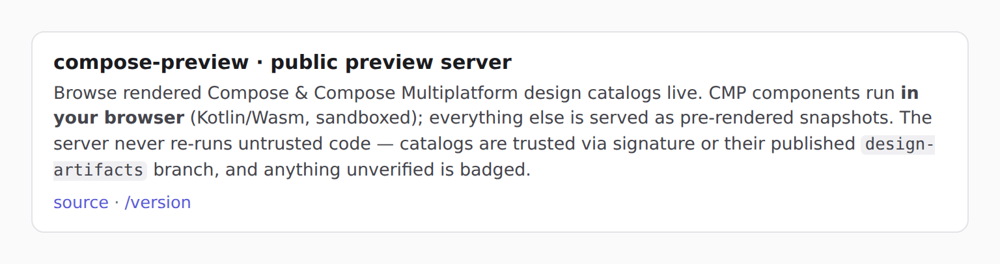
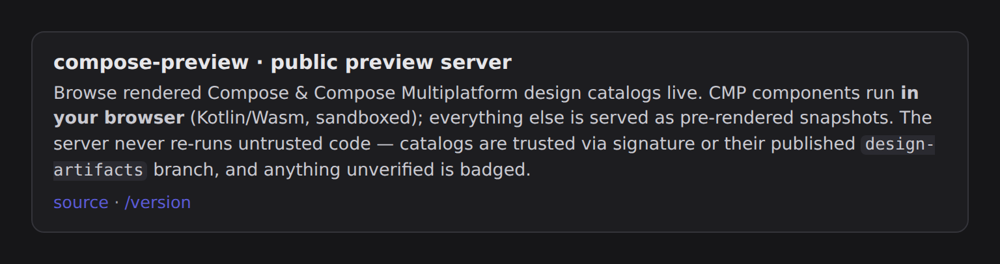
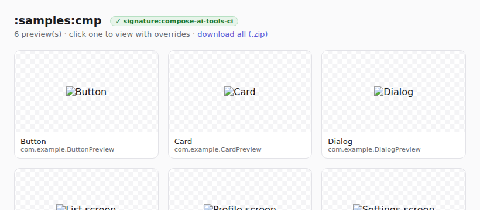
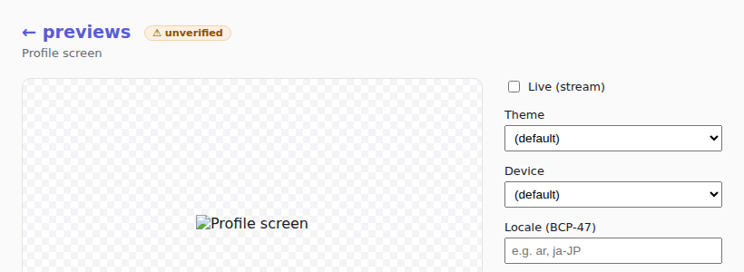

# The public preview server

`compose-preview serve` can run as a **public** preview server (the deployment behind
`preview.coo.ee`) with two things to show:

1. **Uploaded bundles** — anyone can `POST /bundles/<name>` a portable bundle (or point at one with
   `?url=`) and get a shareable `?session=<name>` link. The server shows the bundle's **data tiers**
   (baked PNGs, Remote Compose / Protolayout / Lottie IR) for any uploader, and reports a **trust
   verdict** so you can tell a bundle from a producer you trust from an anonymous one.
2. **The design systems we publish** — `--catalogs compose-m3,wear-m3,remote-m3` fetches each
   published `design-artifacts/<system>` catalog and serves it read-only at its canonical path
   `/<system>/` (the legacy `?session=<system>` form still works). Browsing that branch and opening a
   live, customisable render are then two ends of one workflow (the branch's README + `catalog.json`
   carry `livePreview` deep links back here).

   When a server publishes catalogs, its **front door (`/`) is an index of those design systems** —
   one card per listed system carrying a meaningful hero preview, the system's title + library, its
   trust badge, and a link to `/<system>/`. (A plain `serve` with no `--catalogs` still shows the
   served module's own preview grid at `/`.) This replaces showing an arbitrary default module at the
   root — the point of the public server is the catalogs, so the landing leads with them.

   A catalog entry may name a **per-system source repo** as `<system>@<owner>/<repo>`, so one server
   can serve systems published to *different* repos — e.g. `compose-m3,wear-m3` from this repo
   alongside `--catalogs-unlisted meshcore-mobile@yschimke/meshcore-mobile` from the app's own repo.
   `--catalogs-unlisted` serves a system exactly like `--catalogs` but keeps it **off the front-page
   "Design systems" nav** — reachable at `/<system>/` (and `?session=`) but not advertised on the
   landing page. Every catalog's branch (whatever repo) must be in the `--trust-store` to badge
   `Trusted(Branch)`; otherwise it serves `Unverified` (the data tiers serve either way).

In `--public` mode the landing page opens with a short **"about" intro** explaining what the host is
and its safety model, with a link to the machine-readable [`/version`](#endpoints):





## Two axes: trust × format

These are orthogonal. **Trust** decides attribution; **format** decides what draws the pixels. Neither
ever lets untrusted code run *on the server*.

### Trust

A bundle/catalog is `Trusted(by …)` or `Unverified`. Trust gates only **server-side re-render** of a
bundle's *executable* Compose; the data tiers serve regardless. Three bases (`--trust-store
trust/producers.json`):

| Basis | How | Strength |
|---|---|---|
| **Signature** | An Ed25519 `signatures.json` signed by a key in the store's `keys` (`bundle sign`). | Strongest — cryptographic, offline. |
| **Branch** | The server fetched the catalog from a branch in the store's `branches` (e.g. `design-artifacts/*`). | Origin/TLS trust. |
| **Provenance** | A CI OIDC identity in the store's `oidc`. | Advisory — annotates an already-signature-verified bundle; full Sigstore/Rekor is a follow-up. |

Empty store ⇒ trust nothing (fail-closed). See [`trust/producers.json`](../trust/producers.json) for
the starter, and `compose-preview bundle keygen | sign | verify` to mint a key, sign a bundle, and
check a verdict.

The landing + viewer pages **badge** the session's verdict — green ✓ for a trusted
signature/branch/provenance, amber ⚠ for `unverified` (a live daemon-backed module carries no
badge):





### Format (each its own renderer; none executes code on the server)

| Format | In-browser | Server render | Data-only / safe | Server render needs trust |
|---|---|---|---|---|
| **Compose Android** | — | Robolectric (daemon) | no (runs Kotlin) | **yes** |
| **Compose MP (CMP)** | **Kotlin/Wasm** (browser sandbox) | Skiko desktop (daemon) | no (runs Kotlin) | server: **yes**; Wasm: sandboxed |
| **Remote Compose** | RemoteDocument player | player | **yes** | no |
| **Protolayout / Lottie** | web player | renderer | **yes** | no |
| **Baked PNG** | `` | — | **yes** | no |

So: **CMP renders in the browser** (Wasm sandbox), **Compose Android uses the server**, and a **baked
PNG** is the universal fallback when an image is needed. Remote Compose / Protolayout are *separate,
data-only* formats — the safest uploads.

The CMP-Wasm tier is built (`:samples:cmp-wasm-catalog`): a CMP catalog session's viewer shows a **"Run in browser
(Wasm)"** toggle that mounts the M3 components client-side in a sandboxed iframe — no server
round-trip, so safe even for an unverified session. The app is sourced two ways:

- **From the trusted branch (default).** When the `design-artifacts/<system>` catalog declares a
  `webRender` (a `web/wasm/` app committed to the branch), `--catalogs` fetches it alongside
  `catalog.json` + `images/` and serves it at `/wasm/<system>/` — **trusted by the same branch
  origin**, no local build needed.
- **From a local build.** `--wasm-dir <system>=<dist>` points at a `wasmCatalogDist` output, which
  overrides the branch app for that system (handy when iterating locally).

The `/wasm/` assets are sent with `Cache-Control` + an `ETag`, so the heavy skiko + app wasm (≈ 8 MB
gzipped) is cached and revalidated cheaply (304) instead of re-downloaded each viewer load.

## Running one

```bash
compose-preview serve \
  --module :samples:design-catalog-m3 \   # a base module (used only for ?session=/legacy; `/` is the index)
  --public \                              # open every route (no token)
  --catalogs compose-m3,wear-m3,remote-m3 \  # published design systems, listed on the front-page index
  --catalogs-unlisted \                   # served at /<system>/ but hidden from the nav; each from its own repo
      meshcore-mobile@yschimke/meshcore-mobile,homeassistant-remotecompose@yschimke/homeassistant-remotecompose,cadence@yschimke/cadence \
  --trust-store trust/producers.json \    # who we trust (must list every catalog's branch/repo)
  --host 0.0.0.0 --port 8080

# The listed systems open at https://preview.coo.ee/compose-m3/ ; the unlisted app
# systems at https://preview.coo.ee/meshcore-mobile/ (not on the front page, but shareable).
```

- **`--public`** drops the token gate (the deployed server is meant to be open). It is **safe by
  construction**: rendering a bundle/catalog executes no code, re-rendering untrusted Compose is
  refused, uploads are size-capped, and the `?url=` fetch is SSRF-gated (`--accept-bundles-from`).

### Serving any fetched bundle — no module upfront (`--bundle`)

A catalog is the *packaged* form of "a trusted producer publishes a branch". When you just have a
**preview bundle** — the executable `.bundle` the export pipeline emits, sitting on a GitHub branch or
a local disk — you don't need a `catalog.json` wrapper (or a local module to build) to render it
live. `--bundle <url|path>` (repeatable, `--bundle <name>=<url|path>` to name the session) fetches
the bundle at startup and stands it up as its own `/<name>/` session:

```bash
# A pure preview server — no --module, no local checkout, no Gradle build.
compose-preview serve \
  --public \
  --allow-render-trusted \
  --trust-store trust/producers.json \
  --bundle https://raw.githubusercontent.com/yschimke/compose-ai-tools/design-artifacts/compose-m3/bundle/compose-m3-bundle.png
# Opens the fetched bundle live at http://localhost:8723/compose-m3-bundle/
```

Same **trust × format** rules as a catalog, and the same fail-closed gate — a fetched bundle earns
the **live** (server-side re-render) lane only when it verifies `Trusted` **and** the operator passed
`--allow-render-trusted`:

- **Trusted by branch origin.** A `raw.githubusercontent.com/<owner>/<repo>/<ref>/…` URL is attributed
  to `<owner>/<repo>@<ref>`; if that branch is in the `--trust-store`, the bundle is
  `Trusted(Branch)` with no signature needed (same origin trust the `--catalogs` fetch uses).
- **Trusted by signature.** Any bundle (including a local `--bundle /path/app.bundle`) carrying an
  Ed25519 `signatures.json` signed by a key in the store is `Trusted(Signature)`.
- **Otherwise `Unverified`** → served **read-only as its baked PNGs**; its executable Compose is never
  re-rendered on the server (no RCE lever). The data tiers serve either way.

Desktop-backend only for the live lane (it rides the same `liveBundle` daemon path `compose-m3` uses:
`ServeBundleDaemon.materialize` extracts the bundle, resolves its classpath, and launches the render
daemon straight from it — no build). An Android bundle falls back to baked PNGs, fail-closed. A URL is
fetched from the operator's own command line, so — unlike the client `?url=` upload path — it is **not**
SSRF-gated (`--accept-bundles-from` doesn't apply); the operator chose the address. `--bundle` also
works **alongside** a `--module` (both are served); run it with no `--module` outside a Gradle project
to get the pure module-less server above.

## Deploying `preview.coo.ee`

Both container profiles take this config from env (the entrypoint maps `SERVE_PUBLIC`,
`SERVE_CATALOGS`, `SERVE_CATALOGS_UNLISTED`, `SERVE_TRUST_STORE`, `SERVE_WASM_DIR`,
`SERVE_ACCEPT_BUNDLES` → flags) and put **Caddy** in front for TLS. They default to the **open public
profile** (`SERVE_PUBLIC=1`, catalogs `compose-m3,wear-m3,remote-m3` on the front-page index, plus the app systems
`meshcore-mobile` / `homeassistant-remotecompose` served unlisted at `/<system>/` from their own
repos via `SERVE_CATALOGS_UNLISTED`); set `SERVE_PUBLIC=0` + `SERVE_TOKEN` for a token-gated box.

The prebuilt `deploy/image` **bakes a branch-trust store** at `/trust/producers.json` (trusting
`design-artifacts/*` on `yschimke/compose-ai-tools`, `yschimke/meshcore-mobile`, and
`yschimke/homeassistant-remotecompose`) and the entrypoint defaults `SERVE_TRUST_STORE` to
it, so the published catalogs badge as `Trusted(Branch)` out of the box rather than `unverified`.
Mount your own over that path (or set `SERVE_TRUST_STORE` to it) to pin different producers, or set
`SERVE_TRUST_STORE=none` to run trustless. (Empty falls back to the baked default — use `none` to opt
out — which also means a bare image pull self-heals a box without editing its compose.)

The **catalog set is baked into the image the same way**: the entrypoint defaults `SERVE_CATALOGS`
to `compose-m3,wear-m3,remote-m3` (front-page index) and `SERVE_CATALOGS_UNLISTED` to
`meshcore-mobile@yschimke/meshcore-mobile,homeassistant-remotecompose@yschimke/homeassistant-remotecompose,cadence@yschimke/cadence`
(served at `/<system>/`, off the nav). So a bare `docker pull` / Watchtower update serves them
without editing the box's compose. Override either with your own comma list, or `none` to serve none
of that kind (empty inherits the baked default). The `deploy/vps` from-source path still sets these
in its compose (it builds `main`, so the flags exist immediately; the prebuilt image needs a CLI
release that carries `--catalogs-unlisted`).

| | [`deploy/vps`](../deploy/vps) (from source) | [`deploy/image`](../deploy/image) (prebuilt) |
|---|---|---|
| CLI | compiled from this checkout (~8 min build) | the **released** tarball (`docker pull`, no build) + Watchtower auto-update |
| Has the latest serve features? | **immediately** (built from `main`) | only once they're in a **published CLI release** (bump `CP_VERSION`) |
| In-browser Wasm tier | local build, `SERVE_WASM_DIR=compose-m3=samples/cmp-wasm-catalog/build/wasmDist` | branch-fetch: `--catalogs` pulls each system's `web/wasm/` from the trusted branch (needs the branch to carry it) |
| Picks up a regenerated `design-artifacts/<system>` branch | via the same auto-refresh (rebuild + re-run) | **auto**: the server re-checks each catalog branch head every `SERVE_CATALOG_REFRESH`s (default 600) and re-fetches on change — **no restart**. Watchtower only rolls the *image*; this keeps the *catalog content* current. Set `SERVE_CATALOG_REFRESH=0` to disable. |

So **today** (before a release), deploy from source: `cd deploy/vps && DOMAIN=preview.coo.ee ./setup.sh`
— it builds the current `main`, including the Wasm app, and comes up public. **After** the serve
features ship in a CLI release *and* the `design-artifacts/compose-m3` branch carries `web/wasm/`,
the prebuilt `deploy/image` path serves the same thing with no host build (and Watchtower keeps it
current).
- **Re-render of trusted Compose** stays off unless the operator opts in; a public box should leave
  `--revisions` *off* (that path runs arbitrary Gradle = RCE).

## Trusted server-side re-render (`--allow-render-trusted`)

By default a catalog serves **baked PNGs** — the viewer's device/orientation/etc. controls can't
re-render a static image (they're disabled, with the in-browser Wasm tier carrying theme/font-scale/
locale for CMP). For **full-fidelity** server-side overrides, a **`Trusted`** catalog can be served
by a live, daemon-backed session (`--allow-render-trusted`), so every control re-renders for real.
There are two ways to stand that daemon up, both fail-closed on the `Trusted` verdict (an
`Unverified`/spoofed catalog never reaches either — no RCE lever):

1. **From a carried executable bundle (`liveBundle`) — no build (preferred, and now the default).**
   The design-artifacts pipeline publishes the executable preview bundle (minimized module classes +
   `previews.json` + classpath manifest) onto the branch under `bundle/` and records a `liveBundle`
   in `catalog.json`. `serve` fetches that bundle like it fetches the Wasm app, resolves its
   classpath from the local Maven/Gradle caches (or Central), and launches the render daemon
   **straight from it** — no repo checkout, no Gradle build, no per-request compile. This is what the
   public server uses for `compose-m3`. Desktop-backend only for now (the daemon is the Skiko desktop
   renderer); a catalog whose bundle isn't a desktop bundle falls through to (2) or baked PNGs.

2. **From source (`source: { repo, ref, module }`) — Gradle build fallback.** For a catalog that
   declares a buildable `source` but no `liveBundle`. This runs the source's Gradle (code execution),
   so it's gated additionally by the `--revisions-allow` ref allowlist and a `source.repo` ==
   server-repo check, and the box must have a checkout to worktree from — on the prebuilt image, set
   `SERVE_CATALOG_SOURCE_REPO` so the entrypoint clones one and passes `--catalog-source-root`, which
   pays a **one-time cold Gradle build at startup**. Not needed for the published catalogs; the
   bundle path (1) covers them with no build.

Because path (1) is cheap and safe, both public profiles turn it **on by default**: `deploy/vps`
(from source) and the prebuilt `deploy/image` (`preview.coo.ee`) both default
`SERVE_ALLOW_RENDER_TRUSTED=1` and auto-size the live-seat budget from the box's memory — a bare
image pull "just works" with live CMP, no clone and no build. Set `SERVE_ALLOW_RENDER_TRUSTED=0` to
opt out (the Wasm tier still carries CMP). The other published catalogs (`wear-m3`, `remote-m3`) are
**Android** — no desktop-runnable bundle — so their live lane runs a heavier Robolectric daemon (and
those that carry no runnable bundle fall back to baked PNG, fail-closed: no error, just no daemon
tier).

### Bounding the live tier — `--live-seats` / `SERVE_LIVE_SEATS`

Each live (daemon-backed) stream holds a JVM Compose render session, so on a constrained box a burst
of viewers could exhaust memory. `--live-seats <n>` (env `SERVE_LIVE_SEATS`) is a **permit budget**,
not a flat count: each live session charges permits by backend weight — a desktop CMP daemon costs
**1**, a heavier Robolectric **Android** daemon costs **2** — so one heavy `wear-m3` catalog can't
hog a single seat and starve the cheap `compose-m3` CMP lanes. A session that can't get its permits
is refused with WebSocket close `1013` (*Try Again Later*) instead of spawning a daemon that risks
the OOM killer; `0` is unbounded, and snapshot + Wasm sessions never consume a permit.

**Auto-sizing.** When `SERVE_LIVE_SEATS` is unset, the prebuilt image derives the budget from the
container's memory (reserve ~1 GB for the host + OS, ~1.2 GB per permit, clamped to **[2, 8]**), so a
bigger box scales up on its own with no compose edit: an 8 GB box gets **5** permits, a 4 GB box gets
**2** (two concurrent CMP sessions, or one Android). The `preview` container is **unbounded by
default** (`mem_limit: ${PREVIEW_MEM_LIMIT:-0}`), so it uses the box's full RAM and the entrypoint
falls back to physical RAM when there's no cgroup cap — redeploy onto a larger dedicated box and it
scales automatically. Admission control (the live-seat budget + the per-render concurrency limiter)
is the memory guard, rather than a hard cgroup kill. On a **shared** host, set `PREVIEW_MEM_LIMIT` in
`.env` (e.g. `PREVIEW_MEM_LIMIT=4g`) to cap the container — which also lowers the derived seat budget
to match. Set `SERVE_LIVE_SEATS` explicitly to override the budget directly, or `0` for unbounded.

## Endpoints

`GET /` — with `--catalogs`, the **design-systems index** (one card per listed system); otherwise
the served module's preview grid · `GET /p/{id}?session=<s>` viewer · `GET /render/{id}.png` PNG ·
`GET /api/previews` JSON (now includes `trust`) · `POST /bundles/{name}` upload (returns `trust`) ·
`GET /wasm/{system}/…` in-browser CMP app (ungated static assets) · `GET /healthz` ·
`GET /version`. In `--public` mode all are open **and links carry no `?token`** (the token gates
nothing); otherwise the token gates everything but `/healthz`, `/version`, and `/wasm/` (static, no
session data) and is threaded through every generated link.

Every session-selecting route also has a **path form** where the leading `/{system}` segment picks
the session instead of `?session=`: `GET /{system}/` index · `GET /{system}/p/{id}` viewer ·
`GET /{system}/render/{id}.png` PNG · `GET /{system}/api/previews` JSON · `GET /{system}/bundle.zip`
· `WS /{system}/ws/{id}` stream. This is the canonical public URL for a published catalog
(`/compose-m3/`, `/meshcore-mobile/`, …); the `?session=` form stays for back-compat. The constant
routes (`/healthz`, `/version`, `/bundle.zip`, `/wasm/…`) outrank the `/{system}` catch-all, so an
unknown single segment just 404s like a bad session.

`GET /version` is the host's machine-readable identity — ungated so a deployer, Watchtower check, or
the design-artifacts gallery can confirm which build is live without a token:

```json
{ "schema": "compose-preview-serve/version/v1", "version": "0.16.5",
  "serveSchema": "compose-preview-serve/v1", "public": true }
```

### Storybook-compatible surface

The serve host also speaks the two tiny contracts the downstream Storybook ecosystem is built on, so
PNG-diff visual tools (BackstopJS, storycap/reg-suit, jest-image-snapshot, the `@storybook/test-runner`
in remote-URL mode) can crawl a compose-preview `serve` with **no compose-specific code**:

- `GET /index.json` — the [Storybook stories index](https://storybook.js.org/docs/api/main-config/main-config-indexers):
  `{ "v": 5, "entries": { "<storyId>": { "id", "title", "name", "importPath", "type": "story", "tags" } } }`.
  Each `@Preview` is one `'story'` entry; the `storyId` is minted CSF-style (`sanitize(title)--sanitize(name)`)
  and `importPath` carries the native preview id (`virtual:compose-preview/<fqn>`).
- `GET /iframe.html?id=<storyId>` — renders that one story in isolation as a chrome-free HTML page
  embedding the freshly-rendered PNG (a `data:` URI on a white ground), which is exactly what a
  screenshot tool captures. Accepts the same override query params as `/render` (e.g. `&uiMode=dark`),
  and also accepts a raw native preview id as `id=` for hand-authored deep links.

Both come in the `?session=` and path (`/{system}/index.json`, `/{system}/iframe.html`) forms like the
rest, and follow the same token gate: open in `--public` mode, otherwise `?token=` is required (pass it
through your visual tool's URL, or run the server `--public` on a trusted network). DOM-capture tools
(Percy, Chromatic, Applitools) that re-render captured DOM in cloud browsers are **not** a fit — a
compose preview is a raster image, not a DOM tree; target the pixel-diff tools instead.
