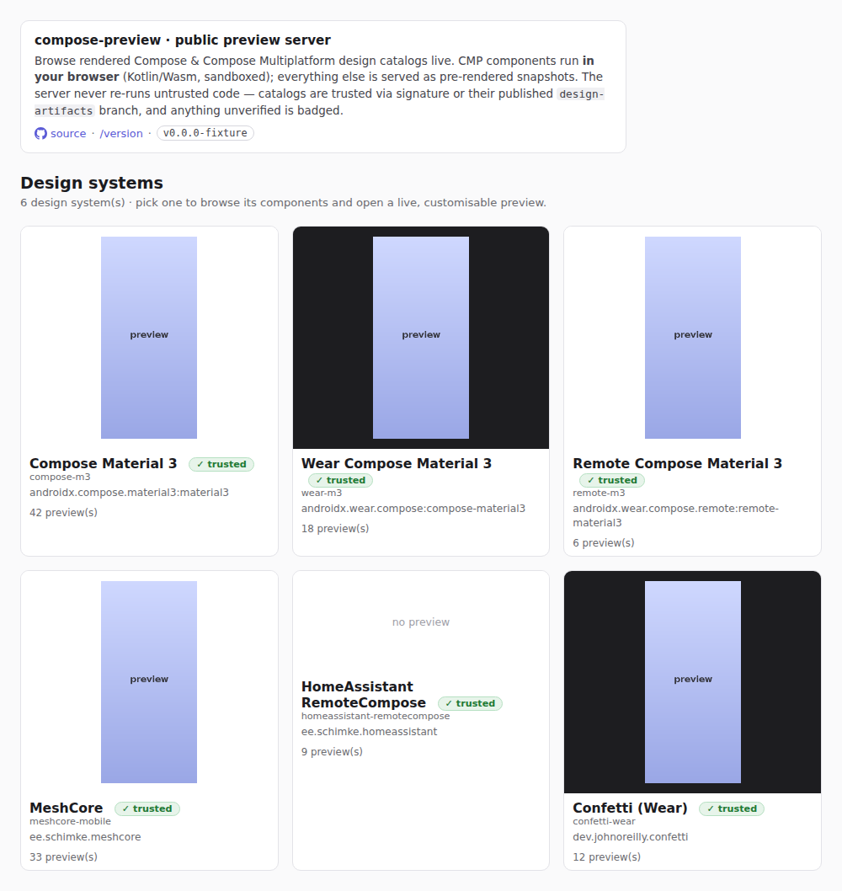
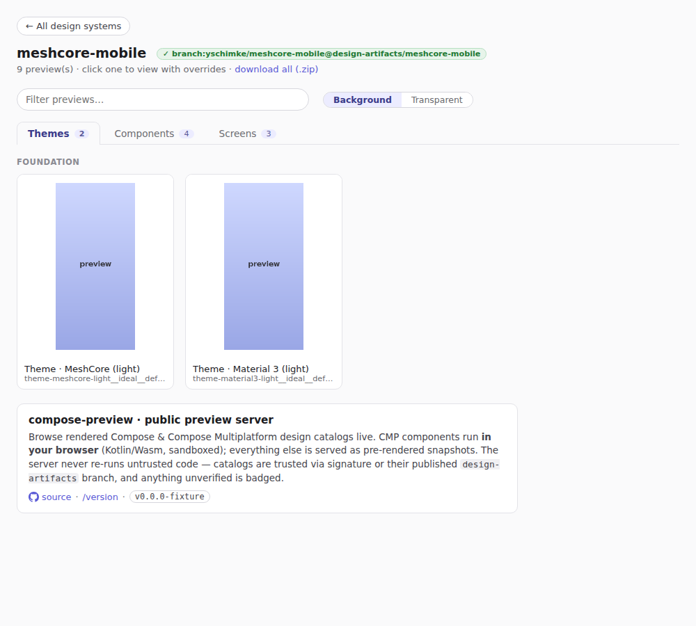
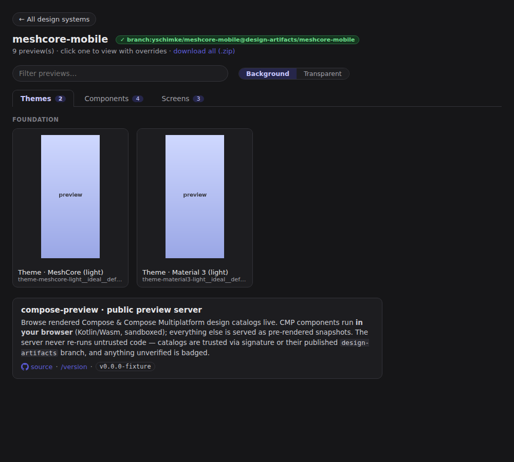
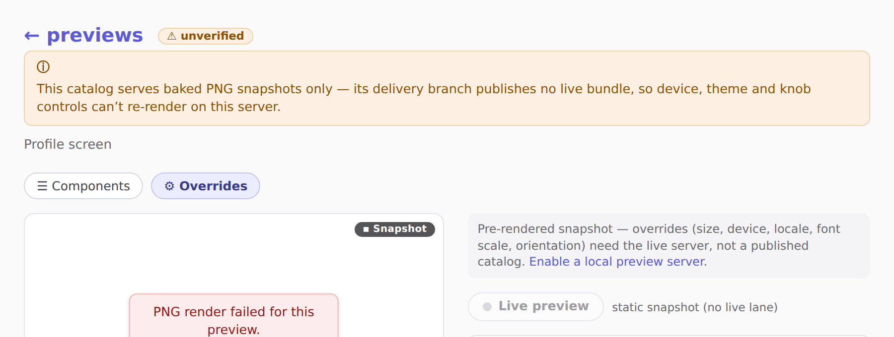
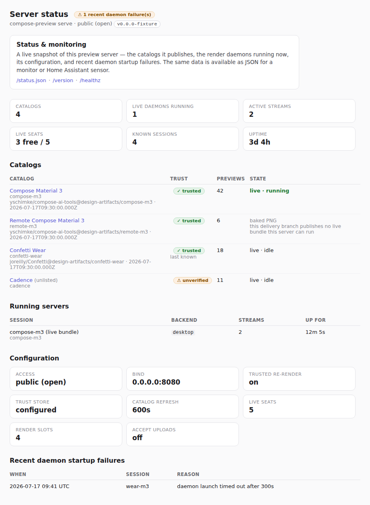

# The public preview server

`compose-preview serve` can run as a **public** preview server (the deployment behind
`preview.coo.ee`) with two things to show:

1. **Uploaded bundles** — anyone can `POST /bundles/<name>` a portable bundle (or point at one with
   `?url=`) and get a shareable `?session=<name>` link. The server shows the bundle's **data tiers**
   (baked PNGs, Remote Compose / Protolayout / Lottie IR) for any uploader, and reports a **trust
   verdict** so you can tell a bundle from a producer you trust from an anonymous one.
2. **The design systems we publish** — `--catalogs compose-m3,wear-m3,remote-m3` fetches each
   published `design-artifacts/<system>` catalog and serves it read-only at its canonical path
   `/<system>/` (the legacy `?session=<system>` form still works). Browsing that branch and opening a
   live, customisable render are then two ends of one workflow (the branch's README + `catalog.json`
   carry `livePreview` deep links back here).

   When a server publishes catalogs, its **front door (`/`) is an index of those design systems** —
   one card per listed system carrying a meaningful hero preview, the system's title + library, its
   trust badge, and a link to `/<system>/`. (A plain `serve` with no `--catalogs` still shows the
   served module's own preview grid at `/`.) This replaces showing an arbitrary default module at the
   root — the point of the public server is the catalogs, so the landing leads with them.

   Two per-system display choices are **systematised** in one place (`ServeWeb.SystemDisplay`), so
   the front door and each catalog grid agree:
   - **Hero** — the card fronts the *most representative* preview: a real `Screens`-section preview
     (an app's actual screen, primary view preferred) when the catalog has one, else a canonical
     component. So Confetti leads with a conference screen while a component library like `compose-m3`
     leads with a button.
   - **Stage** — a **dark-first** system (Wear OS is black-watch-face-first — `wear-m3`,
     `confetti-wear`, …) backs its hero on a dark stage instead of the default white, so a
     light-on-transparent Wear sticker isn't washed out. `SystemDisplay.isDarkFirst` decides, from an
     explicit list plus a Wear/watch id heuristic; extend the list to pin any other dark-first system.

   

   A catalog entry may name a **per-system source repo** as `<system>@<owner>/<repo>`, so one server
   can serve systems published to *different* repos — e.g. `compose-m3,wear-m3` from this repo
   alongside `meshcore-mobile@yschimke/meshcore-mobile` from the app's own repo (both listed on the
   front page). `--catalogs-unlisted` serves a system exactly like `--catalogs` but keeps it **off the
   front door** — an unlisted catalog (e.g. `cadence`) is **not** listed on the `/` index and is kept
   off the in-catalog "Design systems" nav row. It's reachable only at `/<system>/` (and `?session=`),
   shareable by direct link, so you can publish a catalog without advertising it on the public landing.
   Every catalog's branch (whatever repo) must be in the `--trust-store` to badge `Trusted(Branch)`;
   otherwise it serves `Unverified` (the data tiers serve either way).

## Tabbed catalog pages

A catalog whose components declare a **`section`** (set per group in the catalog spec — `Themes`,
`Components`, `Screens`, `Animations`, …) is served with its previews grouped into **tabs**, one per
section, and the component `group` shown as a sub-heading inside a tab. Sections, their groups, and
the cards within follow the catalog's **authored order**, so the tabs read Themes → Components →
Screens rather than alphabetically (the served preview list is otherwise id-sorted). Empty sections
are omitted and the set is open-ended — tag a group with any section name to grow a new tab.

Tabs are progressive enhancement: with scripting off every section shows under its own heading and
the tabs are in-page anchor links; with scripting on, selecting a tab shows just that section while
the **search box still spans every tab**. A catalog whose previews carry no section (the published
design systems today) keeps the single flat grid, unchanged.





In `--public` mode the landing page opens with a short **"about" intro** explaining what the host is
and its safety model, with a link to the machine-readable [`/version`](#endpoints):


## Two axes: trust × format

These are orthogonal. **Trust** decides attribution; **format** decides what draws the pixels. Neither
ever lets untrusted code run *on the server*.

### Trust

A bundle/catalog is `Trusted(by …)` or `Unverified`. Trust gates only **server-side re-render** of a
bundle's *executable* Compose; the data tiers serve regardless. Three bases (`--trust-store
trust/producers.json`):

| Basis | How | Strength |
|---|---|---|
| **Signature** | An Ed25519 `signatures.json` signed by a key in the store's `keys` (`bundle sign`). | Strongest — cryptographic, offline. |
| **Branch** | The server fetched the catalog from a branch in the store's `branches` (e.g. `design-artifacts/*`). | Origin/TLS trust. |
| **Provenance** | A CI OIDC identity in the store's `oidc`. | Advisory — annotates an already-signature-verified bundle; full Sigstore/Rekor is a follow-up. |

Empty store ⇒ trust nothing (fail-closed). See [`trust/producers.json`](../trust/producers.json) for
the starter, and `compose-preview bundle keygen | sign | verify` to mint a key, sign a bundle, and
check a verdict.

The landing + viewer pages **badge** the session's verdict — green ✓ for a trusted
signature/branch/provenance, amber ⚠ for `unverified` (a live daemon-backed module carries no
badge):


### Why a session is snapshot-only — the degradation banner

When a session can only serve **baked PNG snapshots** — an interactive/live lane the viewer would
otherwise offer is unavailable — the landing + viewer show an amber **banner under the header** that
says *why*, instead of leaving a visitor to guess from a dead "Live preview" toggle. The reason is
computed once, at catalog-load time (the point the fallback is actually decided, where it was
previously only logged to the server's stderr), and carried on the host so the same string appears in
the viewer and in `/api/previews`. The current reasons (`ServeDegradation`):

- **`catalog-baked-only`** — the delivery branch publishes no `liveBundle` this server can run (an app
  catalog that hasn't opted into the live tier, `remote-m3`, …). This is the common case.
- **`livebundle-unavailable`** — a `liveBundle` was declared but couldn't be brought up (its bundle or
  an externalized font failed to fetch/verify, or server-side re-render isn't enabled here); the
  detail names the cause.
- **`unverified-no-rerender`** — a live-capable catalog verified as `unverified`, so re-render is
  refused fail-closed (the trust badge already shows the amber verdict; the banner states the
  consequence).

The banner complements the viewer's per-control `cp-note` (which explains what an individual override
needs); a fully-live session shows neither. The programmatic form rides `/api/previews` as a
`degradations` array (`[{ "code", "detail" }]`), empty for a live session, so a client (the Figma
plugin) reads the same reason without scraping HTML.



### Format (each its own renderer; none executes code on the server)

| Format | In-browser | Server render | Data-only / safe | Server render needs trust |
|---|---|---|---|---|
| **Compose Android** | — | Robolectric (daemon) | no (runs Kotlin) | **yes** |
| **Compose MP (CMP)** | **Kotlin/Wasm** (browser sandbox) | Skiko desktop (daemon) | no (runs Kotlin) | server: **yes**; Wasm: sandboxed |
| **Remote Compose** | RemoteDocument player | player | **yes** | no |
| **Protolayout / Lottie** | web player | renderer | **yes** | no |
| **Baked PNG** | `` | — | **yes** | no |

So: **CMP renders in the browser** (Wasm sandbox), **Compose Android uses the server**, and a **baked
PNG** is the universal fallback when an image is needed. Remote Compose / Protolayout are *separate,
data-only* formats — the safest uploads.

The CMP-Wasm tier is built (`:samples:cmp-wasm-catalog`): a CMP catalog session's viewer has a single
**"Live preview"** toggle (static snapshot by default) that, when a Wasm app backs the session,
mounts the M3 components client-side in a sandboxed iframe — no server round-trip, so safe even for
an unverified session. (When the session also carries a live daemon, the toggle prefers that stream;
the corner badge's icon flips ▪→▶ to show which lane is live.) The app is sourced two ways:

- **From the trusted branch (default).** When the `design-artifacts/<system>` catalog declares a
  `webRender` (a `web/wasm/` app committed to the branch), `--catalogs` fetches it alongside
  `catalog.json` + `images/` and serves it at `/wasm/<system>/` — **trusted by the same branch
  origin**, no local build needed.
- **From a local build.** `--wasm-dir <system>=<dist>` points at a `wasmCatalogDist` output, which
  overrides the branch app for that system (handy when iterating locally).

The `/wasm/` assets are sent with `Cache-Control` + an `ETag`, so the heavy skiko + app wasm (≈ 8 MB
gzipped) is cached and revalidated cheaply (304) instead of re-downloaded each viewer load.

## Running one

```bash
compose-preview serve \
  --module :samples:design-catalog-m3 \   # a base module (used only for ?session=/legacy; `/` is the index)
  --public \                              # open every route (no token)
  --catalogs \                            # listed on the front-page index; app systems may come from their own repo
      compose-m3,wear-m3,remote-m3,meshcore-mobile@yschimke/meshcore-mobile,homeassistant-remotecompose@yschimke/homeassistant-remotecompose \
  --catalogs-unlisted cadence@yschimke/cadence \  # served at /cadence/ but NOT on the front page
  --trust-store trust/producers.json \    # who we trust (must list every catalog's branch/repo)
  --host 0.0.0.0 --port 8080

# The listed systems open at https://preview.coo.ee/compose-m3/ (and /meshcore-mobile/, etc.);
# cadence is served unlisted at https://preview.coo.ee/cadence/ (not on the front page, but shareable).
```

- **`--public`** drops the token gate (the deployed server is meant to be open). It is **safe by
  construction**: rendering a bundle/catalog executes no code, re-rendering untrusted Compose is
  refused, uploads are size-capped, and the `?url=` fetch is SSRF-gated (`--accept-bundles-from`).

### Serving any fetched bundle — no module upfront (`--bundle`)

A catalog is the *packaged* form of "a trusted producer publishes a branch". When you just have a
**preview bundle** — the executable `.bundle` the export pipeline emits, sitting on a GitHub branch or
a local disk — you don't need a `catalog.json` wrapper (or a local module to build) to render it
live. `--bundle <url|path>` (repeatable, `--bundle <name>=<url|path>` to name the session) fetches
the bundle at startup and stands it up as its own `/<name>/` session:

```bash
# A pure preview server — no --module, no local checkout, no Gradle build.
compose-preview serve \
  --public \
  --allow-render-trusted \
  --trust-store trust/producers.json \
  --bundle https://raw.githubusercontent.com/yschimke/compose-ai-tools/design-artifacts/compose-m3/bundle/compose-m3-bundle.png
# Opens the fetched bundle live at http://localhost:8723/compose-m3-bundle/
```

Same **trust × format** rules as a catalog, and the same fail-closed gate — a fetched bundle earns
the **live** (server-side re-render) lane only when it verifies `Trusted` **and** the operator passed
`--allow-render-trusted`:

- **Trusted by branch origin.** A `raw.githubusercontent.com/<owner>/<repo>/<ref>/…` URL is attributed
  to `<owner>/<repo>@<ref>`; if that branch is in the `--trust-store`, the bundle is
  `Trusted(Branch)` with no signature needed (same origin trust the `--catalogs` fetch uses).
- **Trusted by signature.** Any bundle (including a local `--bundle /path/app.bundle`) carrying an
  Ed25519 `signatures.json` signed by a key in the store is `Trusted(Signature)`.
- **Otherwise `Unverified`** → served **read-only as its baked PNGs**; its executable Compose is never
  re-rendered on the server (no RCE lever). The data tiers serve either way.

Desktop-backend only for the live lane (it rides the same `liveBundle` daemon path `compose-m3` uses:
`ServeBundleDaemon.materialize` extracts the bundle, resolves its classpath, and launches the render
daemon straight from it — no build). An Android bundle falls back to baked PNGs, fail-closed. A URL is
fetched from the operator's own command line, so — unlike the client `?url=` upload path — it is **not**
SSRF-gated (`--accept-bundles-from` doesn't apply); the operator chose the address. `--bundle` also
works **alongside** a `--module` (both are served); run it with no `--module` outside a Gradle project
to get the pure module-less server above.

## Deploying `preview.coo.ee`

Both container profiles take this config from env (the entrypoint maps `SERVE_PUBLIC`,
`SERVE_CATALOGS`, `SERVE_CATALOGS_UNLISTED`, `SERVE_TRUST_STORE`, `SERVE_WASM_DIR`,
`SERVE_ACCEPT_BUNDLES` → flags) and put **Caddy** in front for TLS. They default to the **open public
profile** (`SERVE_PUBLIC=1`, catalogs `compose-m3,wear-m3,remote-m3` plus the app systems `meshcore-mobile` /
`homeassistant-remotecompose` on the front-page index, and `cadence` served unlisted at `/cadence/` — off the
front page — via `SERVE_CATALOGS_UNLISTED`); set `SERVE_PUBLIC=0` + `SERVE_TOKEN` for a token-gated box.

The prebuilt `deploy/image` **bakes a branch-trust store** at `/trust/producers.json` (trusting
`design-artifacts/*` on `yschimke/compose-ai-tools`, `yschimke/meshcore-mobile`, and
`yschimke/homeassistant-remotecompose`) and the entrypoint defaults `SERVE_TRUST_STORE` to
it, so the published catalogs badge as `Trusted(Branch)` out of the box rather than `unverified`.
Mount your own over that path (or set `SERVE_TRUST_STORE` to it) to pin different producers, or set
`SERVE_TRUST_STORE=none` to run trustless. (Empty falls back to the baked default — use `none` to opt
out — which also means a bare image pull self-heals a box without editing its compose.)

The **catalog set is baked into the image the same way**: the entrypoint defaults `SERVE_CATALOGS`
to `compose-m3,wear-m3,remote-m3,meshcore-mobile@yschimke/meshcore-mobile,homeassistant-remotecompose@yschimke/homeassistant-remotecompose`
(front-page index) and `SERVE_CATALOGS_UNLISTED` to `cadence@yschimke/cadence` (served at `/cadence/`,
off the front page). So a bare `docker pull` / Watchtower update serves them
without editing the box's compose. Override either with your own comma list, or `none` to serve none
of that kind (empty inherits the baked default). The `deploy/vps` from-source path still sets these
in its compose (it builds `main`, so the flags exist immediately; the prebuilt image needs a CLI
release that carries `--catalogs-unlisted`).

| | [`deploy/vps`](../deploy/vps) (from source) | [`deploy/image`](../deploy/image) (prebuilt) |
|---|---|---|
| CLI | compiled from this checkout (~8 min build) | the **released** tarball (`docker pull`, no build) + Watchtower auto-update |
| Has the latest serve features? | **immediately** (built from `main`) | only once they're in a **published CLI release** (bump `CP_VERSION`) |
| In-browser Wasm tier | local build, `SERVE_WASM_DIR=compose-m3=samples/cmp-wasm-catalog/build/wasmDist` | branch-fetch: `--catalogs` pulls each system's `web/wasm/` from the trusted branch (needs the branch to carry it) |
| Picks up a regenerated `design-artifacts/<system>` branch | via the same auto-refresh (rebuild + re-run) | **auto**: the server re-checks each catalog branch head every `SERVE_CATALOG_REFRESH`s (default 600) and re-fetches on change — **no restart**. Watchtower only rolls the *image*; this keeps the *catalog content* current. Set `SERVE_CATALOG_REFRESH=0` to disable. |

`preview.coo.ee` **runs the prebuilt [`deploy/image`](../deploy/image)** — a `docker pull` of the
released `compose-preview-host` image on an **8 GB host**, no build. The **whole deploy chain is
automatic**: cutting a CLI release publishes the host image to GHCR (release-please invokes
[`preview-host-image.yml`](../.github/workflows/preview-host-image.yml) via `workflow_call`, tagging
that version **and** `:latest`), and **Watchtower** on the box polls the `:latest` tag hourly and
rolls the `preview` container onto the new image — no manual step.

> **Why the *Publish preview-host image* Actions list can look stale.** Because that publish runs as
> a **reusable-workflow call** from the release job, its runs appear *inside the release-please run*,
> **not** as standalone *Publish preview-host image* runs — so that workflow's run list shows only the
> occasional manual `workflow_dispatch`, and can read as "hasn't built since <months ago>" even though
> **every release rebuilds the image**. To confirm which build is deployed, check the release-please
> run, the GHCR `:latest` digest, or [`GET /version`](#endpoints) — not the preview-host-image run list.

The two delivery paths move on **different clocks**: a **daemon/CLI change** reaches the box on the
next Watchtower pull of a new release image, while a **`design-artifacts` regen** reaches it much
sooner — the server **auto-refreshes the catalog branches** in between image rolls (re-checks each
`design-artifacts/<system>` head every `SERVE_CATALOG_REFRESH`s, default 600, and re-fetches on
change, no restart). So a catalog repack needs no image roll, but a change to how the daemon *renders*
(or *loads resources*) does. This is the canonical public deployment. The image bakes the
Android/Robolectric daemon + a minimal Android SDK, so it serves the Android **Wear** catalog
(`wear-m3`) live server-side (see the live-lane note below).

The from-source [`deploy/vps`](../deploy/vps) path (`cd deploy/vps && DOMAIN=preview.coo.ee
./setup.sh`) is the **alternative** for when you need a serve feature *before* it ships in a CLI
release: it builds the current `main`, including the Wasm app, and comes up public. But a from-source
box is **desktop-only** (no Android SDK), so it falls back to baked PNGs for the Android catalogs —
use the prebuilt image for live Wear.
- **Re-render of trusted Compose** stays off unless the operator opts in; a public box should leave
  `--revisions` *off* (that path runs arbitrary Gradle = RCE).

## Trusted server-side re-render (`--allow-render-trusted`)

By default a catalog serves **baked PNGs** — the viewer's device/orientation/etc. controls can't
re-render a static image (they're disabled, with the in-browser Wasm tier carrying theme/font-scale/
locale for CMP). For **full-fidelity** server-side overrides, a **`Trusted`** catalog can be served
by a live, daemon-backed session (`--allow-render-trusted`), so every control re-renders for real.
There are two ways to stand that daemon up, both fail-closed on the `Trusted` verdict (an
`Unverified`/spoofed catalog never reaches either — no RCE lever):

1. **From a carried executable bundle (`liveBundle`) — no build (preferred, and now the default).**
   The design-artifacts pipeline publishes the executable preview bundle (minimized module classes +
   `previews.json` + classpath manifest) onto the branch under `bundle/` and records a `liveBundle`
   in `catalog.json`. `serve` fetches that bundle like it fetches the Wasm app, resolves its
   classpath from the local Maven/Gradle caches (or Central + Google Maven), and launches the render
   daemon **straight from it** — no repo checkout, no Gradle build, no per-request compile. This is
   what the public server uses for `compose-m3`. A module that pulls deps from a repo **beyond
   Central + Google** (e.g. `meshcore-mobile`'s `jitpack.io` deps like `usb-serial-for-android`)
   needs those repos supplied via `--extra-maven-repos <url>[,<url>…]` (env `SERVE_EXTRA_MAVEN_REPOS`;
   the prebuilt image defaults it to the repos its baked catalogs need — `https://jitpack.io`
   (meshcore-mobile) + the Apollo snapshots repo (Confetti); `none` to disable) — otherwise the
   resolver skips those coordinates and the daemon can't build its classpath, so the catalog falls
   back to baked PNGs (`livebundle-unavailable`). Only list repos you trust; the server fetches
   artifacts from them when resolving a trusted catalog's live bundle. Both backends are supported
   ([`ServeBundleDaemon.materialize`](../cli/src/main/kotlin/ee/schimke/composeai/cli/serve/ServeBundleDaemon.kt)):
   a **desktop** bundle spawns the Skiko desktop daemon, and an **android** bundle spawns the
   Robolectric daemon **on a box that carries the Android sidecar + SDK** — the prebuilt `deploy/image`
   does, which is what lets `wear-m3` render live server-side (the viewer additionally needs the
   catalog's `previewId` sticker mapping — see the live-lane note below). A bundle whose backend is
   neither, or an `android` bundle on a box that lacks the Android runtime (e.g. the desktop-only
   from-source `deploy/vps`), falls through to (2) or baked PNGs.

2. **From source (`source: { repo, ref, module }`) — Gradle build fallback.** For a catalog that
   declares a buildable `source` but no `liveBundle`. This runs the source's Gradle (code execution),
   so it's gated additionally by the `--revisions-allow` ref allowlist and a `source.repo` ==
   server-repo check, and the box must have a checkout to worktree from — on the prebuilt image, set
   `SERVE_CATALOG_SOURCE_REPO` so the entrypoint clones one and passes `--catalog-source-root`, which
   pays a **one-time cold Gradle build at startup**. Not needed for the published catalogs; the
   bundle path (1) covers them with no build.

Because path (1) is cheap and safe, both public profiles turn it **on by default**: `deploy/vps`
(from source) and the prebuilt `deploy/image` (`preview.coo.ee`) both default
`SERVE_ALLOW_RENDER_TRUSTED=1` and auto-size the live-seat budget from the box's memory — a bare
image pull "just works" with live CMP, no clone and no build. Set `SERVE_ALLOW_RENDER_TRUSTED=0` to
opt out (the Wasm tier still carries CMP). The other published catalogs (`wear-m3`, `remote-m3`) are
**Android** — no desktop-runnable bundle — so their live lane runs a heavier Robolectric daemon
(2 live-seat permits) instead of the desktop one. The prebuilt `deploy/image` (**what `preview.coo.ee`
runs**) bakes that Robolectric Android daemon + a minimal Android SDK, so `wear-m3` — which publishes
an Android `liveBundle` — *can* be rendered live and per-variant there. A box **without** the Android
runtime — the desktop-only from-source `deploy/vps` — instead falls back to baked PNGs for these
catalogs, fail-closed: no error, just no daemon tier. (`remote-m3` carries no runnable bundle, so it
stays baked-PNG on either box.)

> **The live lane also needs a `previewId` sticker→daemon mapping — and, for Android, the app's
> resource table.** The viewer only exposes live/override controls for a preview whose baked sticker
> is mapped to its daemon twin — the `previewId` field the exporter records on each `catalog.json`
> image, from which `ServeCatalogStore` builds the daemon `alias` (`canRenderOverridesFor`). For an
> **Android** catalog there is a second requirement: the packed bundle must **carry the app's compiled
> resource table** (`resources.arsc` / `apk-for-local-test.ap_` under `android/`) *and* the daemon
> must load it onto the render classpath, or a classic `stringResource(R.string.…)` render throws
> `Resources$NotFoundException` and the whole preview fails.
>
> Both requirements have **landed for `wear-m3`**: `previewId` for un-themed state-variant catalogs
> (#2492), and the Android app-resource carriage + daemon-load (#2498) — with a missing-resource
> **placeholder fallback** (#2499, renders an obvious `⟦res 0x7f…⟧` / magenta marker rather than
> crashing) as a safety net — shipped in **0.16.50**. So `wear-m3` renders live and per-variant once
> the box has **rolled the 0.16.50 image** (Watchtower) **and** re-fetched the `design-artifacts/wear-m3`
> bundle regenerated to carry the `android/` resources (catalog auto-refresh). `compose-m3` carried
> `previewId` already; `remote-m3` stays baked-PNG — it publishes no runnable bundle.

### Bounding the live tier — `--live-seats` / `SERVE_LIVE_SEATS`

Each live (daemon-backed) stream holds a JVM Compose render session, so on a constrained box a burst
of viewers could exhaust memory. `--live-seats <n>` (env `SERVE_LIVE_SEATS`) is a **permit budget**,
not a flat count: each live session charges permits by backend weight — a desktop CMP daemon costs
**1**, a heavier Robolectric **Android** daemon costs **2** — so one heavy `wear-m3` catalog can't
hog a single seat and starve the cheap `compose-m3` CMP lanes. A session that can't get its permits
is refused with WebSocket close `1013` (*Try Again Later*) instead of spawning a daemon that risks
the OOM killer; `0` is unbounded, and snapshot + Wasm sessions never consume a permit.

**Auto-sizing.** When `SERVE_LIVE_SEATS` is unset, the prebuilt image derives the budget from the
container's memory (reserve ~1 GB for the host + OS, ~1.2 GB per permit, clamped to **[2, 8]**), so a
bigger box scales up on its own with no compose edit: an 8 GB box gets **5** permits, a 4 GB box gets
**2** (two concurrent CMP sessions, or one Android). `preview.coo.ee` runs on an **8 GB host**, so it
derives **5** permits — enough for the heavier Wear/Android daemon (2 permits) plus concurrent CMP
lanes. The `preview` container is **unbounded by default** (`mem_limit: ${PREVIEW_MEM_LIMIT:-0}`), so
it uses the box's full RAM and the entrypoint
falls back to physical RAM when there's no cgroup cap — redeploy onto a larger dedicated box and it
scales automatically. Admission control (the live-seat budget + the per-render concurrency limiter)
is the memory guard, rather than a hard cgroup kill. On a **shared** host, set `PREVIEW_MEM_LIMIT` in
`.env` (e.g. `PREVIEW_MEM_LIMIT=4g`) to cap the container — which also lowers the derived seat budget
to match. Set `SERVE_LIVE_SEATS` explicitly to override the budget directly, or `0` for unbounded.

## Endpoints

`GET /` — with `--catalogs`, the **systems index** (a "Design systems" section listing the listed
catalogs, one card each; the `--catalogs-unlisted` app catalogs are served at `/<system>/` but not
indexed here); otherwise the served module's preview grid · `GET /p/{id}?session=<s>` viewer ·
`GET /render/{id}.png` PNG ·
`GET /api/previews` JSON (now includes `trust`) · `POST /bundles/{name}` upload (returns `trust`) ·
`GET /wasm/{system}/…` in-browser CMP app (ungated static assets) · `GET /status` server status
(HTML, or JSON with `?format=json`) · `GET /status.json` server status JSON · `GET /healthz` ·
`GET /version`. In `--public` mode all are open **and links carry no `?token`** (the token gates
nothing); otherwise the token gates everything but `/healthz`, `/version`, and `/wasm/` (static, no
session data) and is threaded through every generated link. `/status` is gated like the API routes
(open in `--public`, else token-required) — its running-daemon + config detail is more sensitive
than the bare `/version`/`/healthz`, so a private box keeps it behind the token.

`GET /status` is the operator/observer view of a running host: the catalogs it publishes (with their
trust verdict, preview count, and whether each is served live or as baked PNGs), the render daemons
up **right now** (backend, active streams, how long each has been up), the effective configuration
(access mode, trusted re-render, live-seat budget, catalog-refresh interval, …), and a bounded log of
**recent daemon startup failures** (the render/live daemon a session tried to open but couldn't — the
reason that was previously only logged to stderr). The status snapshot never wakes an idle daemon: a
catalog's liveness is read from the resident-session snapshot, not by resuming it, so a monitor can
poll it freely.



`GET /status.json` (equivalently `GET /status?format=json`) is the machine-readable
form — a stable schema built for a monitor or a **Home Assistant** REST sensor:

```json
{ "schema": "compose-preview-serve/status/v1", "version": "0.16.5", "public": true,
  "status": "ok", "uptimeSeconds": 3600,
  "catalogs": { "total": 5, "listed": 4, "unlisted": 1, "trusted": 4, "degraded": 1 },
  "daemons": { "known": 6, "running": 1, "activeStreams": 0,
    "liveSeatsTotal": 5, "liveSeatsAvailable": 5, "liveSeatsUnbounded": false },
  "config": { "host": "0.0.0.0", "port": 8080, "allowRenderTrusted": true, "trustStore": true,
    "acceptBundles": false, "catalogRefreshSeconds": 600, "maxConcurrentRenders": 4, "liveSeats": 5 },
  "catalogList": [ { "id": "compose-m3", "listed": true, "trust": "branch:…", "previews": 42,
    "live": true, "running": false, "path": "/compose-m3/" } ],
  "runningServers": [], "recentDaemonFailures": [] }
```

A Home Assistant REST sensor reads the top-level `status` (`ok`/`degraded`) as its state and lifts
the grouped counts + arrays as attributes, e.g.:

```yaml
sensor:
  - platform: rest
    name: Preview server
    resource: https://preview.coo.ee/status.json
    value_template: "{{ value_json.status }}"
    json_attributes: [version, uptimeSeconds, catalogs, daemons, recentDaemonFailures]
```

Every session-selecting route also has a **path form** where the leading `/{system}` segment picks
the session instead of `?session=`: `GET /{system}/` index · `GET /{system}/p/{id}` viewer ·
`GET /{system}/render/{id}.png` PNG · `GET /{system}/api/previews` JSON · `GET /{system}/bundle.zip`
· `WS /{system}/ws/{id}` stream. This is the canonical public URL for a published catalog
(`/compose-m3/`, `/meshcore-mobile/`, …); the `?session=` form stays for back-compat. The constant
routes (`/healthz`, `/version`, `/status`, `/status.json`, `/bundle.zip`, `/wasm/…`) outrank the
`/{system}` catch-all, so an unknown single segment just 404s like a bad session.

`GET /version` is the host's machine-readable identity — ungated so a deployer, Watchtower check, or
the design-artifacts gallery can confirm which build is live without a token:

```json
{ "schema": "compose-preview-serve/version/v1", "version": "0.16.5",
  "serveSchema": "compose-preview-serve/v1", "public": true }
```

### Storybook-compatible surface

The serve host also speaks the two tiny contracts the downstream Storybook ecosystem is built on, so
PNG-diff visual tools (BackstopJS, storycap/reg-suit, jest-image-snapshot, the `@storybook/test-runner`
in remote-URL mode) can crawl a compose-preview `serve` with **no compose-specific code**:

- `GET /index.json` — the [Storybook stories index](https://storybook.js.org/docs/api/main-config/main-config-indexers):
  `{ "v": 5, "entries": { "<storyId>": { "id", "title", "name", "importPath", "type": "story", "tags" } } }`.
  Each `@Preview` is one `'story'` entry; the `storyId` is minted CSF-style (`sanitize(title)--sanitize(name)`)
  and `importPath` carries the native preview id (`virtual:compose-preview/<fqn>`).
- `GET /iframe.html?id=<storyId>` — renders that one story in isolation as a chrome-free HTML page
  embedding the freshly-rendered PNG (a `data:` URI on a white ground), which is exactly what a
  screenshot tool captures. Accepts the same override query params as `/render` (e.g. `&uiMode=dark`),
  and also accepts a raw native preview id as `id=` for hand-authored deep links.
  - `&format=svg` serves the figma-svg export as an **inert ``**
    instead of the raster PNG. That's a still-**vector**, resolution-independent render, so the
    **DOM-capture** visual tools (Percy, Chromatic, Applitools) — which serialize the page and
    re-render it in their own cloud browsers — get faithful vector output, not a fixed-resolution
    bitmap. It's an `` (not inline `<svg>`) on purpose: a serve host can return an *unverified*
    catalog's repo-controlled SVG, and SVG referenced through `` is processed in the browser's
    restricted, non-scripting mode — so untrusted bytes can't execute, here or in the downstream
    tool's browser. SVG is produced by a daemon-backed session only, so a static bundle 404s this
    lane (like `/render.svg`).

Both come in the `?session=` and path (`/{system}/index.json`, `/{system}/iframe.html`) forms like the
rest, and follow the same token gate: open in `--public` mode, otherwise `?token=` is required (pass it
through your visual tool's URL, or run the server `--public` on a trusted network). Which tools fit:
**pixel-diff** tools (BackstopJS, storycap/reg-suit, jest-image-snapshot) consume the default PNG page;
**DOM-capture** tools (Percy, Chromatic, Applitools) consume `&format=svg` — a Compose render has no
HTML DOM of its own, but the vector export gives those tools a browser-native DOM to re-render.
