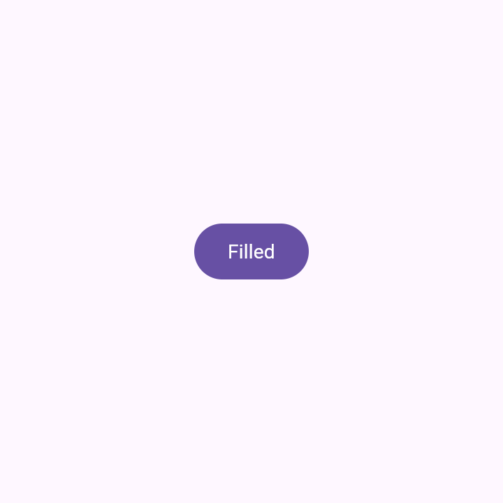
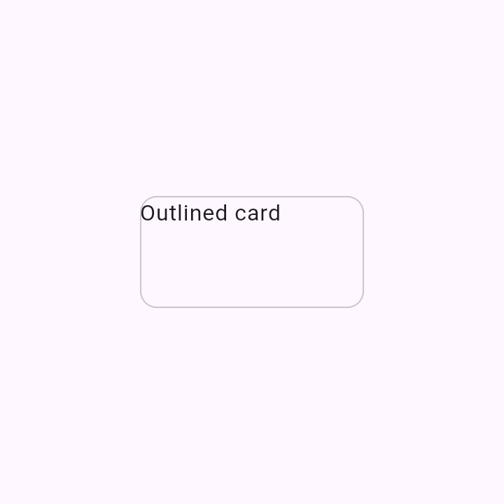

# In-browser CMP rendering via Kotlin/Wasm

**Status: built + measured — GO (model 1).** The spike was executed: a CMP `material3` catalog now
compiles to `wasmJs` and renders the published M3 catalog components **in the browser**, confirmed
headlessly. The module is [`:samples:cmp-wasm-catalog`](../samples/cmp-wasm-catalog); the original
feasibility plan is kept below for context.

## Results (measured)

Built `:samples:cmp-wasm-catalog` — a Compose Multiplatform `wasmJs` app holding the M3 catalog
components in `commonMain` (CMP `material3`, no Android `@Preview`), mounting the one named by a
`?id=<component>&uiMode=<light|dark>` query via `ComposeViewport`.

- **It compiles and paints.** `material3` → `wasmJs` builds clean; rendered headlessly in the
  pre-installed Chromium (Playwright) for buttons, cards, switch, slider, badge, segmented toggle —
  light and dark. Real, interactive components (the switch/slider keep remembered state), not baked
  PNGs:

  | Filled button | Outlined card | Switch (dark) | Slider |
  |---|---|---|---|
  |  |  |  |  |

- **Size (cold-load, gzipped):** app wasm **4.66 MB gz** (21 MB raw, *development*/unoptimized) +
  skiko **3.29 MB gz** (8.6 MB raw) ≈ **~8 MB gz**. The Binaryen `wasm-opt` production path shrinks
  the app wasm further but needs the toolchain note below. Verdict: fine for **model 1** (one cached
  artifact per design system); confirms **model 2** (per-bundle) should stay opt-in.

- **Packaging: webpack-free.** The build pins `FAIL_ON_PROJECT_REPOS`, which rejects the Node / Yarn
  / Binaryen download repos the Kotlin JS/Wasm plugins add at the project level — so
  `wasmJsBrowserDistribution` (webpack) and the production (`wasm-opt`) compile don't run here.
  Instead the `wasmCatalogDist` Gradle task assembles the raw Kotlin/Wasm **ES-module** output +
  skiko + `index.html` into `build/wasmDist/`, served straight from disk (the dev executable builds
  with no extra repos). Enabling the production `wasm-opt` path is a deploy-time size optimization
  (declare the Node/Binaryen repos in settings, or flip to `PREFER_SETTINGS`) — left to the operator
  since it weakens build hermeticity.

- **`@js-joda/core` is self-hosted.** The compiler's `import-object.mjs` imports the bare specifier
  `@js-joda/core` (CMP's datetime backing). An import map resolves it; we **vendor**
  `js-joda.esm.js` (pinned 5.7.0) beside `index.html` rather than a CDN, because the egress proxy
  blocks CDNs (`ERR_TUNNEL_CONNECTION_FAILED`) and self-hosting keeps the bundle offline-clean.

- **Wear stays server-only.** `androidx.wear.compose` has no `wasm` target, so `wear-m3` has no
  in-browser tier — server frames + baked PNG only. The report generator gates the Wasm callout to
  `compose-m3` (`WASM_CATALOG_SYSTEMS` in `scripts/design-artifacts/live-preview.mjs`).

## Remaining (fast-follow)

- **Server route + viewer mount.** Serve the assembled `build/wasmDist/` at `/wasm/<system>/` and
  mount it in the viewer's sandboxed `<iframe>` at the `data-mode="live"` seam (the URL contract
  `wasmLiveUrl` already emits, and the README's "Run it in your browser" link, point here).
- **Production `wasm-opt` size** once the operator enables the Binaryen path.
- **Model 2** (per-bundle CMP Wasm) — still deferred behind `--with-wasm`.

---

## Original spike plan (for context)

This records the feasibility findings and the concrete plan, per the "spike first, report before the
full build" approach.

## Goal

Render a **Compose Multiplatform (CMP)** preview *in the browser* with Kotlin/Wasm, mounted into the
existing `serve` viewer, so a CMP component is interactive client-side with no server round-trip. This
is one tier of the per-format render model in [public-preview-server.md](public-preview-server.md):

- **CMP → Kotlin/Wasm (browser sandbox)** ← *this spike*
- Compose Android → server (Robolectric)
- Remote Compose / Protolayout / Lottie → their own data-only players
- Baked PNG → universal fallback

The viewer falls back down that list when a tier isn't available for a given preview.

## What's already in place (confirmed)

- **Toolchain supports it.** Kotlin `2.3.21` + Compose Multiplatform `1.10.3` (`gradle/libs.versions.toml`)
  both ship the `wasmJs` target with Compose; the `org.jetbrains.compose` plugin is already on the
  build's classpath (used by `jetbrains-compose-*` deps). No version bump needed.
- **The viewer has the seam.** `ServeWeb`'s viewer is written against a `data-mode` attribute
  (`snapshot` today) precisely so a `live` transport mounts into the same page — see the kdoc on
  `ServeWeb` and `data-mode="snapshot"` in `viewerPage`. The `cp-canvas` element already sits beside
  `cp-img` for exactly this.
- **The bundle has a carriage convention.** The portable bundle already reserves a `web/` directory
  (`BUNDLE_WEB_DIR`, written by `bundle embed --in-bundle`) — additive and ignored by older readers —
  so a Wasm app slots in under `web/wasm/` without a new top-level surface.

So the **risk isn't the toolchain** — it's (a) what exactly gets compiled to Wasm, (b) artifact size /
cold-load, and (c) confirming a headless in-browser render. Those need a measured build.

## The core design question: what does the Wasm app contain?

A Wasm app can only render composables **compiled into it** — it can't reflectively render an arbitrary
uploaded consumer composable the way the server's classpath player can. Two models:

1. **Fixed catalog app (recommended first).** Build one `wasmJs` app from a CMP module **we control**
   that registers its composables by preview id, and serve it for our *published* catalogs
   (`--catalogs`). No per-bundle build; one artifact per design system. This directly delivers "CMP
   renders in the browser" for the catalogs the public server already hosts.

   **Important constraint (the existing catalogs aren't wasm-compilable as-is).** The current
   `samples/design-catalog-m3` / `design-catalog-wear-m3` modules are **Android application** modules
   that import Android-only APIs — `androidx.compose.ui.tooling.preview.Preview`,
   `android.content.res.Configuration`, and (Wear) `androidx.wear.compose.*` — none of which a `wasmJs`
   source set can compile. So model 1 is **not** "point Wasm at the existing modules"; it requires a
   **new / ported KMP catalog surface**: re-author the M3 catalog's component composables in
   `commonMain` against the CMP `material3` artifact (which *does* ship wasm), without the Android
   `@Preview` tooling (replace it with a plain id→composable registry). The **Wear** catalog stays
   Android/server-only for now — `androidx.wear.compose` has no wasm target — so its CMP-Wasm tier is
   out of scope. Treat porting the M3 component set to a shared CMP source set as **part of this
   follow-up**, not a free reuse.
2. **Per-bundle app (later).** Compile the *consumer's* selected previews to Wasm at `bundle pack`
   time and carry the app in `web/wasm/`. Fully general, but adds a `wasmJs` compile to every CMP pack
   (heavy) and only works for pure-CMP previews (no Android-only APIs). Gate behind a `--with-wasm`
   opt-in once the size/build cost is known.

Recommend shipping (1) first — it's bounded (one ported M3 catalog surface we own) and proves the
whole viewer path — then (2) as an opt-in once the size/build cost is known. The M3 port is the first
unit of work; Wear and arbitrary per-bundle CMP follow.

## Plan

### 1. A `wasmJs` CMP module
A new KMP module (e.g. `samples/cmp-wasm-catalog`) applying `kotlin("multiplatform")` +
`org.jetbrains.compose`, holding the **ported M3 catalog composables in `commonMain`** (CMP
`material3`, no Android `@Preview`/`Configuration` — see the constraint above), with:
```kotlin
kotlin {
  wasmJs { browser() ; binaries.executable() }
  sourceSets.commonMain.dependencies {
    implementation(compose.runtime); implementation(compose.foundation); implementation(compose.material3)
  }
}
```
A `main()` reads a preview id from the URL/JS bridge and calls `CanvasBasedWindow` /
`ComposeViewport` to mount the matching composable from a `Map<String, @Composable () -> Unit>`
registry (the same ids the catalog uses, e.g. `button-filled__ideal__default__dark`).

### 2. Bundle carriage (format v9, additive)
Package the built app under `web/wasm/{index.html, <app>.wasm, <app>.js, skiko.wasm, …}` and add a
`webRender` manifest descriptor (`kind = "compose-wasm"`, preview-id → entry mapping) — same additive
pattern as the v5–v8 IR/extension fields, so older readers ignore it.

### 3. Viewer integration
`ServeWeb.viewerPage`, when the session advertises a `compose-wasm` webRender for the preview's
backend (`compose-multiplatform`), mounts the Wasm app in a **sandboxed `<iframe>`** at the
`data-mode="live"` seam (Wasm runs in the browser sandbox, so even an *unverified* bundle is safe to
execute client-side — see the trust × format table). Order: Wasm (CMP) → RemoteCompose canvas →
server frames (Android / override re-render) → baked PNG.

## Open questions the measured build must answer
- **Artifact size & cold-load** — a Compose/Wasm app pulls in skiko-wasm; measure the gzipped
  `web/wasm/` total and first-paint time. Sets whether (2) is viable per-bundle.
- **Headless render confirmation** — build the fixed catalog app and open `web/wasm/index.html` in the
  pre-installed Chromium (Playwright) to confirm a composable paints for a given preview id.
- **Build cost** — wall-clock for `wasmJsBrowserDistribution`; whether it fits the design-artifacts CI
  job or needs its own.

## Go / no-go
- **Go** if the ported M3 catalog app renders headlessly and the gzipped `web/wasm/` is within a few
  MB. Ship model (1) — the ported M3 surface — wired into the viewer + the `--catalogs` path.
- **Defer (2)** (per-bundle Wasm) until (1)'s size/build cost is known; keep it behind `--with-wasm`.
- **No-go fallback** is already shipped: CMP previews keep rendering via **server frames** (desktop
  Skiko) and the **baked PNG**, so nothing regresses if Wasm is deferred.
