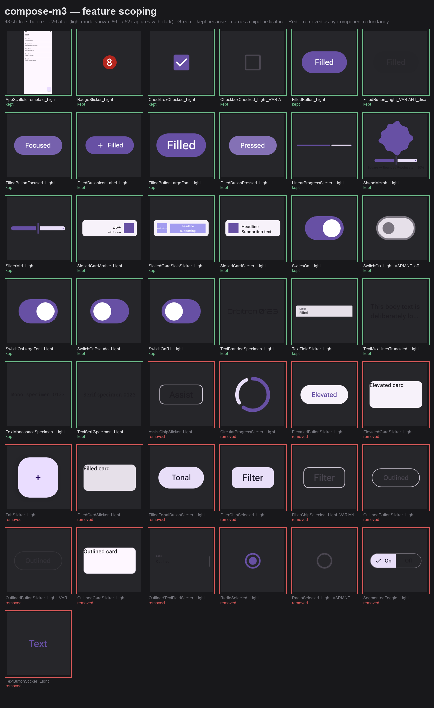
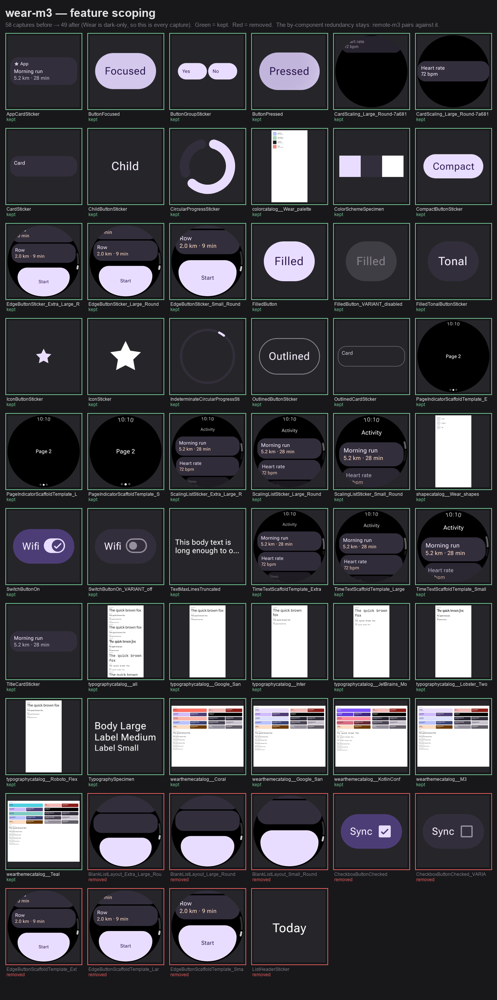

# Catalog feature scoping — `compose-m3` and `wear-m3`

Evidence for scoping the two **in-repo harness catalogs** to the preview pipeline's
features rather than to Material's component surface, and unlisting them from
preview.coo.ee's front page. See
[DESIGN_CATALOGS.md § What belongs in an in-repo catalog](../../docs/design/DESIGN_CATALOGS.md).

Each sheet renders every **before** capture and outlines it green (kept) or red
(removed), so the cut is legible as pixels rather than as a diff of ids. Nothing
that survives moved: this change only deletes entries, so every kept sticker is
byte-identical to what it rendered before.

| | before | after |
| --- | --- | --- |
| `compose-m3` | 27 components / 86 captures | 13 components / 52 captures |
| `wear-m3` | 26 components / 58 captures | 22 components / 49 captures |

## compose-m3

Cut hard: five button emphasis levels collapse to one (which also hosts the
pressed / focused / disabled / icon-label / font-scale captures), three plain cards
collapse to the slotted one (the only card carrying `PreviewSlot`), and the four
boolean selection controls collapse to the checkbox and the switch.

## wear-m3

Cut narrowly, and deliberately so. `samples/design-catalog-remote-m3` declares
`compareWith: "wear-m3"` and authors a `parallel` into ~19 of these ids, so deleting
the by-component redundancy here would silently unpair rows on the *published*
remote-m3 cross-system compare page. What went is the four entries nothing pairs
against and no feature needs: `Layout/List`, `Template/EdgeButton` (a second
`@ScrollingPreview(END)` × breakpoint capture — compare it to `EdgeButtonSticker`
in the sheet), `CheckboxButton/Checked` (a second `@OverrideVariant` boolean) and
`ListHeader`.

