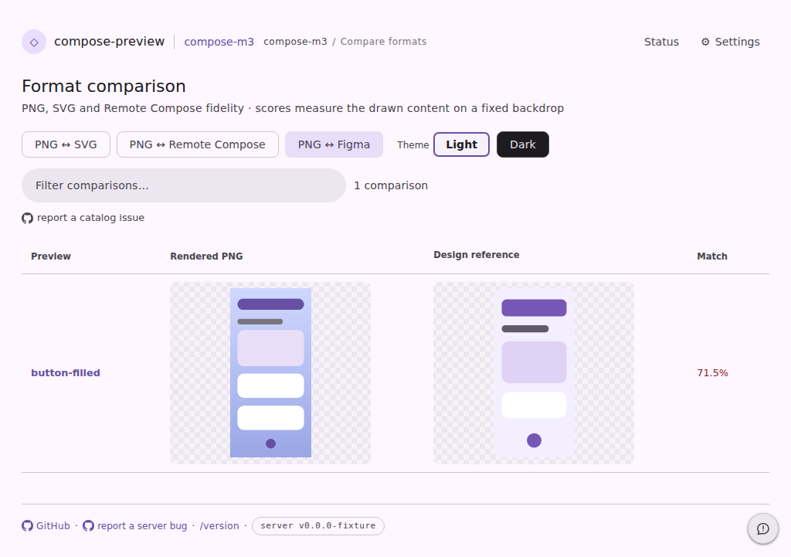
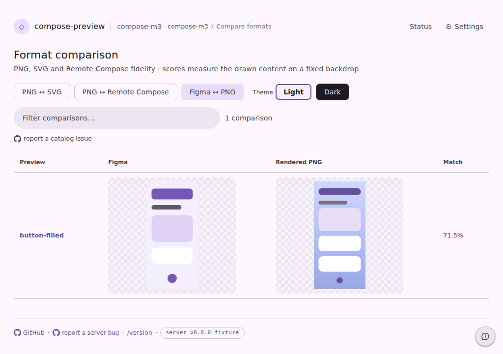

# The design spec leads the pair on the `/compare` wall

Committed evidence for the layout rule now written down in
[`docs/AGENTS.md`](../../docs/AGENTS.md#important-constraints): **the Figma spec
goes on the left, the render on the right, on every surface that shows both.**

Both shots come from the existing `serve-format-compare` page fixture through the
`pages-snapshot` harness — same runner, same stubs, no design tool and no daemon
contacted. Each is the wall's `reference` lane, entered the way a visitor enters
it: by pressing the design-spec format button. `before.*` was captured from a
clean `origin/main` worktree with the same scenario, so the only difference
between the two is this change.

| before | after |
| --- | --- |
|  |  |

- **before** — the render leads and the design reference follows, which is the
  opposite of what the viewer's spec lane shows one click away (Spec / Diff /
  Render, and the wipe's seam). The second column's header reads the generic
  **Design reference**: it was painted by a `::after` in `serve.css`, keyed off
  `data-format`, over a `<th>` hidden with `font-size: 0` — so it could name the
  *lane* but never the catalog's own tool, because CSS has no way to reach that
  string.
- **after** — the design spec is the left column and the render the right one, so
  stepping from the catalog into the viewer no longer swaps the two frames. The
  header is real DOM text again, naming the provider the references actually came
  from (`Figma`), and the button that enters the lane names the pair in the order
  the columns stand (`Figma ↔ PNG`).

The `svg` and `rc` lanes are deliberately unchanged: they pit a render against an
export **of that same render**, where the render is the source of truth and the
export is the thing on trial. Only the design-spec lane leads with the spec.

The dark pair (`before.dark.png` / `after.dark.png`) is the same state on the
dark sheet.

The harness state asserts the header's *computed* style too — a visible font size
and no `::after` content — because the bug above is exactly the kind a DOM-text
assertion passes straight through.

The state is registered with the harness as `serve-format-compare-reference-lane`,
so the CI visual-diff bot diffs this lane on every subsequent PR without anyone
remembering to ask — it had no shot of its own before, because the wall is served
with `svg` as its default format and never opens on the design lane.

```
cd cli/serve-web && npm run typecheck && npm test && npm run build   # 1020 passing
node --test scripts/design-artifacts/render-compare-html.test.mjs
./gradlew :cli:test --tests '*ServeWebTest*'
./gradlew :data-layoutinspector-connector:test --tests '*FigmaFidelityTest*'
UPDATE_SERVE_WEB_FIXTURES=true ./gradlew :cli:test --tests '*ServeWebFixtureTest*'
cd vscode-extension && npx playwright test -c preview-harness/playwright.config.mjs \
  pages-snapshot --grep 'format-compare'
```
