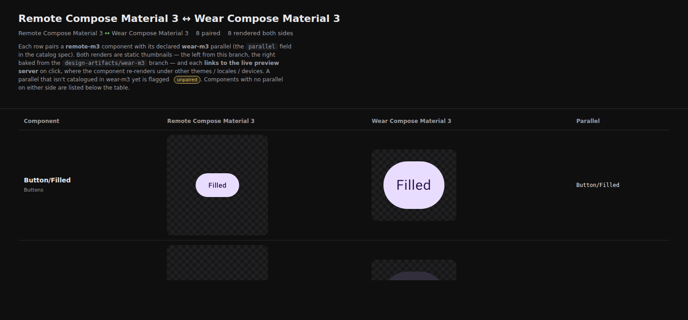
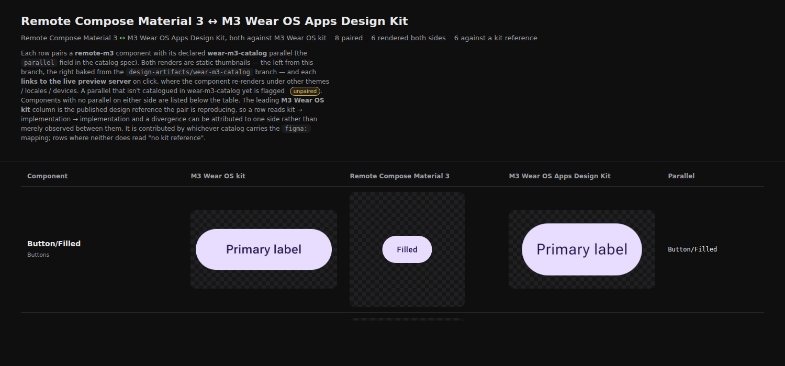

# Cross-system compare — cross-repo pairing and the design column

Evidence for `matches.html` growing a **third column** (the published design reference both
implementations reproduce) and being able to pair against a sibling catalog in **another
repository**. See
[DESIGN_CATALOGS.md § What belongs in an in-repo catalog](../../docs/design/DESIGN_CATALOGS.md).

Both captures are the **real page**, not a fixture: they are `renderCrossSystemHtml` run over the
live published branches — `design-artifacts/remote-m3` and `design-artifacts/wear-m3` in this repo,
`design-artifacts/wear-m3-catalog` in `yschimke/wear-m3-catalog`, and that catalog's
`references/index.json` for the kit column. Trimmed to eight paired rows and with the thumbnails
pulled down locally so the screenshot is deterministic; nothing else is altered.

## Before — two implementation columns, same repo only

`remote-m3` pairs against the in-repo `wear-m3` harness catalog. The two renders differ (copy,
size), and the page cannot say which of them is right.

## After — the kit, and a sibling in another repository

The same rows paired against `yschimke/wear-m3-catalog` instead, with that catalog's kit references
leading. `Button/Filled` now reads at a glance: the kit says **Primary label**, the Wear catalog
reproduces it, and the Remote Compose sticker says "Filled" at a smaller size — a divergence
attributable to one side rather than merely observed between two.

Rows where neither catalog carries a `figma:` mapping read "no kit reference" — inert, never a
spinner and never a borrowed picture. `Button/Icon` is the one visible in the full capture.

## Measured against the live branches

- 233 reference records on `design-artifacts/wear-m3-catalog` invert to **49 componentIds** with a
  primary kit reference.
- `remote-m3` declares **19 distinct parallels**; **9** already resolve against `wear-m3-catalog`'s
  inventory unchanged, **10** need re-pointing (`IconButton`, `CompactButton`,
  `Template/TimeText/largeRound`, `Progress/Circular`, `Progress/Circular/Indeterminate`,
  `Template/PageIndicator/largeRound`, `Icon`, `Text/MaxLines-Truncated`, `Typography`,
  `ColorScheme`).
- Over the full 42 paired rows, **20** resolve a kit reference today.
