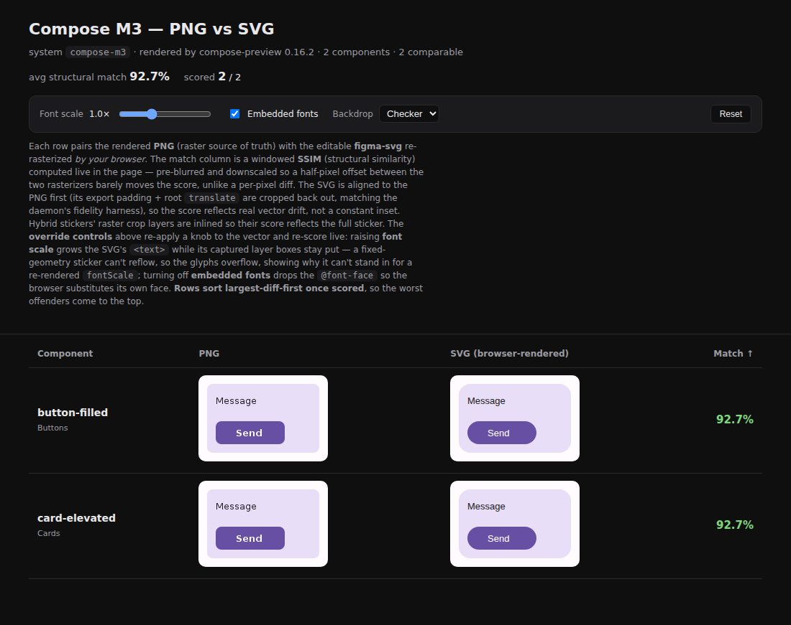
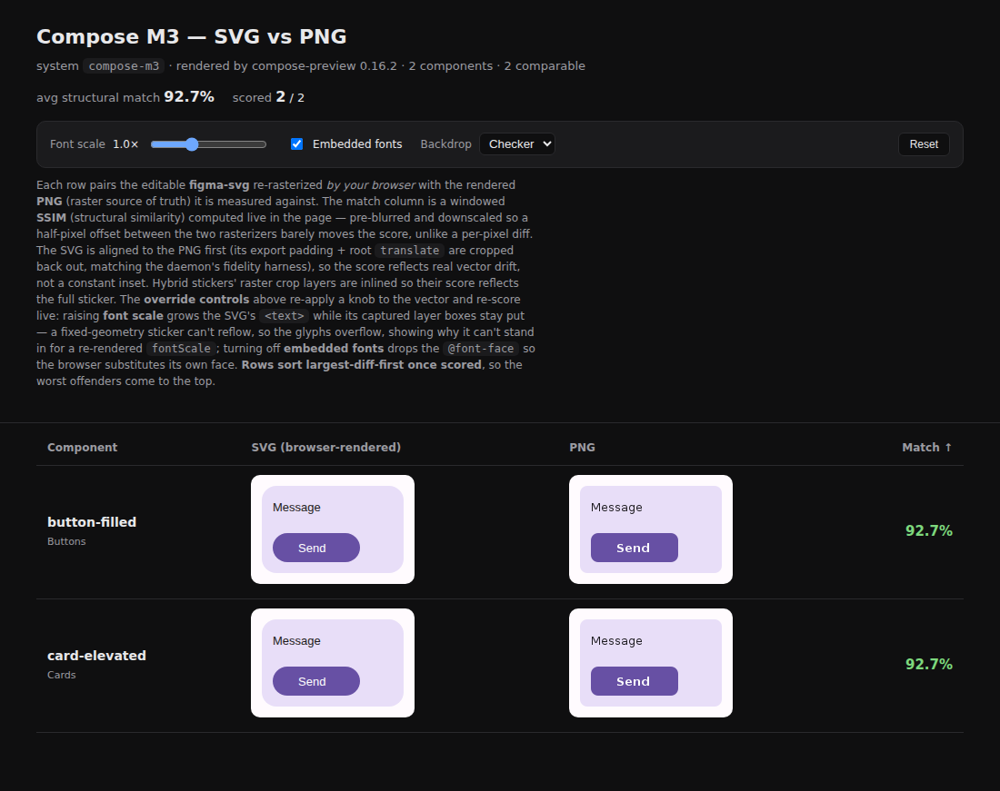

# `compare.html` leads with the design vector

Committed evidence for the column swap in
[`render-compare-html.mjs`](../../scripts/design-artifacts/render-compare-html.mjs),
the self-contained `compare.html` published on every `design-artifacts/<system>`
delivery branch.

Both shots are real pages, generated by calling `renderCompareHtml` from
`origin/main` (before) and from this branch (after) over the same two-component
catalog, then loaded over `http` in Chromium so the page's own in-browser SSIM
scorer actually ran — the `Match` column is a live number in both, not a
skeleton.

| before | after |
| --- | --- |
|  |  |

- **before** — `Component | PNG | SVG (browser-rendered) | Match ↑`.
- **after** — `Component | SVG (browser-rendered) | PNG | Match ↑`, so the design
  vector leads and the render it is measured against follows, the same order the
  viewer's spec lane and the `figma-svg | diff | render` fidelity composite use.

The page title, `h1` and the gallery's nav link move with it (`PNG vs SVG` →
`SVG vs PNG`), and `rc-compare.mjs` splices its own link in beside that anchor, so
its matcher was updated in the same change.

`render-compare-html.test.mjs` → `the design vector column comes before the render
column` pins both the header order and the cell order in CI.
