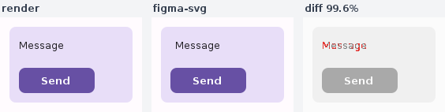
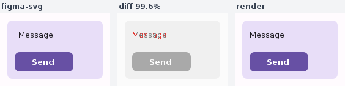

# The fidelity composite reads spec → diff → render

Committed evidence for the panel reorder in
[`FigmaFidelity`](../../data/layoutinspector/connector/src/main/kotlin/ee/schimke/composeai/daemon/FigmaFidelity.kt),
the QA harness that scores a `compose/figma-svg` export against the render it was
built from and drops a labelled composite beside the score sidecar.

Both images are real `FigmaFidelity.compare(...)` output, produced by running the
same 20-line program against the compiled engine from `origin/main` (before) and
from this branch (after). The input pair is a small hand-drawn card and a copy of
it with one text run nudged 6px, so the diff panel has exactly one thing to say
and the score is identical either way (**99.56%** in both) — the only thing that
moved is where each panel sits.

| before | after |
| --- | --- |
|  |  |

- **before** — `render | figma-svg | diff`. The spec was in the middle and the
  render on the left, which is the opposite of what every other surface that
  pairs the two shows.
- **after** — `figma-svg | diff | render`, matching the viewer's spec lane
  (Spec / Diff / Render) and the focused Reference / Diff / Actual page: the spec
  leads, and the delta map sits between the two frames it was taken from.

Verified structurally as well as visually — sampling the mismatch red
(`0xE53935`) per panel-third moves it from panel 2 to panel 1:

```
before.png: panel0[red=0] panel1[red=0]  panel2[red=95]
after.png:  panel0[red=0] panel1[red=95] panel2[red=0]
```

`FigmaFidelityTest.the composite puts the spec first and the render last` pins the
same fact in CI, by sampling one pixel from the middle of each third.
