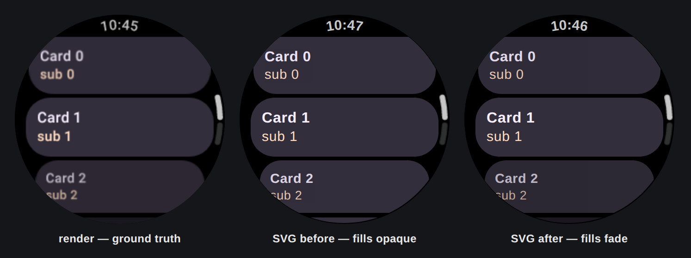

# Wear scaling-list container alpha — issue #3579 finding 3

A Wear scaling list (`TransformingLazyColumn` + `SurfaceTransformation`) fades each item toward the
curved edges through **two** graphics layers: a *container* layer outside the card's fill, and a
*content* layer inside it. The render therefore draws a faded card's background at the container
alpha and its labels at container × content.

The export published every card's background at full strength while its own labels faded around it.



| card | render fill | SVG before | SVG after |
| --- | --- | --- | --- |
| 0 | `(48,43,57)` — α 0.94 | `(51,46,60)` — α **1.00** | `(48,43,56)` — α 0.94 |
| 1 | `(51,46,60)` — α 1.00 | `(51,46,60)` — α 1.00 | `(51,46,60)` — α 1.00 |
| 2 | `(44,39,51)` — α 0.86 | `(51,46,60)` — α **1.00** | `(43,39,51)` — α 0.84 |
| 3 | `(25,23,30)` — α 0.49 | `(51,46,60)` — α **1.00** | `(26,23,30)` — α 0.51 |

Sampled at the card's horizontal centre, on the black device background, against the base container
colour `#332E3C` = `(51,46,60)`.

## Why the container alpha went missing

`ModifierTokenResolver.graphicsLayerAlpha` tried the coordinator's `lastLayerAlpha` *before*
evaluating a lambda-form `graphicsLayer { … }` block. That ordering only holds for a block that ran
while Compose was setting the layer's parameters. Wear's container transformation assigns `alpha`
from the item's scroll progress — known at draw time — so the block runs later and leaves
`lastLayerAlpha` at the identity it was created with. Because the coordinator *does* have a layer,
the existing guard couldn't tell that apart from a genuine `1.0`:

```
idx=0  BlockGraphicsLayerElement  hasLayer=true   lastLayerAlpha=1.0  blockAlpha=0.508   <- container
idx=5  PainterElement                                                                    <- the fill
idx=6  BlockGraphicsLayerElement  hasLayer=false  lastLayerAlpha=—    blockAlpha=0.508   <- content
```

The content layer owns no layer of its own, so it fell through to the block and faded correctly —
which is why only the fill looked wrong. The fix evaluates the block first and keeps the coordinator
as the fallback for the forms that have no block to run.

## Regenerating

`FigmaSvgWearScalingAlphaTest` writes `wear-scaling-alpha.inlined.svg` (raster crops base64-inlined,
so it rasterises standalone) and `wear-scaling-alpha-render.png` to
`renderers/android/build/figma-svg-wear-scaling/`. Rasterise the SVGs through `<object>`, not
`` — `` blocks the external `<image>` children a raster-fallback SVG carries.

**Measurement note.** Give headless Chromium a window larger than the panel and a generous virtual
time budget: capturing at exactly 227×227 truncated the page and dropped the two lower cards
entirely, which reads as a missing-content regression rather than a clipped screenshot.
