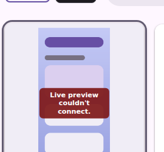
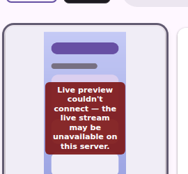

# The grid's live lane: unchanged, except where it was wrong

Committed evidence for `catalog-live.js` → `<cp-catalog-live>`.

Six of the eight `serve-landing-live` captures are **byte-identical** to
`origin/main` (`a158ce4`) — the grid at rest, the hover hint, and the streaming
card in both themes. The two that moved are the two this port deliberately
changed, and nothing else did.

| file | what it is |
| --- | --- |
| `live-card.light.png`, `live-card.dark.png` | a card actually streaming — byte-identical to `main` |
| `refused-before.png`, `refused-after.png` | the wording fix, cropped to the card |
| `refused.light.png`, `refused.dark.png` | the full page in the new `live-refused` state |

## The one behaviour change

`catalog-live.js` carried this comment above its close-code table:

> Maps the server's close codes the way the viewer does, so the two surfaces
> explain a refused live lane in the same words.

It did not. Three of the four cases matched `viewer.js` exactly; the fallback
stopped at `Live preview couldn't connect.` and dropped the half that says where
to look. That fallback is the branch that fires **most** — 1006, a bare abnormal
close, typically a proxy 502 on the WS upgrade — so the shorter wording was what
most people actually saw, on the one surface with nothing to say next.

before | after
--- | ---
 | 

The message is longer and the box wraps to five lines; it still sits inside the
card at grid width, which is the other thing this shot now pins.

## Why it drifted unnoticed

Nothing rendered that surface. The harness had two live-lane states — the hover
hint and a streaming card — and neither reaches an error, so the two
implementations could disagree indefinitely and move no baseline. A wording
change here was invisible to every check in the repo.

So the port adds a `live-refused` state rather than only fixing the text: a card
explaining a lane the server refused, captured at the longest of the four
messages. The next change to that box has a before/after for free.

One wrinkle worth knowing if you add another state here: fixture states run in
order against **one** page, and `live-card` leaves its session holding the first
card. A press on a live card belongs to the canvas, so `live-refused` presses
Escape and waits for the session to go before it starts its own gesture.

## What the port changed that no capture can show

`live/pointerMap.ts` is where the risk actually was. The canvas is
`object-fit: contain`, so a frame whose aspect differs from the thumbnail slot is
letterboxed inside it — the painted rect smaller than the element's and centred
in it. Scaling against the bounding rect offsets and compresses every
coordinate by the margin, and nothing about the failure is visible: no error, an
identical-looking card, presses landing on a different widget. A press in the
margin is refused rather than clamped for the same reason — clamping invents a
press on whatever sits at the frame's border, reliably, and only for people whose
window shape differs from the author's.

`sameOrigin` moved to `dom/` and is now shared with the spec lane instead of
existing twice. Navigation kept its own guard: a blob this page minted is safe to
*draw*, but is not something a sign-in link should ever navigate to, and reusing
the raster check outright would have widened that sink silently while removing a
duplicate.

Three Kotlin tests used to grep the asset for source lines (`sameOriginHref(...)`,
the contained-scale expression, `kind: "click"`). Greps like that cannot survive
minification, and each named a rule the TS tests now exercise directly, so they
are replaced with a pointer rather than reworded.

```
cd cli/serve-web && npm run verify   # 446 passing
UPDATE_SERVE_WEB_FIXTURES=true ./gradlew :cli:test --tests '*ServeWebFixtureTest*'
./gradlew :cli:test --tests '*ServeWeb*' && ./gradlew ktfmtCheck
cd vscode-extension/preview-harness
HARNESS_FIXTURE=serve-landing-live npx playwright test pages-snapshot.spec.mjs
# 10 passed on both refs; 6/8 PNGs byte-identical, 2 changed as intended
```
