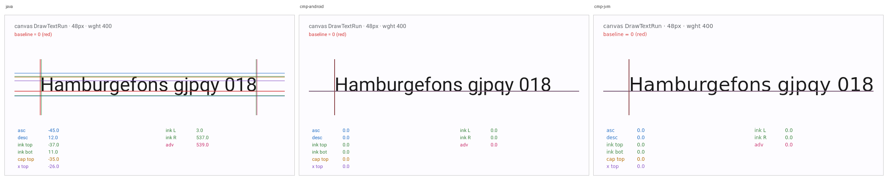
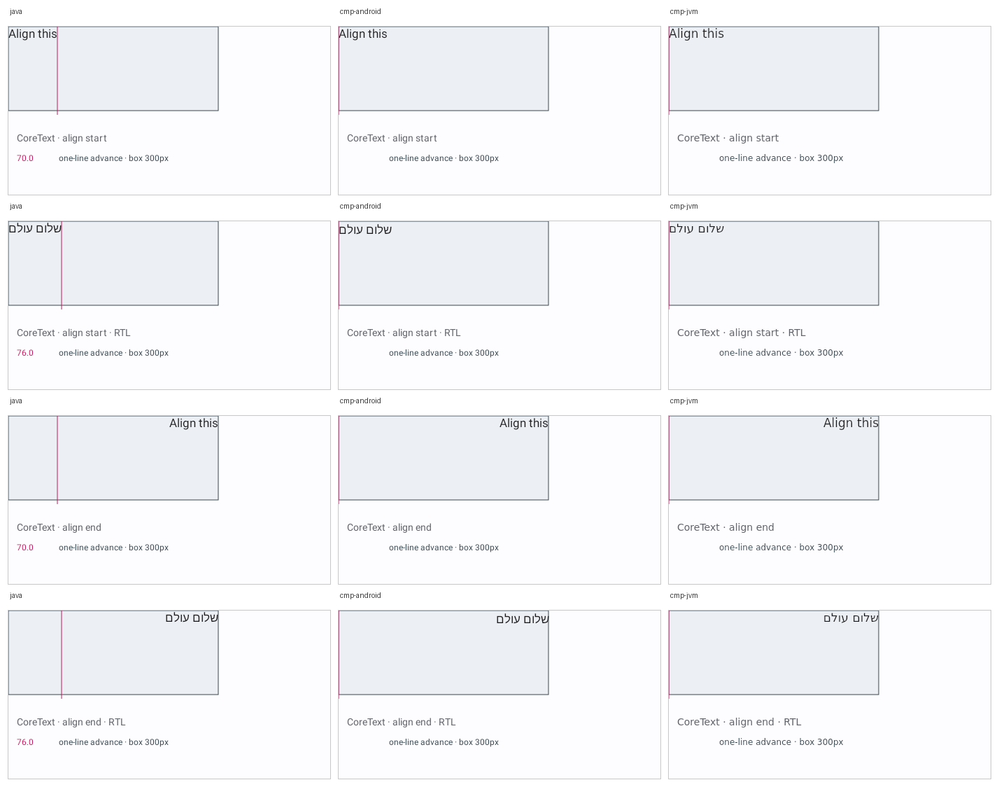
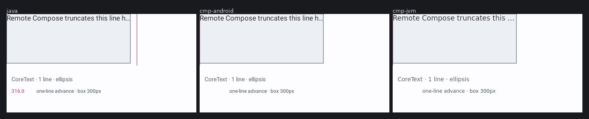
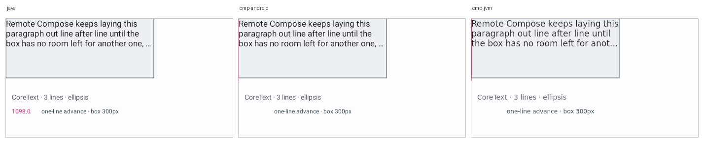

# Text-metric guide lines across three player lanes — issue #3595

Remote Compose documents that measure their own text with `TextMeasure` and draw the answer as guide
lines, so each lane renders *its own* metrics. Design notes:
[`docs/design/RC_TEXT_METRICS.md`](../../docs/design/RC_TEXT_METRICS.md).

Blue is the **font** box (typographic ascent/descent), green is the **ink** box, magenta is the
**advance**, red is the baseline. Each value is printed by the player itself via `TextFromFloat`, so
the image carries the numbers without a sidecar.

## The metric card



Two readings, immediately:

- **`TextMeasure` writes nothing on the two embedded lanes.** Every guide on `cmp-android` and
  `cmp-jvm` reads `0.0` and every rule collapses onto the origin. The vendored embedded player's
  canvas-operation walker has branches for `DrawTextAnchored` and friends and none for
  `TextMeasure`.
- **The same 48px string is 12.8% wider on `cmp-jvm`.** Measured ink extents: `java` 92..623 (532px),
  `cmp-android` 92..623 (532px), `cmp-jvm` 93..692 (600px). The two Android-backed lanes agree to the
  pixel; the Skiko lane does not. No font is pinned in these fixtures, so this points at typeface
  resolution rather than at layout — which is the useful kind of answer.

## The weight sweep


Each row reports **two** numbers: the advance (magenta) and the ink width (green), measured off
different code paths. On `java`: 361.0 / 358.0 at wght 400, then 362.0 / 359.0 at 500, 550, 599 and
700 alike — while 700 is plainly heavier than 500 in the same image.

Equal advances alone would prove nothing; families are routinely drawn duplexed, keeping advances
fixed across weights on purpose. It is the *pair plus the glyphs* that is diagnostic — both numbers
flat while the glyphs visibly differ is the signature of a **synthesised** weight rather than a
resolved face, which in the Robolectric sandbox (no `/system/fonts/`) is exactly what you would
expect. The ink box is integer-quantised, so read it as corroboration rather than as a precise
instrument.

## Start and end alignment, in both directions



`ALIGN_START` and `ALIGN_END` are the only alignments whose meaning depends on paragraph direction,
and on English text they land exactly where `ALIGN_LEFT` and `ALIGN_RIGHT` do — so an LTR-only matrix
cannot tell a correct lane from one that hard-coded start→left. Against a Hebrew paragraph, all three
lanes keep start at the left edge and end at the right. The fixtures state no layout direction, so
the expected behaviour is the content-derived one both stacks normally implement.

## The layout-tree modes





The dark rectangle is the box the text was handed; the magenta rule is where the *player's* own
measurement says a single unwrapped line of the same string ends. On the single-line fixture the
advance (316px) lands just outside the 300px box, which is why it ellipsised; on the wrapping fixture
the one-line advance is 1098px and runs off the frame.

## Regenerating

```bash
./gradlew :rc-player-metrics:rcTextMetricFixtures
./gradlew :third-party-rc-embedded-player:testDebugUnitTest --rerun \
  -Prc.embedded.input=rc-player/metrics/build/fixtures \
  -Prc.view.output=/tmp/rc-metrics/java \
  -Prc.embedded.output=/tmp/rc-metrics/cmp-android
./gradlew :third-party-rc-embedded-player-jvm:test --rerun \
  -Prc.jvm.input=rc-player/metrics/build/fixtures \
  -Prc.jvm.output=/tmp/rc-metrics/cmp-jvm
```

`--rerun` matters: the fixture directory is passed as a system property, not declared as a task
input, so a second run without it is `UP-TO-DATE` and quietly leaves the previous run's PNGs in
place.
