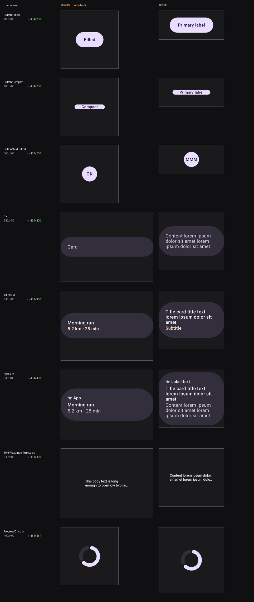
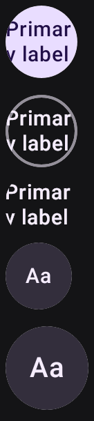

# `remote-m3`: the kit's words, and a component-shaped frame

Evidence for two changes to `samples/design-catalog-remote-m3`, both of which exist because the
catalog now compares against the **kit** (see `renders/remote-m3-wear-catalog-repoint/`): the
stickers say what the kit says, and the `@Preview` frame is the shape of the cell they are compared
against. All captures are real `composePreviewRender` output from this branch; "before" is the
published `design-artifacts/remote-m3` branch.

## Copy, and framing

**Copy.** Every sticker invented its own label — "Filled", "Compact", "Morning run", "5.2 km · 28
min". The kit labels the same button `Primary label` and the same card
`Title card title text lorem…`, so each of those was reported as a difference on its row, burying
the structural findings a comparison exists to surface. The strings now come from a `KitCopy`
object transcribed from the Wear sibling's, so the two catalogs cannot quote the same cell
differently.

**Framing.** The frame was square (200×200dp) for components that are mostly 150×52dp buttons:
a measured **median content fill of 14.7%**, and a 1:1 capture set beside a kit cell that is 172×52.
The compare squashes one into the other's aspect before diffing, so the frame alone was a difference
on every row. The component frame is now 227×100dp and the larger one 227×200dp — 227dp because
that is the Wear canvas `wear-m3-catalog` renders on, so a width-filling component (a card, a line
of text) measures the same as its parallel instead of being stretched to an arbitrary 320dp.

Nothing was clipped: the frames were sized from the measured content of every preview in each class
(tallest component 76dp in a 100dp frame; tallest card 182dp in a 200dp frame).

## Display cells keep a display shape

The kit publishes its indicators as `192×192` **display** cells — the round face, whole — and
`wear-m3-catalog` renders them 384×384 square where it renders a button 272×136. A new
`@CatalogRemoteDisplay` frame (227×227) carries the page indicators and the circular progress rail
for that reason. It is not about filling the frame: those captures are mostly empty, and so is the
kit cell they pair with.

This was worth doing rather than assuming, because the squat component frame actively broke one of
them — `InteractivePageIndicatorRemote` is canvas-height-relative and collapsed from 8.2% of its
capture to 1.6% before it was moved.

## What the render caught that review would not have

Two changes looked right in the diff and were wrong in the pixels.

**A round container cannot hold a two-word label.** Giving the round text buttons `PRIMARY_LABEL`
drew the text straight through the edge of the circle:

The kit's own answer is `Text-Button`'s `MMM` — a run of the widest glyph in the face, which is how
it sizes a container it wants drawn at its worst case. The Wear sibling's `TextButton` quotes the
same constant, so these now do too, and their `parallel` moved from the pill buttons to the round
`TextButton` they actually mirror:

**And the tapped state, which the resting render does not show.** `countedRemote` appends a tally to
the visible label — `MMM` becomes `MMM (1)` on the first tap — so a fix that only looked at the
baked capture would have left the overflow intact one interaction away, on a sheet whose whole point
is that the stickers are live. These five now use `toggledRemote`, the size-preserving affordance the
icon button already used for the same reason: a container-colour tween that says the tap landed
without touching the metrics. `InteractiveActionCaptureTest` asserts their documents encode no
counter, so the absence reads as a decision rather than an oversight.

**An ellipsis sticker with no ellipsis.** `TruncatedTextRemote` exists to carry the
`maxLines` + `overflow` product. `BODY` fits inside two lines at its width, so quoting it published
a truncation sticker that did not truncate. It quotes `CARD_CONTENT` instead — still the kit's own
copy, and long enough to overflow — so the capture shows the product working without inventing a
string to overflow with.

## Deliberately not changed

- **The watch-screen hero and the button group.** Their parallels (`Scaffold`, `ButtonGroup`) are
  door-2 components: the kit publishes no such set, so there is no kit copy to defer to. Rewriting
  the hero's activity rows as lorem would cost the front door its point and match nothing.
- **The interactive page indicator's "Next" control.** Scaffolding for the interaction, not part of
  any kit cell.
- **The typeface and shader specimens, and the type ramp.** Remote-only, no parallel; their content
  names what they demonstrate.
