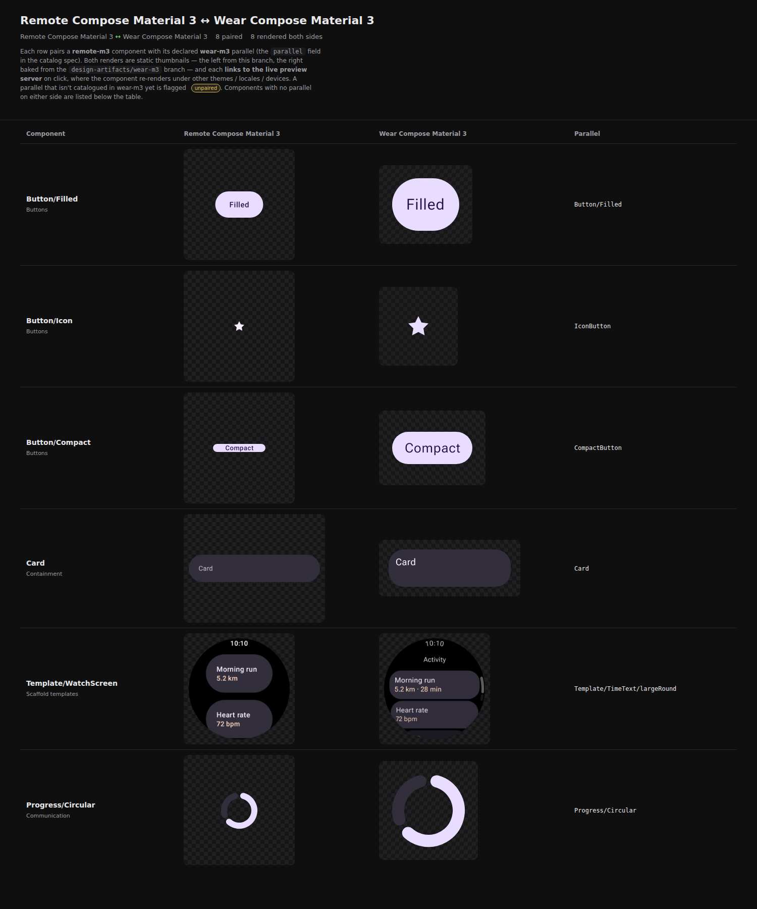
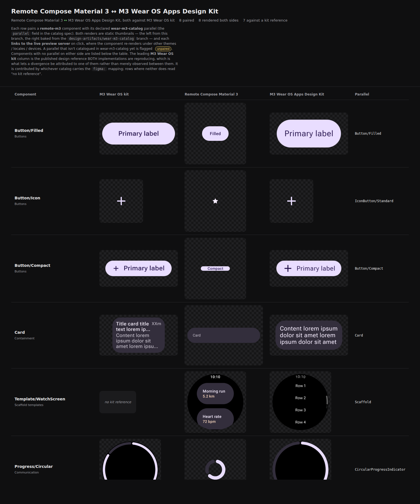

# `remote-m3` re-pointed at the `wear-m3-catalog` reference catalog

Evidence for moving `samples/design-catalog-remote-m3`'s `compareWith` off the in-repo `wear-m3`
harness sheet and onto the Wear **reference** catalog in `yschimke/wear-m3-catalog` — the move
[DESIGN_CATALOGS.md](../../docs/design/DESIGN_CATALOGS.md) anticipated, now that the pipeline
supports a cross-repo sibling and a design column.

Both captures are the real page over the **live published branches**, trimmed to eight rows chosen
because six of their parallels changed (`Button/Filled` and `Card` are unchanged controls).
Thumbnails are pulled down locally and `loading="lazy"` is stripped for the capture — a headless
screenshot never scrolls, so below-fold lazy images would otherwise photograph blank.

## Before — paired against the in-repo harness sheet

`wear-m3` exists to exercise the preview pipeline, not to reproduce the kit. It is the wrong
yardstick, and there is no third column to arbitrate.

## After — paired against the reference catalog, with the kit leading

`Button/Compact` is the row that shows why this matters: the kit and the Wear catalog both draw
**+ Primary label**, and the Remote sticker draws a small pill reading "Compact". Against the
harness sheet that was two components differing; against the kit it is the Remote catalog using
non-kit copy.

## What changed in the spec

| | before | after |
| --- | --- | --- |
| rows with a parallel | 42 | 40 |
| parallels resolving in the sibling | 9 of 19 distinct | **18 of 18 distinct** |
| rows resolving a kit reference | 20 | **38** |

- **Re-pointed (18 rows).** `IconButton` splits by emphasis — the base `Button/Icon` uses
  `RemoteIconButtonDefaults.iconButtonColors()`, the stock transparent container, so it pairs with
  `IconButton/Standard`, while `Button/Icon-Filled` / `-Outlined` pair with their own variants.
  `CompactButton` → `Button/Compact`, `Progress/Circular*` → `CircularProgressIndicator`,
  `Template/TimeText/largeRound` → `Scaffold`, `Template/PageIndicator/largeRound` →
  `PageIndicator/Horizontal`, `Text/MaxLines-Truncated` → `Text/Body`.
- **Added (1 row).** `PageIndicator/Vertical` — the reference catalog publishes the vertical
  indicator, the harness sheet never did.
- **Dropped (3 rows).** `Icon`, `Theme/Typography`, `Theme/ColorScheme`: the Wear catalog publishes
  no counterpart, so they list under "Only in remote-m3" rather than naming a component that does
  not exist.

Two paired rows read "no kit reference", both correctly — `Button/Group` → `ButtonGroup` and
`Template/WatchScreen` → `Scaffold` are door-2 components whose `noReference` records that the kit
publishes no such set.
