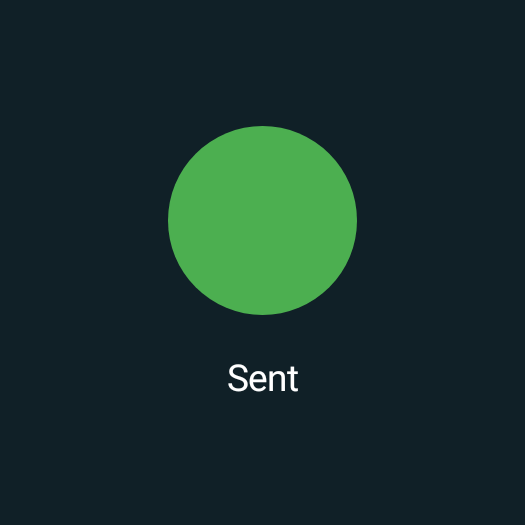
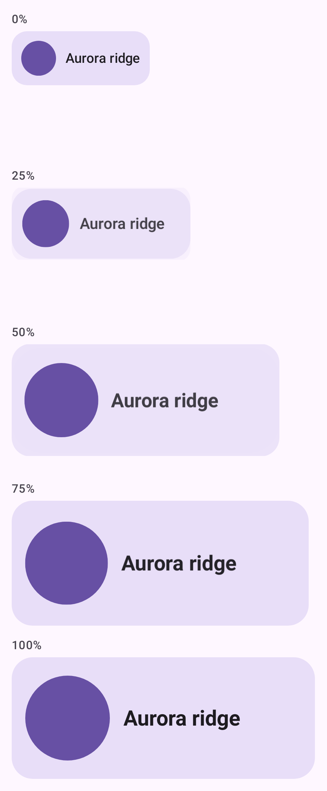
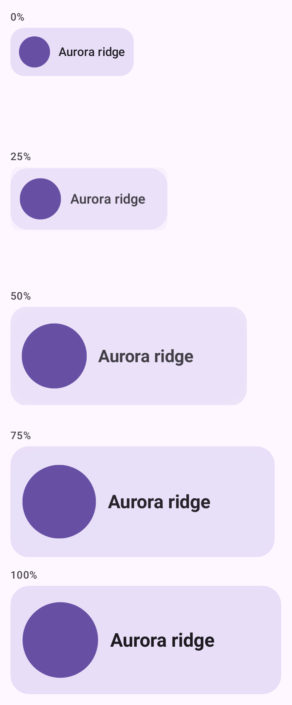

# Settle follow-ups

Evidence for issues [#4238](https://github.com/yschimke/compose-ai-tools/issues/4238),
[#4239](https://github.com/yschimke/compose-ai-tools/issues/4239),
[#4244](https://github.com/yschimke/compose-ai-tools/issues/4244) and
[#4247](https://github.com/yschimke/compose-ai-tools/issues/4247) — the four things left over after
`@SettledPreview` landed.

## #4238 — the desktop daemon honours `@SettledPreview`

Both batch renderers honoured the annotation, and so did the Android daemon, so a live Robolectric
frame already agreed with its published PNG. The desktop daemon did not: `compose-preview serve`
against a CMP module showed a settled preview's **first** frame while the PNG beside it showed the
settled one.

The fixture (`TimedRevealPreview`) is black until a `delay(200)` fires and then paints a green
square, so the question is about one pixel rather than about a heuristic:

| No settle — the frame the daemon used to serve | `@SettledPreview` (auto) | `@SettledPreview(afterMs = 100)` |
| --- | --- | --- |
|  |  |  |

The third column is the control that proves exact mode is a *coordinate* and not a bound: 100ms is
before the reveal, so it captures the frame before it rather than walking on to the next lull.

`delay` is the load-bearing part. `scene.render(nanoTime)` drives Compose's frame clock but **not**
`kotlinx.coroutines.delay`, which on the scene's default context resolves against wall time — so
raising the frame timestamp alone leaves this fixture black forever. Only building the scene on a
`DesktopSettleClock` reveals it, which is the same finding that made the batch desktop lane work.

## #4244 — a settled still and a motion product on one function

`@SettledPreview` + `@AnimatedPreview` on the same function used to be resolved by dropping the
settle and warning about the collision. That was circular: `@AnimatedPreview` already suppresses the
static row, so the still the annotation was meant to fix had been suppressed before the settle was
dropped.

Both ship now — the renderers give the settled still a composition of its own, so neither product
spends the other's timeline:

| The still, settled at the end of the reveal | The GIF, recorded from its start |
| --- | --- |
|  |  |

For scale, the same component captured with no settle at all — the empty container the annotation
exists to stop publishing:

## #4247 — "exact" coordinates land on N

`MainTestClock.advanceTimeBy` rounds a delta **up** to whole 16ms frames, so a coordinate that is
not a multiple of 16 captured one frame late. #4248 corrected the *bookkeeping*; this closes the
other half by spending the whole frames through the rounded advance and the sub-frame remainder with
`ignoreFrameDuration`, so the clock lands on the coordinate that was asked for.

Three renders in `:samples:android` move, and they are exactly the non-aligned values the issue
tabulated:

| preview | requested | `% 16` | clock, before | clock, after |
| --- | --- | --- | --- | --- |
| `SpinnerTimelinePreview` | 500 | 4 | 512 | **500** |
| `SpinnerTimelinePreview` | 1500 | 12 | 1504 | **1500** |
| `SharedElementFilmstripPreview` | 600 | 8 | 608 | **600** |

(`SpinnerTimelinePreview`'s third job reads 1504 rather than 1520 on `main` because #4248 already
stopped the rounding excess compounding across the fan-out; what is left is the single frame of
overshoot on each hop, which is what this closes.)

| `SpinnerTimelinePreview` at 1504ms | at 1500ms |
| --- | --- |
|  |  |

| `SharedElementFilmstripPreview` at 608ms | at 600ms |
| --- | --- |
|  |  |

What the change deliberately does **not** do is invent a frame at N — Compose's test clock dispatches
frames on its own 16ms cadence and there is no public way to ask for one off it. The composition
state captured is the last frame at or before the coordinate, which errs toward showing less of the
future rather than more, and the clock now reads the coordinate exactly rather than 4–12ms past it.

The issue's second item — a `@SettledPreview(afterMs = 1..31)` on a `@FocusedPreview` — is resolved
at discovery instead: the focus path spends two unconditional setup frames giving the walk a
laid-out tree to search, so a coordinate under 32ms cannot be honoured there and is raised to the
floor with a warning, rather than the two backends quietly capturing different instants.

## #4239 — the visual-settle probe

No image: this one moved no pixels in `:samples:android` at all. It is recorded here because the
render-level numbers are the evidence.

The probe used to return as soon as two frames matched with no mismatch behind them. Two identical
frames at `t = 0` is the expected opening of any delayed reveal, so quiescence was being declared
before the animation began. Declaring settled now requires having seen the composition move; an
all-identical run spends its whole budget and reports `NEVER_CHANGED` rather than claiming it
watched something finish.

Measured over a full `:samples:android:composePreviewRenderAll` before and after — 180 outputs on
`main`, 183 after:

- **176 byte-identical.** All four files that changed are accounted for above: the three
  non-frame-aligned `_TIME_` captures #4247 moves, plus the `AsyncImageUnreachablePreview` warnings
  sidecar, which gains its new (empty) `unsettledCaptures` array. **No render moved because of the
  probe change.**
- **3 new files**: `SettledPlusAnimatedPreview`'s `.png` and `.gif` (#4244), and one new warnings
  sidecar — `LoadingPreview`, an indeterminate `CircularProgressIndicator` that can never quiesce,
  which now records `still_changing` in `<png>.warnings.json` instead of only printing to stderr, so
  a consumer can fail its own build on it the way `CatalogRenderTest` already fails on blank
  captures.

What it still cannot do is separate a static preview from a reveal that has not begun. Both are
`NEVER_CHANGED`, and both stay quiet: a preview's `delay` queue lives on the Compose test scheduler,
which exposes no "is anything still scheduled" query for `DesktopSettleClock.hasScheduledWork` to be
mirrored from, and a sample budget wide enough to out-wait a 200ms reveal would be paid by every
static sticker in a catalog. `RevealCardUnsettledPreview` is the committed fixture for that case and
is byte-identical before and after. `@SettledPreview` remains the way an author says "this one
arrives late".
