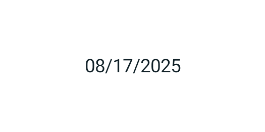
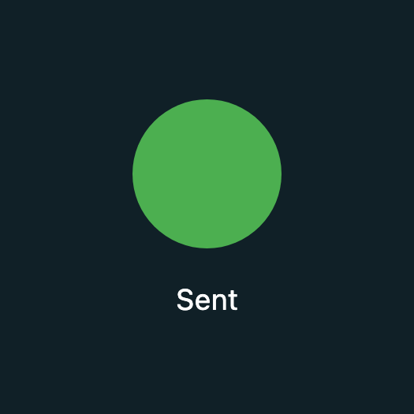

# `@SettledPreview` — settling a time-driven reveal before a still capture

Evidence for [issue #4202](https://github.com/yschimke/compose-ai-tools/issues/4202).

Both pairs are the **same composable** rendered twice by
`:samples:android:composePreviewRenderAll` — once without the annotation, once with it — so the
difference is the settle and nothing else. Fixtures live in
[`samples/android/.../SettledPreviews.kt`](../../samples/android/src/main/kotlin/com/example/sampleandroid/SettledPreviews.kt)
and are pinned by
[`SettledPreviewPixelTest`](../../samples/android/src/test/kotlin/com/example/sampleandroid/SettledPreviewPixelTest.kt),
so both halves keep rendering on every PR rather than being a one-off screenshot.

## The reveal (Wear `ConfirmationDialogContent`'s shape)

Children start at `alpha = 0` and are animated in from a `LaunchedEffect` after a delay.

| Before — no annotation | After — `@SettledPreview` |
| --- | --- |
|  |  |

## The deferred value (Material 3 `DateInputTextField`'s shape)

Nothing fades; the value is simply written after the first composition.

Without the annotation this frame shows the `—` placeholder. `DeferredValueUnsettledPreview` is
committed beside the settled one and `SettledPreviewPixelTest` asserts the pair (the settled capture
carries >5× the dark pixels of the unsettled one), but the "before" PNG is not staged here — the
local box could not hold a Gradle daemon long enough to render it. Re-run
`./gradlew :samples:android:composePreviewRenderAll -PcomposePreview.filter=DeferredValue` and copy
`DeferredValueUnsettledPreview_Deferred_unsettled-*.png` in as `android-deferred-value-before.png`
to complete the pair.

## Desktop (CMP)

The same reveal through the `ImageComposeScene` still path, rendered by
`:samples:cmp:composePreviewRenderAll`. This lane needed more than a raised frame clock — see
[`docs/HOW_IT_WORKS.md`](../../docs/HOW_IT_WORKS.md#settling-a-preview-that-arrives-late).

| Before — no annotation | After — `@SettledPreview` |
| --- | --- |
|  |  |
